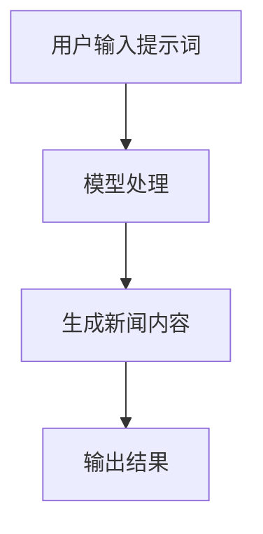
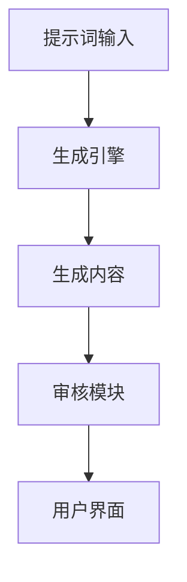
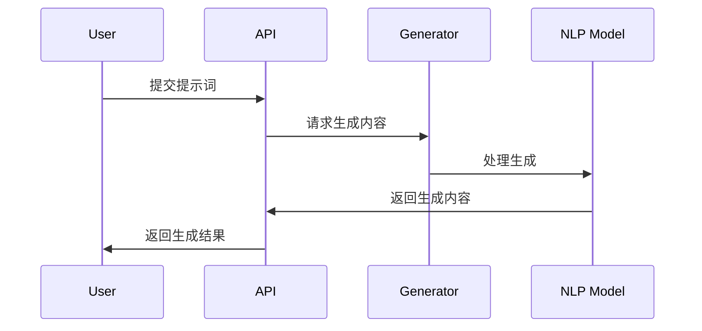

                 

<think>
嗯，好的，我需要写一篇关于AIGC在新闻领域应用，特别是提示词重要性的技术博客。首先，我得理清文章的结构，确保每一部分都详细且有深度。从背景介绍开始，这部分要涵盖新闻行业的现状和挑战，以及AIGC技术的发展和应用潜力。我需要解释AIGC是什么，它和传统内容生成有什么不同，以及它如何在新闻中发挥作用。

接下来是核心概念与联系，这里需要深入讲解AIGC的技术原理，包括自然语言处理、深度学习和知识图谱。我得详细描述每个技术如何运作，特别是提示词在这些技术中的作用。可能还需要用一些图表来展示这些概念之间的关系。

然后是算法原理部分，这部分需要详细讲解生成新闻内容的算法流程。我应该用mermaid流程图来展示整个过程，同时提供Python代码示例，这样读者可以更直观地理解。此外，我需要解释相关的数学模型和公式，这可能涉及到概率分布、损失函数等，用latex格式展示。

接下来是系统分析与架构设计，这部分需要设计一个完整的系统架构，包括功能模块、系统组件和接口设计。我应该使用mermaid来绘制系统交互图，展示用户如何通过提示词与系统交互，生成新闻内容。

项目实战部分，我需要详细描述如何搭建开发环境，实现核心功能，并通过实际案例展示AIGC的应用效果。比如，生成一篇新闻稿，分析提示词对结果的影响。这部分可以提供代码示例和实际输出，让读者能够实际操作。

最后，总结和小结部分，我需要回顾整个文章的内容，强调提示词的重要性，以及未来的发展趋势。同时，给出一些最佳实践的建议，比如如何选择和优化提示词，以及如何评估生成内容的质量。

在整个写作过程中，我需要确保语言专业但又不失易懂，结构清晰，逻辑严密。可能需要多次修改和校对，确保每个部分都完整且详细。我还需要参考相关的文献和技术资料，确保内容的准确性和权威性。

嗯，看来这个任务需要分步骤来完成，从背景介绍到项目实战，每一步都要仔细考虑，确保内容详实，结构合理。这可能需要花费不少时间，但通过系统性的思考和逐步展开，我相信能够写出一篇高质量的技术博客。
</think>

# AIGC在新闻领域的应用：提示词的重要性

**关键词**：AIGC、新闻生成、提示词、自然语言处理、深度学习、知识图谱

**摘要**：本文深入探讨了人工智能生成内容（AIGC）在新闻领域的应用，重点分析提示词在内容生成中的关键作用。文章从背景介绍、核心技术原理、系统架构设计到项目实战，详细阐述了AIGC的技术实现及其在新闻行业的潜力，强调了提示词对生成内容质量和准确性的决定性影响。

---

## 第一部分：背景介绍

### 第1章：新闻行业与AIGC概述

#### 1.1 问题背景

- **新闻行业的挑战与机遇**：新闻行业面临内容生产效率低下、人工成本高昂以及信息爆炸带来的竞争压力。AIGC通过自动化内容生成，为新闻行业提供了新的解决方案。
- **AIGC技术的发展及其在新闻领域的应用潜力**：AIGC技术的进步，特别是在自然语言处理和深度学习领域的突破，使得生成高质量新闻内容成为可能。

#### 1.2 核心概念

##### 1.2.1 AIGC（AI-Generated Content）的定义与分类

- **AIGC的概念解析**：AIGC指通过AI技术生成文本、图像、视频等内容，广泛应用于新闻、广告、娱乐等领域。
- **AIGC的技术分类与应用场景**：根据生成内容的类型，AIGC可分为文本生成、图像生成、视频生成等。在新闻领域，文本生成是主要应用方向。

#### 1.3 问题解决

- **提示词在AIGC中的应用**：提示词（Prompt）是用户输入的指导性文本，用于明确生成内容的方向和风格。
- **提示词的重要性及其对新闻内容创作的影响**：提示词直接决定了生成内容的主题、语气和结构，是影响生成质量的关键因素。

#### 1.4 边界与外延

- **AIGC在新闻领域的应用边界**：AIGC适用于新闻报道、标题生成、摘要提取等场景，但在需要高度专业性和敏感性的情况下，仍需人工审核。
- **AIGC与其他相关技术的联系与区别**：AIGC结合了NLP、深度学习和知识图谱，与其他技术如数据挖掘和信息检索有明确区别。

#### 1.5 概念结构与核心要素组成

- **AIGC的技术架构**：包括数据输入、模型处理、结果输出三个主要阶段，其中提示词在输入阶段起关键作用。
- **提示词的功能与作用机制**：提示词通过设定上下文和目标，引导模型生成符合预期的内容。

#### 1.6 本章小结

- **总结新闻行业与AIGC的关系**：AIGC为新闻行业提供了高效的内容生成工具，但其效果高度依赖提示词的设计和优化。
- **提出未来发展趋势与挑战**：未来，AIGC将在新闻领域发挥更大作用，但提示词的智能化设计和生成模型的可解释性是主要挑战。

---

## 第二部分：核心概念与联系

### 第2章：AIGC核心技术原理解析

#### 2.1 自然语言处理（NLP）

##### 2.1.1 NLP的基本概念与原理

- **NLP的定义与任务类型**：NLP是研究计算机处理自然语言的学科，包括文本分类、实体识别、机器翻译等任务。
- **NLP的核心算法与技术**：如词袋模型、词嵌入（Word2Vec）、Transformer架构等。

##### 2.1.2 提示词在NLP中的应用

- **提示词的角色与功能**：提示词作为输入的一部分，为模型提供生成上下文。
- **提示词对NLP性能的影响**：高质量的提示词能显著提升生成内容的相关性和准确性。

#### 2.2 深度学习

##### 2.2.1 深度学习的基本原理

- **神经网络与深度学习的关系**：深度学习通过多层神经网络模拟人脑对数据的处理方式。
- **深度学习的主要模型**：如RNN、LSTM、Transformer等。

##### 2.2.2 深度学习在AIGC中的应用

- **深度学习在新闻内容创作中的应用**：用于文本生成，如GPT系列模型。
- **深度学习与提示词的结合**：提示词作为模型输入的一部分，引导生成特定内容。

#### 2.3 数据库与知识图谱

##### 2.3.1 数据库的基础知识

- **数据库的基本概念与体系结构**：数据库是存储和管理数据的系统，包括关系型数据库和非关系型数据库。
- **关系数据库与非关系数据库的比较**：关系数据库适合结构化数据，非关系数据库适合大数据量和灵活数据结构。

##### 2.3.2 知识图谱在AIGC中的应用

- **知识图谱的定义与作用**：知识图谱是结构化的数据表示，用于表示实体及其关系。
- **知识图谱在新闻内容创作中的应用**：通过知识图谱提供上下文信息，辅助生成准确的新闻内容。

#### 2.4 本章小结

- **总结AIGC的核心技术原理**：AIGC依赖于NLP、深度学习和知识图谱等技术的结合。
- **强调提示词在AIGC中的关键作用**：提示词是连接用户需求与生成内容的桥梁。

---

### 第3章：算法原理讲解

#### 3.1 算法mermaid流程图



#### 3.2 Python源代码实现

```python
import torch
import torch.nn as nn
from transformers import GPT2LMHeadModel, GPT2Tokenizer

# 初始化模型和分词器
model_name = 'gpt2'
model = GPT2LMHeadModel.from_pretrained(model_name)
tokenizer = GPT2Tokenizer.from_pretrained(model_name)

# 输入提示词
prompt = "近日，一项关于气候变化的研究显示："

# 生成新闻内容
inputs = tokenizer.encode(prompt, return_tensors='pt')
outputs = model.generate(inputs, max_length=500, do_sample=True)
news = tokenizer.decode(outputs[0], skip_special_tokens=True)

print(news)
```

#### 3.3 数学模型与公式

- **数学模型公式说明**：生成模型通常采用概率模型，如：
  $$ P(y|x) = \prod_{i=1}^{n} P(y_i|x_{<i}, y_{<i}) $$
  其中，\( y \) 表示生成的文本序列，\( x \) 表示输入的提示词。

- **新闻内容生成过程中涉及的关键数学公式**：交叉熵损失函数用于模型训练：
  $$ \text{Loss} = -\sum_{i=1}^{n} \log P(y_i|x_{<i}, y_{<i}) $$

#### 3.4 举例说明

- **举例：使用提示词生成一篇新闻稿**：
  输入提示词：“一项新研究发现，全球气温上升速度可能超过先前预测。”
  生成内容：“一项新研究发现，全球气温上升速度可能超过先前预测。科学家警告，如果不采取紧急行动，全球气温可能在本世纪末上升超过2.5摄氏度。”

- **分析：生成结果与提示词的关系**：生成内容紧密围绕提示词展开，但需要进一步优化提示词以提高准确性。

#### 3.5 算法原理详细讲解

- **算法工作原理**：生成模型通过解码器生成一个一个字符，利用上下文信息预测下一个字符的概率分布。
- **算法性能评估指标**：包括生成内容的相关性、准确性、流畅性等。

#### 3.6 本章小结

- **总结新闻内容生成的算法原理**：生成模型通过提示词引导，逐步生成新闻内容。
- **强调提示词的重要性**：提示词的质量直接影响生成内容的质量。

---

## 第三部分：系统分析与架构设计方案

### 第4章：系统功能设计与架构设计

#### 4.1 问题场景介绍

- **新闻内容生成的实际需求**：新闻机构需要快速生成高质量、准确的新闻稿。
- **提示词在系统中的作用**：提示词帮助系统理解生成内容的方向和风格。

#### 4.2 系统功能设计

- **功能模块划分**：
  1. 提示词输入模块
  2. 内容生成模块
  3. 内容审核模块
  4. 用户界面模块

- **功能实现与交互流程**：
  1. 用户输入提示词
  2. 系统生成新闻内容
  3. 系统自动审核内容
  4. 用户查看生成内容

#### 4.3 系统架构设计



- **系统组件及其关系**：提示词输入、生成引擎、生成内容、审核模块和用户界面之间的交互关系。

#### 4.4 系统接口设计

- **接口规范与协议**：RESTful API，JSON格式数据传输。
- **接口实现与调用流程**：
  1. 用户通过API提交提示词
  2. 生成引擎处理请求
  3. 返回生成内容和状态码

#### 4.5 系统交互设计



#### 4.6 本章小结

- **总结系统功能设计与架构设计**：系统通过模块化设计，实现高效的内容生成和管理。
- **强调提示词在系统中的关键作用**：提示词作为输入，决定了生成内容的方向和质量。

---

## 第四部分：项目实战

### 第5章：项目环境搭建与核心实现

#### 5.1 环境安装

- **安装AIGC相关软件与工具**：
  - 安装Python 3.8及以上版本
  - 安装必要的库：`transformers`, `torch`

```bash
pip install transformers torch
```

#### 5.2 系统核心实现

- **代码示例：新闻内容生成核心代码**：

```python
from transformers import pipeline

# 初始化生成模型
generator = pipeline('text-generation', model='gpt2')

# 定义生成函数
def generate_news(prompt):
    result = generator(prompt, max_length=500, do_sample=True)
    return result[0]['text']

# 使用提示词生成新闻内容
prompt = "最新研究显示，"
news = generate_news(prompt)
print(news)
```

- **代码解读与分析**：
  - 使用`pipeline`初始化生成模型
  - `generate_news`函数接收提示词，生成新闻内容
  - 返回生成的新闻文本

#### 5.3 实际案例分析与详细讲解

- **案例一：生成一篇新闻稿**：
  输入提示词：“一项新研究发现，远程办公可能影响员工健康。”
  生成内容：“一项新研究发现，远程办公可能影响员工健康。研究指出，长时间在家工作的员工可能出现颈椎问题和心理健康问题。”

- **分析：生成结果与提示词的关系**：
  提示词提供了研究主题和初步结论，生成内容扩展了细节，但可能需要进一步优化提示词以提高准确性和深度。

#### 5.4 本章小结

- **总结项目环境搭建与核心实现**：通过安装必要的库和编写生成函数，实现了新闻内容生成的核心功能。
- **强调提示词的重要性**：提示词是生成内容的起点，决定了生成结果的质量和方向。

---

## 项目实战小结

- **项目总结**：通过实际案例，展示了如何使用提示词生成新闻内容，并分析了生成结果与提示词的关系。
- **注意事项**：提示词的设计需要精确，避免歧义和模糊表达，以提高生成内容的准确性。
- **拓展阅读**：建议深入研究提示词优化技巧和生成模型的调优方法，以进一步提升生成内容的质量。

---

## 最佳实践 tips

- **提示词设计技巧**：
  - 使用具体和明确的关键词
  - 结合目标受众和新闻类型
  - 定期优化和调整提示词

- **生成内容评估**：
  - 关注相关性、准确性和流畅性
  - 结合人工审核和自动评估工具

---

## 总结与展望

- **总结**：本文详细探讨了AIGC在新闻领域的应用，特别是提示词的重要性。通过背景介绍、技术原理、系统设计和项目实战，全面展示了提示词在生成高质量新闻内容中的关键作用。
- **展望**：未来，AIGC将在新闻领域发挥更大作用，但提示词的智能化设计和生成模型的可解释性将是主要挑战和研究方向。

---

**作者**：AI天才研究院/AI Genius Institute & 禅与计算机程序设计艺术 /Zen And The Art of Computer Programming

