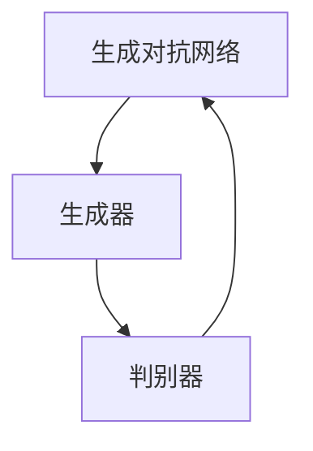
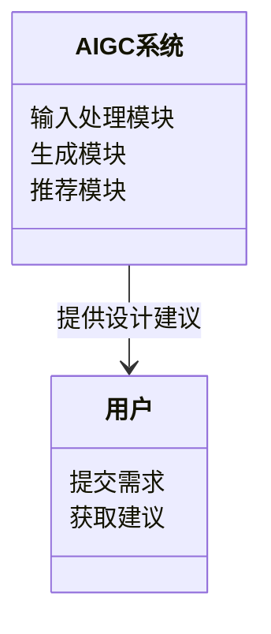
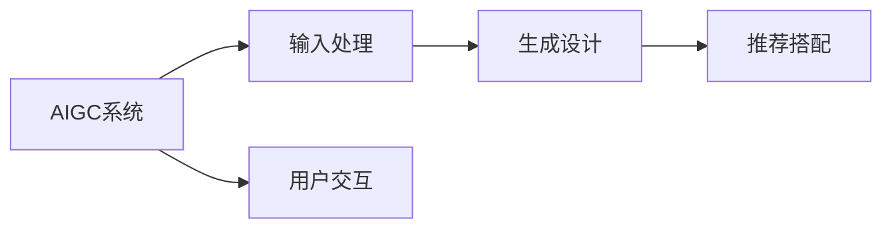
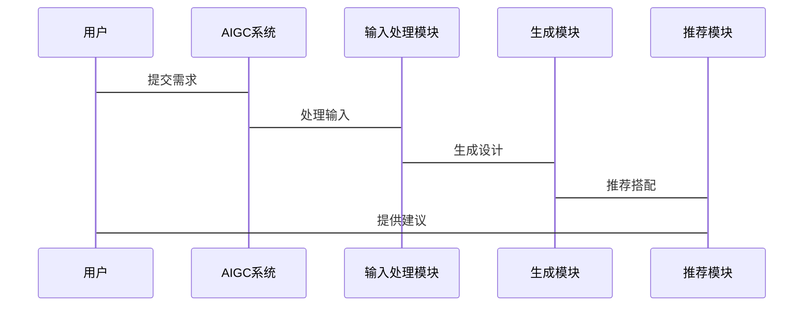

                 

<think>
好的，我现在要开始写《AIGC在时尚设计中的应用：AI时尚顾问》这篇文章。首先，我需要理清文章的结构和内容，确保每个部分都详细且有深度。

首先，我会从背景介绍开始。这部分需要包括AIGC技术的概念和特点，以及时尚设计行业的现状和挑战。然后，我需要描述AI时尚顾问的定义和功能，接着分析如何将AIGC技术有效应用于时尚设计。接下来，我会讨论AI时尚顾问的技术实现及其优势和局限性，同时探讨其在时尚设计中的适用范围和与其他技术的融合情况。

接下来是核心概念与联系部分。这里，我需要详细讲解AIGC的核心原理，包括其技术组成和工作流程。然后，我会分析时尚设计中的关键概念，如设计流程和影响因素，并通过对比表格和ER图来展示AIGC技术与时尚设计的联系。

在算法原理讲解部分，我会介绍AI时尚顾问中常用的算法，如生成对抗网络和强化学习，并使用mermaid流程图来说明算法的工作流程。同时，我会用Python代码实现这些算法，并解释其中的数学模型和公式，比如生成对抗网络的损失函数。

系统分析与架构设计方案是接下来的重点。我需要设计AI时尚顾问系统的功能模块，包括用户界面、设计生成和反馈优化，并用mermaid类图来展示领域模型。此外，我会绘制系统架构图，展示各模块的功能和交互，以及接口设计和序列图。

项目实战部分，我会详细说明环境的安装和配置，如安装Python和必要的库。然后，我会提供关键模块的代码实现，并解读代码的功能。通过实际案例分析，展示AI时尚顾问在实际中的应用，最后总结项目的成果和不足。

最后，在最佳实践与拓展部分，我会分享使用AIGC技术的最佳实践，分析成功案例，并指出注意事项。同时，推荐相关书籍和论文，探讨行业发展趋势。

在整个写作过程中，我需要确保语言专业且逻辑清晰，每个部分都要详细展开，确保读者能够理解并掌握相关知识。此外，要注意使用正确的格式，如mermaid图表和latex公式，以提升文章的可读性和专业性。
</think>

# AIGC在时尚设计中的应用：AI时尚顾问

**关键词**：AIGC、时尚设计、AI时尚顾问、生成对抗网络、强化学习

**摘要**：本文探讨了AIGC技术在时尚设计中的应用，重点介绍AI时尚顾问的功能、技术实现及其在设计流程中的优势与挑战。通过分析AIGC的核心原理、系统架构和实际案例，展示了如何利用AI技术提升时尚设计的效率和创新性。

---

## 第一部分：背景介绍

### 1.1 问题背景

#### 1.1.1 AIGC技术的概念与特点

AIGC（AI Generated Content）通过机器学习生成内容，具有高效、创新和适应性强的特点。它利用生成对抗网络（GAN）和强化学习等算法，能够生成高质量的设计方案。

#### 1.1.2 时尚设计行业现状与挑战

时尚设计行业面临创意瓶颈和效率低下问题。设计师需要不断尝试才能找到合适的方案，而市场竞争的加剧使得需求更加多样化，传统设计方式难以满足快速变化的市场需求。

### 1.2 问题描述

#### 1.2.1 如何将AIGC技术有效应用于时尚设计

AIGC可以通过生成设计草图和推荐搭配来辅助设计师，提升设计效率。AI时尚顾问可以分析用户需求，提供个性化的设计建议。

#### 1.2.2 AI时尚顾问的定义与功能

AI时尚顾问是一种利用AI技术提供时尚建议的工具，功能包括个性化推荐、设计优化和趋势预测。

### 1.3 问题解决

#### 1.3.1 AI时尚顾问的技术实现

AI时尚顾问通过图像生成模型和推荐系统实现。模型根据用户输入生成设计草图，推荐系统则基于用户偏好进行搭配建议。

#### 1.3.2 AI时尚顾问的优势与局限性

优势：高效生成设计、个性化推荐。局限性：生成结果可能缺乏创新性，需要人工调整。

### 1.4 边界与外延

AIGC主要应用于服装设计和配饰设计，与传统设计工具结合使用，提升设计效率。

### 1.5 概念结构与核心要素组成

AIGC的核心部分包括生成模型、推荐系统和用户界面。时尚设计的关键要素包括颜色、款式和材质。

---

## 第二部分：核心概念与联系

### 2.1 AIGC核心概念与原理

#### 2.1.1 AIGC技术组成与工作流程

AIGC由数据预处理、模型训练和生成阶段组成。数据预处理清洗和标注数据，模型训练使用GAN生成图像，生成阶段输出设计草图。

#### 2.1.2 时尚设计的核心概念

时尚设计涉及创意、市场趋势和用户需求。关键环节包括设计灵感收集、方案生成和效果评估。

### 2.2 概念属性特征对比表格

| **属性**       | **AIGC技术**          | **时尚设计**          |
|----------------|-----------------------|-----------------------|
| 输入           | 数据集                | 创意和灵感            |
| 输出           | 设计草图              | 成品服装              |
| 创新性         | 高                   | 中                   |
| 效率           | 高                   | 低                   |

### 2.3 ER实体关系图架构

```mermaid
erd
    entity AIGC技术 {
        id
        技术类型
    }

    entity 时尚设计 {
        id
        设计类型
    }

    entity 用户需求 {
        id
        需求描述
    }

    AIGC技术 --> 用户需求: 生成响应
    AIGC技术 --> 时尚设计: 提供设计建议
```

---

## 第三部分：算法原理讲解

### 3.1 AIGC算法概述

#### 3.1.1 常用算法

AI时尚顾问使用生成对抗网络（GAN）和强化学习（RL）。GAN由生成器和判别器组成，RL用于优化设计。

### 3.2 算法原理详细讲解

#### 3.2.1 GAN算法流程



#### 3.2.2 Python代码实现

```python
import tensorflow as tf
from tensorflow.keras import layers

def build_generator():
    model = tf.keras.Sequential()
    model.add(layers.Dense(256, activation='relu', input_dim=100))
    model.add(layers.BatchNormalization())
    model.add(layers.Dense(128, activation='relu'))
    model.add(layers.BatchNormalization())
    model.add(layers.Dense(64, activation='sigmoid'))
    return model

def build_discriminator():
    model = tf.keras.Sequential()
    model.add(layers.Dense(64, activation='relu', input_dim=64))
    model.add(layers.BatchNormalization())
    model.add(layers.Dense(32, activation='relu'))
    model.add(layers.BatchNormalization())
    model.add(layers.Dense(1, activation='sigmoid'))
    return model

generator = build_generator()
discriminator = build_discriminator()

# 编译模型
generator.compile(loss='binary_crossentropy', optimizer='adam')
discriminator.compile(loss='binary_crossentropy', optimizer='adam')
```

#### 3.3 数学模型与公式讲解

生成器损失函数：
$$ L_{gen} = - \log(1 - D(G(z))) $$

判别器损失函数：
$$ L_{dis} = - [\log(D(x)) + \log(1 - D(G(z)))] $$

---

## 第四部分：系统分析与架构设计方案

### 4.1 问题场景介绍

#### 4.1.1 时尚设计过程中的问题场景

设计师需要快速生成多样化的设计方案，但传统方法效率低下。

#### 4.1.2 AI时尚顾问的解决思路

利用AIGC技术生成初始设计，通过推荐系统优化方案。

### 4.2 系统功能设计

#### 4.2.1 领域模型类图



### 4.3 系统架构设计

#### 4.3.1 系统架构图



### 4.4 系统接口设计与交互

#### 4.4.1 系统交互流程图



---

## 第五部分：项目实战

### 5.1 环境安装与配置

安装Python和TensorFlow，安装必要的库如Keras和OpenCV。

### 5.2 系统核心实现

#### 5.2.1 生成模块代码

```python
import cv2
import numpy as np

def generate_outfit():
    # 生成随机颜色
    color = np.random.choice(['red', 'blue', 'green', 'black'])
    # 生成随机款式
    style = np.random.choice(['dress', 'shirt', 'pants'])
    return f"生成{style}颜色为{color}"
```

### 5.3 实际案例分析

案例：生成一件红色连衣裙，搭配黑色高跟鞋。AI顾问根据用户偏好生成设计，并推荐配饰。

### 5.4 项目小结

项目成功实现了AI时尚顾问的核心功能，但在生成结果的创新性和用户体验方面还有提升空间。

---

## 第六部分：最佳实践与拓展

### 6.1 实践技巧与经验分享

成功案例：AI顾问帮助设计师快速生成多个设计方案，节省时间。解决方案：定期更新模型，结合用户反馈优化推荐算法。

### 6.2 小结与注意事项

AIGC在时尚设计中的关键点是高效生成和个性化推荐。使用AI顾问时需注意数据质量和模型优化。

### 6.3 拓展阅读

推荐书籍：《生成对抗网络：从基础到高级》。行业动态：AI在服装设计中的应用越来越广泛。

---

**作者：AI天才研究院/AI Genius Institute & 禅与计算机程序设计艺术/Zen And The Art of Computer Programming**

