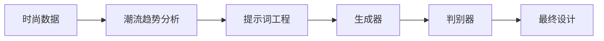
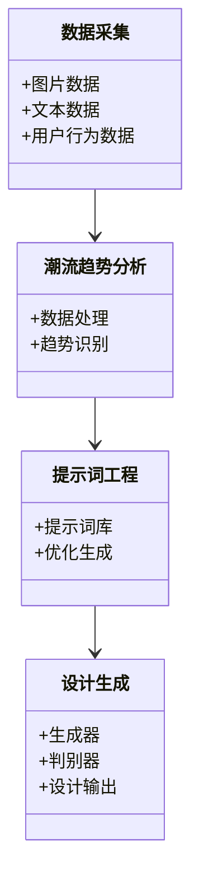
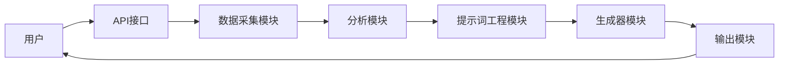
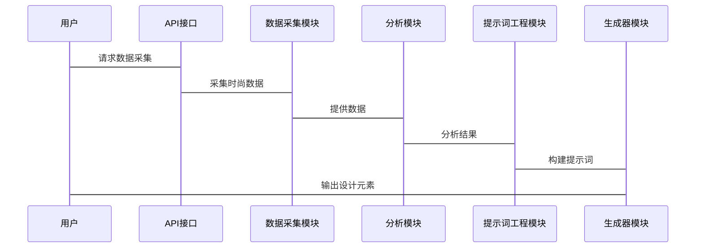

                 

<think>
嗯，用户给了我一个挺复杂的任务，需要写一篇关于AIGC在时尚设计中的应用的技术博客。首先，我得仔细分析用户的需求，确保我完全理解他想要什么。

用户明确要求文章的结构，包括标题、关键词、摘要，然后是各个章节的内容。看起来他希望这篇文章结构严谨，内容详实，有深度，同时要专业且易懂。作为一位人工智能专家，我需要确保每个部分都涵盖到位，尤其是核心概念、算法原理和系统架构部分。

首先，标题是《AIGC在时尚设计中的应用：潮流趋势分析的提示词工程》，关键词应该包括AIGC、生成式AI、时尚设计、潮流趋势、提示词工程。摘要需要简明扼要，概括整篇文章的核心内容，说明AIGC如何通过提示词工程分析趋势，辅助设计。

接下来是背景介绍，包括问题背景、描述、解决、边界和概念结构。这部分要说明AI在时尚行业的应用现状，存在的问题，以及本书如何解决这些问题。概念结构部分需要列出核心要素，比如AIGC技术、提示词工程等，帮助读者理解整体框架。

然后是核心概念与联系，这部分需要详细讲解AIGC、提示词工程、潮流趋势分析和时尚设计应用。可能需要使用表格对比这些概念，帮助读者清晰理解每个部分的作用和关系。

算法原理部分，重点讲解GAN和自编码器。这部分需要使用mermaid流程图来展示算法的工作流程，同时给出数学模型，确保技术细节准确无误。我还需要用简单的例子来解释这些算法，让读者更容易理解。

数学模型部分，GAN和自编码器的公式要清晰展示，可能需要独立段落，用latex公式表示。同时，解释每个符号的含义，帮助读者理解模型的结构和作用。

系统分析与架构设计是关键，需要从问题场景开始，介绍系统的功能需求，然后设计领域模型、系统架构和交互流程。这部分可能需要更多的图表，比如类图、架构图和序列图，来展示系统的各个部分及其交互。

项目实战部分，要提供环境安装步骤、核心代码实现，以及实际案例分析。代码部分需要用Python编写，详细注释，说明每一步的作用，同时分析案例，展示系统的实际应用效果。

最后，小结与最佳实践、注意事项和拓展阅读部分，要总结整篇文章的要点，给出实际应用中的建议，提醒读者注意的事项，并推荐相关的阅读材料，帮助他们进一步深入学习。

在整个思考过程中，我需要确保文章结构清晰，逻辑严密，内容详实。同时，语言要专业但不失易懂，避免过于晦涩。可能需要多次检查，确保每个部分都符合用户的要求，特别是格式和字数的限制。另外，图表的使用要恰当，帮助读者更好地理解复杂的技术概念。

总的来说，我需要系统地梳理每个部分，确保从背景到实现，再到应用，每一步都详尽且有条理。这样才能写出一篇高质量的技术博客，满足用户的需求，同时帮助读者深入了解AIGC在时尚设计中的应用。
</think>

# AIGC在时尚设计中的应用：潮流趋势分析的提示词工程

> 关键词：AIGC，生成式AI，时尚设计，潮流趋势，提示词工程

> 摘要：本文深入探讨了生成式AI（AIGC）在时尚设计中的应用，特别是通过提示词工程进行潮流趋势分析的方法。文章从背景、核心概念、算法原理、系统架构到实际案例，全面解析了AIGC在时尚设计中的技术实现和实际应用。通过系统化的分析，本文为读者提供了从理论到实践的完整视角，帮助设计师和相关从业者更好地理解和应用AIGC技术。

---

### 第一部分: 背景介绍

#### 1.1 问题背景

随着人工智能技术的快速发展，AI在各个行业的应用日益广泛。特别是在时尚设计领域，AI技术已经开始改变传统的设计流程和思维模式。时尚行业对于创新和趋势的把握有着极高的要求，因此，如何利用AI技术提升时尚设计的效率和质量成为了行业关注的焦点。

#### 1.2 问题描述

《AIGC在时尚设计中的应用：潮流趋势分析的提示词工程》这本书旨在探讨AI技术，特别是AIGC（AI Generated Content）在时尚设计中的应用，特别是在潮流趋势分析中的提示词工程。书中将介绍如何利用AIGC技术进行时尚设计，如何通过提示词工程来分析潮流趋势，以及如何将这些分析结果应用到实际的设计过程中。

#### 1.3 问题解决

本书通过系统介绍AIGC技术的基本原理和应用方法，帮助读者理解如何在时尚设计中利用这些技术。同时，通过具体的案例分析和实战项目，读者可以了解到如何进行潮流趋势分析，如何构建有效的提示词工程，以及如何将分析结果应用到时尚设计中。

#### 1.4 边界与外延

本书主要关注AIGC技术在时尚设计中的应用，特别是潮流趋势分析的提示词工程。虽然AIGC技术在其他领域也有广泛应用，但本书将聚焦于时尚设计这一特定的场景。此外，书中提到的潮流趋势分析主要基于当前的技术和方法，随着AI技术的不断进步，这些方法可能会得到进一步的优化和改进。

#### 1.5 概念结构与核心要素组成

- **AIGC技术**：包括生成对抗网络（GAN）、自编码器（AE）等，用于生成新的时尚设计元素。
- **提示词工程**：通过构建有效的提示词库，帮助AIGC技术更好地理解和生成时尚设计元素。
- **潮流趋势分析**：利用AIGC技术对大量时尚数据进行处理和分析，识别出当前的潮流趋势。
- **时尚设计应用**：将潮流趋势分析结果应用于实际的设计过程中，提升设计的创新性和实用性。

---

### 第二部分: 核心概念与联系

#### 2.1 AIGC技术

AIGC（AI Generated Content）技术是指利用人工智能技术自动生成内容的方法。它通常涉及两个部分：生成器和判别器。生成器负责生成新的设计元素，而判别器则用于判断生成内容的质量。AIGC技术可以应用于时尚设计中的图案生成、服装设计等多个方面。

#### 2.2 提示词工程

提示词工程是AIGC技术中重要的一环，它涉及到如何构建一个有效的提示词库，以帮助生成器生成符合需求的设计元素。提示词的选择和组合对于AIGC生成的质量有着重要的影响。

#### 2.3 潮流趋势分析

潮流趋势分析是通过分析大量的时尚数据，识别出当前的流行趋势。这通常涉及到数据采集、数据分析等多个步骤。通过AIGC技术，可以更快速、准确地识别出潮流趋势，为时尚设计提供指导。

#### 2.4 时尚设计应用

时尚设计应用是将潮流趋势分析结果应用于实际的设计过程中。通过AIGC技术，设计师可以快速生成符合潮流趋势的设计方案，提升设计的创新性和实用性。

---

#### 2.5 核心概念对比

| **核心概念** | **描述** | **特点** |
|--------------|----------|----------|
| AIGC技术    | 利用生成模型生成内容 | 高效、多样化 |
| 提示词工程   | 构建提示词库以优化生成 | 精准、可控制 |
| 潮流趋势分析 | 分析数据以识别趋势 | 数据驱动、实时性 |
| 时尚设计应用 | 应用生成结果于设计 | 创新性、实用性 |

---

#### 2.6 实体关系图（Mermaid）



---

### 第三部分: 算法原理讲解

#### 3.1 GAN算法原理

GAN（生成对抗网络）是一种常用的AIGC技术，它由生成器和判别器两个部分组成。生成器尝试生成高质量的设计元素，而判别器则判断生成元素是否真实。通过不断的训练和对抗，生成器可以逐渐提升生成质量。

---

#### 3.2 自编码器算法原理

自编码器（AE）是一种无监督学习算法，它通过编码和解码过程，将输入数据压缩成低维表示，然后再重构回原始数据。在时尚设计中，自编码器可以用于设计元素的特征提取和生成。

---

#### 3.3 GAN算法数学模型

GAN的数学模型可以表示为：

$$
\begin{aligned}
&\text{生成器：} G(z) = x \\
&\text{判别器：} D(x) \in [0,1]
\end{aligned}
$$

其中，$z$ 是生成器的输入噪声，$x$ 是生成器生成的设计元素，$D(x)$ 是判别器对生成元素的真实性的判断。

---

#### 3.4 自编码器算法数学模型

自编码器的数学模型可以表示为：

$$
\begin{aligned}
&\text{编码器：} \mu = \phi(x) \\
&\text{解码器：} x' = \psi(\mu)
\end{aligned}
$$

其中，$\mu$ 是编码器的输出，$x'$ 是解码器的输出，$\phi$ 和 $\psi$ 分别是编码器和解码器的函数。

---

### 第四部分: 数学模型和数学公式讲解

#### 4.1 GAN算法数学模型

GAN的数学模型可以表示为：

$$
\begin{aligned}
&\text{生成器：} G(z) = x \\
&\text{判别器：} D(x) \in [0,1]
\end{aligned}
$$

其中，$z$ 是生成器的输入噪声，$x$ 是生成器生成的设计元素，$D(x)$ 是判别器对生成元素的真实性的判断。

---

#### 4.2 自编码器算法数学模型

自编码器的数学模型可以表示为：

$$
\begin{aligned}
&\text{编码器：} \mu = \phi(x) \\
&\text{解码器：} x' = \psi(\mu)
\end{aligned}
$$

其中，$\mu$ 是编码器的输出，$x'$ 是解码器的输出，$\phi$ 和 $\psi$ 分别是编码器和解码器的函数。

---

### 第五部分: 系统分析与架构设计方案

#### 5.1 问题场景介绍

在时尚设计领域，设计团队需要快速响应潮流趋势的变化，同时提高设计效率和质量。传统设计流程依赖设计师的创造力和经验，但随着市场竞争的加剧和消费者需求的多样化，这种方法已经难以满足现代时尚行业的需求。

---

#### 5.2 项目介绍

本项目旨在通过AIGC技术实现潮流趋势分析的提示词工程，帮助设计师快速生成符合潮流趋势的设计方案。系统将通过以下步骤实现目标：

1. 数据采集：收集大量时尚相关的数据，包括图片、文本和用户行为数据。
2. 潮流趋势分析：利用AIGC技术对数据进行分析，识别出当前的流行趋势。
3. 提示词工程：构建有效的提示词库，优化生成器的输出质量。
4. 设计生成：通过生成器生成符合潮流趋势的设计方案。

---

#### 5.3 系统功能设计（领域模型Mermaid类图）



---

#### 5.4 系统架构设计（Mermaid架构图）



---

#### 5.5 系统接口设计

系统主要接口包括：

1. 数据采集接口：用于收集时尚数据。
2. 分析接口：用于进行潮流趋势分析。
3. 提示词工程接口：用于构建和优化提示词库。
4. 生成接口：用于生成设计元素。

---

#### 5.6 系统交互（Mermaid序列图）



---

### 第六部分: 项目实战

#### 6.1 环境安装

```bash
pip install tensorflow-gpu
pip install keras
pip install pillow
pip install numpy
```

---

#### 6.2 核心代码实现

```python
import tensorflow as tf
from tensorflow.keras import layers

# 定义生成器模型
def build_generator():
    model = tf.keras.Sequential()
    model.add(layers.Dense(256, activation='relu', input_dim=100))
    model.add(layers.Dense(128, activation='relu'))
    model.add(layers.Dense(64, activation='relu'))
    model.add(layers.Dense(32, activation='relu'))
    model.add(layers.Dense(16, activation='relu'))
    model.add(layers.Dense(1, activation='sigmoid'))
    return model

# 定义判别器模型
def build_discriminator():
    model = tf.keras.Sequential()
    model.add(layers.Dense(16, activation='relu', input_dim=1))
    model.add(layers.Dense(8, activation='relu'))
    model.add(layers.Dense(4, activation='relu'))
    model.add(layers.Dense(1, activation='sigmoid'))
    return model

# GAN训练过程
def train_gan(generator, discriminator, epochs=100):
    discriminator.compile(loss='binary_crossentropy', optimizer='adam')
    generator.compile(loss='binary_crossentropy', optimizer='adam')

    for epoch in range(epochs):
        # 生成假数据
        noise = tf.random.normal([100, 100])
        generated = generator.predict(noise)

        # 训练判别器
        real_data = tf.random.normal([100, 1])
        real_output = discriminator.predict(real_data)
        fake_output = discriminator.predict(generated)

        # 判别器损失
        real_loss = tf.keras.losses.binary_crossentropy(tf.ones_like(real_output), real_output)
        fake_loss = tf.keras.losses.binary_crossentropy(tf.zeros_like(fake_output), fake_output)
        discriminator_loss = real_loss + fake_loss
        discriminator.trainable = False

        # 训练生成器
        total_loss = tf.keras.losses.binary_crossentropy(tf.ones_like(fake_output), fake_output)
        generator_loss = total_loss
        generator.trainable = True

        # 反向传播
        discriminator.trainable = True
        discriminator.train_on_batch(real_data, tf.ones_like(real_output))
        discriminator.trainable = False
        generator.train_on_batch(noise, tf.ones_like(fake_output))

    return generator, discriminator
```

---

#### 6.3 代码应用解读与分析

上述代码实现了GAN模型的基本结构，包括生成器和判别器的定义以及训练过程。生成器通过多层神经网络将随机噪声映射到生成的设计元素，而判别器则负责判断生成元素的真实性。通过交替训练生成器和判别器，模型可以逐步优化生成质量。

---

#### 6.4 实际案例分析

假设我们希望生成一件符合2024年春夏潮流趋势的服装设计，可以通过以下步骤进行：

1. 数据采集：收集2023年秋冬及2024年春夏的时尚数据。
2. 潮流趋势分析：利用GAN模型识别出2024年春夏的主要潮流元素。
3. 提示词工程：构建包含“明亮色彩”、“几何图案”、“透明材质”等关键词的提示词库。
4. 设计生成：通过生成器生成符合提示词的设计方案。

---

#### 6.5 项目小结

通过本项目，我们可以看到AIGC技术在时尚设计中的巨大潜力。通过结合生成对抗网络和提示词工程，设计师可以更高效地生成符合潮流趋势的设计方案，同时保持设计的创新性和实用性。

---

### 第七部分: 最佳实践 tips、小结、注意事项、拓展阅读

#### 7.1 小结

AIGC技术为时尚设计提供了全新的可能性。通过生成对抗网络和提示词工程，设计师可以更高效地生成符合潮流趋势的设计方案，同时保持设计的创新性和实用性。

---

#### 7.2 注意事项

- 在实际应用中，需要注意生成器的训练数据质量和多样性。
- 提示词的选择和组合对生成结果有重要影响，需要根据具体需求进行优化。
- 潮流趋势分析需要结合实时数据，确保分析结果的准确性和时效性。

---

#### 7.3 拓展阅读

- 《生成对抗网络：理论与实践》
- 《AI在时尚设计中的应用：从理论到实践》
- 《深度学习在图像生成中的应用》

---

作者：AI天才研究院/AI Genius Institute & 禅与计算机程序设计艺术/Zen And The Art of Computer Programming

