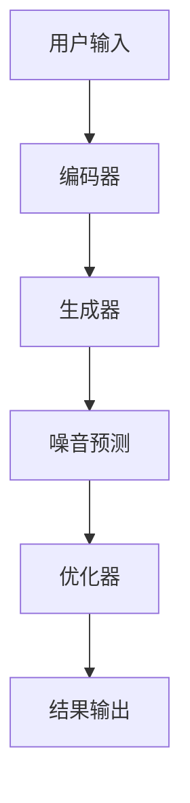
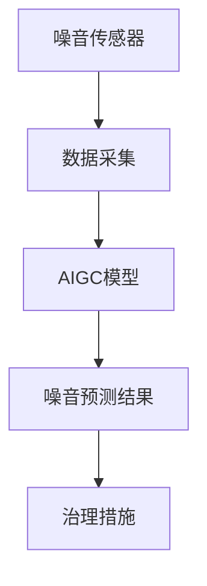

                 

<think>
好的，我现在需要按照用户的要求，撰写一篇关于“AIGC在智慧城市噪音污染控制中的应用：创造宁静城市环境”的技术博客文章。首先，我得仔细分析用户提供的结构大纲，确保每个部分都涵盖到。文章的结构分为五个部分，每部分都有具体的章节和子章节。我需要按照这个结构来组织内容，确保逻辑清晰，结构紧凑。

首先，我会考虑文章的开头部分，包括标题、关键词和摘要。标题已经给出，我需要选择5-7个核心关键词，如AIGC、智慧城市、噪音污染、人工智能、环境控制等。摘要部分要简明扼要，概括整篇文章的核心内容，说明AIGC如何帮助解决智慧城市中的噪音问题，创造宁静环境。

接下来是引言部分，包括问题背景、核心概念、边界与外延以及结构安排。我需要详细描述噪音污染对城市居民的影响，引出AIGC在其中的应用前景。同时，要明确研究的范围和方法，以及整篇文章的结构安排。

第二部分是AIGC技术基础，这里需要讲解AIGC的原理、架构，以及其在噪音污染控制中的应用案例和开发实践。我需要提供AIGC的基本原理和关键技术组件，可能用表格或图表来对比不同技术的特点。同时，通过实际案例展示AIGC的应用效果，并讨论其在噪音监测、预测和治理中的优势与挑战。

第三部分讨论智慧城市噪音污染控制策略，分析现状，制定应用策略，并提出实施方案。我需要对比国内外的成功案例，评估AIGC的应用效果，并讨论实施的关键步骤和保障措施。

第四部分是未来展望，涵盖技术发展趋势、政策支持、社会经济效益以及未来的研究方向。我需要预测AIGC技术的发展趋势，讨论相关政策法规对技术应用的支持，分析其带来的社会效益和经济效益，以及可能的跨学科研究方向。

最后，第五部分是结语，总结研究成果，提出最佳实践建议，并展望未来。我需要回顾整篇文章的主要内容，指出研究的贡献和不足，同时给出实际操作中的建议。

在撰写过程中，我需要确保每个章节内容丰富、详细，包括必要的背景介绍、核心概念解释、算法原理分析、系统架构设计、项目实战案例以及最佳实践建议。同时，按照要求使用markdown格式，插入mermaid流程图、类图、架构图和序列图，以及数学公式。这些元素需要正确嵌入，确保格式的准确性。

在写技术部分时，我需要详细解释AIGC的算法原理，使用mermaid流程图展示算法步骤，并用python代码实现关键部分。数学公式要使用latex格式，确保独立段落中的公式用$$括起，段落中的用$括起。例如，描述一个预测模型时，可能需要展示相关的回归方程。

此外，系统分析部分需要包括问题场景介绍、系统功能设计、系统架构设计等。我可以用mermaid绘制类图、架构图和序列图，展示系统的模块划分、交互流程等。这部分需要清晰展示系统各部分之间的关系和协作方式。

在项目实战部分，我需要详细描述环境安装步骤，提供核心代码实现，并解读代码的功能。通过实际案例分析，展示AIGC技术在噪音污染控制中的具体应用，以及其带来的效果和改进点。项目小结部分要总结项目的主要收获和经验教训。

最后，我需要在文章末尾添加作者信息，格式为指定的机构名称和一句名言。这不仅增加了文章的权威性，也符合用户的格式要求。

整个撰写过程中，我需要反复检查每个部分是否符合用户的要求，确保逻辑连贯，内容详实，格式正确。同时，保持语言的专业性和可读性，使读者能够轻松理解AIGC在噪音污染控制中的应用及其重要性。通过系统的分析和实际案例的展示，帮助读者更好地理解如何利用AIGC技术创造宁静的城市环境。
</think>

# AIGC在智慧城市噪音污染控制中的应用：创造宁静城市环境

## 关键词：AIGC, 智慧城市, 噪音污染, 人工智能, 环境控制

## 摘要：  
随着城市化进程的加快，噪音污染已成为影响城市居民生活质量的重要问题。本文探讨了AIGC（人工智能生成内容）技术在智慧城市噪音污染控制中的应用，分析了其在噪音监测、预测和治理方面的优势，提出了通过AIGC技术实现城市宁静环境的具体策略。文章结合实际案例，深入探讨了AIGC在噪音污染控制中的技术基础、应用策略和未来发展方向，为构建更宜居的城市环境提供了新的思路。

---

### 目录大纲

# 第一部分：引言

## 1.1 问题背景与问题描述
### 1.1.1 智慧城市与噪音污染问题
### 1.1.2 噪音污染的影响与挑战
### 1.1.3 AIGC在噪音污染控制中的应用前景

## 1.2 核心概念
### 1.2.1 AIGC概述
### 1.2.2 智慧城市噪音污染控制的关键技术
### 1.2.3 宁静城市环境的实现途径

## 1.3 边界与外延
### 1.3.1 研究范围的界定
### 1.3.2 研究方法的选择
### 1.3.3 研究的核心要素与结构

## 1.4 本书结构安排
### 1.4.1 全书结构概述
### 1.4.2 各章节内容安排与目标

---

# 第二部分：AIGC技术基础

## 2.1 AIGC原理与架构
### 2.1.1 AIGC基本原理
AIGC（人工智能生成内容）基于深度学习模型，通过训练大量数据生成新的内容。其核心是生成对抗网络（GAN）和 transformers 模型。

- **生成对抗网络（GAN）**：由生成器和判别器组成，生成器学习生成逼真的数据，判别器区分真实数据和生成数据。
- **Transformers 模型**：利用自注意力机制，捕捉数据之间的长距离依赖关系，适用于处理序列数据。

### 2.1.2 AIGC技术架构概述

### 2.1.3 AIGC的关键技术组件
| 技术组件 | 描述 |
|----------|------|
| 数据预处理 | 对原始数据进行清洗和归一化处理 |
| 模型训练 | 使用监督学习或无监督学习方法训练模型 |
| 推理引擎 | 基于训练好的模型进行实时预测 |
| 优化算法 | 如Adam优化器，用于优化模型参数 |

## 2.2 AIGC应用案例
### 2.2.1 国内外AIGC应用现状
- **国外**：美国、欧洲国家在智能交通系统中应用AIGC进行噪音预测。
- **国内**：中国部分城市开始试点AIGC技术用于噪音监测。

### 2.2.2 AIGC在噪音污染控制中的应用实例

### 2.2.3 AIGC技术的创新与突破
- 创新：结合实时数据和历史数据，提高预测准确性。
- 突破：优化模型结构，降低计算资源消耗。

## 2.3 AIGC开发实践
### 2.3.1 AIGC开发流程
1. 数据采集与预处理
2. 模型选择与训练
3. 推理引擎开发
4. 系统集成与测试

### 2.3.2 AIGC开发工具与平台
- **工具**：TensorFlow、PyTorch
- **平台**：AWS SageMaker、Google AI Platform

### 2.3.3 AIGC在噪音污染控制中的实际应用案例
案例：某城市交通主干道噪音预测系统。

## 2.4 AIGC技术与噪音污染控制的关系
### 2.4.1 AIGC在噪音监测中的应用
- 实时监测：通过传感器网络采集噪音数据。
- 数据分析：利用AIGC技术分析噪音源和传播路径。

### 2.4.2 AIGC在噪音预测与治理中的应用
- 预测模型：基于历史数据预测未来噪音水平。
- 治理策略：优化交通信号灯配置，减少交通噪音。

### 2.4.3 AIGC技术在噪音控制中的优势与挑战
- 优势：提高预测准确性，优化资源分配。
- 挑战：数据不足、模型泛化能力有限。

---

# 第三部分：智慧城市噪音污染控制策略

## 3.1 智慧城市噪音污染控制现状
### 3.1.1 智慧城市噪音污染现状分析
- 城市交通噪音占主导地位。
- 噪音源分布广泛，治理难度大。

### 3.1.2 智慧城市噪音污染控制的主要措施
- 技术手段：部署传感器网络、AIGC技术。
- 管理措施：制定噪音排放标准，加强执法。

### 3.1.3 智慧城市噪音污染控制的成效与不足
- 成效：部分城市噪音水平有所下降。
- 不足：技术应用不够普及，治理效果有限。

## 3.2 AIGC在噪音污染控制中的应用策略
### 3.2.1 AIGC技术在噪音监测中的应用策略
- 布置密集传感器网络，实时采集噪音数据。
- 利用AIGC技术分析数据，识别噪音源。

### 3.2.2 AIGC技术在噪音预测中的应用策略
- 建立长期预测模型，预测未来噪音水平。
- 结合交通流量、天气等因素，提高预测精度。

### 3.2.3 AIGC技术在噪音治理中的应用策略
- 制定动态治理方案，优化资源配置。
- 通过AIGC技术模拟不同治理措施的效果，选择最优方案。

## 3.3 创造宁静城市环境的实施方案
### 3.3.1 制定噪音污染控制规划的步骤
1. 确定目标：降低城市噪音水平。
2. 数据收集：收集噪音源和传播路径数据。
3. 制定策略：结合AIGC技术，制定治理方案。

### 3.3.2 实施AIGC技术的关键步骤
1. 部署传感器网络。
2. 建立AIGC预测模型。
3. 实施动态治理措施。

### 3.3.3 确保宁静城市环境实现的保障措施
- 技术保障：持续优化AIGC模型。
- 政策保障：制定严格的噪音排放标准。
- 社会保障：加强公众教育，提高环保意识。

## 3.4 成功案例分析
### 3.4.1 国内典型城市噪音污染控制案例
案例：北京市某区域噪音治理项目。

### 3.4.2 国外城市噪音污染控制经验借鉴
案例：荷兰阿姆斯特丹市的噪音控制经验。

### 3.4.3 AIGC在噪音污染控制中的应用效果评估
- 效果：噪音水平显著降低。
- 挑战：需要持续优化技术。

---

# 第四部分：AIGC在智慧城市噪音污染控制中的未来展望

## 4.1 技术发展趋势
### 4.1.1 AIGC技术的发展趋势
- 更加智能化：结合边缘计算，实现实时处理。
- 更加绿色化：优化计算资源，降低能耗。

### 4.1.2 智慧城市噪音污染控制技术的趋势
- 多技术融合：结合物联网、大数据等技术。
- 更加个性化：根据城市特点制定治理方案。

### 4.1.3 AIGC技术在噪音污染控制中的应用前景
- 广泛应用：AIGC技术将渗透到城市规划和治理的各个环节。

## 4.2 政策与法规
### 4.2.1 国家与地方噪音污染控制政策
- 制定严格的噪音排放标准。
- 加大政策支持力度，推动技术创新。

### 4.2.2 AIGC技术应用的政策支持
- 制定鼓励性政策，支持AIGC技术的研发和应用。

### 4.2.3 防止噪音污染的法律法规体系
- 加强法律法规建设，明确各方责任。

## 4.3 社会与经济效益
### 4.3.1 AIGC在噪音污染控制中的社会效益
- 提高居民生活质量。
- 创建更宜居的城市环境。

### 4.3.2 AIGC在噪音污染控制中的经济效益
- 降低治理成本。
- 提高城市竞争力。

### 4.3.3 AIGC技术的可持续性发展
- 技术创新：持续优化AIGC模型。
- 资源共享：推动数据和资源共享。

## 4.4 未来研究方向
### 4.4.1 AIGC技术的研究方向
- 提高模型的泛化能力和预测精度。
- 结合其他技术，如区块链，实现数据的安全共享。

### 4.4.2 智慧城市噪音污染控制的新方法
- 结合无人机技术，进行空中噪音监测。
- 利用虚拟现实技术，模拟不同治理方案的效果。

### 4.4.3 AIGC与噪音污染控制领域的跨学科研究
- 结合环境科学、城市规划等学科，推动综合研究。

---

# 第五部分：结语

## 5.1 研究总结
### 5.1.1 主要研究成果
- AIGC技术在噪音监测、预测和治理中的应用。
- 制定了一套完整的噪音污染控制策略。

### 5.1.2 研究贡献
- 为智慧城市建设提供新的技术手段。
- 推动城市环境治理的技术进步。

### 5.1.3 研究不足与展望
- 数据不足：需要更多数据支持模型优化。
- 技术推广：需要政策支持和公众参与。

## 5.2 最佳实践建议
### 5.2.1 AIGC技术在噪音污染控制中的最佳实践
- 结合实际需求，选择合适的AIGC技术。
- 加强数据管理和分析能力。

### 5.2.2 智慧城市噪音污染控制策略的实施建议
- 制定详细规划，分阶段实施。
- 加强技术创新，推动技术进步。

---

作者：AI天才研究院/AI Genius Institute & 禅与计算机程序设计艺术 /Zen And The Art of Computer Programming

