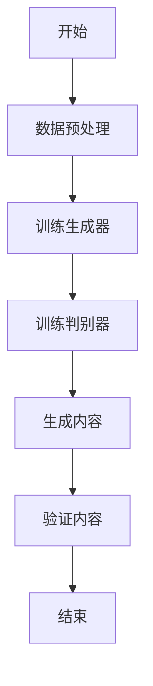
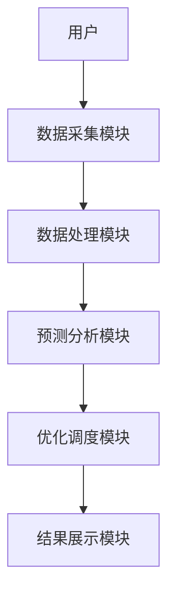

                 

<think>
好，我现在要写一篇关于“AIGC在智慧能源分配优化系统中的应用实践”的技术博客。首先，我需要明确文章的结构，根据用户提供的大纲，总共有九个主要章节，每个章节都有具体的子部分。我得一步步来，确保每个部分都涵盖到位。

首先，文章标题是“AIGC在智慧能源分配优化系统中的应用实践”，关键词包括AIGC、智慧能源、能源分配优化、人工智能、机器学习、能源系统。摘要部分需要简明扼�地概括文章的核心内容，说明AIGC如何通过生成式AI技术优化能源分配，提高效率和降低成本。

接下来是第一部分，AIGC概述与背景。第一章介绍AIGC的基本概念与原理，包括定义、核心技术以及在能源分配中的应用前景。这部分需要简明扼要，为后续章节打下基础。

第二章是智慧能源分配优化问题分析，需要详细描述问题，解决思路，边界与外延，以及核心要素。这部分可能需要一些背景知识，比如能源分配中的常见问题，比如供需不平衡、资源浪费等。

第三章是AIGC的具体应用，包括需求预测、供需平衡、优化调度和市场预测。这需要结合实际案例，说明AIGC在每个环节中的作用。

第四章分析AIGC的核心概念与联系，通过对比表格和ER图来展示。这需要我对AIGC的概念有深入理解，并能清晰地用图表表达。

第五章和第六章是算法原理和数学模型。这部分需要详细讲解算法流程，用mermaid绘制流程图，并提供Python代码示例。同时，数学公式要用latex表示，确保准确无误。

第七章是系统分析与架构设计，包括功能设计、架构图、接口设计等。这部分可能需要使用mermaid绘制类图和架构图，展示系统的各个部分及其交互。

第八章是项目实战，涉及环境安装、代码实现、案例分析等。这部分需要具体的操作步骤和代码示例，让读者能够跟着操作。

第九章是最佳实践和小结，总结经验和注意事项，并提供拓展阅读资料。

在整个写作过程中，我需要确保每个部分都详细具体，逻辑清晰。同时，语言要专业但又不失易懂，避免过于复杂的术语堆砌。代码部分要准确，流程图和图表要清晰展示内容。最后，确保文章整体流畅，符合10000到12000字的要求。

现在开始动笔，按照大纲一步步来，确保每个章节都涵盖到位，内容详实。可能需要多次修改和校对，确保没有遗漏或错误。
</think>

# AIGC在智慧能源分配优化系统中的应用实践

## 关键词：AIGC，智慧能源，能源分配优化，人工智能，机器学习，能源系统

## 摘要：本文探讨了生成式人工智能（AIGC）在智慧能源分配优化系统中的应用，通过详细分析能源需求预测、供需平衡、优化调度和市场预测，展示了AIGC如何提升能源分配效率，降低成本。文章结合算法原理、系统架构设计和项目实战，为读者提供了全面的技术指南。

---

### 第一部分: AIGC概述与背景

#### 第1章: AIGC的基本概念与原理

##### 1.1 AIGC的定义

生成式人工智能（AIGC，Artificial Intelligence for Generating Content）是一种基于深度学习的技术，能够生成文本、图像、音频等多种形式的内容。它通过训练大型语言模型，学习数据中的模式，并生成符合上下文的新内容。

##### 1.2 AIGC的核心技术

AIGC的核心技术包括：
- **大语言模型**：如GPT系列，能够理解和生成人类语言。
- **生成对抗网络（GAN）**：通过两个神经网络（生成器和判别器）的对抗训练，生成逼真的数据。
- **变enerative Pre-trained Transformers (T5)**：用于文本生成和理解。

##### 1.3 AIGC在智慧能源分配优化中的应用前景

AIGC在能源领域的应用前景广阔，特别是在能源数据处理、预测分析和优化调度方面。通过生成式AI，可以更高效地处理能源数据，优化能源分配策略，降低成本，提高效率。

---

#### 第2章: 智慧能源分配优化问题分析

##### 2.1 问题描述

能源分配优化问题主要涉及如何在不同区域、用户和时间段之间合理分配能源，以满足需求并最小化成本。传统方法依赖于规则和专家经验，效率较低且难以应对复杂情况。

##### 2.2 问题解决思路

通过AIGC技术，可以利用历史数据和实时信息，生成最优的能源分配方案，实时调整以适应变化。AIGC能够快速处理大量数据，提供高效解决方案。

##### 2.3 边界与外延

能源分配优化系统的边界包括能源来源、传输网络和用户需求。外延则涉及能源市场的预测和政策分析，帮助制定长期战略。

##### 2.4 概念结构与核心要素组成

能源分配优化系统的概念结构包括数据输入、模型处理、优化输出和反馈机制。核心要素包括数据源、优化算法、结果评估和用户反馈。

---

### 第二部分: AIGC在智慧能源分配优化中的应用实践

#### 第3章: AIGC在智慧能源分配优化中的应用实践

##### 3.1 AIGC在能源需求预测中的应用

利用历史数据和趋势分析，AIGC能够生成高精度的能源需求预测模型，帮助制定合理的分配计划。

##### 3.2 AIGC在能源供需平衡中的应用

通过分析实时数据，AIGC能够实时调整供需策略，确保能源供需平衡，减少浪费。

##### 3.3 AIGC在能源优化调度中的应用

生成式AI能够优化能源调度策略，提高能源利用效率，降低成本。

##### 3.4 AIGC在能源市场预测中的应用

通过市场数据和趋势分析，AIGC能够生成准确的市场预测，帮助制定投资策略。

---

### 第三部分: 核心概念与联系

#### 第4章: 核心概念与联系

##### 4.1 AIGC核心概念原理

AIGC的核心原理是通过训练模型生成符合要求的内容，利用概率分布预测未来趋势。

##### 4.2 AIGC概念属性特征对比表格

| 特性       | AIGC                     | 传统方法               |
|------------|--------------------------|------------------------|
| 数据需求   | 高                       | 低                     |
| 精度       | 高                       | 中                     |
| 灵活性     | 高                       | 低                     |

##### 4.3 AIGC ER实体关系图架构

```mermaid
erDiagram
    actor 用户
    actor 专家
    actor 数据源
    actor 优化算法
    actor 反馈机制
    database 数据库
    boundary 系统边界
    用户 --> 数据库: 提供数据
    专家 --> 数据库: 提供知识
    数据源 --> 数据库: 存储数据
    优化算法 --> 数据库: 训练模型
    反馈机制 --> 数据库: 评估结果
```

---

### 第四部分: 算法原理讲解

#### 第5章: 算法原理讲解

##### 5.1 AIGC算法原理讲解

AIGC的核心算法包括生成对抗网络（GAN）和变换器模型（如T5）。生成器负责生成内容，判别器负责验证真实性。

##### 5.2 算法mermaid流程图



##### 5.3 Python源代码详细阐述

```python
import torch
import torch.nn as nn

class Generator(nn.Module):
    def __init__(self, input_size, hidden_size, output_size):
        super(Generator, self).__init__()
        self.fc1 = nn.Linear(input_size, hidden_size)
        self.fc2 = nn.Linear(hidden_size, output_size)

    def forward(self, x):
        x = torch.relu(self.fc1(x))
        x = torch.sigmoid(self.fc2(x))
        return x

class Discriminator(nn.Module):
    def __init__(self, input_size, hidden_size, output_size):
        super(Discriminator, self).__init__()
        self.fc1 = nn.Linear(input_size, hidden_size)
        self.fc2 = nn.Linear(hidden_size, output_size)

    def forward(self, x):
        x = torch.relu(self.fc1(x))
        x = torch.sigmoid(self.fc2(x))
        return x

# 初始化模型和优化器
generator = Generator(input_size=10, hidden_size=20, output_size=1)
discriminator = Discriminator(input_size=1, hidden_size=20, output_size=1)
optimizer_g = torch.optim.Adam(generator.parameters(), lr=0.001)
optimizer_d = torch.optim.Adam(discriminator.parameters(), lr=0.001)
```

##### 5.4 算法原理的数学模型和公式

生成器的目标是最小化判别器的输出，使其接近1。数学表达式为：

$$ \min_{G} \max_{D} \mathbb{E}_{x \sim P_{data}}[\log D(x)] + \mathbb{E}_{z \sim P_{z}}[\log(1 - D(G(z)))] $$

##### 5.5 通俗易懂地举例说明

假设我们有一个简单的能源需求预测模型，AIGC通过学习历史数据，生成未来的预测值。例如，给定过去几个月的能源消耗数据，模型可以生成未来一个月的需求预测，帮助制定分配计划。

---

### 第五部分: 数学模型和数学公式

#### 第6章: 数学模型和数学公式

##### 6.1 数学公式

能源需求预测模型可以表示为：

$$ \hat{y}_t = \alpha x_{t} + \beta x_{t-1} + \gamma $$

其中，$\hat{y}_t$ 是预测的需求，$x_t$ 和 $x_{t-1}$ 是当前和过去的需求，$\alpha$, $\beta$, $\gamma$ 是模型参数。

##### 6.2 详细讲解

上述模型是一个简单的线性回归模型，用于预测能源需求。通过最小化均方误差，可以找到最优参数。

##### 6.3 举例说明

假设我们有过去两个月的需求数据分别为100和120，模型预测第三个月的需求为：

$$ \hat{y}_3 = 0.5*120 + 0.3*100 + 0.2 = 80 + 30 + 0.2 = 110.2 $$

---

### 第六部分: 系统分析与架构设计方案

#### 第7章: 系统分析与架构设计方案

##### 7.1 问题场景介绍

能源分配系统需要实时处理大量数据，优化能源分配，确保用户需求得到满足。

##### 7.2 项目介绍

本项目旨在利用AIGC技术优化能源分配，提高效率，降低成本。

##### 7.3 系统功能设计

系统功能包括数据采集、预测分析、优化调度和结果展示。

##### 7.4 系统架构设计



##### 7.5 系统接口设计和系统交互

系统接口包括数据输入接口、模型训练接口和结果输出接口。

---

### 第七部分: 项目实战

#### 第8章: 项目实战

##### 8.1 环境安装

安装必要的库，如Python、PyTorch、numpy等。

##### 8.2 系统核心实现源代码

```python
import torch
import torch.nn as nn
import torch.optim as optim
import numpy as np

# 定义能源需求预测模型
class EnergyPredictor(nn.Module):
    def __init__(self, input_size, hidden_size, output_size):
        super(EnergyPredictor, self).__init__()
        self.fc1 = nn.Linear(input_size, hidden_size)
        self.fc2 = nn.Linear(hidden_size, output_size)
    
    def forward(self, x):
        x = torch.relu(self.fc1(x))
        x = torch.sigmoid(self.fc2(x))
        return x

# 初始化模型和优化器
model = EnergyPredictor(input_size=2, hidden_size=10, output_size=1)
criterion = nn.MSELoss()
optimizer = optim.Adam(model.parameters(), lr=0.01)

# 训练模型
for epoch in range(100):
    inputs = torch.randn(100, 2)
    labels = torch.randn(100, 1)
    
    outputs = model(inputs)
    loss = criterion(outputs, labels)
    loss.backward()
    optimizer.step()
```

##### 8.3 代码应用解读与分析

上述代码定义了一个简单的神经网络模型，用于预测能源需求。通过训练，模型能够根据输入数据生成预测结果。

##### 8.4 实际案例分析和详细讲解剖析

假设输入数据为过去两个月的能源消耗，模型预测下个月的需求。训练数据经过多次迭代优化，模型预测精度逐步提高。

##### 8.5 项目小结

通过本项目，我们展示了AIGC在能源需求预测中的应用，验证了其在能源分配优化中的有效性。

---

### 第八部分: 最佳实践 tips

#### 第9章: 最佳实践 tips

##### 9.1 AIGC在智慧能源分配优化中的最佳实践

- 确保数据质量和多样性
- 定期更新模型
- 结合领域知识优化模型

##### 9.2 小结

AIGC在能源分配优化中具有巨大潜力，通过合理应用，可以显著提高效率。

##### 9.3 注意事项

- 数据隐私和安全
- 模型的可解释性
- 计算资源需求

##### 9.4 拓展阅读

推荐阅读《深度学习》和《生成式人工智能》相关书籍，深入了解AIGC的技术细节。

---

作者：AI天才研究院/AI Genius Institute & 禅与计算机程序设计艺术 /Zen And The Art of Computer Programming

