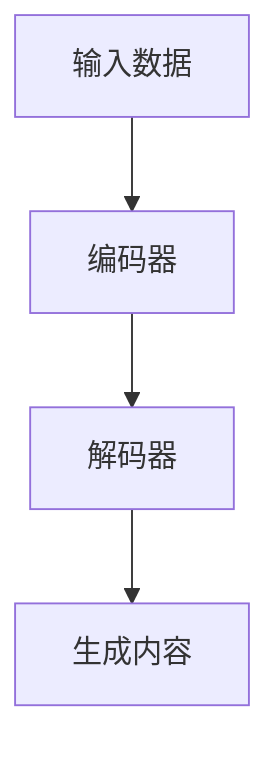
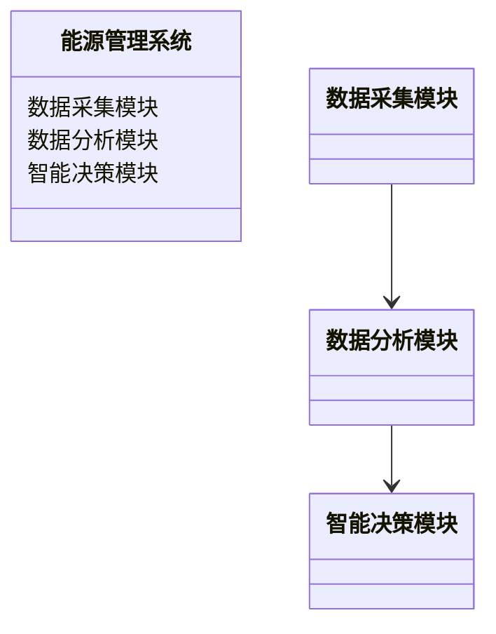
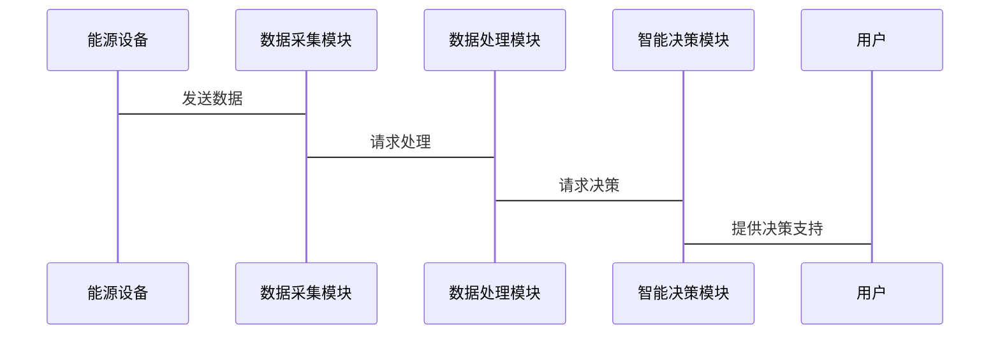

                 

<think>
好，我需要撰写一篇关于《AIGC在智慧能源管理系统中的应用》的技术博客文章。首先，我需要理解什么是AIGC和智慧能源管理系统。AIGC指的是人工智能生成内容，而智慧能源管理系统则是利用先进技术来优化能源管理的系统。

接下来，我考虑文章的结构。根据之前的大纲，文章分为五个主要部分：背景介绍、核心概念与联系、算法原理与实践、系统分析与架构设计、项目实战。每个部分下还有多个子部分，确保内容详细且有条理。

在背景介绍部分，我需要解释AIGC和智慧能源管理系统的概念、发展历程和它们之间的关联。这部分要吸引读者，让他们明白为什么AIGC在能源管理中是重要的。

核心概念部分，我需要详细描述AIGC在能源数据分析、预测与优化以及智能决策中的应用。同时，通过对比表格和Mermaid图来展示AIGC与其他技术的差异，帮助读者更好地理解。

算法原理部分，我打算先用Mermaid流程图展示AIGC算法的整体流程，然后通过Python代码具体实现，解释数据预处理、模型训练和应用的过程。数学公式也需要用Latex格式清晰表达，确保读者能理解模型背后的原理。

系统架构设计部分，我需要介绍系统的功能模块、架构图和交互流程。这部分需要详细描述系统如何工作，各个模块如何协同，以及接口设计的具体细节。

项目实战部分，我会选择一个实际案例，详细讲解从环境配置到代码实现的整个过程。通过案例分析，展示AIGC在实际应用中的效果和价值。

在撰写过程中，我需要确保每一部分都详细且有逻辑性，使用专业但易懂的语言。同时，注意引用相关的关键词和术语，使文章更具专业性。最后，加上作者信息，使文章显得完整。

总的来说，我需要按照大纲一步步深入分析，确保每个部分都内容丰富，结构清晰，帮助读者全面理解AIGC在智慧能源管理中的应用。
</think>

# AIGC在智慧能源管理系统中的应用

## 关键词：AIGC, 智慧能源管理系统, 人工智能, 能源管理, 数据分析

## 摘要：本文探讨了AIGC技术在智慧能源管理系统中的应用，分析其在能源数据分析、预测与优化、智能决策等方面的优势，结合具体算法原理和项目实战，展示了AIGC如何提升能源管理效率和智能化水平。

---

## 第一部分：AIGC与智慧能源管理系统概述

### 1.1 AIGC技术基础

#### 1.1.1 AIGC的概念与演进

AIGC（AI-Generated Content）指的是利用人工智能技术生成文本、图像、视频等内容。随着技术进步，AIGC已从简单的文本生成扩展到复杂场景的应用，成为推动各行业智能化的重要工具。

#### 1.1.2 AIGC核心技术解析

- **自然语言处理（NLP）**：用于理解与生成人类语言，如GPT系列模型。
- **生成对抗网络（GAN）**：通过对抗训练生成高质量内容。
- **大语言模型（LLM）**：如GPT-4，具备强大的上下文理解和生成能力。

#### 1.1.3 AIGC在智慧能源管理中的应用前景

AIGC可提升能源数据的分析与预测能力，优化能源分配，辅助决策，推动能源管理的智能化转型。

### 1.2 智慧能源管理系统概述

#### 1.2.1 智慧能源管理系统的定义与重要性

智慧能源管理系统通过整合物联网、大数据和AI技术，实现能源的智能化监控与管理，提升能源使用效率，降低成本。

#### 1.2.2 智慧能源管理系统的主要功能

- 数据采集与监控
- 能源消耗预测
- 优化控制
- 智能报警

#### 1.2.3 智慧能源管理系统的发展趋势

系统将更加智能化、分布式和可持续，AI技术的应用将更加广泛，推动能源管理向绿色、高效方向发展。

---

## 第二部分：AIGC在智慧能源管理系统中的应用原理

### 2.1 AIGC在能源数据分析中的应用

#### 2.1.1 能源数据概述

能源数据包括发电、输电、配电和用电等环节的数据，具有多源异构、实时性强等特点。

#### 2.1.2 AIGC在数据分析中的优势

- **自动化处理**：快速处理海量数据
- **模式识别**：发现数据中的隐藏规律
- **自适应优化**：根据数据变化调整分析模型

#### 2.1.3 AIGC在能源数据挖掘中的应用

通过深度学习模型挖掘数据中的关联性，识别异常情况，优化能源分配策略。

### 2.2 AIGC在能源预测与优化中的应用

#### 2.2.1 预测与优化概述

能源预测涉及发电量、负荷预测等，优化则包括设备调度和配电优化。

#### 2.2.2 AIGC在能源预测中的应用

利用时间序列模型，如LSTM，进行短期负荷预测，准确率高，适应性强。

#### 2.2.3 AIGC在能源优化中的应用

通过强化学习优化能源分配策略，降低能耗，提高系统效率。

### 2.3 AIGC在能源管理中的智能决策支持

#### 2.3.1 智能决策支持系统概述

系统利用AIGC提供实时数据支持，辅助决策者制定最优策略。

#### 2.3.2 AIGC在智能决策支持中的应用

生成多种决策方案，提供优化建议，提升决策效率和准确性。

#### 2.3.3 AIGC在能源管理中的实践案例

通过案例展示AIGC如何优化能源使用，降低成本，提高系统稳定性。

---

## 第三部分：算法原理与实践

### 3.1 AIGC算法原理讲解

#### 3.1.1 AIGC算法概述

- **生成模型**：如Transformer架构
- **训练目标**：最小化生成内容与真实数据的差异
- **评估指标**：如BLEU、ROUGE等

#### 3.1.2 AIGC算法的数学模型与公式

- **注意力机制**：计算每个词的重要性
  $$\alpha_i = \frac{\exp(e_i)}{\sum_{j} \exp(e_j)}$$
- **损失函数**：交叉熵损失
  $$L = -\sum_{i} y_i \log(p_i)$$
- **优化算法**：如Adam优化器

#### 3.1.3 AIGC算法的mermaid流程图



### 3.2 Python源代码实现与算法分析

#### 3.2.1 环境配置与依赖安装

安装Python和相关库如TensorFlow、Keras。

#### 3.2.2 AIGC算法的Python实现

```python
import tensorflow as tf
from tensorflow.keras.layers import Dense, Input
from tensorflow.keras.models import Model

# 定义编码器
encoder_input = Input(shape=(input_length,))
encoder Dense(512, activation='relu')(encoder_input)
encoder_output = Dense(256, activation='relu')(encoder.Dense)

# 定义解码器
decoder_input = Input(shape=(output_length,))
decoder Dense(512, activation='relu')(decoder_input)
decoder_output = Dense(vocab_size, activation='softmax')(decoder.Dense)

# 组合模型
model = Model(inputs=[encoder_input, decoder_input], outputs=decoder_output)
model.compile(optimizer='adam', loss='sparse_categorical_crossentropy')
```

#### 3.2.3 模型训练与应用案例

- **数据预处理**：将文本转换为数字序列。
- **模型训练**：使用训练数据优化模型参数。
- **模型应用**：生成新的能源管理策略文本。

---

## 第四部分：系统分析与架构设计

### 4.1 问题场景介绍

#### 4.1.1 智慧能源管理面临的挑战

数据量大、实时性强、决策复杂。

#### 4.1.2 AIGC技术如何解决这些问题

通过自动化分析和预测，提升系统效率和决策能力。

### 4.2 系统功能设计

#### 4.2.1 领域模型



### 4.3 系统架构设计

#### 4.3.1 系统架构概述

分层架构：数据采集层、数据处理层、应用层。

#### 4.3.2 系统模块设计

- 数据采集模块：实时采集能源数据。
- 数据处理模块：清洗和分析数据。
- 应用层：生成决策建议。

#### 4.3.3 系统交互



---

## 第五部分：项目实战

### 5.1 环境安装

#### 5.1.1 硬件环境配置

建议配置：CPU多核，GPU加速。

#### 5.1.2 软件环境配置

安装Python、TensorFlow、Keras等库。

### 5.2 系统核心实现

#### 5.2.1 数据收集与预处理

从能源设备采集数据，清洗并转换为模型可用格式。

#### 5.2.2 AIGC算法应用

训练模型生成能源管理策略。

#### 5.2.3 模型训练与优化

通过反向传播优化模型参数，提升生成效果。

### 5.3 代码应用解读与分析

#### 5.3.1 代码结构解析

模型由编码器和解码器组成，训练时使用梯度下降优化。

#### 5.3.2 代码运行流程

输入数据 → 编码 → 解码 → 生成结果。

#### 5.3.3 代码性能分析

评估生成内容的质量，调整模型参数以优化性能。

### 5.4 实际案例分析

#### 5.4.1 案例背景

某工业园区的能源管理优化。

#### 5.4.2 案例实现步骤

1. 数据采集
2. 模型训练
3. 生成优化策略
4. 效果验证

#### 5.4.3 案例结果分析

负载预测准确率提升，能耗降低。

### 5.5 项目小结

通过案例展示了AIGC在能源管理中的强大能力，证明其在实际应用中的价值。

---

## 总结

AIGC技术正在深刻改变智慧能源管理的模式，通过自动化分析与决策支持，提升系统效率和智能化水平。未来，随着技术进步，AIGC将在能源管理中发挥更大的作用。

---

## 作者：AI天才研究院/AI Genius Institute & 禅与计算机程序设计艺术 /Zen And The Art of Computer Programming

