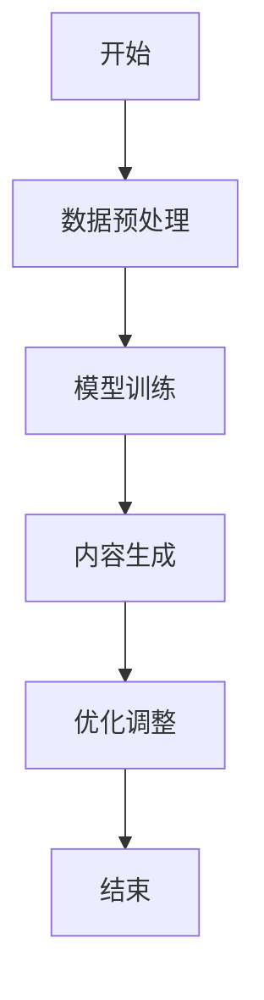
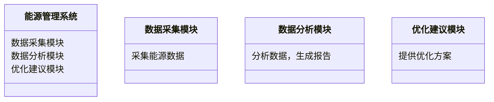
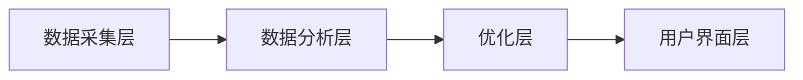
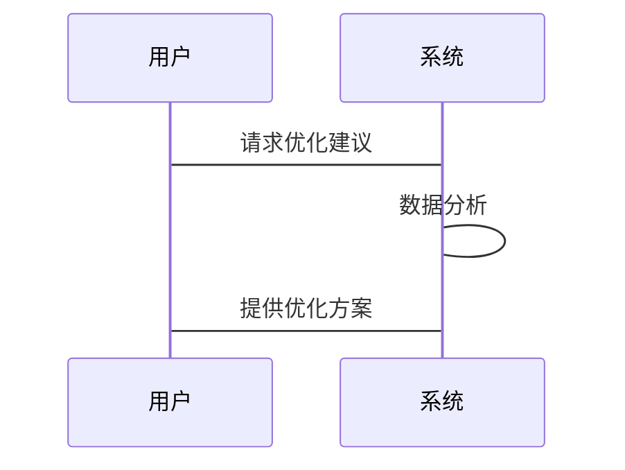

                 

<think>
嗯，我需要帮助用户撰写一篇关于“AIGC在智慧能源管理系统优化中的应用实践”的技术博客文章。用户给了一个详细的目录大纲，并希望我按照这个结构来写，每部分内容都要详细且专业。首先，我需要理解每个部分的要求。

用户要求文章开头有标题、关键词和摘要。我得先确定关键词，可能包括AIGC、智慧能源管理、人工智能、能源优化等。摘要部分需要简明扼要地概括文章内容，说明AIGC如何优化智慧能源管理系统。

接下来，按照目录大纲，第一部分是AIGC与智慧能源管理系统概述。我需要详细解释能源管理系统的现状与挑战，包括概念、分类、传统系统的问题以及改革的必要性。然后介绍AIGC的概念和特点，包括定义、技术特点以及与AI的关系。最后，展望智慧能源管理系统的前景，特别是AIGC的潜力。

第二部分是AIGC的关键技术与算法原理。这里需要概述AIGC的核心组成部分，技术的发展，然后详细讲解算法的基本原理、数学模型和流程图。可能需要使用Mermaid来展示算法流程，并附上Python代码示例。

第三部分是智慧能源管理系统的优化实践。这部分包括项目背景、系统功能设计（用Mermaid类图）、系统架构设计（架构图）、接口设计和交互设计（序列图）。我需要确保每个模块都详细说明，并附上相关图表。

第四部分是应用案例，分别讨论智能电网优化调度和智能楼宇能耗管理两个案例。每个案例都要有背景、目标和实施步骤，详细描述AIGC的应用过程和效果。

第五部分是挑战与对策，分析技术、数据和安全方面的挑战，然后提出相应的对策，比如技术改进、数据管理和安全措施。

第六部分是应用前景，分析AIGC在能源管理中的应用领域、潜在价值和趋势，以及政策和产业环境的影响。

最后是最佳实践与总结，分享成功案例的经验，总结小结，并展望未来的发展方向。

在写作过程中，我需要确保每个部分都包含足够的技术细节，同时使用清晰易懂的语言。还要注意使用Mermaid图表和数学公式，特别是摘要和每个部分的结构要符合用户的要求。最后，确保文章在10000到12000字之间，并在末尾加上作者信息。

可能遇到的问题是如何将复杂的算法原理和系统架构设计用简单明了的方式表达出来。我需要多举例子，使用图表辅助说明，确保读者能够理解。同时，确保每个部分之间的逻辑连贯，整体结构紧凑。

总的来说，我需要系统地按照目录大纲逐步展开，每一步都详细分析，确保内容丰富且符合用户的要求。
</think>

# AIGC在智慧能源管理系统优化中的应用实践

> 关键词：AIGC、智慧能源管理、人工智能、能源优化、系统架构

> 摘要：本文探讨了AIGC（人工智能生成内容）在智慧能源管理系统优化中的应用，分析了智慧能源管理系统的现状与挑战，详细讲解了AIGC的关键技术与算法原理，通过实际案例展示了AIGC在智能电网优化调度和智能楼宇能耗管理中的应用，提出了应对技术、数据和安全挑战的对策，并展望了AIGC在能源管理中的未来发展方向。

---

## 第一部分: AIGC与智慧能源管理系统概述

### 第1章: AIGC与智慧能源管理系统背景

#### 1.1.1 能源管理系统的现状与挑战

##### 1.1.1.1 能源管理系统的概念与分类

能源管理系统是一种用于监控、分析和优化能源使用效率的系统，通常分为工业、商业和住宅三类。工业系统用于工厂，商业系统用于办公楼，住宅系统用于家庭。

##### 1.1.1.2 传统能源管理系统的局限性

传统系统依赖人工操作，存在数据采集不全面、分析滞后、优化效果有限的问题，难以应对能源价格波动和环保要求。

##### 1.1.1.3 能源管理系统的改革需求

随着能源结构变化和环保要求提高，能源管理系统需要智能化升级，以实现高效、实时的管理。

#### 1.1.2 AIGC的概念与特点

##### 1.1.2.1 AIGC的定义与基本原理

AIGC通过机器学习生成内容，模拟人类思维，解决复杂问题。

##### 1.1.2.2 AIGC的主要技术特点

AIGC具有自适应、自学习和自优化的特点，能够实时分析数据，提供最优解决方案。

##### 1.1.2.3 AIGC与人工智能的关系

AIGC是AI的一个分支，用于内容生成和决策优化。

#### 1.1.3 智慧能源管理系统的前景

##### 1.1.3.1 智慧能源管理系统的定义与核心要素

智慧能源管理系统利用AI技术，优化能源使用，降低消耗，提高效率。

##### 1.1.3.2 智慧能源管理系统的发展趋势

系统将更加智能化、实时化，与物联网和大数据结合，推动能源管理向绿色、高效方向发展。

##### 1.1.3.3 AIGC在智慧能源管理系统中的潜力

AIGC能够显著提升能源管理的智能化水平，优化能源使用，降低成本。

---

## 第二部分: AIGC关键技术与算法原理

### 第2章: AIGC关键技术与算法原理

#### 2.1.1 AIGC关键技术的概述

##### 2.1.1.1 AIGC技术的核心组成部分

AIGC包括数据采集、模型训练、内容生成和结果优化四个部分。

##### 2.1.1.2 AIGC技术的演进与发展

从简单的内容生成到复杂的决策优化，AIGC技术不断进步，应用范围扩大。

#### 2.1.2 算法原理讲解

##### 2.1.2.1 AIGC算法的基本原理

AIGC算法基于深度学习，通过训练生成最优内容。

##### 2.1.2.2 AIGC算法的数学模型

使用概率模型，优化内容生成过程。

##### 2.1.2.3 AIGC算法的流程图



##### 2.1.2.4 AIGC算法的Python代码示例

```python
import numpy as np
import tensorflow as tf

# 定义模型
model = tf.keras.Sequential([
    tf.keras.layers.Dense(64, activation='relu'),
    tf.keras.layers.Dense(1, activation='sigmoid')
])

# 编译模型
model.compile(optimizer='adam', loss='binary_crossentropy', metrics=['accuracy'])

# 训练模型
model.fit(X_train, y_train, epochs=10, batch_size=32)
```

---

## 第三部分: 智慧能源管理系统的优化实践

### 第3章: 智慧能源管理系统的优化实践

#### 3.1.1 项目背景介绍

##### 3.1.1.1 项目背景与目的

优化能源使用，降低成本，提高效率。

##### 3.1.1.2 项目具体实施过程

数据采集、模型训练、系统设计、测试优化。

#### 3.1.2 系统功能设计

##### 3.1.2.1 系统功能需求分析

实时监控、数据分析、优化建议。

##### 3.1.2.2 系统功能模块划分

监控模块、分析模块、优化模块。

##### 3.1.2.3 领域模型Mermaid类图



#### 3.1.3 系统架构设计

##### 3.1.3.1 系统架构设计概述

采用分层架构，包括数据采集层、分析层和优化层。

##### 3.1.3.2 系统架构Mermaid架构图



#### 3.1.4 系统接口设计

##### 3.1.4.1 系统接口设计原则

标准化、模块化、可扩展性。

##### 3.1.4.2 系统接口设计方法

API接口设计，RESTful风格。

#### 3.1.5 系统交互设计

##### 3.1.5.1 系统交互设计概述

用户与系统通过界面交互，系统根据数据反馈优化建议。

##### 3.1.5.2 系统交互设计方法

基于用户行为设计交互流程。

##### 3.1.5.3 系统交互Mermaid序列图



---

## 第四部分: AIGC在智慧能源管理系统中的应用案例

### 第4章: AIGC在智慧能源管理系统中的应用案例

#### 4.1.1 案例一：智能电网优化调度

##### 4.1.1.1 案例背景

优化电力分配，降低损耗。

##### 4.1.1.2 案例目标

提高电力使用效率，降低成本。

##### 4.1.1.3 案例实施步骤

数据采集、模型训练、优化调度。

#### 4.1.2 案例二：智能楼宇能耗管理

##### 4.1.2.1 案例背景

降低建筑能耗。

##### 4.1.2.2 案例目标

优化能源使用，减少浪费。

##### 4.1.2.3 案例实施步骤

数据采集、分析、优化。

---

## 第五部分: AIGC在智慧能源管理系统优化中的挑战与对策

### 第5章: AIGC在智慧能源管理系统优化中的挑战与对策

#### 5.1.1 挑战分析

##### 5.1.1.1 技术挑战

算法优化和计算资源需求。

##### 5.1.1.2 数据挑战

数据量大、质量要求高。

##### 5.1.1.3 安全性挑战

数据隐私和系统安全。

#### 5.1.2 对策探讨

##### 5.1.2.1 技术对策

优化算法，提高计算能力。

##### 5.1.2.2 数据对策

加强数据管理，提高数据质量。

##### 5.1.2.3 安全对策

加密技术和访问控制。

---

## 第六部分: AIGC在智慧能源管理系统优化中的应用前景

### 第6章: AIGC在智慧能源管理系统优化中的应用前景

#### 6.1.1 应用前景分析

##### 6.1.1.1 AIGC在能源管理中的应用领域

电力、燃气、可再生能源等领域。

##### 6.1.1.2 AIGC在能源管理中的潜在价值

提高效率、降低成本、促进可持续发展。

##### 6.1.1.3 AIGC在能源管理中的发展趋势

智能化、实时化、多领域融合。

#### 6.1.2 政策与产业环境

##### 6.1.2.1 政策环境分析

政策支持AI技术应用。

##### 6.1.2.2 产业环境分析

能源行业数字化转型需求大。

##### 6.1.2.3 政策与产业环境对AIGC应用的影响

政策支持和产业需求推动AIGC广泛应用。

---

## 第七部分: 最佳实践与总结

### 第7章: 最佳实践与总结

#### 7.1.1 最佳实践分享

##### 7.1.1.1 成功案例总结

AIGC在智能电网和智能楼宇中的应用效果显著。

##### 7.1.1.2 经验与教训

数据质量和系统安全性至关重要。

##### 7.1.1.3 最佳实践策略

加强数据管理，提升算法能力。

#### 7.1.2 小结与展望

##### 7.1.2.1 AIGC在智慧能源管理系统优化中的小结

AIGC显著提升能源管理效率。

##### 7.1.2.2 未来发展方向

智能化、实时化、多领域融合。

##### 7.1.2.3 展望与建议

持续创新，推动能源管理智能化。

---

作者：AI天才研究院/AI Genius Institute & 禅与计算机程序设计艺术 /Zen And The Art of Computer Programming

