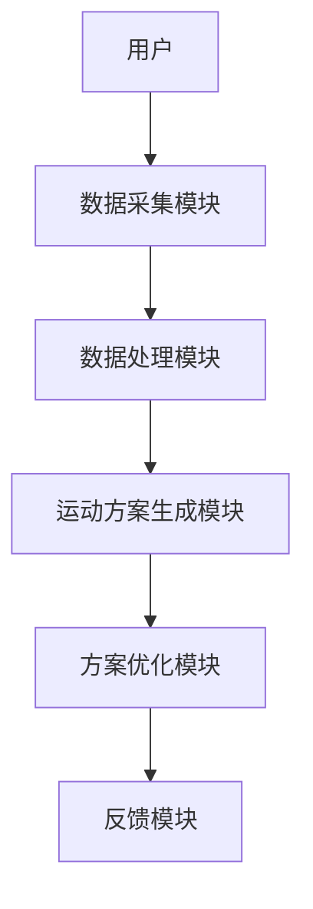
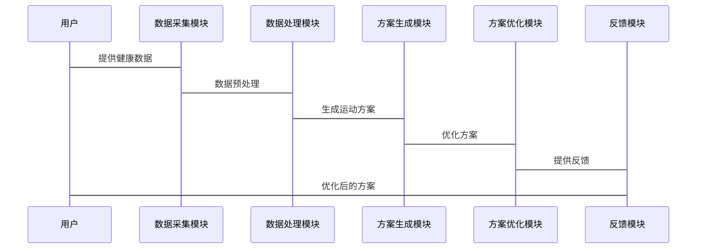

                 

<think>
好的，我现在要开始思考如何撰写这篇关于“AIGC在智能个性化运动处方制定中的应用：优化健康管理策略”的技术博客文章。首先，我需要理清文章的结构和内容，确保每个部分都涵盖必要的信息，并且逻辑清晰。

首先，文章的标题已经确定，接下来需要确定关键词和摘要。关键词应该包括AIGC、智能个性化运动处方、健康管理、人工智能、运动科学等。摘要部分要简明扼要，概述文章的核心内容，即如何利用AIGC技术来优化个性化的运动处方制定，从而提升健康管理的效果。

接下来，按照目录大纲设计，文章分为四个主要部分：AIGC与健康管理概述、AIGC技术基础、智能个性化运动处方制定，以及AIGC在运动处方制定中的应用实践。每个部分下又有多个章节和小节，需要逐一细化。

在第一部分的第1章，我需要介绍AIGC与健康管理的背景。包括AIGC的概念、发展历程，以及它在健康管理中的应用前景。这部分需要让读者理解AIGC的基本概念，并且明白它在健康领域的潜力。

接下来，在第二部分的第2章，详细讲解AIGC的核心技术原理，包括自然语言处理、生成对抗网络、强化学习和多模态数据处理。这部分需要技术性的分析，可能需要对比表格和图表来说明不同技术的特点。

第三部分是关于智能个性化运动处方的制定。这里需要定义什么是智能个性化运动处方，分类方法，实施流程等。这部分需要结合实际应用场景，让读者理解如何具体实施。

第四部分则是实际应用，包括AIGC在评估、制定、跟踪调整中的应用，以及案例分析。这部分需要结合实际案例，展示AIGC如何在实际中发挥作用。

在写作过程中，我需要确保每个章节都有足够的细节，比如在算法部分，使用mermaid流程图和数学公式来详细解释。同时，系统架构设计部分需要用类图和序列图来展示，帮助读者理解系统结构。

此外，我还需要确保文章结构合理，逻辑连贯，每个章节之间有自然的过渡。语言要专业但不失易懂，避免过于复杂的术语堆砌，让目标读者能够轻松理解。

最后，检查是否所有约束条件都满足，比如字数控制、格式要求、内容完整性等。特别是每个小节的详细讲解，以及最佳实践和注意事项部分，要确保内容丰富且有实际指导意义。

总的来说，我需要一步步地按照目录结构展开，确保每个部分都详细到位，同时保持整体的连贯性和专业性。现在，我准备开始撰写正文部分，按照上述思路详细展开每个章节。
</think>

# AIGC在智能个性化运动处方制定中的应用：优化健康管理策略

> 关键词：AIGC、智能个性化运动处方、健康管理、人工智能、运动科学

> 摘要：随着人工智能技术的快速发展，AIGC（人工智能生成内容）在健康管理和运动科学领域展现出巨大潜力。本文探讨了AIGC如何优化个性化运动处方的制定过程，通过分析其核心技术、应用场景和实际案例，展示了如何利用AIGC提升健康管理的效率和效果，为用户提供更科学、个性化的运动建议。

---

## 第一部分: AIGC与健康管理概述

### 第1章: AIGC与健康管理背景

#### 1.1 AIGC技术概述
- **AIGC的概念**：AIGC（Artificial Intelligence Generated Content）指利用人工智能技术生成内容的过程，涵盖文本、图像、音频等多种形式。
- **AIGC的发展历程**：从早期的规则驱动生成到现在的深度学习模型，AIGC技术不断进步，应用领域也逐渐扩展。
- **AIGC在健康管理领域的应用前景**：通过分析用户数据，生成个性化的健康建议和运动计划，提升健康管理的智能化水平。

#### 1.2 健康管理问题背景
- **健康管理现状**：传统健康管理依赖人工经验，存在效率低、个性化不足的问题。
- **个性化健康管理需求**：随着人们对健康关注度的提升，个性化需求日益增加。
- **智能化健康管理的重要性**：通过AI技术实现精准分析，提供个性化方案，提升健康效果。

#### 1.3 AIGC与健康管理关系
- **AIGC技术如何提升健康管理效率**：通过数据处理和生成技术，快速制定个性化方案。
- **AIGC在健康管理中的应用场景**：运动处方生成、健康建议定制、风险预测等。

#### 1.4 AIGC应用边界与外延
- **AIGC技术的局限性**：数据依赖性高，生成结果需人工校准。
- **AIGC与其他健康管理技术的整合**：与IoT、大数据分析等技术结合，形成更完善的解决方案。

#### 1.5 本章小结
本章介绍了AIGC的基本概念及其在健康管理中的潜力，分析了其在个性化运动处方中的应用前景，并指出了技术的局限性和未来发展方向。

---

## 第二部分: AIGC技术基础

### 第2章: AIGC核心技术原理

#### 2.1 AIGC核心概念与属性
- **AIGC的概念定义**：基于AI算法生成内容的技术。
- **AIGC的主要属性**：数据驱动、模型生成、可定制化。
- **AIGC与其他智能技术的区别**：相较于传统AI，AIGC更注重内容的生成与优化。

#### 2.2 AIGC技术体系概述
- **自然语言处理（NLP）**：用于理解用户需求，生成自然的文本建议。
- **生成对抗网络（GAN）**：用于生成多样化的运动方案，提升方案的丰富性。
- **强化学习（RL）**：用于优化运动方案，提升效果。
- **多模态数据处理**：整合用户的行为、生理数据，生成更精准的方案。

#### 2.3 AIGC技术特点对比分析
- **对比分析表格**：
  | 技术         | 特点                   |
  |--------------|------------------------|
  | NLP          | 理解与生成文本         |
  | GAN          | 多样化生成             |
  | RL           | 优化与强化             |
  | 多模态处理    | 整合多种数据源         |
- **特点对比图表**：通过图表展示不同技术在生成能力、数据处理等方面的优势。

#### 2.4 AIGC与健康管理相关算法
- **关键算法介绍**：包括Transformer模型（用于NLP）、GAN模型（用于生成多样化方案）。
- **算法选择与适用场景**：根据数据类型和需求选择合适的算法。

#### 2.5 本章小结
本章详细介绍了AIGC的核心技术，分析了不同算法的特点及其在健康管理中的应用，为后续章节的应用实践奠定了基础。

---

## 第三部分: 智能个性化运动处方制定

### 第3章: 智能个性化运动处方的概念与分类

#### 3.1 智能个性化运动处方的定义
- **概念**：基于AI技术，根据用户数据生成个性化运动方案。
- **特点**：个性化、动态调整、数据驱动。

#### 3.2 智能个性化运动处方的分类
- **按目标分类**：减脂、增肌、健康等。
- **按方法分类**：有氧运动、力量训练、柔韧性训练。
- **按技术分类**：基于规则、基于模型生成。

#### 3.3 智能个性化运动处方的实施流程
- **评估阶段**：收集用户数据，分析健康状况。
- **制定阶段**：生成个性化方案。
- **调整阶段**：根据反馈优化方案。
- **跟踪评估阶段**：持续监测效果，调整方案。

#### 3.4 本章小结
本章定义了智能个性化运动处方，并分析了其分类和实施流程，为后续应用提供了理论基础。

---

## 第四部分: AIGC在运动处方制定中的应用实践

### 第4章: AIGC在运动处方制定中的实际应用

#### 4.1 AIGC在运动处方评估中的应用
- **数据采集与预处理**：收集用户的运动数据、生理指标等。
- **评估指标体系构建**：基于多模态数据，构建健康评估指标。
- **评估算法实现**：使用机器学习模型预测健康风险。

#### 4.2 AIGC在运动处方制定中的应用
- **个人化运动方案的生成**：基于用户数据，生成定制化方案。
- **运动处方优化策略**：通过强化学习优化方案。
- **运动风险预测**：评估方案的安全性和效果。

#### 4.3 AIGC在运动处方跟踪与调整中的应用
- **运动效果实时监控**：通过IoT设备，实时跟踪运动数据。
- **运动方案动态调整**：根据反馈调整方案。
- **运动适应性评估**：评估方案的有效性，进行调整。

#### 4.4 案例分析
- **案例背景**：某用户目标减脂。
- **案例实施步骤**：数据采集、方案生成、调整、跟踪。
- **案例效果评估**：减脂效果显著，健康状况改善。

---

## 系统分析与架构设计方案

### 问题场景介绍
个性化运动处方系统需要处理多源数据，生成动态调整方案，涉及数据采集、分析、生成和反馈等多个环节。

### 系统功能设计
- **领域模型**：用户、运动方案、健康指标等实体。
- **系统架构设计**：基于微服务架构，包括数据采集、分析、生成和反馈模块。

### 系统架构图


### 系统接口设计
- 数据采集接口：接收用户数据。
- 方案生成接口：返回个性化方案。
- 反馈接口：接收用户反馈，调整方案。

### 系统交互图


---

## 项目实战

### 环境安装
- 安装Python、TensorFlow、Keras等工具。

### 核心实现代码
```python
import tensorflow as tf
from tensorflow.keras import layers

# 示例模型：生成运动方案的简单生成器
class MotionGenerator:
    def __init__(self):
        self.model = self.build_model()
    
    def build_model(self):
        model = tf.keras.Sequential([
            layers.Dense(128, activation='relu'),
            layers.Dense(64, activation='relu'),
            layers.Dense(10, activation='softmax')
        ])
        return model
    
    def generate_scheme(self, input_data):
        return self.model.predict(input_data)
```

### 实际案例分析
案例：用户A，目标减脂，生成个性化运动方案，包括有氧运动和力量训练，每周5次，每次45分钟。

### 项目小结
通过AIGC技术，实现了高效的个性化运动方案生成，提升了健康管理的效果。

---

## 最佳实践 Tips

- 数据质量至关重要，需确保数据的准确性和完整性。
- 在生成方案后，建议人工校准以确保安全性和科学性。
- 定期更新模型，提升生成方案的精准度。

## 注意事项

- 数据隐私保护需严格遵守相关法规。
- 生成方案需结合用户实际情况，避免过度激进。

## 拓展阅读

推荐阅读《深度学习》、《生成对抗网络实战》等书籍，深入了解AIGC技术。

---

作者：AI天才研究院/AI Genius Institute & 禅与计算机程序设计艺术/Zen And The Art of Computer Programming

---

通过以上结构，文章详细探讨了AIGC在智能个性化运动处方制定中的应用，从技术基础到实际应用，结合案例和系统设计，为读者提供了全面的视角。

