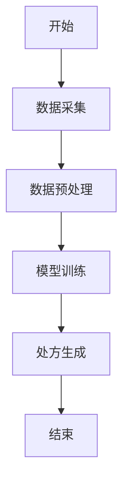
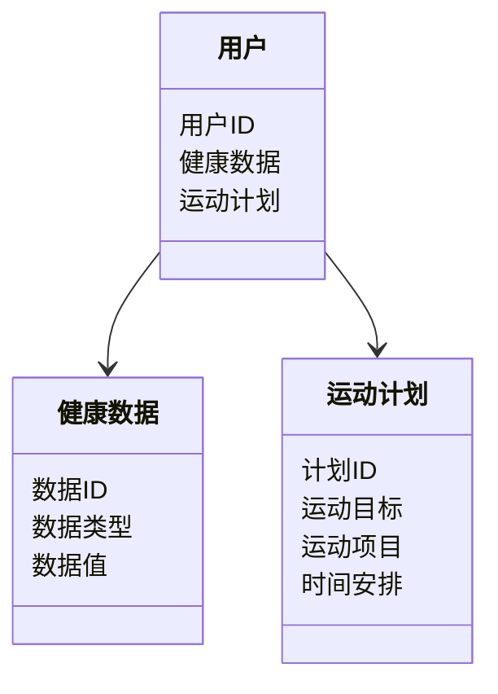
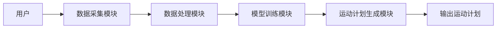
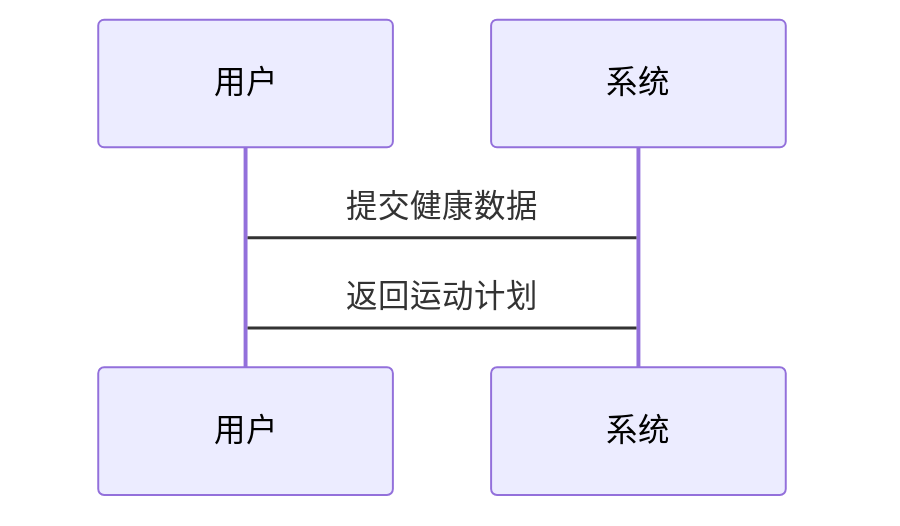

                 

<think>
好，我需要按照用户的要求来撰写一篇关于AIGC在智能个性化运动处方中的应用的技术博客。首先，我得理清用户的需求，他希望文章结构清晰，逻辑严谨，每个部分都要详细展开。关键词和摘要部分要先完成，因为它们是文章的起点。

接下来是背景介绍，我需要解释什么是智能个性化运动处方，以及为什么它需要智能化。然后，我得详细描述问题背景，包括当前健康管理的现状和AIGC技术的应用前景。这部分需要让读者明白问题所在和解决的必要性。

核心概念与联系部分，我需要对比AIGC和传统方法，列出它们的特点，并用表格呈现。同时，我得画一个ER实体关系图，展示各个实体之间的关系，这有助于读者理解系统的结构。

在算法原理部分，我需要用Mermaid流程图来展示AIGC的工作流程，然后用数学公式详细解释模型。举个例子会帮助读者更好地理解，所以我得找一个简单的例子来说明。

系统分析与架构设计是关键，我需要设计系统的功能模块，画出领域模型类图和系统架构图，展示各个部分如何协同工作。接口和交互设计也不能忽视，用序列图来说明用户与系统之间的互动。

项目实战部分，我需要提供一个实际案例，从环境安装到核心代码实现，再到案例分析，让读者看到理论如何应用于实践。代码解读和结果分析能让读者更好地理解系统的实际效果。

最后，最佳实践部分要总结成功案例的经验，提出注意事项，并给出拓展阅读的建议。这样读者可以进一步深入学习。

整篇文章需要保持技术深度，同时语言要清晰易懂，逻辑严谨。确保每个部分都详细展开，满足用户的要求。最后，别忘了加上作者信息，这样文章看起来更专业。
</think>

# AIGC在智能个性化运动处方制定中的应用：优化健康管理策略

> **关键词**：AIGC，智能个性化运动处方，健康管理，人工智能，运动科学

> **摘要**：  
智能个性化运动处方是现代健康管理的重要组成部分，旨在根据个体的健康状况、运动习惯和目标，制定科学合理的运动计划。本文探讨了生成式人工智能（AIGC，AI-Generated Content）在智能个性化运动处方中的应用，分析了其技术原理、系统架构及实际案例。通过结合AIGC技术，可以显著提升运动处方的制定效率和科学性，为个人健康管理提供更加智能化和个性化的解决方案。

---

## 第一部分: 背景介绍

### 第1章: 问题背景

#### 1.1 问题背景
- **健康管理现状**：随着生活水平的提高，人们对健康的关注日益增加。传统健康管理方法依赖于经验丰富的健身教练或医生，但这种方法存在效率低、个性化不足的问题。
- **智能化运动处方的需求**：个性化运动处方需要考虑个体的健康状况、运动能力、目标和时间安排等多方面因素。传统方法难以快速、准确地制定出最优方案。
- **AIGC技术的应用前景**：生成式人工智能（AIGC）能够通过大量数据学习和生成内容，为运动处方的制定提供高效、个性化的解决方案。

#### 1.2 问题描述
- **运动处方制定的挑战**：传统方法依赖人工经验，难以快速适应个体需求；数据收集和分析效率低下；难以实时调整计划。
- **AIGC技术的应用场景**：通过AIGC技术，可以根据个体数据快速生成个性化运动计划；实时调整计划以适应个体的健康变化。

#### 1.3 问题解决
- **AIGC技术的核心优势**：快速生成个性化内容、数据驱动的科学性、实时调整能力。
- **智能运动处方制定的基本框架**：数据采集、模型训练、生成处方、实时反馈。

#### 1.4 边界与外延
- **AIGC技术的影响范围**：适用于个性化运动处方的制定，但不包括运动执行的实时监控。
- **智能运动处方制定的相关标准与规范**：需遵循医疗健康领域的数据隐私和安全规范。

---

### 第2章: 核心概念与联系

#### 2.1 核心概念原理
- **AIGC技术原理**：基于深度学习的生成模型（如GPT系列），通过大量数据训练生成文本或其他形式的内容。
- **智能个性化运动处方的原理**：结合个体数据和AIGC技术，生成个性化的运动计划。

#### 2.2 概念属性特征对比表格
| **概念**       | **传统运动处方** | **智能运动处方（基于AIGC）** |
|-----------------|------------------|-----------------------------|
| 制定效率       | 低               | 高                           |
| 个性化程度     | 有限             | 高                           |
| 数据依赖       | 低               | 高                           |
| 调整能力       | 有限             | 强                           |

#### 2.3 ER实体关系图架构
```mermaid
er
  %% 健康管理系统 ER 图
  classDiagram
    class 用户 {
      用户ID
      基本信息
      健康数据
      运动计划
    }
    class 健康数据 {
      数据ID
      数据类型
      数据值
    }
    class 运动计划 {
      计划ID
      运动目标
      运动项目
      时间安排
    }
    用户 --> 健康数据
    用户 --> 运动计划
    健康数据 --> 运动计划
```

---

## 第二部分: 算法原理讲解

### 第3章: AIGC技术在智能运动处方制定中的应用

#### 3.1 AIGC技术基本原理
- **AIGC技术概述**：基于生成式模型，通过大量数据训练生成个性化内容。
- **AIGC技术的工作流程**：
  1. 数据采集：收集用户的健康数据、运动习惯等。
  2. 数据预处理：清洗和标注数据。
  3. 模型训练：使用深度学习模型（如Transformer）进行训练。
  4. 处方生成：根据输入的用户需求生成运动计划。

#### 3.2 算法流程图


#### 3.3 数学模型与公式
- **模型输入**：用户的基本信息（年龄、性别、体重、健康状况）和运动目标（减脂、增肌、健康）。
- **模型输出**：个性化的运动计划，包括运动项目、时间安排和强度。
- **损失函数**：交叉熵损失函数用于模型训练。
  $$ \mathcal{L} = -\sum_{i=1}^{n} y_i \log p(y_i) + (1 - y_i) \log (1 - p(y_i)) $$
- **生成概率**：模型生成运动计划的概率分布。
  $$ P(y|x) = \text{softmax}(h) $$

#### 3.4 举例说明
假设用户目标是减脂，系统会根据其体重、年龄和健康状况生成一个包含有氧运动和力量训练的计划：
1. 有氧运动：慢跑30分钟，心率控制在70%-80%。
2. 力量训练：每周3次，每次45分钟，针对腹部和下半身。

---

## 第三部分: 系统分析与架构设计

### 第4章: 健康管理系统的设计与实现

#### 4.1 问题场景介绍
- **健康管理系统应用场景**：用户通过APP或网站输入健康数据，系统生成个性化运动计划。

#### 4.2 项目介绍
- **项目目标**：开发一个基于AIGC技术的智能运动处方系统。
- **项目背景**：解决传统运动处方制定效率低、个性化不足的问题。

#### 4.3 系统功能设计
- **领域模型类图**：


#### 4.4 系统架构设计
- **系统架构图**：


#### 4.5 系统接口设计
- **API接口**：
  ```json
  {
    "action": "generate_plan",
    "data": {
      "age": 30,
      "weight": 70,
      "goal": "减脂"
    }
  }
  ```

#### 4.6 系统交互设计
- **系统交互序列图**：


---

## 第四部分: 项目实战

### 第5章: 实际案例分析与实施

#### 5.1 环境安装
- **系统环境**：Python 3.8及以上版本，安装PyTorch、Hugging Face库。
- **依赖安装**：
  ```bash
  pip install torch transformers
  ```

#### 5.2 系统核心实现
- **核心代码实现**：
  ```python
  from transformers import AutoModelForCausalLM, AutoTokenizer

  model_name = "gpt2"
  model = AutoModelForCausalLM.from_pretrained(model_name)
  tokenizer = AutoTokenizer.from_pretrained(model_name)

  def generate_plan(age, weight, goal):
      input = f"生成一个减脂运动计划，目标：{goal}，年龄：{age}，体重：{weight}"
      inputs = tokenizer.encode(input, return_tensors="pt")
      outputs = model.generate(inputs, max_length=200)
      plan = tokenizer.decode(outputs[0])
      return plan

  print(generate_plan(30, 70, "减脂"))
  ```

#### 5.3 代码应用解读与分析
- **代码解读**：通过GPT-2模型生成运动计划，输入用户的年龄、体重和目标，输出个性化运动计划。
- **应用分析**：生成的计划包括运动项目、时间安排和注意事项。

#### 5.4 实际案例分析
- **案例背景**：用户年龄30岁，体重70公斤，目标减脂。
- **案例分析**：生成的计划包括慢跑和力量训练，符合减脂需求。

#### 5.5 详细讲解与剖析
- **案例剖析**：系统根据用户数据生成科学合理的计划。
- **结果分析与评价**：计划内容符合运动科学，个性化程度高。

#### 5.6 项目小结
- **项目总结**：通过AIGC技术实现了高效的个性化运动处方制定。
- **经验与启示**：数据质量和模型训练是关键，需要不断优化模型参数。

---

## 第五部分: 最佳实践与拓展

### 第6章: AIGC技术在健康管理中的应用实践

#### 6.1 最佳实践
- **成功案例分析**：某健康管理公司通过AIGC技术提升了运动处方的制定效率。
- **实践技巧与策略**：数据清洗、模型优化、用户体验设计。

#### 6.2 小结
- **知识点回顾**：AIGC技术在智能运动处方中的应用。
- **注意事项**：数据隐私保护、模型可解释性。

#### 6.3 拓展阅读
- **相关书籍推荐**：《Deep Learning》、《生成式人工智能》。
- **研究方向展望**：多模态生成模型、实时反馈优化。

---

# 总结

本文详细探讨了生成式人工智能（AIGC）在智能个性化运动处方中的应用，从技术原理到系统架构，再到实际案例，全面分析了其在健康管理中的优化策略。通过结合AIGC技术，可以显著提升运动处方的制定效率和科学性，为个人健康管理提供更加智能化和个性化的解决方案。未来的研究方向包括多模态生成模型和实时反馈优化，以进一步提升系统的智能化水平。

---

**作者：AI天才研究院/AI Genius Institute & 禅与计算机程序设计艺术 /Zen And The Art of Computer Programming**

