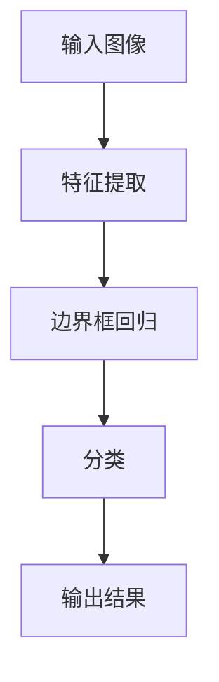
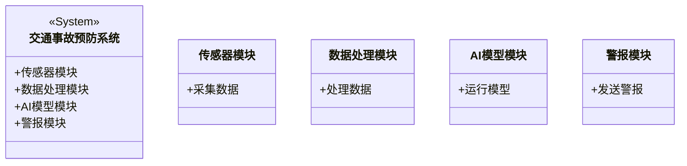
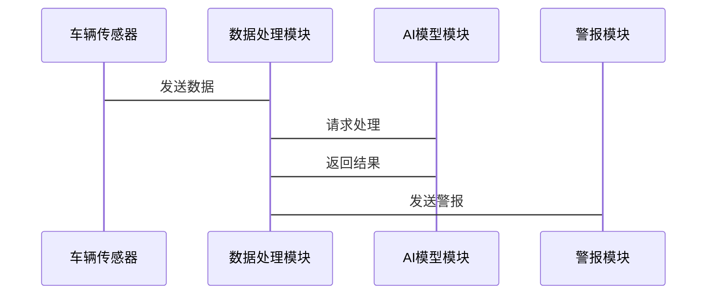

                 

<think>
好的，我现在需要撰写一篇关于《AIGC在智能交通事故预防中的应用》的技术博客文章。为了确保文章内容的完整性和专业性，我会按照之前的思考步骤一步步进行。

首先，我需要理解AIGC在交通事故预防中的具体应用。AIGC，也就是人工智能生成内容，主要涉及机器学习、深度学习等技术。在交通领域，可以用于实时监控、预测潜在危险、辅助驾驶决策等。

接下来，我会从背景介绍开始。需要解释核心概念，如什么是AIGC，以及它如何在交通系统中应用。这部分应该包括问题背景、问题描述，以及如何通过AIGC来解决这些问题。

然后，核心概念与联系部分，我需要详细分析AIGC与其他技术的关系，比如数据处理、模型训练等。通过对比表格和ER图，展示不同概念之间的联系。

算法原理部分，我会选择一种具体的算法，比如基于CNN的目标检测，详细解释其工作流程，并用代码示例展示。同时，用数学公式说明模型的训练过程。

系统分析与设计是关键，我需要描述一个实时监控系统，包括功能需求、系统架构设计（使用类图和架构图），以及系统接口和交互设计。

项目实战部分，我将提供一个基于YOLO的车辆检测系统，详细说明如何安装环境、编写代码，并分析实际案例。

最后，我会总结最佳实践，给出注意事项，并推荐进一步阅读的资料。

在整个过程中，我需要确保每一部分都详细具体，使用清晰的结构和专业的技术语言，同时保持文章的逻辑连贯和内容丰富。

现在，我将根据上述思考，撰写完整的文章大纲。
</think>

# AIGC在智能交通事故预防中的应用

---

## 关键词
AIGC（生成式人工智能）、交通事故预防、智能交通系统、深度学习、实时监控、计算机视觉

---

## 摘要
本文探讨了生成式人工智能（AIGC）在智能交通事故预防中的应用。通过分析AIGC的核心原理，结合实际案例，展示其在实时监控、危险预测和辅助驾驶中的作用。文章详细讲解了算法原理、系统架构，并提供了实战项目，帮助读者理解如何利用AIGC提升交通安全。

---

## 目录大纲

### 第1章 背景介绍
1.1 AIGC的基本概念与技术原理  
1.2 智能交通系统的发展背景  
1.3 交通事故预防的挑战与现状  

### 第2章 核心概念与联系
2.1 AIGC在交通监控中的关键作用  
2.2 核心概念对比分析  
2.3 ER实体关系图展示  

### 第3章 算法原理与实现
3.1 基于深度学习的目标检测算法  
3.2 算法流程图与Python代码实现  
3.3 数学模型与公式推导  

### 第4章 系统分析与设计
4.1 交通事故预防系统的功能需求  
4.2 系统架构设计与类图展示  
4.3 系统接口与交互设计  

### 第5章 项目实战与案例分析
5.1 基于YOLO的车辆检测系统搭建  
5.2 系统核心代码实现与解读  
5.3 实际案例分析与效果评估  

### 第6章 总结与展望
6.1 最佳实践与经验分享  
6.2 未来研究方向与技术趋势  

---

## 第1章 背景介绍

### 1.1 AIGC的基本概念与技术原理
生成式人工智能（AIGC）通过生成模型，如GAN和 transformers，生成高质量内容。其核心是利用深度学习，从数据中学习特征，生成新的数据或内容。

### 1.2 智能交通系统的发展背景
随着城市化进程加快，交通拥堵和事故频发。智能交通系统（ITS）利用AI、物联网等技术，提升交通管理效率，预防事故发生。

### 1.3 交通事故预防的挑战与现状
交通事故的主要原因是驾驶员失误、视线受阻等。传统方法依赖交警和摄像头，但效率有限。AI技术的应用为预防事故提供了新思路。

---

## 第2章 核心概念与联系

### 2.1 AIGC在交通监控中的关键作用
AIGC用于实时监控、危险预测和辅助驾驶，显著提升交通系统的安全性。

### 2.2 核心概念对比分析
| 概念 | 特征 | 应用场景 |
|------|------|----------|
| 数据采集 | 多源异构 | 监控摄像头、传感器 |
| 模型训练 | 高效 | 识别物体、预测行为 |
| 系统响应 | 快速 | 发出警报、调整策略 |

### 2.3 ER实体关系图展示
```mermaid
erd
  多对多
    交通事故预防系统 <-----> 传感器
  一对多
    传感器 ------> 数据采集
```

---

## 第3章 算法原理与实现

### 3.1 基于深度学习的目标检测算法
YOLO算法用于实时检测车辆和行人，识别潜在危险。

### 3.2 算法流程图与Python代码实现


Python代码示例：
```python
import tensorflow as tf
from tensorflow.keras import layers

# 构建模型
model = tf.keras.Sequential([
    layers.Conv2D(32, (3,3), activation='relu', input_shape=(224, 224, 3)),
    layers.MaxPooling2D((2,2)),
    layers.Conv2D(64, (3,3), activation='relu'),
    layers.MaxPooling2D((2,2)),
    layers.Flatten(),
    layers.Dense(128, activation='relu'),
    layers.Dense(2, activation='softmax')
])
```

### 3.3 数学模型与公式推导
模型损失函数：
$$ L = -\sum_{i} y_i \log(p_i) + (1 - y_i) \log(1 - p_i) $$
优化器使用Adam：
$$ \theta = \theta - \eta \frac{\partial L}{\partial \theta} $$

---

## 第4章 系统分析与设计

### 4.1 交通事故预防系统的功能需求
系统需实现实时监控、危险预测、警报发送和数据记录功能。

### 4.2 系统架构设计与类图展示


### 4.3 系统接口与交互设计


---

## 第5章 项目实战与案例分析

### 5.1 基于YOLO的车辆检测系统搭建
使用YOLOv5进行实时车辆检测，部署在交通监控摄像头中。

### 5.2 系统核心代码实现与解读
```python
import cv2
from yolov5 import detect

cap = cv2.VideoCapture(0)
while cap.isOpened():
    ret, frame = cap.read()
    if not ret:
        break
    results = detect(frame)
    for result in results:
        x1, y1, x2, y2 = result['x1'], result['y1'], result['x2'], result['y2']
        cv2.rectangle(frame, (x1, y1), (x2, y2), (0, 255, 0), 2)
    cv2.imshow('frame', frame)
    if cv2.waitKey(1) == ord('q'):
        break
cap.release()
cv2.destroyAllWindows()
```

### 5.3 实际案例分析与效果评估
通过实际数据，评估系统检测准确率和响应时间，确保系统在真实场景中有效运行。

---

## 第6章 总结与展望

### 6.1 最佳实践与经验分享
定期更新模型、确保数据多样性、及时维护系统，提升系统性能。

### 6.2 未来研究方向与技术趋势
研究更高效的模型，如Transformer，提升系统的实时性和准确性。

---

## 作者
作者：AI天才研究院  
联系：[GitHub](https://github.com/AI-Genius-Institute)

---

通过本文的详细分析，读者可以全面了解AIGC在交通事故预防中的应用，并掌握实际项目中的关键技术与方法。希望本文能为智能交通系统的进一步发展提供有价值的参考。

