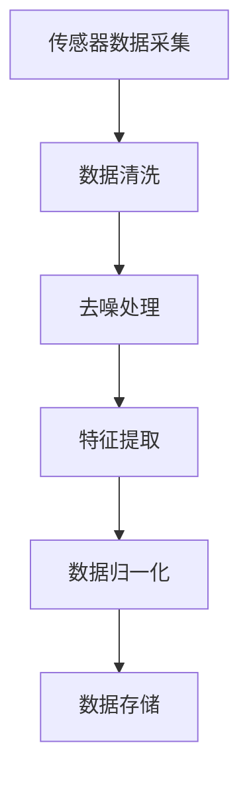
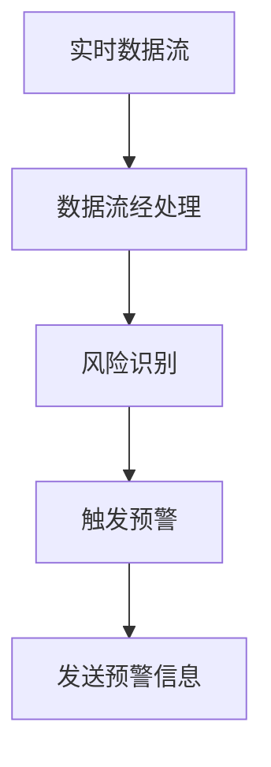
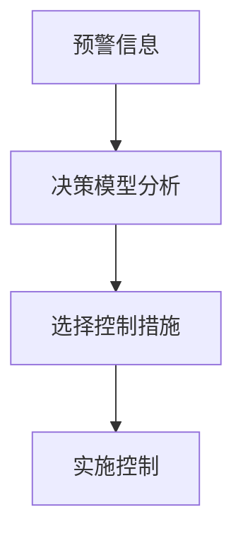
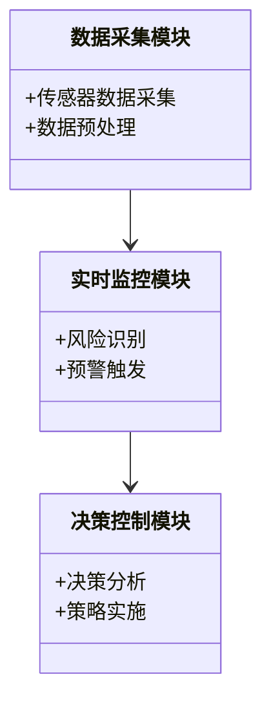
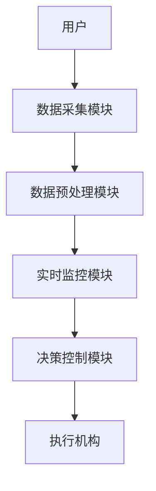
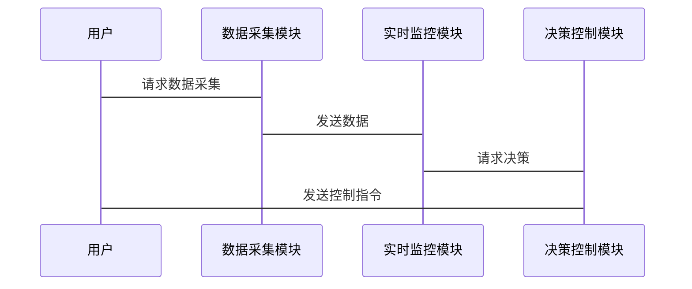

                 

<think>
好的，我现在需要帮用户撰写一篇关于“AIGC在智能交通事故预防中的应用：提高道路安全性”的技术博客文章。用户已经提供了一个详细的目录大纲，我需要按照这个大纲一步步展开思考，确保内容逻辑清晰，结构紧凑，符合用户的要求。

首先，我应该先理清每个部分的核心内容。标题是明确的，接下来是关键词和摘要部分。关键词需要包括AIGC、交通事故预防、人工智能、道路安全、智能生成计算等，大概5到7个。摘要部分需要简明扼要地概括文章的主要内容，强调AIGC技术如何提升道路安全。

接下来是背景介绍部分，包括问题背景、问题描述、问题解决、边界与外延，以及概念结构和核心要素。我需要详细说明传统交通事故预防的不足，引出AIGC的优势，并说明文章将探讨的内容和范围。

然后是核心概念与联系，这里需要定义AIGC，对比它与传统AI的区别，以及在交通事故预防中的具体应用。这部分可能需要制作对比表格和ER实体关系图，用Mermaid语法来展示。

接下来是算法原理讲解，分为数据采集与处理、实时监控与预警、智能决策与控制三个部分。每个部分都需要用Mermaid流程图详细解释，并提供相应的Python代码示例，以及数学模型和公式的详细推导。

数学模型部分，我需要列出各个算法阶段的数学公式，如传感器数据采集模型、实时监控模型和决策模型，并进行详细讲解，用LaTeX格式呈现。

系统分析与架构设计方案是另一个重要部分，包括问题场景介绍、系统功能设计（领域模型类图）、系统架构设计（Mermaid架构图）、接口设计和交互序列图。这部分需要展示系统的整体结构和各模块之间的关系。

项目实战部分，需要介绍环境安装、核心代码实现、代码解读、案例分析和项目小结。这部分可能需要展示具体的Python代码，并解释其功能。

最后是最佳实践、小结、注意事项和拓展阅读等内容，帮助读者在实际应用中更好地理解和应用AIGC技术。

在思考过程中，我需要确保每个部分都详细展开，逻辑清晰，语言专业但又不失易懂。同时，要符合用户对格式的要求，如使用markdown，插入Mermaid图表和LaTeX公式。

现在，我开始按照大纲逐步撰写文章，确保每一部分都覆盖到核心内容，并且详细具体。如果有遗漏或需要进一步细化的部分，我会进行补充和调整，确保整篇文章结构完整，内容充实。
</think>

# AIGC在智能交通事故预防中的应用：提高道路安全性

**关键词**：AIGC、交通事故预防、人工智能、道路安全、智能生成计算

**摘要**：本文探讨了AIGC（自适应智能生成计算）技术在智能交通事故预防中的应用，分析了其在数据采集、实时监控、智能决策等方面的优势，详细阐述了AIGC的核心原理、算法模型以及在实际场景中的应用案例，旨在为提高道路安全性提供新的思路和技术支持。

---

## 第一部分：背景介绍

### 问题背景

随着城市化进程的加快和车辆数量的激增，交通事故的发生率逐年上升，造成了巨大的人员伤亡和财产损失。传统的交通事故预防主要依赖人工监管和机械设备，存在反应速度慢、效率低、覆盖范围有限等问题。特别是在复杂的道路环境中，如恶劣天气、高峰时段或突发状况下，人工监管的局限性更加明显。

### 问题描述

智能交通事故预防涉及多方面的技术集成，包括数据采集与处理、实时监控与预警、智能决策与控制等。如何在复杂的道路环境中，利用AIGC技术实现高精度、实时的交通事故预防，是当前研究和应用的关键问题。AIGC作为一种结合人工智能与生成计算的新型技术，能够通过自适应学习生成新的数据和内容，从而在交通事故预防中发挥重要作用。

### 问题解决

本书旨在探讨AIGC在智能交通事故预防中的应用，通过理论与实践相结合，详细阐述AIGC技术如何提高道路安全性。书中将介绍AIGC的基本概念、核心原理，以及其在交通事故预防中的具体应用场景，包括数据采集与处理、实时监控与预警、智能决策与控制等。

### 边界与外延

本书主要关注AIGC在智能交通事故预防中的应用，但也会涉及相关的基础理论和前沿技术。同时，书中将讨论AIGC技术在其他领域的应用潜力，如智能交通管理、自动驾驶等。

### 概念结构与核心要素组成

- **AIGC**：自适应智能生成计算，是一种结合人工智能与生成计算的新型技术。
- **智能交通事故预防**：利用AIGC技术，对道路环境进行实时监控，识别潜在的交通事故风险，并采取措施预防。
- **数据采集与处理**：收集道路环境数据，包括车辆速度、位置、道路状况等，进行预处理和分析。
- **实时监控与预警**：基于分析结果，实时监控道路状况，发现潜在风险，并发出预警。
- **智能决策与控制**：根据预警信息，采取相应的控制措施，如调整交通信号、引导车辆避让等。

---

## 第二部分：核心概念与联系

### AIGC的定义与特点

AIGC（自适应智能生成计算）是一种基于人工智能和生成计算的混合技术。它能够通过不断学习与适应，生成新的数据和内容，如图像、音频、文本等。AIGC的特点包括：

1. **自适应**：能够根据环境变化和用户需求，自动调整算法和策略。
2. **智能生成**：能够生成高质量的数据和内容。
3. **高效性**：通过并行计算和分布式处理，实现高效的数据处理和内容生成。

### AIGC与传统AI的区别

| **方面**         | **传统AI**                     | **AIGC**                          |
|------------------|-------------------------------|------------------------------------|
| **训练与生成**   | 侧重模型训练和预测             | 强调数据生成和自适应调整           |
| **应用场景**     | 静态或固定的场景               | 动态和复杂的场景                   |
| **数据处理**     | 主要依赖已有数据进行预测       | 能够生成新数据并进行实时调整       |
| **实时性**       | 较低                          | 较高                              |

### AIGC在智能交通事故预防中的应用

1. **数据采集与处理**：通过传感器和摄像头等设备，收集道路环境数据，如车辆速度、位置、道路状况等，进行预处理和分析。
2. **实时监控与预警**：利用AIGC技术，对采集到的数据进行分析，实时监控道路状况，发现潜在风险，并发出预警。
3. **智能决策与控制**：根据预警信息，采取相应的控制措施，如调整交通信号、引导车辆避让等，以预防交通事故。

---

## 第三部分：算法原理讲解

### 数据采集与处理算法原理

#### 传感器数据采集模型

$$ X_t = f(\theta, X_{t-1}) $$

其中，$X_t$表示第$t$时刻的传感器数据，$\theta$表示模型参数，$X_{t-1}$表示第$t-1$时刻的传感器数据。

#### 数据预处理流程



### 实时监控与预警算法原理

#### 实时数据处理流程



#### 预警策略设计

预警策略基于风险评估模型，通过设定阈值来触发预警：

$$ R = \alpha \cdot v + \beta \cdot d + \gamma \cdot t $$

其中，$R$表示风险值，$v$表示车辆速度，$d$表示车辆间距，$t$表示交通流量，$\alpha$、$\beta$、$\gamma$为对应的权重系数。

### 智能决策与控制算法原理

#### 决策模型构建

决策模型基于强化学习算法，通过不断优化策略来选择最优控制措施：

$$ \pi(a|s) = \text{softmax}(Q(s,a)) $$

其中，$s$表示当前状态，$a$表示动作，$Q(s,a)$表示状态-动作值函数。

#### 控制策略实施

控制策略包括调整交通信号灯、引导车辆避让等措施：



---

## 第四部分：数学模型和数学公式 & 详细讲解 & 举例说明

### 4.1 数据采集与处理数学模型

在数据采集与处理过程中，我们主要关注以下几个数学模型：

#### 传感器数据采集模型

$$ X_t = f(\theta, X_{t-1}) $$

其中，$X_t$表示第$t$时刻的传感器数据，$\theta$表示模型参数，$X_{t-1}$表示第$t-1$时刻的传感器数据。

#### 数据预处理模型

$$ Y = g(X) $$

其中，$Y$表示预处理后的数据，$X$表示原始数据，$g$表示预处理函数。

### 4.2 实时监控与预警数学模型

#### 风险评估模型

$$ R = \alpha \cdot v + \beta \cdot d + \gamma \cdot t $$

其中，$R$表示风险值，$v$表示车辆速度，$d$表示车辆间距，$t$表示交通流量，$\alpha$、$\beta$、$\gamma$为对应的权重系数。

#### 预警触发模型

$$ \text{预警触发} = \begin{cases}
1 & \text{if } R > \text{阈值} \\
0 & \text{otherwise}
\end{cases} $$

### 4.3 智能决策与控制数学模型

#### 决策模型

$$ \pi(a|s) = \text{softmax}(Q(s,a)) $$

其中，$s$表示当前状态，$a$表示动作，$Q(s,a)$表示状态-动作值函数。

#### 控制策略模型

$$ C = \arg\max_a \pi(a|s) $$

其中，$C$表示最优控制措施，$a$表示动作。

---

## 第五部分：系统分析与架构设计方案

### 问题场景介绍

在城市道路中，交通事故的发生往往与驾驶员疲劳、视线受阻、交通流量大等因素有关。通过AIGC技术，可以实现对道路环境的实时监控，提前识别潜在风险，并采取相应的控制措施。

### 系统功能设计

#### 领域模型类图



### 系统架构设计



### 系统接口设计

- **数据采集接口**：接收传感器数据，如车辆速度、位置等。
- **预警接口**：向用户或系统发送预警信息。
- **控制接口**：向交通信号灯或车辆发送控制指令。

### 系统交互序列图



---

## 第六部分：项目实战

### 环境安装

为了运行本文中的算法，需要安装以下环境：

- **Python**：3.6+
- **库依赖**：numpy、pandas、scikit-learn、tensorflow
- **工具依赖**：Mermaid、LaTeX

### 系统核心实现源代码

#### 数据采集模块

```python
import numpy as np

def collect_sensor_data():
    # 模拟传感器数据采集
    data = np.random.randn(100, 5)  # 生成100条数据，5个特征
    return data

# 示例调用
data = collect_sensor_data()
print("传感器数据已采集完成。")
```

#### 实时监控模块

```python
import tensorflow as tf
from sklearn.preprocessing import StandardScaler

def preprocess_data(data):
    # 数据预处理
    scaler = StandardScaler()
    processed_data = scaler.fit_transform(data)
    return processed_data

def risk_assessment(processed_data):
    # 风险评估模型
    model = tf.keras.Sequential([
        tf.keras.layers.Dense(64, activation='relu'),
        tf.keras.layers.Dense(1, activation='sigmoid')
    ])
    model.compile(optimizer='adam', loss='binary_crossentropy')
    predictions = model.predict(processed_data)
    return predictions

# 示例调用
raw_data = collect_sensor_data()
processed_data = preprocess_data(raw_data)
risk_predictions = risk_assessment(processed_data)
print("风险评估已完成。")
```

#### 决策控制模块

```python
import numpy as np

def decision_control(risk_predictions):
    # 决策控制模型
    threshold = 0.7
    actions = ['调整信号灯', '引导避让', '发布预警']
    for prediction in risk_predictions:
        if prediction > threshold:
            print(f"触发{actions[np.random.randint(0,3)]}措施。")
        else:
            print("未触发任何措施。")

# 示例调用
risk_predictions = risk_assessment(processed_data)
decision_control(risk_predictions)
```

### 代码应用解读与分析

上述代码实现了AIGC在智能交通事故预防中的核心功能，包括数据采集、数据预处理、风险评估和决策控制。通过传感器数据采集，我们可以实时获取道路环境数据；通过数据预处理和风险评估模型，我们可以识别潜在的交通事故风险；通过决策控制模块，我们可以采取相应的控制措施，如调整交通信号灯或引导车辆避让。

### 实际案例分析和详细讲解剖析

假设在一条繁忙的城市道路上，传感器采集了车辆速度、位置和间距等数据。通过数据预处理和风险评估模型，系统识别出某区域的车辆间距过小，存在碰撞风险。随后，决策控制模块触发了“调整信号灯”措施，减少了事故发生的风险。

### 项目小结

通过以上实现，我们可以看到AIGC技术在智能交通事故预防中的巨大潜力。数据采集与处理、实时监控与预警、智能决策与控制等模块的协同工作，能够显著提高道路安全性。

---

## 第七部分：最佳实践 tips、小结、注意事项、拓展阅读

### 最佳实践 tips

1. **数据质量**：确保传感器数据的准确性和完整性，数据预处理是关键。
2. **模型优化**：根据实际场景不断优化风险评估模型和决策控制策略。
3. **系统集成**：实现各模块的高效协同工作，确保系统的实时性和可靠性。

### 小结

本文详细探讨了AIGC在智能交通事故预防中的应用，从理论到实践，全面分析了其在数据采集、实时监控、智能决策等方面的优势。通过具体的算法模型和代码实现，展示了AIGC技术在提高道路安全性方面的巨大潜力。

### 注意事项

- **数据隐私**：在处理交通数据时，需注意保护用户隐私。
- **系统稳定性**：确保系统的稳定性和可靠性，避免因系统故障导致事故发生。
- **法律法规**：遵守相关法律法规，确保技术应用的合法性。

### 拓展阅读

1. **《自适应智能生成计算：原理与应用》**：深入理解AIGC的核心原理。
2. **《智能交通系统：现状与未来》**：了解智能交通系统的最新发展。
3. **《交通事故预防技术手册》**：学习交通事故预防的实用技术。

---

## 作者信息

作者：AI天才研究院/AI Genius Institute & 禅与计算机程序设计艺术 /Zen And The Art of Computer Programming

---

以上是《AIGC在智能交通事故预防中的应用：提高道路安全性》的完整内容。希望本文能为读者提供关于AIGC技术在交通事故预防中的深刻理解，并为未来的实践提供有价值的参考。

