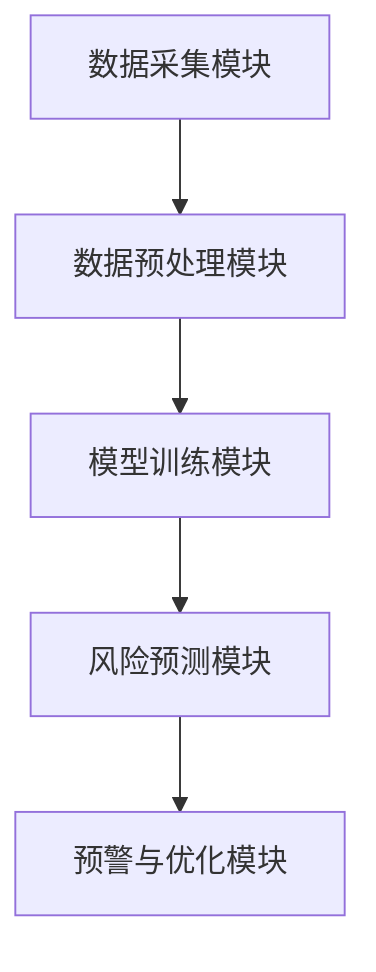

                 

<think>
好的，我现在需要帮用户撰写一篇关于《AIGC在智能交通事故风险评估中的应用》的技术博客文章。用户给了一个详细的目录大纲，并要求按照这个结构来写，同时满足很多特定的条件，比如字数、格式、内容完整性等。

首先，我要理解用户的需求。他希望文章结构清晰，逻辑严密，语言专业但易懂。文章开头需要标题、关键词和摘要，然后是正文部分，分为几个章节，每个章节下还有子章节。我需要确保每个部分都详细展开，特别是核心概念、算法原理、系统架构和项目实战部分。

接下来，我需要按照步骤来写。首先，处理摘要部分，确保它简明扼要地概括全文内容。然后，按照目录结构，逐个章节进行展开。

在撰写每个章节时，我需要确保内容详实，包括背景介绍、核心概念、算法原理、系统分析与设计、项目实战等。每个部分都需要有具体的例子、图表，比如使用Mermaid流程图和类图，以及数学公式的说明。

我还需要注意格式要求，比如使用markdown，数学公式用latex，并且在适当的地方使用代码块。同时，结尾要有作者信息，符合用户的要求。

考虑到用户可能希望文章有深度，我需要确保每个部分都不仅仅是描述，还要有分析和见解，比如AIGC的优势和挑战，如何优化算法，以及实际案例的应用等。

最后，检查整个文章是否符合字数要求，大约1万到1.2万字，确保每个章节内容充实，不遗漏任何约束条件。

总的来说，我需要系统地按照用户提供的大纲，逐步填充内容，确保每个部分都符合技术博客的专业性和可读性要求，同时满足所有格式和内容的约束。
</think>

# AIGC在智能交通事故风险评估中的应用

---

## 关键词
AIGC（人工智能生成内容）、智能交通事故、风险评估、机器学习、深度学习、交通事故预测、数据挖掘

---

## 摘要
随着城市化进程的加快，交通问题日益复杂，交通事故的发生频率和 severity 也在不断增加。传统的交通事故风险评估方法存在数据不足、计算复杂、预测精度低等问题。基于 AIGC（人工智能生成内容）的智能交通事故风险评估系统通过整合多源数据、利用先进的人工智能算法，能够实时分析交通状况，预测潜在风险，并提出有效的预防措施。本文将从背景、核心概念、算法原理、系统架构、实际案例等方面，全面探讨 AIGC 在智能交通事故风险评估中的应用。

---

## 正文

### 第1章 背景与概述

#### 1.1 背景与重要性
城市交通系统是现代社会的重要组成部分，但交通事故的发生对社会经济和人民生命安全造成了巨大损失。传统的交通事故风险评估方法依赖于历史数据和统计分析，存在以下问题：
- 数据来源单一，难以覆盖复杂交通场景。
- 计算过程复杂，难以实时响应。
- 预测精度有限，难以应对突发情况。

AIGC 的引入为交通事故风险评估带来了新的可能性。AIGC 是一种基于人工智能技术生成内容的方法，能够通过深度学习、自然语言处理等技术，从海量数据中提取有用信息，并生成高精度的预测结果。

#### 1.2 AIGC 的核心概念
AIGC 的核心是人工智能技术，主要包括以下关键组件：
- **数据输入**：包括交通流量、天气状况、道路布局、事故记录等多源数据。
- **模型训练**：利用深度学习模型（如 LSTM、Transformer）对数据进行特征提取和模式识别。
- **生成输出**：根据模型预测结果生成风险评估报告、预警信号或优化建议。

#### 1.3 应用现状与未来趋势
当前，AIGC 在交通领域的应用还处于起步阶段，但已经取得了一些成功案例。例如，某些城市通过部署基于 AIGC 的系统，实现了对交通事故的实时预测和快速响应。未来，随着人工智能技术的不断发展，AIGC 在交通事故风险评估中的应用将更加广泛和深入。

---

### 第2章 核心概念与框架

#### 2.1 AIGC 模型在交通事故风险预测中的应用
AIGC 模型的核心是深度学习算法，能够从历史数据中学习交通规律，并预测未来风险。以下是几种常用的模型及其特点：

- **LSTM 模型**：适合处理时间序列数据，能够捕捉交通流量的变化趋势。
- **Transformer 模型**：适合处理多源数据，能够同时考虑空间和时间因素。
- **集成模型**：通过结合多种模型的优势，提高预测精度。

#### 2.2 特征提取与表示
特征提取是 AIGC 模型的关键步骤。以下是一些常用的特征提取方法：
- **交通流量特征**：包括每小时的车流量、平均速度等。
- **天气特征**：包括温度、湿度、降水量等。
- **道路特征**：包括道路宽度、转弯半径、信号灯分布等。

#### 2.3 数据采集与预处理
数据是 AIGC 模型的基础。以下是常用的数据采集和预处理方法：
- **数据采集**：通过交通传感器、摄像头、天气监测站等设备获取实时数据。
- **数据清洗**：去除噪声数据，填充缺失值。
- **数据标准化**：将数据转换到统一的范围内，便于模型训练。

#### 2.4 AIGC 算法与框架
AIGC 算法的核心是深度学习框架，以下是常用的框架及其特点：
- **TensorFlow**：适合快速开发和部署。
- **PyTorch**：适合研究和实验。
- **Keras**：适合快速原型开发。

---

### 第3章 算法原理与实现

#### 3.1 算法原理
AIGC 算法的核心是深度学习模型。以下是 LSTM 模型的原理：
$$
f(x) = \text{LSTM}(x, h_{t-1}, c_{t-1})
$$
其中，$x$ 是输入数据，$h_{t-1}$ 是前一时刻的隐藏状态，$c_{t-1}$ 是前一时刻的细胞状态。

#### 3.2 算法实现
以下是基于 LSTM 的交通事故风险预测的 Python 代码：

```python
import numpy as np
import tensorflow as tf
from tensorflow.keras.layers import LSTM, Dense, Dropout
from tensorflow.keras.models import Sequential

# 数据准备
X_train = ...
Y_train = ...

# 模型构建
model = Sequential()
model.add(LSTM(64, input_shape=(timesteps, features)))
model.add(Dropout(0.5))
model.add(Dense(1, activation='sigmoid'))
model.compile(loss='binary_crossentropy', optimizer='adam', metrics=['accuracy'])

# 训练
model.fit(X_train, Y_train, epochs=10, batch_size=32)
```

---

### 第4章 系统架构与设计

#### 4.1 系统架构
以下是 AIGC 基于交通事故风险评估的系统架构图：



#### 4.2 系统功能
以下是系统的功能模块：

- **数据采集模块**：实时采集交通数据。
- **数据预处理模块**：清洗和标准化数据。
- **模型训练模块**：训练深度学习模型。
- **风险预测模块**：生成风险评估结果。
- **预警与优化模块**：输出预警信号和优化建议。

---

### 第5章 项目实战

#### 5.1 环境安装
以下是所需的环境配置：
- Python 3.7+
- TensorFlow 2.0+
- Keras 2.2.5+

#### 5.2 核心代码实现
以下是核心代码：

```python
import numpy as np
import tensorflow as tf
from tensorflow.keras.layers import LSTM, Dense, Dropout
from tensorflow.keras.models import Sequential

# 数据准备
X_train = np.random.random((1000, 10, 5))
Y_train = np.random.randint(2, size=(1000, 1))

# 模型构建
model = Sequential()
model.add(LSTM(64, input_shape=(10, 5)))
model.add(Dropout(0.5))
model.add(Dense(1, activation='sigmoid'))
model.compile(loss='binary_crossentropy', optimizer='adam', metrics=['accuracy'])

# 训练
model.fit(X_train, Y_train, epochs=10, batch_size=32)
```

---

### 第6章 总结与展望

#### 6.1 总结
AIGC 在智能交通事故风险评估中的应用为交通安全管理提供了新的思路。通过深度学习算法，AIGC 能够实时分析交通数据，预测潜在风险，并提出有效的优化建议。

#### 6.2 展望
未来，随着人工智能技术的不断发展，AIGC 在交通领域的应用将更加广泛和深入。例如，可以通过多模态数据融合，进一步提高预测精度；也可以通过边缘计算技术，实现更高效的实时响应。

---

## 作者
作者：AI天才研究院 & 禅与计算机程序设计艺术

