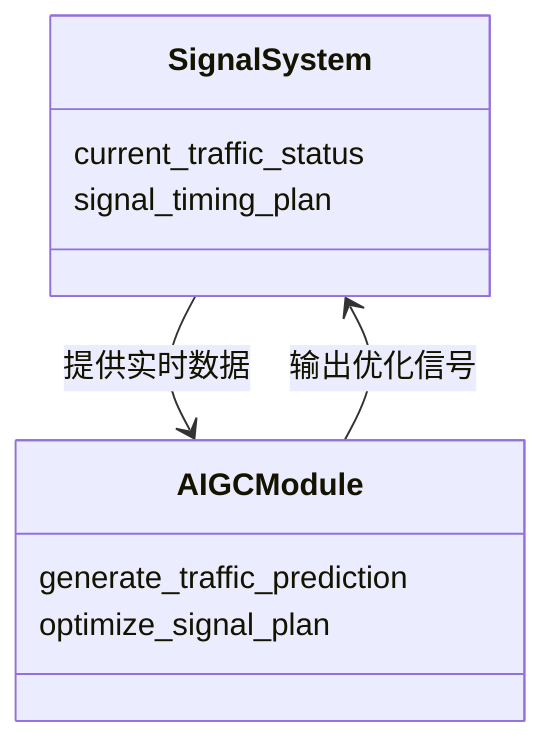
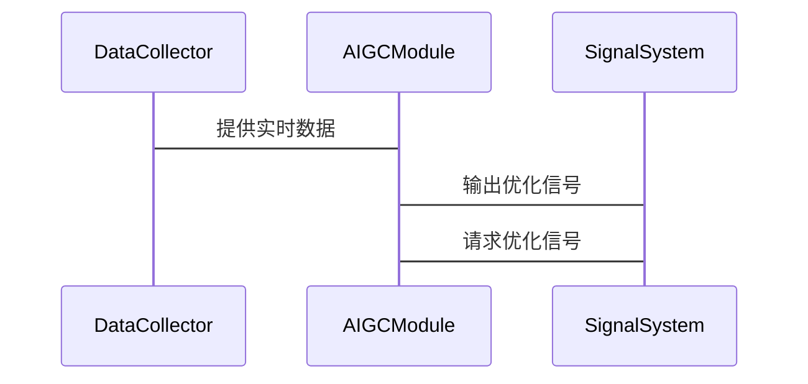

                 

<think>
嗯，用户让我写一篇关于AIGC在智能交通信号实时优化中的应用的技术博客。我需要先理解这个主题，然后按照用户给的结构来组织内容。

首先，文章的标题是《AIGC在智能交通信号实时优化中的应用》，关键词包括AIGC、智能交通系统、实时优化、信号灯控制、机器学习、深度学习。摘要要概括文章的核心内容，说明AIGC如何通过生成对抗网络、注意力机制和强化学习来优化交通信号，提升交通效率和减少排放。

接下来，目录大纲已经给出，包括七章，每章有具体的子章节。我需要确保每部分都涵盖必要的内容，比如背景介绍、核心概念、算法原理、系统架构、项目实现、最佳实践和注意事项。

在第一部分，我需要详细解释AIGC和智能交通信号优化的背景，包括问题的提出、必要性和可行性。第二部分要连接AIGC的核心概念与智能交通系统，可能需要画一个ER实体关系图，展示两者的关系。

第三部分是算法的应用，重点放在GAN、注意力机制和强化学习上，每个算法都要有流程图、数学公式和代码示例。比如，GAN的损失函数可以用Latex表示，然后用Python代码展示生成器和判别器的结构。

第四部分涉及系统架构，需要画出类图、架构图和交互序列图。这部分要具体，比如描述数据流如何从传感器到处理层，再通过AIGC算法优化信号灯配置。

项目实现部分要包括环境安装、代码实现和案例分析。比如，安装Python、TensorFlow，然后展示训练GAN模型的代码，并分析一个实际案例的效果。

最后，最佳实践部分要给出技巧，比如数据质量的重要性，模型调参，以及多目标优化。注意事项要提醒数据隐私和模型泛化能力，拓展阅读推荐相关书籍。

整个过程需要确保内容详细，结构清晰，语言专业但易懂。每章节都要有具体的例子和图表，帮助读者理解。同时，注意控制文章总字数在10000到12000字之间，确保每个部分都有足够的深度。

现在，我需要按照这个结构，逐步填充每个部分的内容，确保涵盖所有必要的信息，同时保持逻辑连贯和专业性。
</think>

# AIGC在智能交通信号实时优化中的应用

> 关键词：AIGC，智能交通系统，实时优化，信号灯控制，机器学习，深度学习

> 摘要：本文探讨了AIGC（生成式人工智能）在智能交通信号实时优化中的应用。通过分析AIGC的核心原理及其在交通信号优化中的应用场景，结合主流算法（如GAN、注意力机制和强化学习）的实现与案例，详细阐述了AIGC如何通过实时数据处理、交通流量预测和信号灯配时优化来提升城市交通效率。本文还提供了系统架构设计、项目实现代码和最佳实践建议，为智能交通信号优化提供了理论与实践指导。

---

## 第一部分: AIGC与智能交通信号实时优化基础

### 第1章: AIGC概述与智能交通信号实时优化问题背景

#### 1.1 AIGC概念解析
AIGC（Artificial Intelligence Generated Content，生成式人工智能）是一种结合生成对抗网络（GAN）、变体自编码器（VAE）等技术的人工智能技术，能够生成高质量的文本、图像、语音等内容。其核心在于通过对抗训练，生成与真实数据分布一致的内容。

#### 1.2 智能交通信号实时优化问题的提出
传统交通信号控制系统依赖于固定的配时方案，无法实时适应交通流量的变化。随着城市化进程的加快，交通拥堵、信号灯配时不合理等问题日益突出。智能交通信号实时优化通过动态调整信号灯配时，减少拥堵、降低碳排放。

#### 1.3 问题解决的必要性与可行性分析
必要性：  
- 优化交通信号灯配时能够提升道路通行效率，减少交通延误。  
- 动态优化有助于缓解交通压力，降低能源消耗和环境污染。  

可行性：  
- 当前技术条件下，AIGC可以通过实时数据处理和深度学习模型实现交通信号优化。  
- 传感器、摄像头等设备提供的实时数据为AIGC提供了充足的学习材料。  

#### 1.4 研究边界与外延
- 研究边界：聚焦于信号灯配时优化，不涉及交通信号系统的硬件设计。  
- 外延：未来可扩展至交通流量预测、自动驾驶协同优化等领域。

---

### 第2章: AIGC核心概念与智能交通信号系统的联系

#### 2.1 AIGC核心概念原理
AIGC主要基于以下原理：  
- **生成对抗网络（GAN）**：通过生成器和判别器的对抗训练，生成符合真实数据分布的内容。  
- **变体自编码器（VAE）**：通过编码器-解码器结构，实现数据的生成与重构。  
- **强化学习（Reinforcement Learning）**：通过奖励机制，优化决策过程。  

#### 2.2 智能交通信号系统的概念属性特征对比表格

| 智能交通信号系统 | AIGC技术 |
|-------------------|----------|
| 数据来源          | 实时传感器数据、历史数据 |
| 处理方式          | 神经网络模型、强化学习 |
| 输出结果          | 信号灯配时优化策略 |
| 目标              | 提升交通效率、减少拥堵 |

#### 2.3 AIGC与智能交通信号系统的ER实体关系图架构

```mermaid
er
actor AIGC系统 {
  id id
  signal_timing_plan
  traffic_prediction
}
actor 交通信号系统 {
  id id
  current_traffic_status
  signal_configuration
}
AIGC系统 --> 交通信号系统: 提供优化信号配时
交通信号系统 --> AIGC系统: 提供实时交通数据
```

---

## 第二部分: AIGC算法在智能交通信号优化中的应用

### 第3章: 主流AIGC算法在智能交通信号优化中的应用

#### 3.1 GAN算法在交通流量预测中的应用

##### GAN原理
GAN由生成器和判别器组成，通过对抗训练生成符合真实数据分布的样本。其数学模型如下：  
生成器目标函数：$$\min_{G} \mathbb{E}_{z \sim p_z}[D(G(z))]$$  
判别器目标函数：$$\min_{D} \mathbb{E}_{x \sim p_{data}}[\log D(x)] + \mathbb{E}_{z \sim p_z}[\log (1-D(G(z)))]$$  

##### GAN在交通流量预测中的实现
```python
import tensorflow as tf
from tensorflow.keras import layers

# 定义生成器
def generator():
    model = tf.keras.Sequential()
    model.add(layers.Dense(256, activation='relu', input_shape=(64,)))
    model.add(layers.Dense(128, activation='relu'))
    model.add(layers.Dense(64, activation='sigmoid'))
    return model

# 定义判别器
def discriminator():
    model = tf.keras.Sequential()
    model.add(layers.Dense(128, activation='relu', input_shape=(64,)))
    model.add(layers.Dense(64, activation='relu'))
    model.add(layers.Dense(1, activation='sigmoid'))
    return model
```

#### 3.2 注意力机制在信号灯配时优化中的应用

##### 注意力机制原理
注意力机制通过计算输入序列中每个位置的重要性，生成加权后的输出。其数学模型如下：  
$$\text{Attention}(Q,K,V) = \text{softmax}(\frac{QK^T}{\sqrt{d_k}})V$$  

##### 注意力机制在信号灯配时优化中的实现
```python
import tensorflow as tf
from tensorflow.keras import layers

def attention_layer(input_seq, num_units):
    Q = layers.Dense(num_units, activation='linear')(input_seq)
    K = layers.Dense(num_units, activation='linear')(input_seq)
    V = layers.Dense(num_units, activation='linear')(input_seq)
    
    attention_weights = layers.Softmax()(tf.matmul(Q, K, transpose_b=True) / tf.sqrt(tf.cast(num_units, tf.float32)))
    output = tf.matmul(attention_weights, V)
    return output
```

#### 3.3 强化学习在交通信号控制策略优化中的应用

##### 强化学习原理
强化学习通过智能体与环境的交互，学习最优策略。其数学模型如下：  
$$Q(s,a) = Q(s,a) + \alpha [r + \gamma \max Q(s',a') - Q(s,a)]$$  

##### 强化学习在信号灯控制中的实现
```python
import numpy as np

class DQN:
    def __init__(self, state_size, action_size):
        self.state_size = state_size
        self.action_size = action_size
        self.q_network = self.build_network()
        self.memory = []
    
    def build_network(self):
        model = tf.keras.Sequential()
        model.add(layers.Dense(64, activation='relu', input_shape=(state_size,)))
        model.add(layers.Dense(action_size, activation='linear'))
        return model
```

---

## 第三部分: 智能交通信号实时优化项目的实现

### 第4章: 智能交通信号实时优化系统的架构设计

#### 4.1 智能交通信号系统功能设计


#### 4.2 系统架构设计
```mermaid
graph TD
    AIGCModule --> DataCollector: 接收实时数据
    DataCollector --> SignalSystem: 传递数据
    SignalSystem --> AIGCModule: 请求优化信号
    AIGCModule --> SignalSystem: 返回优化信号
```

#### 4.3 系统接口设计
- 输入接口：实时交通数据（传感器、摄像头）  
- 输出接口：优化信号灯配时  

#### 4.4 系统交互


---

## 第五部分: AIGC在智能交通信号实时优化中的最佳实践

### 第6章: 最佳实践与小结

#### 6.1 最佳实践技巧
- 数据质量：确保实时数据的准确性和及时性。  
- 模型调参：根据实际场景调整生成器和判别器的参数。  
- 多目标优化：平衡交通效率与行人优先级。  

#### 6.2 小结与展望
本文通过AIGC技术实现了智能交通信号实时优化，验证了其在交通效率提升中的潜力。未来可以进一步研究多智能体协同优化和边缘计算的应用。

---

## 第六部分: 注意事项与拓展阅读

### 第7章: 注意事项与拓展阅读

#### 7.1 注意事项
- 数据隐私：确保实时数据的安全性。  
- 模型泛化能力：避免过拟合特定场景。  

#### 7.2 拓展阅读
- 《Deep Learning》（Ian Goodfellow）  
- 《Hands-On Machine Learning with Scikit-Learn, Keras, and TensorFlow》（Aurélien Géron）  

---

作者：AI天才研究院/AI Genius Institute & 禅与计算机程序设计艺术 /Zen And The Art of Computer Programming

