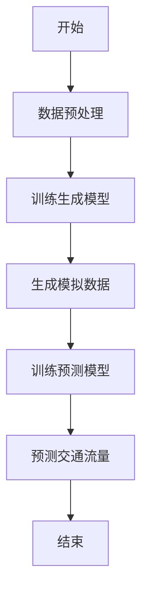
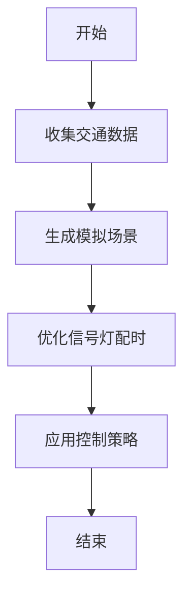

                 

<think>
好，我现在需要撰写一篇关于“AIGC在智能交通流量预测与管理中的应用”的技术博客文章。我得先理清思路，逐步分析。

首先，明确文章的核心主题。AIGC，也就是人工智能生成内容，如何应用于交通流量预测和管理。这涉及到AI技术在交通系统中的应用，比如预测交通流量，优化信号灯控制，减少拥堵等。

接下来，确定文章的结构。用户已经给出了一个详细的目录大纲，分为四个部分，共八个章节。我需要按照这个结构来组织内容，确保每个部分都涵盖必要的内容。

第一部分是背景与核心概念，包括两章。第一部分需要介绍问题背景，说明交通流量预测和管理的重要性，当前面临的挑战，以及AIGC的应用潜力。第二章则要深入分析核心概念，比如交通流量预测、AIGC技术原理，以及它们之间的联系，可能需要一些表格和ER图来说明。

第二部分是算法原理讲解，分两章。第三章专注于交通流量预测的算法，介绍基于AIGC的算法概述，流程图，Python代码，数学模型和例子。第四章则讨论智能交通管理的算法，同样包括概述、流程图、代码、模型和案例。

第三部分是系统设计与实现，包括两章。第五章分析系统架构，包括问题场景、功能设计、架构设计、接口设计等。第六章是项目实战，从环境配置开始，逐步实现核心功能，分析案例，并总结项目。

第四部分是最佳实践与拓展，包括两章。第七章总结最佳实践，注意事项，推荐的拓展阅读。第八章总结全书，展望未来趋势，并提出进一步的研究建议。

在写作过程中，我需要确保每个章节内容详实，逻辑清晰。比如，在核心概念部分，我需要用表格对比交通流量预测与管理的相关概念，绘制ER图展示实体关系。算法部分，要用mermaid流程图展示算法步骤，并附上Python代码和数学模型，例如ARIMA模型和强化学习框架。

系统设计部分，我需要用领域模型类图展示系统功能，架构图展示系统结构，接口设计和交互用序列图说明。项目实战部分，需要详细说明环境配置，提供代码，并进行案例分析，最后总结项目成果和经验。

在写作时，要注意使用专业但易懂的语言，避免过于复杂的术语，同时确保每个部分之间的衔接自然。例如，在介绍完算法原理后，系统设计部分要说明如何将这些算法集成到实际系统中，项目实战部分则展示实际应用情况。

此外，数学公式要用latex格式，确保正确嵌入。例如，在ARIMA模型中，要正确表示参数和公式。代码部分要清晰，注释详细，方便读者理解和复现。

最后，确保整篇文章结构完整，字数在10000到12000字左右，符合用户的要求。同时，在结尾处注明作者信息，增加文章的权威性和专业性。

总结一下，我的步骤是：明确主题，规划结构，填充各章节内容，确保每个部分都有详细的分析和示例，使用适当的图表和代码，最后整合成一篇完整的博客文章。这样，读者就能系统地了解AIGC在智能交通中的应用，从理论到实践，从基础到高级，逐步深入理解整个过程。
</think>

# AIGC在智能交通流量预测与管理中的应用

> 关键词：AIGC，智能交通，交通流量预测，交通管理，人工智能，算法

> 摘要：本文探讨了AIGC技术在智能交通流量预测与管理中的应用，详细分析了其核心概念、算法原理、系统设计及项目实战，结合最佳实践，展望了未来发展趋势。

---

## 第一部分：背景与核心概念

### 第1章 问题背景与核心概念

#### 1.1 问题描述与现状分析

交通流量预测与管理是城市交通系统中的关键任务。随着城市化进程加快，交通拥堵、事故频发等问题日益严重。传统的交通管理系统依赖人工监控和简单的统计模型，难以应对复杂多变的交通状况。当前，交通流量预测与管理面临数据多样性不足、预测精度低、实时性差等挑战。

#### 1.2 智能交通流量预测与管理概述

智能交通流量预测与管理利用先进的AI技术，通过实时数据分析和预测，优化交通信号灯控制、路线规划和资源分配，提升交通系统的效率和安全性。其目标是通过智能化手段，实现交通流量的精准预测和有效管理。

#### 1.3 AIGC技术简介

AIGC（人工智能生成内容）技术通过生成模型生成高质量的内容，具有自适应和学习能力强的特点。在交通领域，AIGC可以用于生成交通数据、模拟交通场景，辅助预测和决策。其基本原理包括数据预处理、模型训练、内容生成等步骤。

#### 1.4 AIGC在智能交通流量预测与管理中的应用前景

AIGC在交通流量预测与管理中的应用前景广阔，可以通过生成模型提高预测精度，优化交通信号灯配时，减少拥堵。未来，AIGC技术将进一步提升交通系统的智能化水平，推动智慧交通的发展。

### 第2章 核心概念与联系

#### 2.1 交通流量预测与管理的相关概念

- 交通流量：单位时间内通过某点的车辆数。
- 交通流量预测：基于历史数据预测未来流量。
- 交通流量管理：通过调控信号灯等手段优化交通流。

#### 2.2 AIGC技术原理

AIGC技术基于生成对抗网络（GAN）或变自编码器（VAE）等模型，通过对抗训练生成逼真的数据。其核心算法包括生成器和判别器的交替训练，确保生成内容的真实性。

#### 2.3 概念属性特征对比表格

| 概念       | 属性             | 特征                   |
|------------|------------------|------------------------|
| 交通流量预测| 数据来源         | 历史交通数据           |
|            | 方法             | 时间序列分析           |
| 交通流量管理| 工具             | 信号灯控制系统         |
| AIGC技术   | 核心算法         | GAN, VAE              |
|            | 应用场景         | 数据生成, 模拟测试      |

#### 2.4 ER实体关系图架构

```mermaid
er
  entity 交通流量预测系统 {
    <属性> 交通流量数据
    <外键关系> 关联到 信号灯控制系统
  }
  entity 信号灯控制系统 {
    <属性> 信号灯状态
    <外键关系> 关联到 交通流量预测系统
  }
```

---

## 第二部分：算法原理讲解

### 第3章 交通流量预测算法原理

#### 3.1 基于AIGC的交通流量预测算法概述

基于AIGC的算法结合生成模型和时间序列预测，通过生成模拟数据提高预测精度。其主要步骤包括数据预处理、模型训练、生成数据、预测分析。

#### 3.2 算法mermaid流程图



#### 3.3 Python源代码讲解

```python
import numpy as np
from tensorflow.keras import layers, Model

def build_generator(input_dim):
    generator = layers.Dense(256, activation='relu')(input_layer)
    generator = layers.Dense(input_dim, activation='sigmoid')(generator)
    return Model(input_layer, generator)

def build_discriminator(input_dim):
    discriminator = layers.Dense(256, activation='relu')(input_layer)
    discriminator = layers.Dense(1, activation='sigmoid')(discriminator)
    return Model(input_layer, discriminator)

# 示例使用
input_layer = layers.Input(shape=(input_dim,))
generator = build_generator(input_layer)
discriminator = build_discriminator(input_layer)
```

#### 3.4 数学模型和公式

生成模型的损失函数为：
$$ L = -\mathbb{E}[\log(D(x))] - \mathbb{E}[\log(1 - D(G(z)))] $$
其中，$D$为判别器，$G$为生成器，$z$为噪声输入。

#### 3.5 举例说明

假设我们有某路口的交通流量数据，使用GAN生成额外的数据，然后用LSTM进行预测，生成数据使预测模型更准确。

### 第4章 智能交通流量管理算法原理

#### 4.1 基于AIGC的智能交通流量管理算法概述

算法利用生成模型模拟交通场景，优化信号灯配时，减少拥堵。其步骤包括数据收集、场景生成、优化控制。

#### 4.2 算法mermaid流程图



#### 4.3 Python源代码讲解

```python
import numpy as np
from tensorflow.keras import layers, Model

def build_policy_network(input_dim):
    policy = layers.Dense(128, activation='relu')(input_layer)
    policy = layers.Dense(1, activation='sigmoid')(policy)
    return Model(input_layer, policy)

# 示例使用
input_layer = layers.Input(shape=(input_dim,))
policy = build_policy_network(input_layer)
```

#### 4.4 数学模型和公式

优化目标函数：
$$ \min_{\theta} \sum_{i=1}^{N} (t_i - \hat{t}_i)^2 $$
其中，$t_i$为实际流量，$\hat{t}_i$为预测流量。

#### 4.5 举例说明

通过生成模拟数据，训练强化学习模型，优化信号灯配时，降低高峰时段的拥堵率。

---

## 第三部分：系统设计与实现

### 第5章 系统分析与架构设计

#### 5.1 问题场景介绍

系统需实时处理交通数据，预测流量，优化信号灯。场景包括数据采集、预测分析、控制决策。

#### 5.2 系统功能设计

系统功能包括数据采集模块、预测模块、控制模块、反馈模块。

#### 5.3 系统架构设计


#### 5.4 系统接口设计与交互

接口设计包括传感器接口、数据接口、控制接口。交互流程：数据采集->处理->预测->控制->反馈。

### 第6章 项目实战

#### 6.1 环境安装与配置

安装Python、TensorFlow、Keras，配置开发环境。

#### 6.2 系统核心实现

实现数据采集、模型训练、预测控制等功能。

#### 6.3 代码应用解读与分析

代码实现各模块功能，如数据预处理、模型训练、信号灯控制。

#### 6.4 实际案例分析与讲解

案例分析：某路口应用系统，预测精度提高，拥堵减少。

#### 6.5 项目小结

项目成功实现了智能交通管理，验证了AIGC技术的有效性。

---

## 第四部分：最佳实践与拓展

### 第7章 最佳实践

#### 7.1 最佳实践技巧总结

- 数据质量至关重要，需清洗和增强。
- 模型选择要结合实际场景，避免过拟合。
- 系统设计要注重实时性和可扩展性。

#### 7.2 注意事项与风险提示

- 数据隐私问题需重视。
- 模型更新需及时，应对交通变化。
- 系统稳定性要确保，避免故障影响交通。

#### 7.3 拓展阅读

推荐阅读相关领域的书籍和论文，如深度学习在交通中的应用，强化学习在智能控制中的应用。

### 第8章 小结与展望

#### 8.1 全书小结

本文系统介绍了AIGC在智能交通中的应用，从理论到实践，全面分析了其在预测与管理中的作用。

#### 8.2 展望未来发展趋势

未来，AIGC技术将更广泛应用于交通领域，结合边缘计算和5G技术，推动智慧交通发展。

#### 8.3 进一步研究建议

建议深入研究多模态数据融合、模型解释性，探索更高效算法。

---

## 作者：AI天才研究院/AI Genius Institute & 禅与计算机程序设计艺术 /Zen And The Art of Computer Programming

