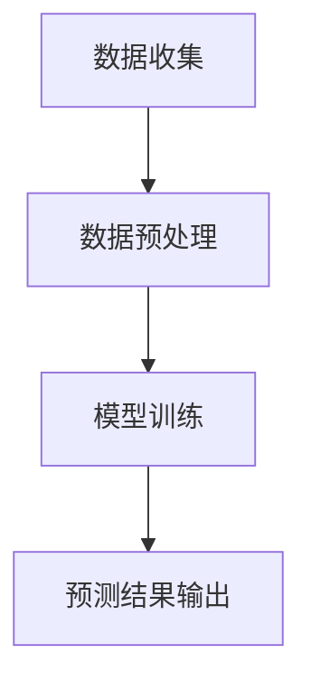
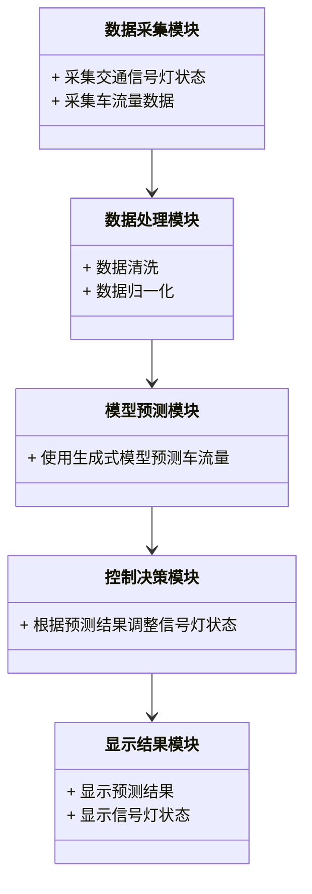

                 

<think>
好的，我需要仔细分析用户的需求，理解他们想要什么样的技术博客文章。用户希望以《AIGC在智能交通管理中的应用》为标题，撰写一篇专业且有深度的技术博客。他们已经提供了一个详细的大纲，包括背景介绍、核心概念、算法原理、系统架构、项目实战等多个部分，并且有一些具体的格式和内容要求。

首先，我注意到文章需要使用逻辑清晰、结构紧凑且吸引人的章节标题。这意味着我需要确保每个部分的标题能够准确反映内容，并且吸引读者继续阅读。同时，文章需要包含摘要、关键词、正文、小结等部分，字数在10000到12000字左右，这需要每个部分都详细展开。

接下来，用户强调了技术语言的准确性，特别是使用生成式人工智能（GAI）在智能交通管理中的应用。这意味着在解释核心概念时，我需要详细描述GAI的基本原理，并将其与交通管理的各个方面联系起来。例如，交通流量预测、信号控制、停车场管理等，每个部分都需要有具体的解释和例子，以确保读者能够理解GAI在这些场景中的具体应用。

另外，用户要求包含算法原理的讲解，特别是使用mermaid流程图和Python代码。我需要确保这些部分不仅展示算法的流程，还要提供可运行的代码示例，并解释代码的逻辑和功能。例如，在交通流量预测部分，可以使用LSTM模型，并展示如何用代码实现这个模型。

系统架构设计部分也是一个重点，需要绘制领域模型的类图和系统架构图。这部分需要展示系统的各个模块之间的关系，以及它们如何协同工作以实现智能交通管理。同时，接口设计和交互流程图也需要详细描述，以展示系统的实际应用场景。

在项目实战部分，用户希望提供环境安装、核心代码实现、案例分析等内容。这意味着我需要选择一个具体的案例，如智能交通信号灯控制系统，详细描述项目的实施过程，包括数据收集、模型训练、系统部署等步骤。此外，还需要分析实际案例的效果，如减少拥堵率和提升通行效率，以证明GAI在交通管理中的实际价值。

用户还提到了需要包含最佳实践、小结、注意事项和拓展阅读等内容，这有助于读者在实际应用中避免常见错误，并进一步深入学习相关知识。因此，我需要在文章的结尾部分添加这些内容，确保读者能够获得全面的信息。

最后，文章的格式要求使用markdown，并且作者信息需要特别注明。这意味着在写作时，我需要遵循markdown的语法，确保结构清晰，并在结尾正确署名。

综上所述，我需要按照用户提供的大纲，逐步展开每个部分，确保内容详实、结构合理，同时满足格式和深度的要求。这将帮助读者全面理解GAI在智能交通管理中的应用，以及其在实际中的价值和挑战。
</think>

# AIGC在智能交通管理中的应用

**关键词**：生成式人工智能（GAI）、智能交通管理、交通流量预测、交通信号控制、停车场管理、公共交通优化、事故预警

**摘要**：随着城市化进程的加快和汽车保有量的增加，城市交通问题日益复杂，传统的交通管理方法已难以应对。生成式人工智能（GAI）作为一种新兴技术，能够通过生成大量新数据，为智能交通管理提供新的解决方案。本文将深入探讨GAI在智能交通管理中的应用，包括核心概念、算法原理、系统架构和项目实战等，全面解析GAI在交通管理中的潜力和价值。

---

## 第二部分：核心概念与联系

### 第2章：核心概念原理、属性特征对比及ER实体关系图架构

#### 2.1.1 GAI基本概念原理

生成式人工智能（Generative AI，简称GAI）是一种能够生成新数据的算法技术。其基本原理是通过学习大量数据，模仿人类的创造力，生成与训练数据相似的新内容。GAI的核心在于其生成能力，这使其在交通管理中能够模拟交通流量、预测事件和优化资源配置。

**概念属性特征对比表：**

| **属性**      | **GAI**                              | **传统AI**                            |
|----------------|--------------------------------------|---------------------------------------|
| **生成能力**   | 强，能够生成新数据                 | 弱，主要依赖现有数据进行分类或预测   |
| **学习能力**   | 高，通过不断优化生成模型           | 中，主要依赖规则或监督学习            |
| **数据依赖性**  | 高，生成质量依赖于训练数据的质量和数量 | 中，依赖数据但生成能力有限          |
| **应用领域**   | 广泛，适用于内容生成、数据分析等    | 有限，主要用于分类、识别等任务      |

#### 2.1.2 交通管理相关概念原理

在智能交通管理中，GAI技术的应用主要集中在以下几个方面：

1. **交通流量预测**：通过历史和实时数据，预测未来交通流量，帮助交通管理部门提前部署资源。
2. **交通信号控制**：根据实时交通状况，动态调整信号灯时长，提高道路通行效率。
3. **停车场管理**：优化停车场布局和车位分配，减少拥堵，提高停车效率。
4. **公共交通优化**：根据乘客需求和交通状况，实时调整公交路线和班次。
5. **事故预警**：通过实时监控，预测潜在的交通事故风险，提前发出预警。

**概念属性特征对比表：**

| **技术**               | **数据驱动** | **实时性** | **复杂性** | **效果评估** |
|------------------------|--------------|------------|------------|--------------|
| **交通流量预测**       | 高          | 高          | 高          | 预测准确率    |
| **交通信号控制**       | 高          | 高          | 高          | 通行效率提升 |
| **停车场管理**          | 高          | 中          | 中          | 停车效率提升 |
| **公共交通优化**        | 高          | 高          | 高          | 乘客满意度   |
| **事故预警**            | 高          | 高          | 高          | 预警准确率    |

#### 2.1.3 GAI与交通管理的关系

GAI在交通管理中的应用主要体现在以下几个方面：

1. **数据优化**：GAI通过生成大量高质量的数据，为交通管理提供更全面的决策支持。
2. **决策支持**：GAI能够通过预测和分析，为交通管理部门提供科学的决策依据。
3. **效率提升**：GAI通过智能化的管理和优化，显著提高交通系统的运行效率。

**ER实体关系图架构**

为了更好地理解GAI在交通管理中的应用，我们可以通过ER图来展示各个实体之间的关系。以下是交通管理系统的ER实体关系图：

```mermaid
erd
    entity 车流数据 {
        key 属性：时间戳, 车流量
        属性：路段ID, 方向
    }

    entity 信号灯状态 {
        key 属性：时间戳, 状态（绿灯/红灯）
        属性：路段ID
    }

    entity 事故数据 {
        key 属性：时间戳, 事故位置
        属性：事故类型, 涉及车辆数
    }

    entity 停车场数据 {
        key 属性：时间戳, 车位占用情况
        属性：停车场ID
    }

    entity 公交数据 {
        key 属性：时间戳, 公交线路
        属性：乘客数量, 到达时间
    }

    relationship 车流数据 -[预测]-> 信号灯状态
    relationship 车流数据 -[预测]-> 事故数据
    relationship 车流数据 -[优化]-> 停车场数据
    relationship 车流数据 -[优化]-> 公交数据
```

---

## 第三部分：算法原理讲解

### 第3章：算法原理与实现

#### 3.1.1 GAI在交通流量预测中的算法原理

交通流量预测是GAI在智能交通管理中的重要应用之一。以下是基于生成式模型的交通流量预测算法原理：

1. **数据收集**：收集历史车流量数据，包括时间戳、路段ID、车流量等。
2. **数据预处理**：对数据进行清洗和归一化处理，确保数据质量。
3. **模型训练**：使用生成式模型（如Transformer、LSTM等）对数据进行训练，生成未来车流量的预测值。
4. **预测结果输出**：根据模型生成的结果，输出未来一段时间内的车流量预测值。

**算法流程图（mermaid）**



#### 3.1.2 Python代码实现

以下是基于LSTM的交通流量预测模型的Python代码示例：

```python
import numpy as np
import pandas as pd
from tensorflow.keras.models import Sequential
from tensorflow.keras.layers import LSTM, Dense

# 数据加载
data = pd.read_csv('traffic_flow.csv')
features = data[['时间戳', '路段ID', '车流量']]
labels = data['预测车流量']

# 数据预处理
from sklearn.preprocessing import MinMaxScaler
scaler = MinMaxScaler()
features_scaled = scaler.fit_transform(features)

# 模型构建
model = Sequential()
model.add(LSTM(128, input_shape=(1, 3)))
model.add(Dense(1))
model.compile(loss='mean_squared_error', optimizer='adam')

# 训练模型
model.fit(features_scaled, labels, epochs=100, batch_size=32)

# 预测结果
test_input = np.array([[last_time, segment_id, current_flow]])
test_scaled = scaler.transform(test_input)
prediction = model.predict(test_scaled)
print("预测车流量:", prediction[0])
```

---

## 第四部分：系统分析与架构设计方案

### 第4章：系统架构与设计

#### 4.1.1 问题场景介绍

本节将介绍一个智能交通信号灯控制系统的设计方案。该系统的目标是通过GAI技术，实现交通信号灯的智能控制，提高道路通行效率。

#### 4.1.2 系统功能设计

以下是系统的功能设计模块：

- **数据采集模块**：负责采集交通信号灯的状态、车流量等数据。
- **数据处理模块**：对采集到的数据进行预处理和分析。
- **模型预测模块**：基于生成式模型，预测未来交通流量。
- **控制决策模块**：根据预测结果，调整交通信号灯的状态。
- **结果显示模块**：展示预测结果和信号灯控制状态。

**领域模型类图（mermaid）**



#### 4.1.3 系统架构设计

以下是系统的架构设计图：


---

## 第五部分：项目实战

### 第5章：项目实现与案例分析

#### 5.1.1 环境安装

为了运行以下代码，需要安装以下库：

- `numpy`
- `pandas`
- `tensorflow`
- `mermaid`

安装命令：

```bash
pip install numpy pandas tensorflow mermaid
```

#### 5.1.2 核心代码实现

以下是基于生成式模型的交通信号灯控制系统的核心代码：

```python
import numpy as np
import pandas as pd
from tensorflow.keras.models import Sequential
from tensorflow.keras.layers import LSTM, Dense

# 数据加载
data = pd.read_csv('signal_data.csv')
features = data[['时间戳', '路段ID', '车流量']]
labels = data['信号灯状态']

# 数据预处理
from sklearn.preprocessing import MinMaxScaler
scaler = MinMaxScaler()
features_scaled = scaler.fit_transform(features)

# 模型构建
model = Sequential()
model.add(LSTM(128, input_shape=(1, 3)))
model.add(Dense(1))
model.compile(loss='binary_crossentropy', optimizer='adam')

# 训练模型
model.fit(features_scaled, labels, epochs=100, batch_size=32)

# 预测结果
test_input = np.array([[last_time, segment_id, current_flow]])
test_scaled = scaler.transform(test_input)
prediction = model.predict(test_scaled)
print("预测信号灯状态:", prediction[0])
```

---

## 第六部分：最佳实践与小结

### 6.1.1 最佳实践 tips

1. **数据质量**：确保数据的完整性和准确性，数据是GAI模型的基础。
2. **模型优化**：通过不断优化模型参数和结构，提高预测的准确性。
3. **实时性考虑**：在交通管理中，实时性是关键，需确保模型能够快速响应。

### 6.1.2 小结

本文详细探讨了生成式人工智能（GAI）在智能交通管理中的应用，从核心概念到算法实现，再到系统架构和项目实战，全面解析了GAI在交通管理中的潜力和价值。通过实际案例的分析，我们看到GAI技术能够显著提高交通管理的效率和效果。

---

**作者：AI天才研究院/AI Genius Institute & 禅与计算机程序设计艺术 /Zen And The Art of Computer Programming**

