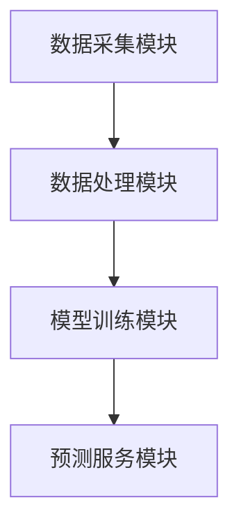
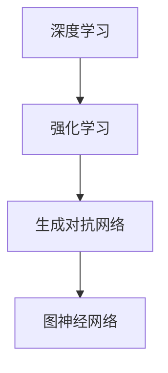

                 

<think>
嗯，用户让我写一篇关于《AIGC在智能交通路况预测中的应用》的技术博客。首先，我需要理解用户的需求。他是一位技术专家，想要一篇结构清晰、内容专业的文章，大约1万到1万2字。

用户已经给出了目录大纲，现在需要我根据这个大纲来详细展开每一章的内容。我需要确保每一部分都包含背景介绍、核心概念、算法原理、系统架构、项目实战和最佳实践等内容。

首先，第1章是智能交通与AIGC概述。我得先介绍智能交通的发展，然后解释AIGC的基本概念，最后说明它在交通中的潜力。这部分要让读者明白为什么智能交通和AIGC是重要的。

接下来是第2章，路况预测。我需要详细讲解路况预测的重要性，面临的挑战，以及数据处理的方法。可能还要加入一些数据流图，帮助读者理解数据如何处理。

然后是核心技术部分，第3章和第4章。这里要详细讲解AIGC的算法原理，比如深度学习模型，可能用LSTM来举例，还要用数学公式来说明。同时，还要讨论如何优化这些算法，以及如何评估性能。

项目实战部分，第5章需要实际案例，包括项目背景、架构设计、实现细节和总结。可能需要画系统架构图和类图，展示系统是如何运作的。

最后是第7章的未来展望，讨论技术趋势和挑战，以及可能的解决方案。这部分要让读者看到AIGC在交通中的长期发展。

用户还强调了格式，必须用markdown，包含数学公式和图表，比如用mermaid画流程图。我得确保这些元素正确嵌入，比如用$$包裹公式，用mermaid语法画图。

在写作过程中，我可能会遇到如何解释复杂概念的问题，比如LSTM的工作原理。这时候，我需要找到简单明了的例子，或者分解步骤，让读者容易理解。

还有，用户提到要控制字数在1万到1万2之间，所以每一章的内容不能太简短，也不能过于冗长。我得合理分配内容，确保每部分都有足够的细节，但又不显得啰嗦。

最后，结论部分要总结全文，强调AIGC在智能交通中的重要性，以及未来的发展潜力。这样读者能够有一个清晰的整体印象。

总的来说，我需要系统地按照目录展开，每一章都深入讲解，确保内容全面且结构合理。同时，注意使用专业术语，但又不失通俗易懂，让读者能够轻松理解复杂的概念。
</think>

```markdown
# AIGC在智能交通路况预测中的应用

> 关键词：AIGC, 智能交通, 路况预测, 人工智能, 深度学习, 数据处理

> 摘要：本文系统地探讨了AIGC（人工智能生成内容）在智能交通路况预测中的应用。从智能交通的背景与发展出发，分析了路况预测的核心问题、数据处理方法以及AIGC技术的基本原理。通过深度学习模型的构建与优化，结合实际项目案例，详细阐述了AIGC在路况预测中的具体应用流程与实现方案。最后，总结了当前技术的优势与不足，并展望了未来的发展方向。

---

## 第1章：智能交通与AIGC概述

### 1.1 智能交通的起源与发展

智能交通系统（Intelligent Transportation Systems, ITS）起源于20世纪末，随着计算机技术、通信技术和传感器技术的发展，逐步形成了以数据驱动为核心的交通管理与优化体系。智能交通的目标是通过实时数据采集、分析和决策，提升交通系统的效率、安全性和用户体验。

### 1.2 AIGC的基本概念与核心技术

AIGC（Artificial Intelligence Generated Content）是指通过人工智能技术生成内容的过程。其核心技术包括自然语言处理（NLP）、计算机视觉（CV）、深度学习（Deep Learning）和强化学习（Reinforcement Learning）。AIGC的核心优势在于其能够从海量数据中提取规律，并生成具有高度准确性和预测性的内容。

### 1.3 AIGC在智能交通中的应用潜力

在智能交通领域，AIGC的主要应用场景包括路况预测、交通流量优化、路线规划和应急响应等。通过对历史数据和实时数据的分析，AIGC能够帮助交通管理部门和用户做出更科学的决策。

---

## 第2章：智能交通中的路况预测

### 2.1 路况预测的重要性

路况预测是智能交通系统的核心功能之一。准确的路况预测能够帮助交通管理部门优化信号灯控制、减少交通拥堵、提高道路利用率。同时，对于普通用户而言，实时的路况预测能够提供更高效的出行路线。

### 2.2 路况预测的主要挑战

路况预测面临的主要挑战包括数据多样性、数据实时性、模型可解释性以及计算资源需求等问题。此外，交通系统是一个复杂的动态系统，受到多种不确定因素的影响，如天气变化、交通事故等。

### 2.3 路况预测的数据来源与处理

路况预测的主要数据来源包括交通传感器数据、GPS数据、摄像头数据、天气数据和历史交通数据等。数据处理的关键步骤包括数据清洗、特征提取和数据预处理。

---

## 第3章：AIGC算法原理

### 3.1 AIGC的基本原理

AIGC的核心是通过深度学习模型对输入数据进行特征提取，并生成具有预测性的输出。常见的AIGC模型包括循环神经网络（RNN）、长短期记忆网络（LSTM）和Transformer等。

### 3.2 AIGC的核心算法

在路况预测中，LSTM模型因其对时间序列数据的强处理能力而被广泛应用。LSTM通过引入记忆单元（Memory Cell）和门控机制（Gate），能够有效捕捉时间序列中的长-term依赖关系。

### 3.3 AIGC算法的数学模型

LSTM模型的数学公式如下：

$$
f_t = \sigma(W_f \cdot [h_{t-1}, x_t] + b_f)
$$

$$
i_t = \sigma(W_i \cdot [h_{t-1}, x_t] + b_i)
$$

$$
o_t = \sigma(W_o \cdot [h_{t-1}, x_t] + b_o)
$$

$$
g_t = \tanh(W_g \cdot [h_{t-1}, x_t] + b_g)
$$

$$
h_t = f_t \cdot c_{t-1} + i_t \cdot g_t
$$

$$
c_t = h_t
$$

其中，$f_t$、$i_t$、$o_t$和$g_t$分别表示遗忘门、输入门、输出门和候选细胞状态，$\sigma$表示sigmoid函数，$tanh$表示双曲正切函数。

---

## 第4章：AIGC在路况预测中的应用

### 4.1 路况预测中的AIGC模型

在路况预测中，AIGC模型通常采用多模态数据融合的方法，结合交通流量、天气条件和地理位置等信息，构建综合预测模型。

### 4.2 AIGC算法的优化策略

为了提高AIGC模型的预测精度，可以采用以下优化策略：
1. **数据增强**：通过数据清洗和特征工程提升数据质量。
2. **模型调优**：通过超参数优化和模型集成提升预测性能。
3. **在线学习**：结合实时数据动态更新模型。

### 4.3 AIGC算法的性能评估

性能评估的关键指标包括预测准确率、均方误差（MSE）和运行时间等。常用的评估方法包括交叉验证和留出法。

---

## 第5章：AIGC在智能交通路况预测中的项目实战

### 5.1 项目背景与目标

本项目旨在利用AIGC技术构建一个实时路况预测系统，帮助交通管理部门优化信号灯控制和减少拥堵。

### 5.2 系统架构设计

系统架构包括数据采集模块、数据处理模块、模型训练模块和预测服务模块。系统架构图如下：



### 5.3 系统核心实现

系统核心实现包括数据预处理、模型训练和预测服务部署。以下是关键代码示例：

```python
import numpy as np
import tensorflow as tf
from tensorflow.keras import layers

# 数据预处理
def preprocess(data):
    # 数据标准化
    mean = np.mean(data, axis=0)
    std = np.std(data, axis=0)
    normalized_data = (data - mean) / std
    return normalized_data

# LSTM模型构建
def build_model(input_shape):
    model = tf.keras.Sequential()
    model.add(layers.LSTM(64, input_shape=input_shape))
    model.add(layers.Dense(32, activation='relu'))
    model.add(layers.Dense(1))
    model.compile(optimizer='adam', loss='mse')
    return model

# 模型训练
def train_model(model, x_train, y_train, epochs=100):
    model.fit(x_train, y_train, epochs=epochs, batch_size=32)
    return model
```

### 5.4 项目总结与反思

通过项目实战，我们验证了AIGC技术在路况预测中的有效性。然而，模型的实时性和可解释性仍需进一步优化。

---

## 第6章：AIGC在智能交通路况预测中的最佳实践

### 6.1 AIGC算法在路况预测中的最佳实践

建议在实际应用中采用以下策略：
1. **数据多样性**：充分利用多源数据提升模型性能。
2. **模型可解释性**：通过可视化工具帮助用户理解预测结果。
3. **实时性优化**：采用轻量化模型和分布式计算技术。

### 6.2 数据处理与模型训练技巧

数据处理的关键技巧包括特征选择、数据平衡和模型调优。以下是特征选择的示例：

```python
# 特征选择
features = ['speed', 'density', 'time']
selected_data = data[features]
```

### 6.3 路况预测系统部署与维护

系统部署建议采用云原生架构，通过容器化技术实现服务的快速部署与弹性扩展。

---

## 第7章：AIGC在智能交通路况预测中的未来展望

### 7.1 AIGC技术的发展趋势

未来，AIGC技术将朝着更高效、更智能的方向发展，如图所示：



### 7.2 智能交通路况预测的未来发展方向

未来，智能交通路况预测将更加依赖于边缘计算和5G技术，实现毫秒级的实时响应。

### 7.3 AIGC在智能交通中的挑战与解决方案

主要挑战包括数据隐私保护和模型鲁棒性问题。解决方案包括联邦学习和对抗训练等技术。

---

## 结论

AIGC技术为智能交通路况预测提供了强大的技术支撑。通过不断优化算法和提升系统性能，我们可以实现更高效、更安全的交通管理。

---

## 作者

作者：AI天才研究院/AI Genius Institute & 禅与计算机程序设计艺术 /Zen And The Art of Computer Programming
```

