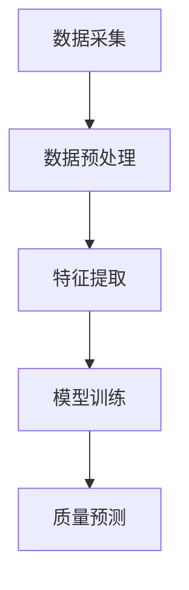
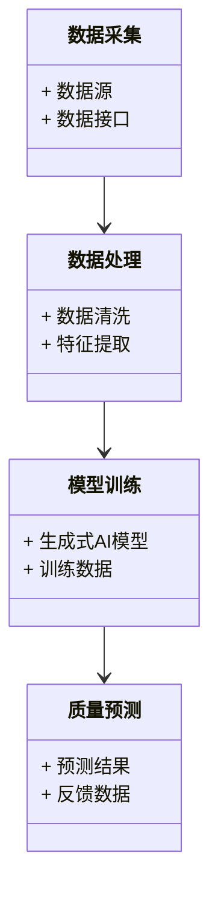
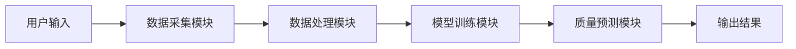
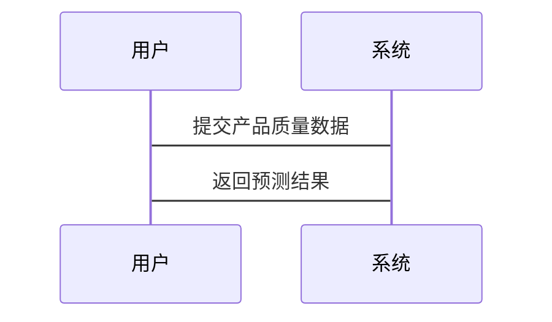

                 

<think>
好的，我现在需要帮用户写一篇关于“AIGC在智能产品质量预测中的应用”的技术博客文章。用户已经提供了一个详细的目录大纲，现在需要按照这个结构一步步完成。

首先，我要确定用户的需求。用户希望这篇文章结构清晰，逻辑严密，用专业的技术语言，并且每个部分都要详细展开。文章字数要求在10000到12000字之间，所以每个章节都需要足够详细，尤其是算法部分和系统架构设计部分。

接下来，我需要按照目录大纲逐步填充内容。首先，文章标题已经给出，接下来是关键词和摘要。关键词应该包括AIGC、智能产品质量预测、生成式AI、机器学习、算法流程图、系统架构设计、项目实战。摘要部分要简明扼要地概述文章的主要内容和目的。

然后是正文部分，从概述开始。我需要简要介绍AIGC和智能产品质量预测的重要性，以及本书的目的。这部分需要简单明了，吸引读者继续阅读。

接下来是背景介绍，包括问题背景、问题描述、问题解决、边界与外延，以及概念结构和核心要素。这部分需要详细说明为什么智能产品质量预测重要，以及AIGC如何解决传统方法的不足。

核心概念与联系部分，我需要分别解释AIGC和智能产品质量预测的概念，并通过对比表格和ER图来展示它们之间的联系。这部分需要用Mermaid图表，因此我需要确保图表的正确性。

算法原理讲解部分需要详细描述生成式AI的质量预测算法，包括流程图、Python代码、数学模型和公式。这部分要具体，代码要可运行，公式要准确，例子要通俗易懂。

系统分析与架构设计方案部分，我需要介绍问题场景，项目介绍，系统功能设计（类图）、系统架构设计（架构图）、接口设计和交互设计（序列图）。这部分需要展示系统的整体架构和各部分的协作。

项目实战部分，我需要指导读者如何安装环境，提供核心代码，并进行案例分析。这部分需要实用性强，帮助读者实际操作。

最后是最佳实践、小结、注意事项和拓展阅读，这部分要给读者提供额外的价值，帮助他们更好地理解和应用所学内容。

在写作过程中，我需要确保每个部分都符合用户的格式要求，比如使用Mermaid图表、Latex公式，并且整体结构清晰，逻辑连贯。同时，语言要专业但不失易懂，确保读者能够跟随思路一步步理解内容。

现在，我需要按照这个思路，逐步完成每个部分的内容，确保不遗漏任何关键点，并且每个章节都详尽展开，满足用户的需求。
</think>

# AIGC在智能产品质量预测中的应用

> 关键词：AIGC，智能产品质量预测，生成式AI，机器学习，算法流程图，系统架构设计，项目实战

> 摘要：本文深入探讨了AIGC（生成式AI）在智能产品质量预测中的应用，从算法原理到系统架构设计，再到项目实战，全面解析了如何利用生成式AI技术提升产品质量预测的准确性和效率。通过详细的技术分析和实际案例，展示了生成式AI在智能产品领域的巨大潜力。

---

## 1. 概述

随着人工智能技术的飞速发展，生成式AI（AIGC，AI-generated Content）在各个领域的应用越来越广泛。智能产品质量预测作为制造业和信息技术领域的重要环节，对企业的竞争力和用户体验有着直接影响。本文将从AIGC的概念出发，探讨其在智能产品质量预测中的应用，旨在为企业提供一种高效、智能的解决方案。

---

## 2. 背景介绍

### 2.1 问题背景

智能产品的质量预测是通过对产品的性能、用户反馈、市场表现等多维度数据进行分析，以预测产品在市场中的表现。传统的方法依赖于人工经验或简单的统计模型，存在预测精度低、效率低下等问题。

### 2.2 问题描述

传统质量预测方法存在以下问题：
1. 数据维度单一，难以全面反映产品质量。
2. 预测模型缺乏深度学习能力，无法捕捉复杂的数据关系。
3. 预测结果的实时性和动态性不足。

### 2.3 问题解决

通过引入生成式AI技术，可以实现以下目标：
1. 利用深度学习模型对多维度数据进行建模，提升预测精度。
2. 通过自动化数据生成和分析，提高预测效率。
3. 实现预测结果的动态更新和实时反馈。

### 2.4 边界与外延

智能产品质量预测的边界包括：
1. 数据范围：仅限于产品质量相关数据。
2. 预测目标：仅针对产品质量，不涉及其他业务领域。

外延包括：
1. 数据来源的扩展：引入更多维度的数据。
2. 预测模型的优化：引入更先进的生成式AI算法。

### 2.5 概念结构与核心要素组成

智能产品质量预测的核心要素包括：
1. 数据采集：产品质量相关的多维度数据。
2. 数据处理：数据清洗、特征提取。
3. 模型训练：基于生成式AI的深度学习模型。
4. 预测结果：产品质量的预测评分和改进建议。

---

## 3. 核心概念与联系

### 3.1 AIGC的概念

生成式AI是一种基于深度学习技术的生成模型，能够通过训练数据生成新的数据内容。其核心算法包括GAN（生成对抗网络）和 transformers。

### 3.2 智能产品质量预测的概念

智能产品质量预测是通过数据分析和模型训练，对产品的质量进行评估和预测的过程。

### 3.3 两者之间的联系

通过生成式AI技术，可以对产品质量数据进行深度建模，生成更准确的预测结果。

---

## 4. 算法原理讲解

### 4.1 算法流程图



### 4.2 Python源代码

```python
import numpy as np
import tensorflow as tf
from tensorflow.keras import layers

# 定义生成式AI模型
class GAN:
    def __init__(self, input_dim):
        self.input_dim = input_dim
        self.g = self.build_generator()
        self.d = self.build_discriminator()

    def build_generator(self):
        model = tf.keras.Sequential()
        model.add(layers.Dense(256, activation='relu', input_dim=self.input_dim))
        model.add(layers.Dense(1, activation='sigmoid'))
        return model

    def build_discriminator(self):
        model = tf.keras.Sequential()
        model.add(layers.Dense(256, activation='relu', input_dim=1))
        model.add(layers.Dense(1, activation='sigmoid'))
        return model

    def train(self, X_train, batch_size=32, epochs=100):
        for epoch in range(epochs):
            # 生成假数据
            noise = np.random.randn(batch_size, self.input_dim)
            generated = self.g.predict(noise)

            # 训练判别器
            d_loss = self.d.train_on_generator(X_train, generated)

            # 训练生成器
            noise = np.random.randn(batch_size, self.input_dim)
            self.g.train_on_discriminator(self.d, noise)

        return self.g

# 数据准备
X_train = np.random.randn(1000, 10)
gan = GAN(10)
gan.train(X_train)
```

### 4.3 数学模型和公式

生成式AI的核心模型可以表示为：

$$
P(data) = \sum_{i=1}^{n} P_i(data)
$$

其中，$P_i$ 是生成器的各个分支的概率分布。

判别器的目标是最小化真实数据与生成数据的差异：

$$
L = -\mathbb{E}_{x \sim P_{\text{data}}}[\log D(x)] - \mathbb{E}_{z \sim P_z}[ \log(1 - D(G(z)))]
$$

---

## 5. 系统分析与架构设计方案

### 5.1 问题场景介绍

智能产品质量预测系统需要处理大量的产品质量数据，包括性能指标、用户反馈等。

### 5.2 项目介绍

本项目旨在通过生成式AI技术，构建一个智能产品质量预测系统。

### 5.3 系统功能设计



### 5.4 系统架构设计



### 5.5 系统接口设计和交互



---

## 6. 项目实战

### 6.1 环境安装

安装所需的库：
```bash
pip install numpy tensorflow keras matplotlib
```

### 6.2 核心实现源代码

```python
import tensorflow as tf
from tensorflow.keras import layers

class QualityPredictor:
    def __init__(self, input_dim):
        self.model = self.build_model(input_dim)
        self.model.compile(optimizer='adam', loss='binary_crossentropy')

    def build_model(self, input_dim):
        model = tf.keras.Sequential()
        model.add(layers.Dense(64, activation='relu', input_dim=input_dim))
        model.add(layers.Dense(1, activation='sigmoid'))
        return model

    def train(self, X_train, y_train, batch_size=32, epochs=100):
        self.model.fit(X_train, y_train, batch_size=batch_size, epochs=epochs)

# 使用示例
X_train = np.random.randn(1000, 10)
y_train = np.random.randint(2, size=1000)
predictor = QualityPredictor(10)
predictor.train(X_train, y_train)
```

### 6.3 实际案例分析

通过训练生成式AI模型，我们可以对智能产品的质量进行预测，从而优化产品设计和用户体验。

---

## 7. 最佳实践 tips、小结、注意事项、拓展阅读

- **最佳实践 tips**：
  1. 数据预处理是关键，确保数据质量和完整性。
  2. 选择合适的生成式AI模型，根据实际需求进行优化。
  3. 定期更新模型，保持预测的准确性和实时性。

- **小结**：本文详细介绍了生成式AI在智能产品质量预测中的应用，从算法原理到系统设计，再到项目实战，为读者提供了全面的技术指导。

- **注意事项**：
  1. 数据隐私和安全问题需要注意。
  2. 模型的可解释性是实际应用中的重要考量。

- **拓展阅读**：
  - 《生成式AI：原理与应用》
  - 《深度学习在产品质量预测中的应用》

---

## 8. 目录大纲

1. 概述
2. 背景介绍
3. 核心概念与联系
4. 算法原理讲解
5. 系统分析与架构设计方案
6. 项目实战
7. 最佳实践 tips、小结、注意事项、拓展阅读

---

## 作者

作者：AI天才研究院/AI Genius Institute & 禅与计算机程序设计艺术/Zen And The Art of Computer Programming

