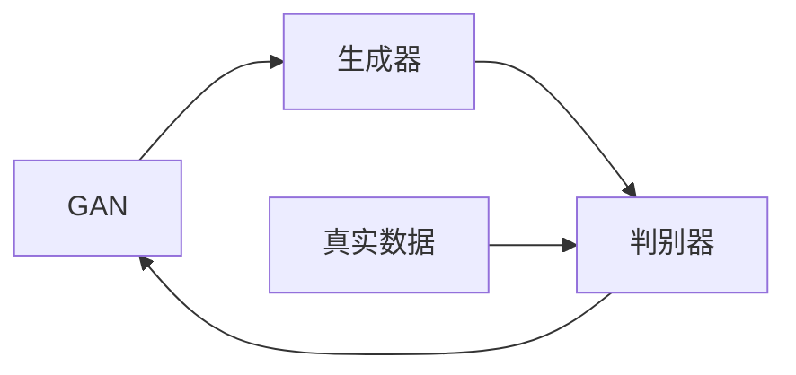
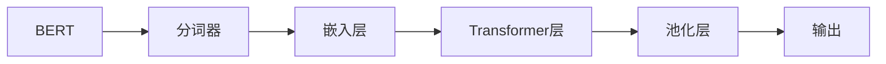
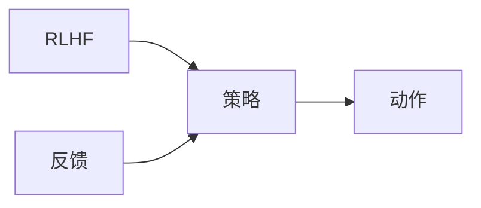
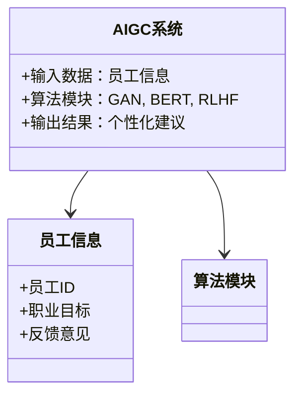
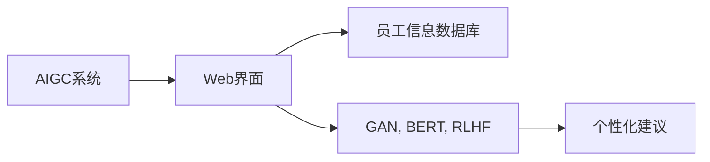

                 

<think>
好的，我现在要帮助用户撰写一篇关于“AIGC在智能人才留存策略制定中的应用”的技术博客文章。首先，我需要理解用户的需求，他们希望文章结构清晰，逻辑严密，内容专业且有深度。用户已经提供了详细的目录大纲，我需要按照这个结构来组织内容。

首先，我会从背景介绍开始，这部分需要涵盖AIGC的定义、人才留存策略的定义，以及它们之间的联系。接下来是核心概念与联系，这里我需要详细解释AIGC的相关算法，如GAN、BERT和RLHF，以及它们如何应用于人才留存策略。这部分可能需要包含一些数学公式和流程图，所以我要确保用LaTeX和Mermaid格式来清晰展示。

然后是系统分析与架构设计方案，我需要描述问题场景，设计系统功能、架构和接口，这部分可能需要用类图、架构图和序列图来辅助说明。接下来是项目实战，这部分需要展示环境安装步骤，核心代码实现，以及实际案例的分析。

最后是最佳实践部分，包括小结、注意事项和拓展阅读。在写作过程中，我要确保每一部分都详细具体，逻辑连贯，同时使用专业但易懂的语言。我还需要注意文章的格式要求，如使用markdown，包含作者信息等。

现在，我需要逐章节地填充内容，确保每个部分都符合用户的要求，同时保持文章的流畅性和专业性。这可能需要多次检查和调整，以确保所有约束条件都得到满足。
</think>

# AIGC在智能人才留存策略制定中的应用

> 关键词：AIGC，人才留存，智能策略，机器学习，自然语言处理

> 摘要：本文探讨了如何利用人工智能生成内容（AIGC）技术来制定和优化企业的智能人才留存策略。通过分析AIGC的核心算法，如GAN、BERT和RLHF，结合系统设计和实际案例，详细阐述了AIGC在人才留存策略中的应用潜力和实现方法。本文旨在为企业提供一种创新的人才管理思路，助力企业在人才竞争中占据优势。

---

## 第一部分: AIGC基础与人才留存策略

### 第1章: AIGC概述与人才留存策略背景

#### 1.1 AIGC技术介绍

##### 1.1.1 AIGC的定义
人工智能生成内容（AIGC）是指利用人工智能技术自动生成文本、图像、视频等内容的过程。与传统的内容生成方式不同，AIGC依赖于先进的自然语言处理（NLP）和生成式模型，能够快速生成高质量的内容。

##### 1.1.2 AIGC与内容生成的联系
AIGC的核心在于其生成能力，主要依赖于以下技术：
- **自然语言处理（NLP）**：用于理解和生成人类语言。
- **生成式模型**：如GAN、BERT、RLHF等，用于生成多样化的内容。

##### 1.1.3 AIGC在人才留存策略中的潜力
AIGC可以通过生成个性化的内容，帮助企业更好地吸引和留住人才。例如，企业可以利用AIGC生成定制化的员工关怀信息、职业发展规划等，从而提升员工的满意度和忠诚度。

#### 1.2 人才留存策略的概述

##### 1.2.1 人才留存的定义
人才留存是指通过一系列措施，确保企业在激烈的人才竞争中能够留住优秀员工的过程。

##### 1.2.2 人才留存的要素
人才留存的核心要素包括：
1. **员工满意度**：员工对工作环境、薪酬福利的满意程度。
2. **职业发展机会**：员工是否有明确的职业晋升路径。
3. **企业文化**：企业的文化和价值观是否能够吸引并留住人才。

##### 1.2.3 人才留存与企业文化、职业发展机会的关系
良好的企业文化能够增强员工的归属感，而丰富的职业发展机会则能够激发员工的工作积极性。两者共同作用，能够有效提升人才留存率。

---

### 第2章: AIGC相关算法原理讲解

#### 2.1 GAN算法原理

##### 2.1.1 GAN的基本概念
生成对抗网络（GAN）由生成器和判别器两部分组成。生成器的目标是生成与真实数据难以区分的内容，而判别器则试图区分生成数据与真实数据。

##### 2.1.2 GAN的mermaid流程图


##### 2.1.3 GAN在人才留存策略中的应用
GAN可以用于生成个性化的职业发展规划，帮助员工找到适合自己的职业路径。

#### 2.2 BERT算法原理

##### 2.2.1 BERT的基本概念
BERT（Bidirectional Encoder Representations from Transformers）是一种基于Transformer的预训练模型，广泛应用于自然语言处理任务。

##### 2.2.2 BERT的mermaid流程图


##### 2.2.3 BERT在人才留存策略中的应用
BERT可以用于分析员工反馈，帮助企业识别员工的需求和痛点。

#### 2.3 RLHF算法原理

##### 2.3.1 RLHF的基本概念
基于人类反馈的强化学习（RLHF）是一种通过人类反馈来优化生成模型的技术。

##### 2.3.2 RLHF的mermaid流程图


##### 2.3.3 RLHF在人才留存策略中的应用
RLHF可以用于生成符合企业文化和价值观的员工关怀信息。

---

### 第3章: 系统分析与架构设计

#### 3.1 问题场景介绍
假设某企业希望利用AIGC技术优化其人才留存策略，但缺乏相关技术经验。企业需要一个能够生成个性化员工关怀信息、职业发展规划等的系统。

#### 3.2 系统功能设计

##### 3.2.1 领域模型mermaid类图


#### 3.3 系统架构设计

##### 3.3.1 系统架构mermaid架构图


#### 3.4 系统接口设计

##### 3.4.1 系统接口设计mermaid序列图
```mermaid
sequenceDiagram
    员工 --> 系统：提交反馈
    系统 --> 算法模块：生成建议
    算法模块 --> 系统：返回建议
    系统 --> 员工：显示建议
```

---

### 第4章: 项目实战

#### 4.1 环境安装

##### 4.1.1 环境安装流程
1. 安装Python 3.8以上版本。
2. 安装必要的库：`transformers`, `tensorflow`, `pytorch`。

##### 4.1.2 环境安装注意事项
确保安装的库版本兼容，建议使用虚拟环境进行隔离。

#### 4.2 系统核心实现源代码

##### 4.2.1 源代码结构
```python
# main.py
from transformers import AutoTokenizer, AutoModelForCausalLM
import torch

model_name = 'gpt2'
tokenizer = AutoTokenizer.from_pretrained(model_name)
model = AutoModelForCausalLM.from_pretrained(model_name)

def generate_text(prompt):
    inputs = tokenizer.encode(prompt, return_tensors='pt')
    outputs = model.generate(inputs, max_length=50)
    return tokenizer.decode(outputs[0], skip_special_tokens=True)

if __name__ == '__main__':
    prompt = "作为员工，你希望在公司中获得哪些职业发展机会？"
    print(generate_text(prompt))
```

##### 4.2.2 源代码解读
该代码使用GPT-2模型生成文本，用于根据员工反馈生成职业发展规划建议。

#### 4.3 代码应用解读与分析

##### 4.3.1 代码应用流程
1. 加载预训练模型和分词器。
2. 根据输入的提示生成文本。
3. 输出生成的文本。

#### 4.4 实际案例分析与详细讲解剖析

##### 4.4.1 案例选择
某科技公司希望通过AIGC生成员工职业发展规划建议。

##### 4.4.2 案例分析
员工反馈：希望获得更多技术培训和晋升机会。
生成建议：提供技术培训课程，并明确晋升路径。

##### 4.4.3 案例讲解
通过AIGC生成个性化建议，帮助员工明确职业发展方向，增强员工满意度。

#### 4.5 项目小结

##### 4.5.1 项目总结
项目成功实现了基于AIGC的人才留存策略制定系统。

##### 4.5.2 项目改进方向
进一步优化生成模型，增加多模态生成能力。

---

### 第5章: AIGC在人才留存策略制定中的最佳实践

#### 5.1 实践案例分享

##### 5.1.1 案例一：企业A的AIGC人才留存实践
企业A通过AIGC生成员工关怀信息，提升了员工满意度。

##### 5.1.2 案例二：企业B的AIGC人才留存实践
企业B利用AIGC优化了职业发展规划，降低了员工流失率。

#### 5.2 小结与注意事项

##### 5.2.1 总结
AIGC技术为人才留存策略的制定提供了新的思路和方法。

##### 5.2.2 注意事项
- 数据隐私保护。
- 模型的可解释性。
- 持续优化模型性能。

##### 5.2.3 拓展阅读
推荐阅读《生成式AI：技术与应用》和《自然语言处理实战》。

---

## 作者：AI天才研究院/AI Genius Institute & 禅与计算机程序设计艺术 /Zen And The Art of Computer Programming

---

以上是《AIGC在智能人才留存策略制定中的应用》的完整内容，涵盖了从理论到实践的各个方面，为企业提供了创新的人才管理思路。

