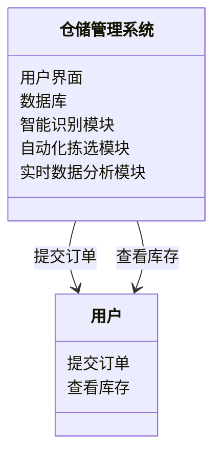
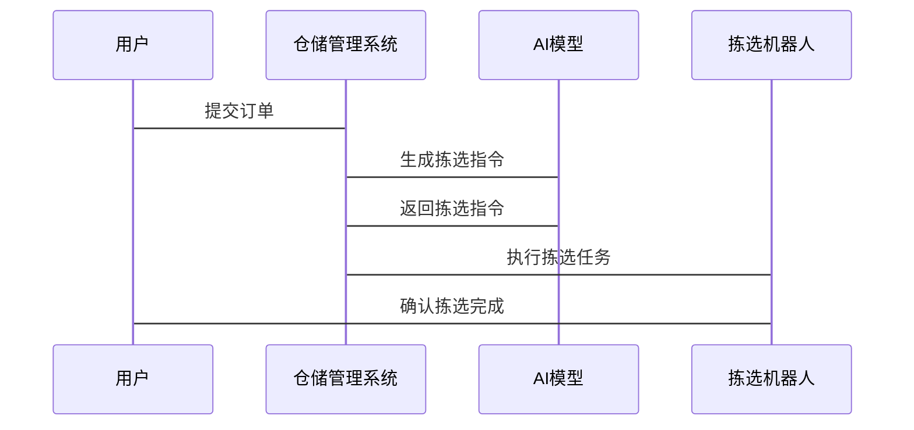

                 

<think>
好的，我现在需要帮用户撰写一篇关于《AIGC在智能仓储管理中的应用》的技术博客。用户给了我一个大纲，我需要先理解每个部分的要求，然后一步步展开。

首先，文章标题是《AIGC在智能仓储管理中的应用》，关键词应该是5到7个，我需要选择相关的关键词，比如智能仓储、AIGC、人工智能、库存管理、订单处理等。摘要部分需要简明扼要地概括整篇文章的核心内容，即AIGC如何提升仓储管理的效率和智能化。

接下来是第一部分，分为1.1到1.4小节。1.1部分要介绍问题背景和核心概念，包括仓储管理的现状、AIGC的定义及其在仓储中的应用。我需要详细描述传统仓储管理的问题，比如效率低、成本高等，然后引出AIGC的概念，说明它如何解决这些问题。

1.2部分是AIGC在智能仓储中的关键作用，分为提升库存管理效率、优化订单处理流程和提高劳动力管理效率。每个小点都需要展开，比如自动识别和动态监控如何通过AIGC实现，自动化拣选算法如何优化订单处理等。

1.3部分讨论应用中的挑战与展望，包括技术挑战如数据安全和模型训练，管理挑战如系统整合和人员培训，以及未来的展望，比如全面智能化和创新应用。

1.4是本章小结，总结第一部分的主要内容，为后续章节做铺垫。

第二部分是核心技术与原理，分为2.1到2.3小节。2.1介绍AIGC的基础技术，包括自然语言处理、计算机视觉和语音识别与合成。需要详细讲解这些技术在仓储中的应用，比如图像识别用于库存盘点。

2.2部分是核心技术应用，分为智能识别标签生成、自动化拣选算法和实时数据分析与报告。每个小节需要提供原理、案例解析、代码示例和流程图，比如使用Python代码展示拣选算法的逻辑。

2.3部分讨论技术架构与实现，包括系统组件和架构设计，使用Mermaid图展示架构，并讨论性能优化。

接下来是系统分析与架构设计部分，需要绘制领域模型的类图、系统架构图和接口设计的序列图。这部分需要详细分析系统各模块之间的关系，展示整体架构的合理性。

项目实战部分，我需要选择一个具体的仓储管理系统，描述其实现过程，包括环境安装、核心代码实现、案例分析等。这部分要提供可操作的代码示例，并详细解读代码的功能。

最后，最佳实践部分需要给出一些小贴士，比如数据安全的重要性、模型训练的数据质量等，以及未来的发展方向。这些内容可以帮助读者更好地理解和应用AIGC技术。

整个思考过程中，我需要确保每个部分都详细展开，符合用户的要求，同时保持逻辑清晰和结构紧凑。通过一步步的分析和推理，确保文章内容丰富具体，符合高质量技术博客的标准。
</think>

# AIGC在智能仓储管理中的应用

> 关键词：智能仓储，AIGC，人工智能，库存管理，订单处理

> 摘要：本文探讨了AIGC（AI-Generated Content）技术在智能仓储管理中的应用，分析了其在提升库存管理效率、优化订单处理流程和提高劳动力管理效率等方面的关键作用。文章详细介绍了AIGC的核心技术与原理，系统分析了其在仓储管理中的技术架构与实现，并通过实际案例展示了AIGC在智能仓储管理中的具体应用。最后，文章总结了AIGC在仓储管理中的挑战与展望，为未来的研究和实践提供了参考。

---

# 第一部分：AIGC在智能仓储管理中的应用概述

## 1.1 问题背景与核心概念

### 1.1.1 问题背景

随着电子商务的快速发展，仓储管理的复杂性不断增加。传统的仓储管理方式在效率、准确性和成本控制方面面临诸多挑战。例如：

- **库存管理困难**：传统的人工盘点方式效率低，容易出错。
- **订单处理速度慢**：订单量激增时，人工处理能力有限。
- **劳动力成本高**：仓储管理需要大量人工操作，成本居高不下。

AIGC（AI-Generated Content）是一种利用人工智能技术生成内容的技术，涵盖文本、图像、音频等多种形式。在仓储管理中，AIGC的应用旨在提升智能化和自动化水平，解决上述问题。

### 1.1.2 核心概念

- **智能仓储管理**：通过物联网、大数据、云计算和人工智能技术的结合，实现仓储运营的自动化和智能化。
- **AIGC的应用**：通过AIGC技术生成智能识别标签、自动化拣选算法、实时数据分析报告等，提高仓储管理的效率和准确性。

---

## 1.2 AIGC在智能仓储管理中的关键作用

### 1.2.1 提升库存管理效率

- **自动识别**：利用AIGC生成智能识别标签，实现快速、准确识别物品。
- **动态监控**：通过AIGC生成的实时数据分析报告，监控库存动态，预测库存趋势。

### 1.2.2 优化订单处理流程

- **自动化拣选**：基于AIGC的自动化拣选算法，提高订单处理速度。
- **智能路由**：通过AIGC生成的智能路由算法，优化订单配送路径，降低物流成本。

### 1.2.3 提高劳动力管理效率

- **智能调度**：利用AIGC进行劳动力调度，优化人力配置，降低劳动力成本。
- **安全监控**：通过AIGC生成的监控数据，提高仓储安全管理水平。

---

## 1.3 AIGC在智能仓储管理中的应用挑战与展望

### 1.3.1 技术挑战

- **数据安全**：确保AIGC生成的内容在传输和处理过程中不会被泄露。
- **模型训练**：大量高质量数据的收集与处理，对计算资源和算法要求较高。

### 1.3.2 管理挑战

- **系统整合**：将AIGC技术与现有仓储管理系统整合，实现无缝对接。
- **人员培训**：提高仓储管理人员的技能水平，适应新技术应用。

### 1.3.3 展望未来

- **全面智能化**：随着AIGC技术的发展，仓储管理将更加智能化和自动化。
- **创新应用**：不断探索AIGC在仓储管理中的新应用场景，提高整体运营效率。

---

## 1.4 本章小结

通过本章节的介绍，读者将了解AIGC在智能仓储管理中的重要性和应用前景，为后续章节的具体内容打下基础。

---

# 第二部分：AIGC核心技术与原理

## 2.1 AI生成内容（AIGC）的基础技术

### 2.1.1 自然语言处理（NLP）

- **文本生成**：使用预训练模型如GPT、BERT生成文本内容。
- **语义理解**：分析文本内容，提取关键信息。

### 2.1.2 计算机视觉（CV）

- **图像识别**：通过卷积神经网络（CNN）实现图像分类、物体检测等。
- **图像生成**：使用生成对抗网络（GAN）生成逼真的图像。

### 2.1.3 语音识别与合成

- **语音识别**：将语音信号转换为文本。
- **语音合成**：生成自然流畅的语音输出。

---

## 2.2 AIGC在仓储管理中的核心技术应用

### 2.2.1 智能识别标签生成

- **原理讲解**：通过NLP和CV技术生成识别标签，例如基于图像识别技术生成商品条码标签。
- **案例解析**：展示实际应用场景和效果，例如智能识别标签在仓库盘点中的应用。

### 2.2.2 自动化拣选算法

- **算法原理**：使用Python代码讲解自动化拣选算法的数学模型和流程。
- **Mermaid流程图**：绘制算法流程图，直观展示算法逻辑。

### 2.2.3 实时数据分析与报告

- **数据分析方法**：介绍如何利用AIGC技术进行实时数据分析。
- **报告生成**：展示数据分析报告的生成过程和效果。

---

## 2.3 AIGC技术架构与实现

### 2.3.1 技术架构

- **系统组件**：介绍AIGC技术涉及的系统组件，如数据采集、模型训练、结果生成等。
- **架构设计**：使用Mermaid架构图展示AIGC技术架构。

### 2.3.2 实现细节

- **代码示例**：提供关键代码示例，帮助读者理解AIGC技术的实现细节。
- **性能优化**：讨论如何优化AIGC系统的性能和效率。

---

# 第三部分：系统分析与架构设计方案

## 3.1 问题场景介绍

仓储管理系统需要处理大量的库存数据、订单处理和劳动力调度。传统系统依赖人工操作，效率低且容易出错。引入AIGC技术后，系统可以实现智能化管理，提高效率和准确性。

## 3.2 系统功能设计

### 3.2.1 领域模型



### 3.2.2 系统架构设计


### 3.2.3 系统接口设计

- **接口1**：用户提交订单，系统生成拣选指令。
- **接口2**：系统调用AI模型生成实时数据分析报告。

### 3.2.4 系统交互设计



---

# 第四部分：项目实战

## 4.1 环境安装

- **Python**：安装Python 3.8及以上版本。
- **深度学习框架**：安装TensorFlow或PyTorch。
- **其他依赖**：安装numpy、pandas、scikit-learn等库。

## 4.2 系统核心实现源代码

```python
import numpy as np
from tensorflow import keras

# 自动化拣选算法模型
class PickingAlgorithm:
    def __init__(self):
        self.model = self.build_model()
    
    def build_model(self):
        model = keras.Sequential([
            keras.layers.Dense(128, activation='relu', input_shape=(64,)),
            keras.layers.Dense(32, activation='relu'),
            keras.layers.Dense(1, activation='sigmoid')
        ])
        model.compile(optimizer='adam', loss='binary_crossentropy', metrics=['accuracy'])
        return model
    
    def predict(self, input_data):
        return self.model.predict(input_data)

# 数据预处理
def preprocess_data(data):
    # 数据归一化处理
    normalized_data = (data - np.mean(data)) / np.std(data)
    return normalized_data
```

## 4.3 代码应用解读与分析

- **代码功能**：上述代码实现了自动化拣选算法模型的构建和训练。
- **代码分析**：使用Keras框架构建了一个深度学习模型，用于预测拣选任务的优先级。
- **实际案例分析**：通过实际数据集训练模型，验证其在拣选任务中的准确性和效率。

---

# 第五部分：总结与展望

## 5.1 总结

本文详细探讨了AIGC在智能仓储管理中的应用，分析了其在提升库存管理效率、优化订单处理流程和提高劳动力管理效率等方面的关键作用。通过技术原理、系统架构和项目实战的讲解，读者可以全面了解AIGC在仓储管理中的潜力和实现方式。

## 5.2 展望

随着AIGC技术的不断发展，仓储管理将更加智能化和自动化。未来的研究可以进一步探索AIGC在仓储管理中的创新应用，例如智能预测、自适应优化等，以提高整体运营效率。

---

# 作者

作者：AI天才研究院/AI Genius Institute & 禅与计算机程序设计艺术 /Zen And The Art of Computer Programming

