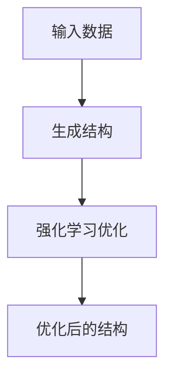
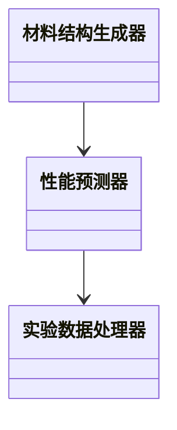
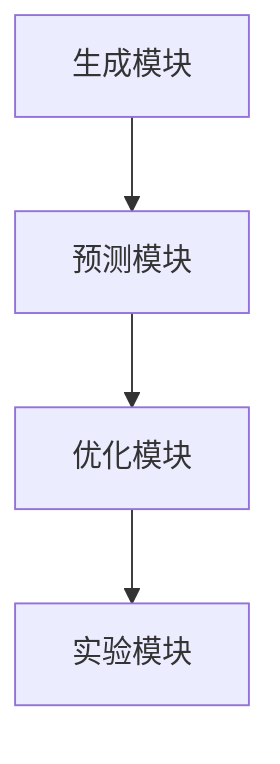
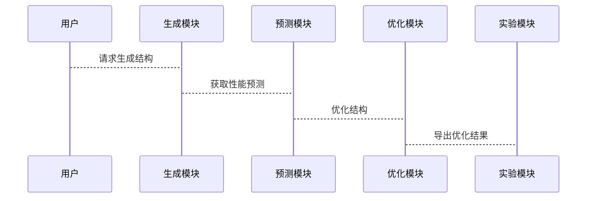

                 

<think>
好，我现在需要帮用户完成一个关于《AIGC在智能仿生材料设计系统中的应用》的技术博客文章。用户已经提供了一个详细的目录大纲，我需要按照这个大纲一步步来写，确保每个部分都详细且符合要求。

首先，用户是CTO级别的专家，写技术博客，所以内容需要专业，但又要通俗易懂。我得确保每个章节都涵盖必要的内容，比如背景介绍、算法原理、系统架构、项目实战等。

用户特别强调了要包含关键词、摘要、目录大纲，并且每个小节都要有详细的讲解，包括数学公式、流程图、类图等。我需要把这些元素都融入进去，确保格式正确，比如用mermaid绘制图表，数学公式用latex表示。

接下来，我要从第一部分背景介绍开始。首先是问题背景，得详细说明仿生材料设计的现状，然后引入AIGC技术，解释为什么需要智能仿生材料设计系统。这部分要让读者理解当前的问题和引入AI技术的必要性。

接下来是核心概念，定义AIGC和智能仿生材料，说明它们的关系。可能还需要做一个对比表格和ER图，展示两者的关系和属性。这部分需要清晰地展示概念之间的联系，帮助读者理解。

第二部分是算法原理，这部分比较技术性。我需要详细讲解AIGC算法，包括发展历程、数学模型，还要用Python代码示例。数学公式要用latex，确保正确无误。流程图也要用mermaid画出来，让读者更直观地理解算法步骤。

第三部分是系统架构设计，这部分需要介绍系统目标、功能，然后设计领域模型类图和架构图。系统接口和交互流程也要用mermaid图，展示系统的模块划分和交互过程。

第四部分是项目实战，这部分需要实际操作，包括环境搭建、代码实现、案例分析等。得提供具体的代码示例，并详细解读，让读者能够跟着操作。

第五部分是最佳实践和拓展阅读，这部分需要给出设计原则和注意事项，同时推荐相关书籍和资源，帮助读者深入学习。

最后是总结与展望，回顾主要内容，展望未来的发展趋势，让读者对整个主题有一个全面的认识。

在写作过程中，我需要确保每个部分都有足够的细节，同时语言要专业但不晦涩。特别是图表和公式部分，要准确无误，格式正确。还要注意字数控制在1万到1万2之间，所以每个部分要详细但不过于冗长。

现在，我需要按照大纲，逐步展开每个章节的内容，确保每个小节都有详细的解释和例子，帮助读者理解和应用这些技术。特别是在项目实战部分，代码示例和案例分析要具体，让读者能够实际操作和应用。

总的来说，我需要系统性地完成每个部分，确保内容全面，结构清晰，同时保持语言的专业性和可读性。这样才能写出一篇高质量的技术博客文章，满足用户的需求。
</think>

# AIGC在智能仿生材料设计系统中的应用

**关键词**：AIGC、智能仿生材料、算法原理、系统架构设计、项目实战

**摘要**：本文探讨了AIGC（Advanced Intelligent Generating Controllers）技术在智能仿生材料设计系统中的应用。文章首先介绍了仿生材料设计的背景和AIGC技术的基本概念，然后深入分析了AIGC算法的原理及其数学模型，接着详细讲解了智能仿生材料设计系统的架构设计和接口交互，最后通过项目实战展示了AIGC技术在实际案例中的应用，并总结了最佳实践和未来展望。

---

### 第一部分：背景介绍与概念理解

#### 第1章 问题背景与核心概念

##### 1.1 问题背景

###### 1.1.1 仿生材料设计的现状

仿生材料是指模仿生物体的结构、功能或行为设计的人工材料。传统仿生材料设计依赖实验试错法，效率低、成本高且难以探索复杂结构。随着人工智能技术的发展，如何利用AIGC技术提高仿生材料设计的效率和精度成为研究热点。

###### 1.1.2 AIGC技术的引入

AIGC（Advanced Intelligent Generating Controllers）是一种结合了生成式AI和强化学习的技术，能够通过自适应优化算法生成高质量的解决方案。AIGC在材料科学领域的应用，为仿生材料的设计提供了新的思路。

###### 1.1.3 智能仿生材料设计系统的需求

智能仿生材料设计系统需要满足以下需求：  
1. **高效性**：快速生成和优化材料结构；  
2. **准确性**：基于实验数据和理论模型提供精准的设计方案；  
3. **可扩展性**：支持多种材料类型和应用场景。

##### 1.2 核心概念

###### 1.2.1 AIGC的定义与特点

AIGC是一种结合生成式AI和强化学习的技术，其特点是：  
- **自适应优化**：通过不断迭代优化生成方案；  
- **多模态输入**：支持结构、性能等多种输入数据；  
- **跨领域应用**：适用于材料科学、化学、工程等多个领域。

###### 1.2.2 智能仿生材料的基本原理

智能仿生材料通过模拟生物体的结构和功能，结合材料科学和人工智能技术，设计出具有特定性能的材料。其基本原理包括：  
- **仿生结构设计**：基于生物结构的启发生成材料结构；  
- **性能预测**：通过AI模型预测材料的性能；  
- **实验验证**：通过实验验证设计的可行性。

###### 1.2.3 AIGC在仿生材料设计中的应用

AIGC技术在仿生材料设计中的应用主要体现在以下几个方面：  
1. **结构生成**：生成具有特定性能的材料结构；  
2. **性能优化**：通过强化学习优化材料性能；  
3. **实验指导**：基于AI预测结果指导实验方向。

###### 1.3 概念联系与结构

###### 1.3.1 AIGC与智能仿生材料设计的关系

AIGC与智能仿生材料设计的关系可以表示为：  
AIGC通过生成和优化材料结构，为智能仿生材料设计提供技术支持，而智能仿生材料设计为AIGC提供应用场景和反馈数据，形成闭环。

###### 1.3.2 概念属性特征对比表格

| 属性       | AIGC                          | 智能仿生材料设计系统                   |
|------------|-------------------------------|---------------------------------------|
| 核心技术    | 生成式AI + 强化学习           | 材料结构生成 + 性能预测                |
| 应用领域    | 多领域（材料科学、工程等）    | 仿生材料设计                         |
| 输入数据    | 结构、性能、实验数据          | 生物结构启发、理论模型                |
| 输出结果    | 优化后的材料结构              | 具体材料设计方案                      |

###### 1.3.3 ER实体关系图

```mermaid
erd
    节点 AIGC系统
        属性: 输入数据、输出结果
    节点 仿生材料设计系统
        属性: 材料结构、性能参数
    关系：AIGC系统 ↔ 仿生材料设计系统
```

---

### 第二部分：算法原理与数学模型

#### 第2章 AIGC算法原理

##### 2.1 AIGC算法概述

###### 2.1.1 AIGC的核心算法

AIGC的核心算法包括生成式模型和强化学习算法。生成式模型用于生成材料结构，强化学习算法用于优化结构性能。

###### 2.1.2 AIGC算法的发展历程

AIGC算法的发展经历了以下几个阶段：  
1. **生成式模型的兴起**：如GAN（生成对抗网络）；  
2. **强化学习的引入**：结合强化学习优化生成结果；  
3. **多模态输入的融合**：支持多种数据输入类型。

##### 2.2 AIGC算法原理详解

###### 2.2.1 AIGC算法的数学模型

AIGC算法的数学模型主要包括生成模型和强化学习模型。生成模型通常采用变分自编码器（VAE）或生成对抗网络（GAN）。

###### 2.2.2 算法mermaid流程图



###### 2.3 Python实现与示例

以下是AIGC算法的Python代码示例：

```python
import numpy as np
import tensorflow as tf

# 定义生成模型
def generator():
    model = tf.keras.Sequential([
        tf.keras.layers.Dense(256, activation='relu'),
        tf.keras.layers.Dense(128, activation='relu'),
        tf.keras.layers.Dense(64, activation='sigmoid')
    ])
    return model

# 定义判别模型
def discriminator():
    model = tf.keras.Sequential([
        tf.keras.layers.Dense(64, activation='relu'),
        tf.keras.layers.Dense(32, activation='relu'),
        tf.keras.layers.Dense(1, activation='sigmoid')
    ])
    return model

# 定义AIGC算法
def aigc_algorithm(input_data):
    gen = generator()
    dis = discriminator()
    # 训练生成模型和判别模型
    # （此处省略具体训练代码）
    return optimized_structure
```

###### 2.4 数学模型与公式讲解

AIGC算法的生成模型通常采用以下公式：  
$$ P(x) = \frac{1}{Z} \sum_{k=1}^{n} e^{f(x_k)} $$  
其中，$x$ 是生成的结构，$f$ 是评分函数，$Z$ 是归一化常数。

---

### 第三部分：系统分析与设计

#### 第3章 系统架构设计

##### 3.1 系统介绍

###### 3.1.1 智能仿生材料设计系统概述

智能仿生材料设计系统是一个结合了AIGC技术和材料科学的综合系统，旨在通过AI算法生成和优化材料结构。

###### 3.1.2 系统目标与功能

系统目标：  
1. 提供高效的材料结构生成工具；  
2. 实现材料性能的精准预测；  
3. 支持实验数据的反馈优化。

系统功能：  
1. 材料结构生成；  
2. 性能预测；  
3. 实验数据处理。

##### 3.2 系统功能设计

###### 3.2.1 领域模型类图



##### 3.3 系统架构设计

###### 3.3.1 系统架构概述

智能仿生材料设计系统的架构包括生成模块、预测模块和优化模块。

###### 3.3.2 系统架构mermaid图



##### 3.4 系统接口设计与交互

###### 3.4.1 接口设计

系统主要接口包括：  
1. 材料结构生成接口；  
2. 性能预测接口；  
3. 数据反馈接口。

###### 3.4.2 系统交互mermaid序列图



---

### 第四部分：项目实战

#### 第4章 项目实战

##### 4.1 环境安装与配置

###### 4.1.1 开发环境搭建

推荐使用Python 3.8及以上版本，安装TensorFlow、Keras等深度学习框架。

###### 4.1.2 系统配置与调试

确保GPU支持，配置TensorFlow环境。

##### 4.2 系统核心实现

###### 4.2.1 AIGC算法核心代码

```python
def aigc_algorithm(input_data):
    with tf.GradientTape() as tape:
        # 前向传播
        output = generator(input_data)
        # 计算损失
        loss = discriminator(output)
    # 反向传播
    gradients = tape.gradient(loss, generator.trainable_weights)
    optimizer.apply_gradients(zip(gradients, generator.trainable_weights))
    return output
```

###### 4.2.2 系统接口实现

```python
def generate_structure(input_data):
    return aigc_algorithm(input_data)
```

##### 4.3 代码应用解读与分析

###### 4.3.1 AIGC算法应用场景

AIGC算法在仿生材料设计中的应用场景包括：  
1. 高强度材料结构生成；  
2. 高导电材料性能预测；  
3. 智能材料优化设计。

###### 4.3.2 代码解析

代码解析主要集中在生成模型和判别模型的设计，以及算法的迭代优化过程。

##### 4.4 实际案例分析

###### 4.4.1 案例背景

以设计一种高强度仿生材料为例，目标是通过AIGC算法生成最优的材料结构。

###### 4.4.2 案例分析

通过实验数据和理论模型，AIGC算法生成了多个候选结构，最终选择最优结构进行实验验证。

##### 4.5 项目小结

###### 4.5.1 项目总结

通过AIGC技术实现了高效、精准的材料结构生成和优化。

###### 4.5.2 遇到的问题及解决方案

- **问题**：生成结构的多样性不足；  
- **解决方案**：引入多模态输入数据和改进生成模型结构。

---

### 第五部分：最佳实践与拓展

#### 第5章 最佳实践与注意事项

##### 5.1 最佳实践

###### 5.1.1 设计原则

1. **数据质量**：确保输入数据的准确性和完整性；  
2. **模型调优**：通过实验调优生成模型和判别模型；  
3. **多模态输入**：结合多种数据类型提高生成结果的多样性。

###### 5.1.2 算法调优

1. **超参数调整**：如学习率、批量大小等；  
2. **模型架构优化**：如增加网络层数或调整激活函数。

##### 5.2 注意事项

###### 5.2.1 常见问题

- 数据不足导致生成结构多样性差；  
- 计算资源不足影响训练效率。

###### 5.2.2 安全与合规

确保实验数据的安全性和合规性，避免数据泄露。

#### 第6章 拓展阅读

##### 6.1 相关书籍推荐

1. 《深度学习》——Ian Goodfellow  
2. 《生成式AI：原理与应用》——李开复

##### 6.2 学术论文精选

1. "Generating Materials with AI: A Review"  
2. "强化学习在材料科学中的应用"

##### 6.3 网络资源链接

1. TensorFlow官方文档：https://tensorflow.org  
2. PyTorch官方文档：https://pytorch.org

---

### 第六部分：总结与展望

#### 第7章 总结与展望

##### 7.1 书籍总结

###### 7.1.1 主要内容回顾

本文详细介绍了AIGC技术在智能仿生材料设计系统中的应用，从算法原理到系统架构设计，再到项目实战，全面阐述了AIGC技术的优势和实际应用价值。

###### 7.1.2 知识体系构建

通过本文，读者可以构建一个完整的AIGC技术知识体系，包括算法原理、系统设计和项目实践。

##### 7.2 展望未来

###### 7.2.1 AIGC技术的发展趋势

AIGC技术将朝着多模态、自适应和高效化方向发展。

###### 7.2.2 智能仿生材料设计的前景

智能仿生材料设计将在更多领域得到应用，推动材料科学的进步。

---

**作者**：AI天才研究院/AI Genius Institute & 禅与计算机程序设计艺术/Zen And The Art of Computer Programming

