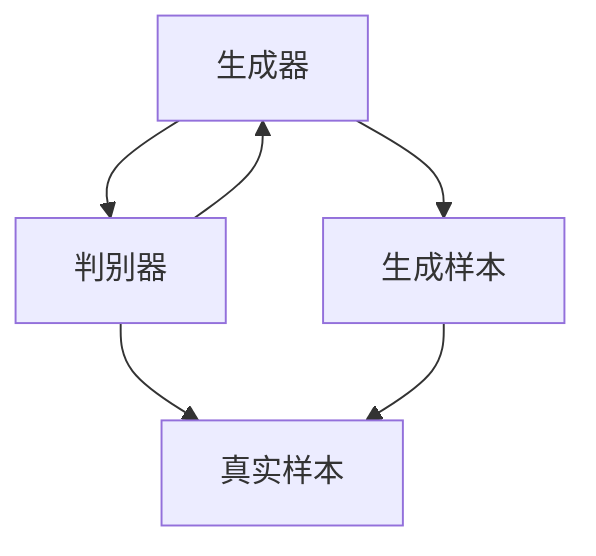
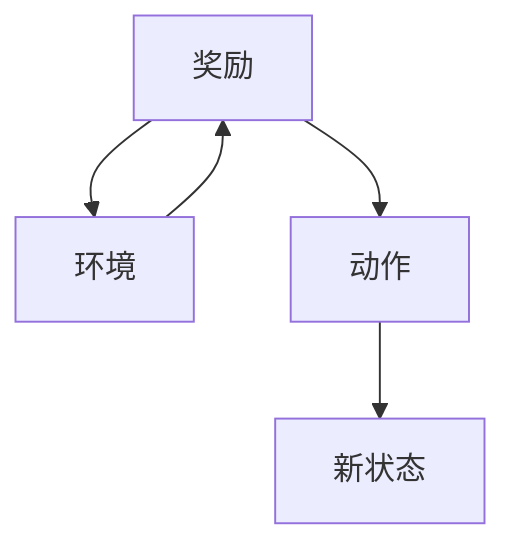
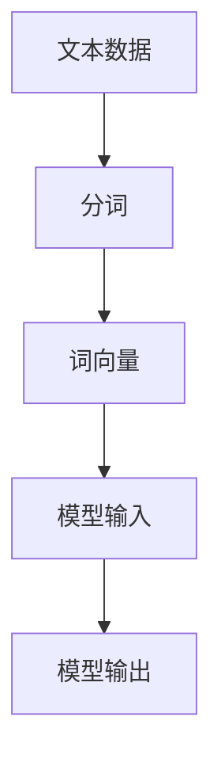
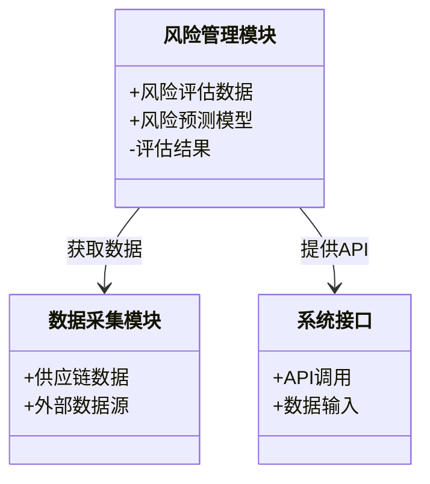
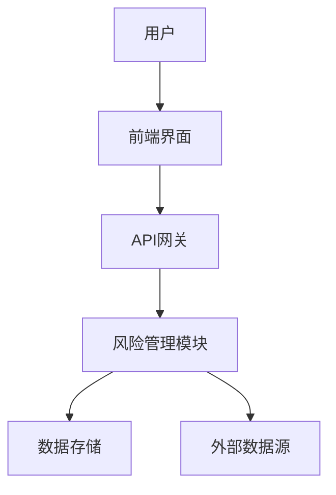
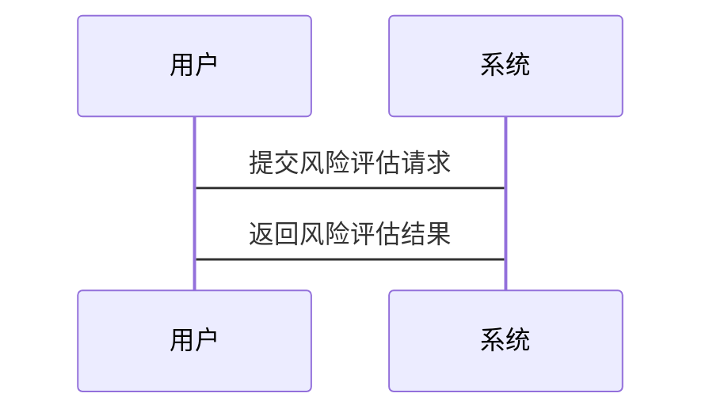

                 

<think>
嗯，用户给了我一个任务，让我写一篇关于AIGC在智能供应链风险管理中的应用的技术博客。首先，我需要理解用户的需求。他们希望我以一位世界级专家的身份，详细分析这个主题，结构要清晰，语言专业但易懂。

我先看用户提供的大纲，发现他们已经详细列出了各个章节，包括引论、技术原理与应用、数学模型、系统分析与架构设计等。我需要按照这个大纲来展开，确保每个部分都涵盖必要的内容，比如核心概念、算法原理、系统架构等。

接下来，我需要考虑每个章节的具体内容。比如，第一章需要介绍AIGC和供应链风险管理的基本概念，以及它们的应用前景。这可能涉及到生成对抗网络、强化学习和自然语言处理等技术。

然后，在技术原理部分，我需要详细解释GAN、强化学习和NLP在供应链中的应用，包括它们的工作原理和实际场景。这部分可能需要配以Mermaid流程图，帮助读者理解。

数学模型部分，我需要列出GAN和强化学习的相关公式，解释它们的意义和应用。这部分要确保公式准确，解释清晰。

系统架构设计部分，我需要描述供应链风险管理的场景，设计系统功能，绘制类图和架构图，展示系统的组成部分和交互流程。

项目实战部分，可能需要包括环境安装、核心代码实现、案例分析等，但用户可能还没提供具体代码，我可能需要自己构思或提示用户补充。

最后，我需要总结整个内容，给出最佳实践建议和注意事项，帮助读者更好地理解和应用这些技术。

在写作过程中，我需要确保每个章节的内容详实，逻辑连贯。同时，语言要专业但不过于晦涩，适合技术读者阅读。我还要注意使用正确的格式，如Mermaid图表和LaTeX公式，确保它们正确无误地嵌入文章中。

总的来说，我需要一步步按照用户提供的大纲，逐步展开每个部分，确保每个小节都深入分析，提供足够的细节和实例，帮助读者全面理解AIGC在供应链风险管理中的应用。
</think>

# AIGC在智能供应链风险管理中的应用

> 关键词：AIGC，人工智能生成内容，供应链风险管理，生成对抗网络，强化学习，自然语言处理

> 摘要：本文探讨了AIGC（人工智能生成内容）技术在智能供应链风险管理中的应用。通过分析AIGC的核心技术及其在供应链风险管理中的应用场景，本文揭示了AIGC如何通过生成对抗网络（GAN）、强化学习（RL）和自然语言处理（NLP）等技术手段，优化供应链的风险评估、预测和应对策略。文章还详细介绍了AIGC在供应链风险管理中的数学模型、系统架构设计以及实际应用案例，为相关领域的研究和实践提供了理论和实践参考。

---

## 第一部分：引论

### 第1章：AIGC与智能供应链风险管理概述

#### 1.1 AIGC技术概述

##### 1.1.1 AIGC的概念与起源

人工智能生成内容（AIGC，Artificial Intelligence Generated Content）是指利用人工智能技术生成文本、图像、音频、视频等多样化内容的过程。AIGC的起源可以追溯到20世纪末，随着深度学习技术的发展，特别是生成对抗网络（GAN）和变体自编码器（VAE）的提出，AIGC技术逐渐成熟。AIGC的核心在于通过算法模拟人类创造力，生成符合特定需求的内容。

##### 1.1.2 AIGC技术核心

AIGC的核心技术包括生成对抗网络（GAN）、强化学习（RL）和自然语言处理（NLP）等。其中，GAN通过两个神经网络（生成器和判别器）的对抗训练，生成逼真的数据；RL通过奖励机制优化生成内容的质量；NLP则用于理解和生成人类语言，帮助AIGC更好地与供应链中的文本数据交互。

##### 1.1.3 AIGC在供应链风险管理中的应用前景

供应链风险管理是企业运营中的关键环节，涉及供应商选择、库存优化、物流规划等多个方面。传统的供应链风险管理依赖人工分析，效率低且易受主观因素影响。AIGC通过自动化数据处理和智能生成能力，能够显著提升供应链风险管理的效率和准确性。例如，AIGC可以自动生成风险评估报告、预测潜在风险并提出应对策略。

#### 1.2 智能供应链风险管理背景

##### 1.2.1 供应链风险管理的重要性

供应链是企业运营的“生命线”，其稳定性和安全性直接影响企业的竞争力。供应链风险管理旨在识别、评估和应对可能影响供应链的各类风险，如供应商违约、物流中断、原材料短缺等。有效的风险管理可以降低供应链中断的可能性，提升企业的抗风险能力。

##### 1.2.2 传统供应链风险管理面临的挑战

传统供应链风险管理主要依赖人工经验和静态数据分析，存在以下问题：  
1. 数据量大且分散，难以快速处理和分析；  
2. 风险评估主观性强，缺乏量化依据；  
3. 应对策略滞后，难以实时调整；  
4. 需要大量人工参与，效率低下。  

##### 1.2.3 智能供应链风险管理的发展趋势

随着人工智能、大数据和物联网技术的发展，供应链风险管理正在向智能化方向转型。智能供应链风险管理利用AIGC、机器学习和区块链等技术，实现数据的实时采集、分析和预测，从而更快、更准地识别和应对风险。

#### 1.3 研究方法与本书结构

##### 1.3.1 研究方法

本文采用理论分析与实践应用相结合的方法，结合AIGC的核心技术，分析其在供应链风险管理中的应用场景，并通过实际案例验证其有效性。

##### 1.3.2 本书结构安排

本书分为三部分：引论、技术原理与应用、系统分析与架构设计。引论部分介绍AIGC与供应链风险管理的基本概念；技术原理与应用部分详细讲解AIGC的核心技术及其在供应链风险管理中的应用；系统分析与架构设计部分从系统角度分析供应链风险管理的实现方案。

##### 1.3.3 主要贡献与创新点

本文的创新点在于将AIGC技术引入供应链风险管理领域，提出了一种基于GAN、RL和NLP的智能风险管理框架，并通过实际案例验证了该框架的有效性。

---

## 第二部分：技术原理与应用

### 第3章：AIGC技术在供应链风险管理中的应用原理

#### 3.1 GAN在供应链风险管理中的应用

##### 3.1.1 GAN基础原理

生成对抗网络（GAN）由生成器和判别器组成。生成器的目标是生成与真实数据相似的样本，而判别器的目标是区分生成样本和真实样本。通过交替训练生成器和判别器，GAN能够生成高质量的数据。

##### 3.1.2 GAN在供应链风险管理中的应用场景

在供应链风险管理中，GAN可以用于以下场景：  
1. **风险数据生成**：利用GAN生成模拟的供应链数据，用于训练风险预测模型；  
2. **异常检测**：通过判别器识别供应链中的异常数据，发现潜在风险；  
3. **风险模拟**：生成多种风险场景，评估不同策略下的供应链表现。

##### 3.1.3 GAN算法的mermaid流程图

#### 3.2 强化学习在供应链风险管理中的应用

##### 3.2.1 强化学习基础原理

强化学习（RL）通过智能体与环境的交互，学习最优策略。智能体会根据当前状态选择动作，并通过奖励机制优化策略。

##### 3.2.2 强化学习在供应链风险管理中的应用

在供应链风险管理中，强化学习可以用于以下场景：  
1. **库存优化**：通过强化学习算法优化库存水平，降低缺货和过剩风险；  
2. **供应商选择**：基于历史数据，学习最优供应商选择策略；  
3. **风险应对策略**：在不同风险场景下，学习最优应对策略。

##### 3.2.3 强化学习算法的mermaid流程图

#### 3.3 自然语言处理在供应链风险管理中的应用

##### 3.3.1 NLP基础原理

自然语言处理（NLP）用于理解和生成人类语言。通过NLP技术，可以对供应链中的文本数据（如合同、邮件）进行分析，提取关键信息。

##### 3.3.2 NLP在供应链风险管理中的应用

在供应链风险管理中，NLP可以用于以下场景：  
1. **合同分析**：自动解析供应商合同，识别潜在风险条款；  
2. **舆情分析**：通过社交媒体和新闻数据，分析供应商的信誉风险；  
3. **风险报告生成**：自动生成风险评估报告，供决策者参考。

##### 3.3.3 NLP算法的mermaid流程图

### 第4章：数学模型与公式讲解

#### 4.1 GAN数学模型

##### 4.1.1 GAN损失函数

GAN的损失函数由生成器损失和判别器损失组成：

$$
\mathcal{L}_{\text{GAN}} = \mathcal{L}_{\text{D}} + \mathcal{L}_{\text{G}}
$$

其中，判别器损失为：

$$
\mathcal{L}_{\text{D}} = -\log(D(x)) - \log(1 - D(G(z)))
$$

生成器损失为：

$$
\mathcal{L}_{\text{G}} = -\log(D(G(z)))
$$

##### 4.1.2 GAN优化目标

GAN的优化目标是通过交替训练生成器和判别器，使得生成器生成的样本与真实样本难以区分。

##### 4.1.3 GAN公式讲解

$$
\min_{G} \max_{D} \mathcal{L}_{\text{GAN}} = \min_{G} \max_{D} \left( -\log(D(x)) - \log(1 - D(G(z))) \right)
$$

---

## 第三部分：系统分析与架构设计

### 第5章：系统分析与架构设计

#### 5.1 供应链风险管理场景介绍

供应链风险管理场景包括供应商选择、库存管理、物流监控等多个环节。例如，在供应商选择中，企业需要评估供应商的信用风险、交付能力和成本优势。

#### 5.2 系统功能设计与领域模型

##### 5.2.1 领域模型Mermaid类图

#### 5.3 系统架构设计

##### 5.3.1 系统架构Mermaid架构图

#### 5.4 系统接口设计与交互

##### 5.4.1 系统接口设计

系统接口包括API接口和用户界面。API接口用于与其他系统的数据交互，用户界面用于风险评估结果的展示和操作。

##### 5.4.2 系统交互Mermaid序列图

---

## 结语

通过本文的分析，我们可以看到AIGC技术在智能供应链风险管理中的巨大潜力。基于GAN、RL和NLP等技术，AIGC可以帮助企业更高效地识别、评估和应对供应链风险。未来，随着AIGC技术的不断发展，其在供应链风险管理中的应用将更加广泛和深入。

---

作者：AI天才研究院/AI Genius Institute & 禅与计算机程序设计艺术 /Zen And The Art of Computer Programming

