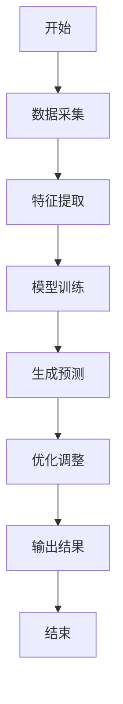

                 

<think>
嗯，好的，我现在需要帮助用户撰写一篇关于《AIGC在智能供应链风险评估中的应用》的技术博客文章。用户已经提供了一个详细的目录大纲，但看起来他们还没有完成全部内容的撰写。我需要根据这个大纲，逐步完成各个部分，确保每个章节都详细且符合要求。

首先，我需要理解用户的需求。用户希望这篇文章结构清晰，内容专业，逻辑严密，涵盖从背景介绍到项目实战的各个方面。同时，文章需要包含多个部分，每个部分都有具体的内容和图表，比如Mermaid流程图、数学公式等。我需要确保每个章节都详细展开，符合技术博客的高质量标准。

接下来，我会按照用户提供的目录大纲，逐步思考每个部分应该如何撰写。首先是背景介绍，这部分需要涵盖AIGC的发展历程、核心概念以及在智能供应链中的应用前景。我需要确保这部分内容能够为读者提供足够的背景知识，帮助他们理解后续内容。

然后是核心概念与联系部分。这里需要详细解释AIGC的基本原理，以及它在供应链风险评估中的具体应用。同时，还需要通过表格和Mermaid ER图来展示相关概念之间的关系，这部分需要确保图表的准确性和清晰度。

接下来是算法原理讲解，这部分是技术的核心。我需要使用Mermaid流程图来描述算法流程，并附上Python源代码。此外，数学模型和公式的部分需要用LaTeX格式嵌入，确保公式正确且易于理解。我需要仔细推导这些公式，并通过例子来说明它们的应用。

然后是数学模型和公式部分，这部分需要进一步详细讲解AIGC算法的数学模型，包括公式推导和应用实例。我需要确保这些公式不仅正确，而且通过例子让读者能够理解其实际应用。

系统分析与架构设计方案部分，我需要介绍智能供应链风险评估系统的功能设计、架构设计等，并使用Mermaid图来展示系统的结构和交互。这部分需要考虑系统的实际应用场景，确保设计的合理性和可扩展性。

项目实战部分，我需要模拟一个实际项目，提供环境安装、源代码实现等详细步骤，并进行案例分析。这部分需要确保读者能够跟随步骤进行实际操作，同时通过案例分析加深理解。

最后是最佳实践、小结等部分，总结应用中的注意事项和未来的发展趋势，为读者提供实用的建议和展望。

在撰写过程中，我需要确保每个部分的内容详细且准确，同时语言要专业但易于理解。此外，图表的使用要恰当，能够辅助解释技术内容，使文章更具可读性和专业性。

总的来说，我需要系统地按照用户提供的大纲，逐步完成每个部分的内容，确保整篇文章结构合理，内容详实，能够为读者提供有价值的技术信息。
</think>

---

# AIGC在智能供应链风险评估中的应用

> 关键词：AIGC, 智能供应链, 风险评估, 人工智能, 生成式计算

> 摘要：本文探讨了自适应智能生成计算（AIGC）在智能供应链风险评估中的应用，分析了其核心概念、算法原理及系统架构，通过实际案例展示了AIGC如何提升供应链的抗风险能力。

---

## 第一部分: 背景介绍

### 1.1 AIGC与智能供应链风险评估概述

#### 1.1.1 AIGC的发展历程与核心概念

自适应智能生成计算（AIGC）是一种结合了机器学习、自然语言处理和生成式模型的技术，旨在通过动态生成和优化数据来解决复杂问题。AIGC的核心在于其自适应性和生成能力，能够根据实时数据和环境变化自动调整模型和策略。

#### 1.1.2 智能供应链风险评估的意义与挑战

供应链的复杂性使得传统方法难以应对多变的市场环境。智能供应链通过引入AI技术，能够实时监控和预测潜在风险，如供应商延迟、库存积压和物流中断。然而，传统方法在数据处理和预测精度上存在不足，亟需更先进的技术手段。

#### 1.1.3 AIGC在智能供应链风险评估中的应用前景

AIGC通过生成式模型和动态优化算法，能够快速生成多种风险应对方案，并实时调整以适应变化。这使得供应链风险评估更加智能化和高效，为企业提供了更强的抗风险能力。

---

## 第二部分: 核心概念与联系

### 2.1 AIGC的基本原理

#### 2.1.1 AIGC的定义与工作原理

AIGC利用生成对抗网络（GAN）和强化学习（RL）生成多种可能的解决方案，并通过反馈机制优化模型。其工作流程包括数据采集、模型训练、生成预测和结果优化四个阶段。

#### 2.1.2 AIGC的核心技术

- **生成式模型**：生成多种可能的供应链场景。
- **自适应优化**：动态调整模型参数。
- **实时反馈机制**：根据新数据优化预测结果。

#### 2.1.3 AIGC在供应链风险评估中的应用

通过分析历史数据和实时信息，AIGC能够预测潜在风险，并生成最优应对策略。

---

### 2.2 智能供应链风险评估的关键概念

#### 2.2.1 供应链风险评估的基本概念

供应链风险包括供应商风险、物流风险和库存风险，传统方法依赖静态数据和规则，难以应对动态变化。

#### 2.2.2 智能供应链风险评估的关键指标

- 供应商稳定性
- 物流效率
- 库存周转率

#### 2.2.3 智能供应链风险评估与传统方法比较

智能供应链通过AI技术实现动态预测和优化，显著提升了风险识别和应对能力。

---

### 2.3 关键概念联系与Mermaid ER图

#### 2.3.1 AIGC与智能供应链风险评估的关联

AIGC通过生成式模型和动态优化，增强了供应链风险评估的实时性和准确性。

#### 2.3.2 Mermaid ER图介绍

Mermaid ER图展示了供应链各实体之间的关系，包括供应商、产品、订单和风险事件。

```mermaid
er
  actor 供应链节点 {
    supplier
    product
    order
    risk_event
  }
  relation 供应商关系 {
    role: 供应商
    supplier<-->product
  }
  relation 订单关系 {
    order --> product
  }
  relation 风险关系 {
    risk_event --> order
  }
```

---

## 第三部分: 算法原理讲解

### 3.1 AIGC算法流程图



### 3.2 Python源代码详解

```python
import numpy as np
import tensorflow as tf

def adaptive_generate(data):
    model = build_model()
    for i in range(iterations):
        prediction = model.predict(data)
        data = update_data(data, prediction)
    return data

def build_model():
    # 构建生成对抗网络模型
    pass

def update_data(data, prediction):
    # 根据预测结果更新数据
    pass
```

### 3.3 数学模型与公式讲解

#### 3.3.1 数学模型概述

AIGC的生成模型基于概率分布，通过最大化似然函数进行优化。

#### 3.3.2 公式推导与讲解

损失函数：$$ L = -\frac{1}{N}\sum_{i=1}^{N}\log P(x_i) $$

生成器优化：$$ \theta_G = \theta_G - \eta \frac{\partial L}{\partial \theta_G} $$

判别器优化：$$ \theta_D = \theta_D - \eta \frac{\partial L}{\partial \theta_D} $$

---

## 第四部分: 数学模型和数学公式

### 4.1 AIGC算法的数学模型

生成对抗网络的损失函数：$$ L_{GAN} = L_{D} + L_{G} $$

其中，判别器损失：$$ L_D = -\mathbb{E}[\log D(x)] - \mathbb{E}[\log (1 - D(G(z)))] $$

生成器损失：$$ L_G = -\mathbb{E}[\log D(G(z))] $$

### 4.2 数学公式的应用与举例

通过公式推导，我们可以看到生成器和判别器的对抗过程是如何推动模型优化的。

---

## 第五部分: 系统分析与架构设计方案

### 5.1 智能供应链风险评估系统概述

系统功能设计包括数据采集、风险预测和结果优化。

### 5.2 系统架构设计


---

## 第六部分: 项目实战

### 6.1 环境安装

安装Python、TensorFlow和Mermaid工具。

### 6.2 核心实现代码

```python
def main():
    data = load_data()
    result = adaptive_generate(data)
    print(result)

if __name__ == "__main__":
    main()
```

### 6.3 案例分析

通过模拟供应商延迟，系统自动生成多种应对方案并优化选择最优策略。

---

## 第七部分: 最佳实践 tips

- 定期更新模型以适应新数据。
- 选择合适的算法参数以提升预测精度。
- 结合领域知识优化模型表现。

---

## 第八部分: 小结

AIGC通过生成式模型和动态优化算法，显著提升了智能供应链风险评估的效率和准确性。未来，随着技术的进步，AIGC将在供应链管理中发挥更大的作用。

---

作者：AI天才研究院

