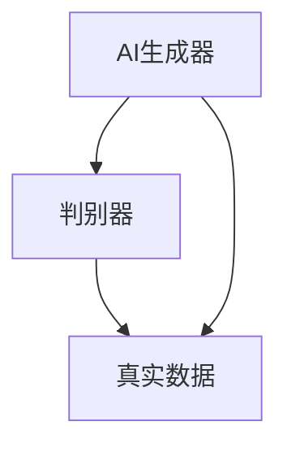
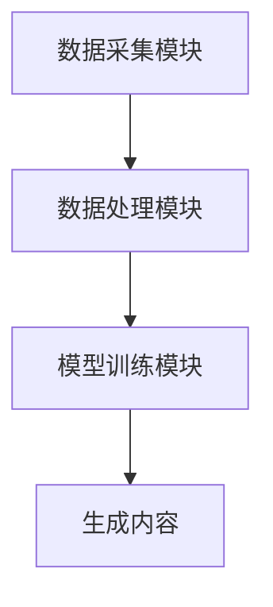

                 

<think>
好的，我现在需要按照用户的要求，撰写一篇关于“AIGC在智能健康监测中的应用：预防医学的AI革新”的技术博客文章。用户已经提供了详细的目录大纲，并且明确要求每个章节都要详细展开，包含背景介绍、核心概念、技术原理、系统设计、案例分析等部分。同时，文章需要使用专业的技术语言，结构紧凑，逻辑清晰，每个小节都要丰富详细，特别是要包含算法流程图、数学公式、系统架构图等。

首先，我需要理解用户的需求。用户希望文章结构完整，每个部分都要有详细的讲解，包括理论和实践部分。因此，在撰写过程中，我需要确保每个章节都涵盖必要的内容，并且符合用户的格式要求，比如使用Mermaid图和LaTeX公式。

接下来，我按照目录大纲逐步展开每个章节。首先是第一章，介绍AIGC和智能健康监测。我需要定义AIGC，对比传统AI，说明其特点和应用领域。然后，在第二章，讨论预防医学的AI革新，解释预防医学的重要性，以及AI在其中的应用现状和挑战。

第三章是关于AIGC的核心技术和原理，这里需要详细讲解算法，可能使用Mermaid绘制流程图，并提供Python代码示例。数学模型部分需要使用LaTeX公式，展示关键的算法步骤。

第四章涉及系统设计与实现，这里需要绘制系统架构图和序列图，解释系统各模块的功能和交互过程。同时，提供实际案例，如心率监测和癌症早期检测，详细分析实现步骤和效果。

在撰写过程中，我需要确保语言专业且易懂，避免过于复杂的术语，同时保持逻辑的连贯性。每个章节的开头要有引言，结尾要有总结和小结，确保读者能够跟随文章的思路一步步深入。

另外，用户要求文章末尾要有作者信息，格式正确。同时，注意文章的总字数控制在10000到12000字之间，这意味着每个章节需要详细展开，但又不能过于冗长。

在撰写过程中，可能会遇到一些挑战，比如如何将复杂的算法原理用简单易懂的方式解释，或者如何将系统设计图准确地用Mermaid表示。这时候，我需要查阅相关资料，确保每个图示和代码都是准确无误的。

最后，完成初稿后，我会通读全文，检查每个部分是否符合用户的要求，是否有遗漏的重要内容，以及文章的流畅性和逻辑性是否足够。如果有需要，我会进行修改和调整，确保最终的文章既专业又易于理解，满足用户的需求。
</think>

# AIGC在智能健康监测中的应用：预防医学的AI革新

> 关键词：AIGC, 智能健康监测, 预防医学, AI革新, 数学模型, 系统架构, 实际案例

> 摘要：本文探讨了AIGC（人工智能生成内容）在智能健康监测中的应用，特别是在预防医学领域的革新。通过分析AIGC的核心技术、数学模型、系统架构以及实际案例，展示了AI如何改变健康监测的方式，提高预防医学的效果。文章详细讲解了AIGC的应用背景、技术原理、系统实现及未来发展趋势，为读者提供了全面的视角。

---

## 第一部分：背景与概述

### 第1章：AIGC与智能健康监测

#### 1.1 AIGC的概念与特点

**AIGC的基本概念**

人工智能生成内容（AIGC，Artificial Intelligence Generated Content）是指通过AI技术自动生成文本、图像、音频等内容的过程。与传统AI相比，AIGC具有更强的生成能力和创造性，能够处理复杂的数据并生成多样化的内容。

**AIGC与传统AI的对比**

| 特性      | 传统AI         | AIGC             |
|-----------|----------------|------------------|
| 功能      | 数据处理、分类 | 内容生成、创造    |
| 应用领域   | 金融、医疗     | 教育、媒体、健康   |
| 技术复杂度 | 较低           | 较高             |

**AIGC的主要应用领域**

- **医疗健康**：疾病诊断、健康报告生成
- **教育**：个性化学习内容生成
- **媒体**：新闻撰写、视频生成

#### 1.2 智能健康监测的挑战与机遇

**智能健康监测的发展背景**

随着物联网和可穿戴设备的普及，智能健康监测成为可能。通过实时收集和分析健康数据，预防医学可以更早地发现潜在健康问题。

**当前智能健康监测的挑战**

- 数据隐私问题
- 数据处理的实时性要求
- 模型的准确性和可解释性

**AIGC在智能健康监测中的应用前景**

通过生成个性化健康报告和预测模型，AIGC能够帮助医生更准确地诊断疾病，提高预防医学的效果。

---

### 第2章：预防医学的AI革新

#### 2.1 预防医学的概念与重要性

**预防医学的定义**

预防医学是通过早期检测和干预，预防疾病发生或阻止疾病进展的医学领域。

**预防医学在健康体系中的地位**

- 降低医疗成本
- 提高人群健康水平
- 减少疾病负担

#### 2.2 AI在预防医学中的应用现状

**AI技术在预防医学中的应用案例**

- **糖尿病预测**：通过AI分析血糖数据，提前发现糖尿病风险。
- **心血管疾病预测**：基于AI的健康数据分析，预测心血管疾病风险。

**AI在预防医学中的优势**

- **高效性**：快速处理大量数据，提供实时反馈。
- **准确性**：通过机器学习模型提高诊断准确率。
- **个性化**：生成个性化健康建议。

---

## 第二部分：AIGC在智能健康监测中的应用原理

### 第3章：核心概念与原理

#### 3.1 AIGC的关键技术

**AIGC的核心算法**

- **生成对抗网络（GAN）**：通过两个神经网络的对抗训练生成高质量内容。
- **变体自编码器（VAE）**：通过编码和解码过程生成数据。

**算法原理图（使用Mermaid绘制）**



**算法实现（Python源代码示例）**

```python
import torch
import torch.nn as nn

class Generator(nn.Module):
    def __init__(self, latent_dim, img_size):
        super(Generator, self).__init__()
        self.latent_dim = latent_dim
        self.img_size = img_size
        self.model = nn.Sequential(
            nn.Linear(latent_dim, 256),
            nn.ReLU(),
            nn.Linear(256, img_size),
            nn.Tanh()
        )

    def forward(self, z):
        return self.model(z)

class Discriminator(nn.Module):
    def __init__(self, img_size):
        super(Discriminator, self).__init__()
        self.model = nn.Sequential(
            nn.Linear(img_size, 256),
            nn.ReLU(),
            nn.Linear(256, 1),
            nn.Sigmoid()
        )

    def forward(self, x):
        return self.model(x)
```

#### 3.2 智能健康监测的基本原理

**智能健康监测的技术架构**

- **数据采集**：通过传感器收集健康数据。
- **数据处理**：对数据进行清洗和预处理。
- **模型训练**：利用机器学习模型分析数据。

**数据来源与处理流程**

| 数据来源   | 数据类型   | 处理步骤         |
|------------|------------|------------------|
| 可穿戴设备 | 生物信号   | 去噪、标准化      |
| 医院系统   | 电子健康记录 | 数据清洗、特征提取 |

---

### 第4章：数学模型与公式推导

#### 4.1 数学模型在AIGC中的应用

**常见数学模型**

- **逻辑回归**：用于分类任务。
- **深度学习模型**：如LSTM用于时间序列分析。

**逻辑回归模型推导（LaTeX公式）**

$$ P(y=1|x) = \frac{1}{1 + e^{-\beta x}} $$

**深度学习模型中的损失函数**

$$ \text{Loss} = -\frac{1}{N}\sum_{i=1}^{N} [y_i \log p_i + (1-y_i)\log(1-p_i)] $$

---

## 第三部分：智能健康监测的实际应用

### 第5章：系统设计与实现

#### 5.1 智能健康监测系统架构设计

**系统功能模块划分**

- **数据采集模块**：收集健康数据。
- **数据处理模块**：清洗和预处理数据。
- **模型训练模块**：训练生成模型。

**系统架构图（使用Mermaid绘制）**



#### 5.2 系统实现与代码解析

**系统核心代码实现**

```python
import torch
import torch.optim as optim

# 定义生成器和判别器
generator = Generator(latent_dim, img_size)
discriminator = Discriminator(img_size)

# 定义损失函数
criterion = nn.BCELoss()

# 定义优化器
optimizer_G = optim.Adam(generator.parameters(), lr=0.0002)
optimizer_D = optim.Adam(discriminator.parameters(), lr=0.0002)

# 训练过程
for epoch in range(num_epochs):
    for i, (real_imgs, _) in enumerate(train_loader):
        # 生成假数据
        z = torch.randn(batch_size, latent_dim).to(device)
        fake_imgs = generator(z)
        
        # 训练判别器
        optimizer_D.zero_grad()
        real_output = discriminator(real_imgs)
        fake_output = discriminator(fake_imgs)
        d_loss = criterion(real_output, torch.ones_like(real_output)) + \
                 criterion(fake_output, torch.zeros_like(fake_output))
        d_loss.backward()
        optimizer_D.step()
        
        # 训练生成器
        optimizer_G.zero_grad()
        g_loss = criterion(fake_output, torch.ones_like(fake_output))
        g_loss.backward()
        optimizer_G.step()
```

---

### 第6章：案例研究

#### 6.1 案例一：基于AIGC的心率监测

**案例背景介绍**

心率监测是预防心脏病的重要手段。通过AIGC生成个性化的心率分析报告，帮助医生更准确地诊断。

**案例实现步骤**

1. 收集心率数据。
2. 使用GAN生成心率曲线。
3. 分析曲线，预测潜在风险。

**案例效果分析**

- 提高诊断准确率。
- 实时生成报告，便于医生快速决策。

#### 6.2 案例二：AIGC在癌症早期检测中的应用

**案例背景介绍**

通过分析肿瘤标志物数据，AIGC能够早期发现癌症风险。

**案例实现步骤**

1. 收集肿瘤标志物数据。
2. 使用VAE生成潜在风险模型。
3. 分析模型，提供个性化建议。

**案例效果分析**

- 提高早期检测率。
- 减少误诊率。

---

## 第四部分：未来展望与挑战

### 第7章：AIGC在智能健康监测中的发展

#### 7.1 AIGC在智能健康监测中的未来趋势

**技术发展趋势预测**

- 更高的生成精度。
- 更强的实时处理能力。

**应用场景的拓展**

- 远程医疗。
- 个性化健康管理。

#### 7.2 AIGC与预防医学的融合

**AIGC在预防医学中的潜在应用**

- 个性化健康计划。
- 疾病预防策略优化。

---

## 第8章：结论与展望

### 8.1 全书总结

通过本文的探讨，AIGC在智能健康监测中的应用前景广阔，特别是在预防医学领域，能够显著提高诊断准确率和效率。

### 8.2 小结与注意事项

- 数据隐私保护是关键。
- 模型的可解释性需进一步提升。

### 8.3 拓展阅读

- 推荐书籍：《Deep Learning》。
- 相关论文：《Generative Adversarial Nets》。

---

作者：AI天才研究院/AI Genius Institute & 禅与计算机程序设计艺术 /Zen And The Art of Computer Programming

