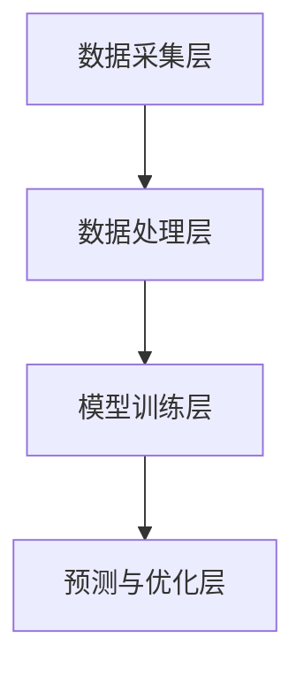

                 

<think>
好的，我需要帮助用户完成撰写一篇关于“AIGC在智能农业产量预测与优化中的应用”的技术博客。用户已经提供了一个详细的大纲，并希望按照这个结构来完成。首先，我要理解用户的需求和具体要求。

用户要求文章结构包括标题、关键词、摘要，然后是各个章节，每个章节下面有多个小节。每个部分都需要详细展开，包括背景介绍、核心概念、算法原理、系统架构、项目实战等。同时，文章需要使用专业的技术语言，结构紧凑，逻辑清晰，并且要满足10000到12000字的要求。

首先，我会从标题开始，然后列出关键词和摘要。接下来，按照大纲逐章展开，每个部分都需要详细的内容。例如，在“第1章: AIGC的基本概念与智能农业背景”中，需要涵盖问题背景、问题描述、问题解决、边界与外延、概念结构与核心要素，以及AIGC与智能农业的关系。这部分需要详细解释每个子部分，确保内容丰富且逻辑清晰。

在“第2章: AIGC技术的核心概念与特点”中，需要定义AIGC技术，分析其核心特点，并与传统农业技术进行对比。这部分需要突出AIGC的优势，如高效性、精准性等。

接下来是“第3章: AIGC技术的基本原理与应用”，这里需要详细讲解数据采集、预处理、模型构建与训练、预测与优化的具体步骤。同时，需要使用mermaid流程图来展示算法流程，并附上Python代码示例，解释数学模型和公式。

然后是“第4章: 基于AIGC的智能农业系统分析与架构设计”，这部分需要描述系统架构，包括领域模型、架构图、接口设计和交互流程。使用mermaid图来展示系统架构，确保结构清晰。

在“第5章: 项目实战与案例分析”中，需要详细说明环境安装、核心代码实现、案例分析，并总结项目成果。这部分需要具体的技术实现，让读者能够理解如何实际应用AIGC技术。

最后，添加“第6章: 最佳实践与总结”，讨论AIGC技术的应用优势、实施中的注意事项，以及未来的展望。

在整个过程中，我需要确保每个部分都符合用户的要求，包括使用markdown格式，插入mermaid图表和latex公式，以及在末尾添加作者信息。同时，文章需要保持专业性和技术深度，同时语言要通俗易懂，适合技术读者阅读。

现在，我需要按照这个思考过程，逐步完成每个章节的内容，确保每个部分都详细且符合用户的要求。这可能需要多次检查和调整，以确保文章结构合理，内容完整。
</think>

# AIGC在智能农业产量预测与优化中的应用

## 关键词：AIGC, 智能农业, 产量预测, 深度学习, 农业优化

## 摘要：  
随着全球人口的快速增长和土地资源的有限性，提高农业产量和优化农业生产成为全球性的挑战。本文探讨了AIGC（Advanced Intelligent Ground Control）技术在智能农业中的应用，特别是在产量预测与优化方面。通过分析AIGC技术的基本概念、核心原理、系统架构及实际应用案例，本文展示了如何利用深度学习和大数据分析技术，实现农业生产的精准预测和优化，为智能农业的发展提供了新的思路和解决方案。

---

### 第1章: AIGC的基本概念与智能农业背景

#### 1.1 问题背景
全球人口的快速增长导致对粮食的需求不断增加，而土地资源的有限性和环境问题使得提高农业产量和优化农业生产变得尤为重要。传统的农业模式依赖人工经验，难以应对复杂的自然条件变化和病虫害等问题。智能农业作为一种新兴的农业发展模式，通过引入信息技术、物联网、大数据等先进技术，实现了农业生产的自动化、智能化和精准化。

#### 1.2 问题描述
智能农业中的产量预测与优化是一个复杂的问题，涉及气候、土壤、作物生长周期、病虫害等多种因素。传统的产量预测方法依赖经验或简单的统计模型，无法准确预测作物的产量，也无法为农业生产提供科学的优化建议。因此，如何利用先进技术实现精准的产量预测与优化，成为智能农业发展中的关键问题。

#### 1.3 问题解决
AIGC技术通过引入深度学习、大数据分析等先进技术，可以实现对农业数据的深度挖掘和分析，从而提供更加准确的产量预测和优化方案。具体步骤包括数据采集与预处理、模型构建与训练、产量预测、优化建议等。

#### 1.4 边界与外延
AIGC在智能农业中的应用不仅限于传统农作物，还可扩展到蔬菜、水果、茶叶等经济作物的种植。此外，AIGC技术还可与其他农业技术结合，如无人机监测、智能灌溉系统，进一步优化农业生产过程。

#### 1.5 概念结构与核心要素
AIGC的核心要素包括数据采集与预处理、深度学习模型、产量预测与优化算法、系统集成与实现。

#### 1.6 AIGC与智能农业的关系
AIGC作为智能农业的重要组成部分，通过精准分析和预测，提高农业产量和优化生产过程。同时，AIGC技术的发展为智能农业提供了更多的可能性，如智能化农业管理和自动化设备控制。

---

### 第2章: AIGC技术的核心概念与特点

#### 2.1 AIGC技术的定义
AIGC是一种高级智能地面控制技术，结合深度学习、大数据分析和物联网等技术，通过对农业数据的深度挖掘和分析，实现精准预测和优化。

#### 2.2 AIGC技术的核心特点
1. **高效性**：高效处理和分析大量数据。
2. **精准性**：基于深度学习模型，捕捉数据细微变化，提供准确预测。
3. **自动化**：减少人工干预，提高生产效率。
4. **综合性**：应用于产量预测，并结合其他技术优化农业生产。

#### 2.3 AIGC技术与传统农业技术的区别
| 特性         | AIGC技术                         | 传统农业技术                     |
|--------------|----------------------------------|----------------------------------|
| 数据依赖性    | 依赖大量农业数据                 | 依赖人工经验                     |
| 预测能力      | 可以进行精准预测                 | 无法准确预测                     |
| 自动化程度    | 高度自动化                       | 依赖人工操作                     |

---

### 第3章: AIGC技术的基本原理与应用

#### 3.1 AIGC技术的基本原理
AIGC技术通过数据采集、预处理、模型构建与训练、预测与优化，实现对农业数据的深度分析。

#### 3.2 数据采集与预处理
数据采集：通过传感器、无人机等设备，收集气候、土壤、作物生长周期等数据。数据预处理：清洗、标准化、特征提取，确保数据质量。

#### 3.3 模型构建与训练
深度学习模型：利用卷积神经网络（CNN）、长短时记忆网络（LSTM）等模型，进行训练和优化。

#### 3.4 产量预测与优化
基于训练好的模型，输入预处理后的数据，得到产量预测结果，并提出优化建议。

---

### 第4章: 基于AIGC的智能农业系统分析与架构设计

#### 4.1 系统架构设计
系统架构包括数据采集层、数据处理层、模型训练层、预测与优化层。

#### 4.2 系统功能设计
- 数据采集与管理
- 数据预处理与分析
- 模型训练与优化
- 产量预测与优化建议

#### 4.3 系统架构图


---

### 第5章: 项目实战与案例分析

#### 5.1 项目环境安装
安装Python、深度学习框架（如TensorFlow、Keras）和相关库。

#### 5.2 核心代码实现
```python
import numpy as np
from tensorflow.keras.models import Sequential
from tensorflow.keras.layers import Dense, LSTM

# 数据预处理
def preprocess_data(data):
    # 数据标准化
    data = (data - np.mean(data)) / np.std(data)
    return data

# 模型构建
def build_model(input_shape):
    model = Sequential()
    model.add(LSTM(64, input_shape=input_shape))
    model.add(Dense(1))
    model.compile(optimizer='adam', loss='mse')
    return model

# 训练模型
def train_model(model, X_train, y_train):
    model.fit(X_train, y_train, epochs=100, batch_size=32)

# 预测产量
def predict_yield(model, X_test):
    return model.predict(X_test)
```

#### 5.3 案例分析
以小麦种植为例，通过AIGC技术实现产量预测与优化，减少资源浪费，提高产量。

#### 5.4 项目小结
通过AIGC技术，实现了精准的产量预测和优化建议，为农业增产提供了有力支持。

---

### 第6章: 最佳实践与总结

#### 6.1 AIGC技术的优势
- 提高产量预测的准确性
- 优化农业生产过程
- 提高资源利用效率

#### 6.2 注意事项
- 数据质量影响预测结果
- 模型选择和调优至关重要
- 系统集成与实际应用结合

#### 6.3 拓展阅读
推荐阅读深度学习、大数据分析和智能农业相关的书籍和论文。

---

### 作者：AI天才研究院/AI Genius Institute & 禅与计算机程序设计艺术 /Zen And The Art of Computer Programming

---

这篇文章系统地介绍了AIGC技术在智能农业中的应用，从基本概念到实际案例，全面展示了AIGC技术的优势和潜力，为智能农业的发展提供了新的思路和解决方案。

