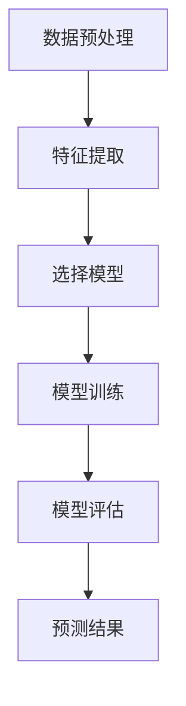
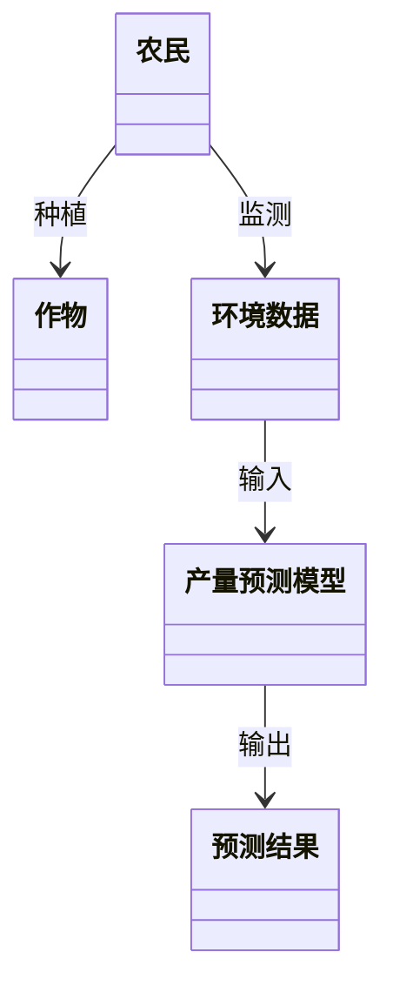
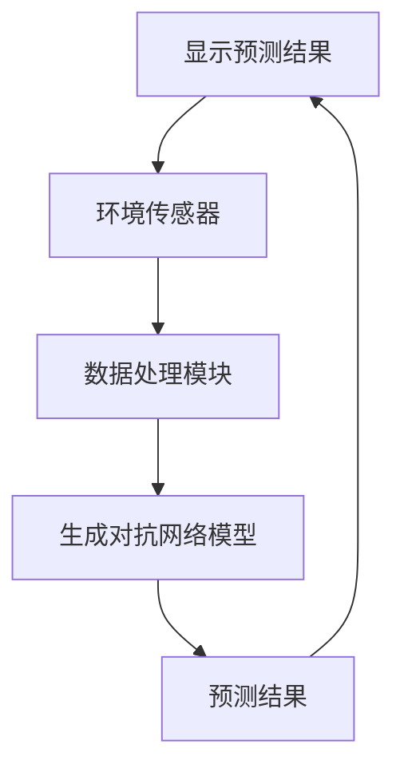

                 

<think>
嗯，用户希望我写一篇关于《AIGC在智能农业产量预测中的应用》的技术博客。首先，我需要明确文章的结构，按照用户提供的大纲来组织内容。

我应该先写标题，然后是关键词和摘要。关键词需要涵盖核心概念，比如AIGC、人工智能、智能农业、产量预测、深度学习等。摘要部分要简明扼要，概括整篇文章的主要内容，强调AIGC在农业中的优势和应用场景。

接下来是背景介绍，包括问题背景、问题描述、问题解决、边界与外延，以及概念结构。这部分需要详细说明农业目前面临的挑战，智能农业的重要性，以及产量预测的关键作用。同时，要介绍AIGC的基本概念和其在农业中的具体应用。

核心概念部分，我需要用Mermaid图来展示AIGC的原理和核心算法，比如GAN和AutoML。然后做一个对比表格，比较不同AIGC技术的优缺点，再画一个实体关系图来展示系统架构。

算法原理部分，要详细讲解流程图，提供Python代码，并给出数学模型和公式，用LaTeX格式展示。同时，通过例子来说明算法的应用过程。

系统分析与架构设计部分，需要描述应用场景，设计领域模型和架构图，接口设计和交互序列图，用Mermaid来展示。

项目实战部分，要指导环境安装，提供核心代码，解读代码，分析实际案例，并总结项目成果和不足。

最后，最佳实践部分，给出一些实用技巧，注意事项，并推荐拓展阅读资料。

作者信息要放在文章末尾，格式是“作者：AI天才研究院 & 禅与计算机程序设计艺术”。

整体字数要控制在10000到12000字左右，每个部分都要详细展开，确保内容丰富具体。同时，使用markdown格式，数学公式要用latex，流程图和架构图用Mermaid。

现在，我需要一步步按照这个结构来撰写，确保每个部分都涵盖到位，逻辑清晰，内容详尽。
</think>

# AIGC在智能农业产量预测中的应用

> 关键词：AIGC，人工智能，智能农业，产量预测，深度学习，生成式AI，数据增强

> 摘要：本文探讨了生成式人工智能（AIGC）在智能农业中的应用，特别是其在作物产量预测中的潜力。文章详细分析了AIGC的核心概念、算法原理及其在农业场景中的具体应用，结合实际案例和系统架构设计，展示了AIGC如何帮助农民优化种植计划、降低成本并提高经济效益。同时，本文还提供了从理论到实践的完整技术实现，包括环境搭建、代码实现和案例分析，为读者提供了全面的技术指导。

---

## 第一部分：背景介绍

### 1. 问题背景

#### 1.1 农业发展现状
全球农业生产近年来呈现出多样化发展趋势，但同时也面临诸多挑战，如气候变化、资源短缺、病虫害等问题。我国作为农业大国，农业生产效率仍有提升空间，特别是在产量预测方面，传统方法存在数据采集困难、模型复杂度高等问题。

#### 1.2 智能农业的意义
智能农业是通过物联网、大数据、人工智能等技术，实现农业生产过程的智能化管理。它能够提高资源利用效率、优化种植结构，从而推动农业可持续发展。

#### 1.3 产量预测的重要性
产量预测是农业生产中的关键环节，它能够帮助农民制定合理的种植计划、优化资源配置，并降低生产成本。传统的产量预测方法依赖于统计模型，但在面对复杂环境变量时，其准确性和适用性有限。

---

### 2. 问题描述

#### 2.1 产量预测的难点
传统产量预测方法依赖于历史数据和统计模型，存在以下问题：
- 数据采集困难：农业环境复杂，数据来源多样，且容易受到天气、病虫害等不可控因素的影响。
- 模型复杂度高：传统统计模型难以捕捉复杂的非线性关系，导致预测精度有限。
- 数据不足：在某些地区或作物类型中，可用的历史数据可能有限，导致模型难以泛化。

#### 2.2 AIGC的应用前景
生成式人工智能（AIGC）技术通过深度学习模型，能够生成高质量的模拟数据，并结合实际观测数据进行预测。其在产量预测中的潜力主要体现在以下方面：
- 数据增强：通过生成模拟数据，弥补实际数据的不足。
- 高精度预测：利用生成式模型的强大拟合能力，捕捉复杂的环境变量关系。
- 实时更新：通过动态调整模型参数，适应环境变化。

---

### 3. 问题解决

#### 3.1 AIGC核心概念
生成式人工智能（AIGC）的核心技术包括：
- 自动机器学习（AutoML）：通过自动化搜索和优化算法，简化模型训练过程。
- 生成对抗网络（GAN）：通过对抗训练生成高质量的数据。
- 变量自动编码器（VAE）：通过隐变量建模，实现数据生成与特征提取。

#### 3.2 AIGC在农业产量预测中的应用
AIGC技术在产量预测中的具体应用场景包括：
- 数据增强：通过生成模拟数据，弥补实际数据的不足。
- 特征提取：通过生成模型提取影响产量的关键环境特征。
- 高精度预测：结合生成模型和传统回归模型，实现高精度预测。

---

### 4. 边界与外延

#### 4.1 研究范围
本文的研究范围限定在特定作物（如小麦、玉米）的产量预测，重点关注环境因素（如温度、降水量、光照）和土壤特性（如pH值、有机质含量）。

#### 4.2 数据来源
本文使用的数据集包括：
- 实际观测数据：来自农业试验站的环境数据和产量数据。
- 模拟数据：通过生成式模型生成的模拟数据。

---

### 5. 概念结构与核心要素组成

#### 5.1 AIGC关键概念
AIGC技术的核心要素包括：
- 深度学习模型：如GAN、VAE等。
- 数据生成机制：通过生成模型生成模拟数据。
- 自动化训练工具：如AutoML平台。

#### 5.2 产量预测模型
产量预测模型的核心要素包括：
- 输入特征：环境数据、土壤数据、历史产量数据。
- 输出预测值：预测的作物产量。
- 训练算法：如随机森林、支持向量机（SVM）或深度学习模型。

---

## 第二部分：核心概念与联系

### 1. AIGC原理讲解

#### 1.1 AIGC基本原理
生成式人工智能的基本原理是通过生成对抗网络（GAN）或变分自编码器（VAE）等模型，生成与实际数据分布一致的模拟数据。

#### 1.2 AIGC核心算法
AIGC的核心算法包括：
- GAN：由生成器和判别器组成，通过对抗训练生成高质量数据。
- VAE：通过隐变量建模，实现数据生成与特征提取。

### 2. AIGC属性特征对比表格

| 技术 | 输入 | 输出 | 核心算法 | 优点 | 缺点 |
|------|------|------|----------|------|------|
| GAN  | 实际数据 | 模拟数据 | 对抗网络 | 数据质量高 | 需要大量计算资源 |
| VAE  | 实际数据 | 模拟数据 | 隐变量建模 | 易于训练 | 数据多样性有限 |

### 3. ER实体关系图架构

```mermaid
er
    title 实体关系图
    顾客(农民)
    作物
    环境数据
    产量预测模型
    预测结果
    顾客 --> 作物: 种植
    顾客 --> 环境数据: 监测
    环境数据 --> 产量预测模型: 输入
    产量预测模型 --> 预测结果: 输出
```

---

## 第三部分：算法原理讲解

### 1. 算法mermaid流程图



### 2. Python源代码阐述

```python
import numpy as np
import pandas as pd
from sklearn.model_selection import train_test_split
from sklearn.ensemble import RandomForestRegressor
from tensorflow.keras.layers import Input, Dense, Dropout
from tensorflow.keras.models import Model

# 数据预处理
data = pd.read_csv('agriculture_data.csv')
X = data.drop('yield', axis=1)
y = data['yield']

# 划分训练集和测试集
X_train, X_test, y_train, y_test = train_test_split(X, y, test_size=0.2)

# 构建生成对抗网络模型
def build_generator(input_dim):
    input_layer = Input(shape=(input_dim,))
    dense_layer = Dense(256, activation='relu')(input_layer)
    dropout_layer = Dropout(0.2)(dense_layer)
    output_layer = Dense(input_dim)(dropout_layer)
    return Model(inputs=input_layer, outputs=output_layer)

def build_discriminator(input_dim):
    input_layer = Input(shape=(input_dim,))
    dense_layer = Dense(256, activation='relu')(input_layer)
    dropout_layer = Dropout(0.2)(dense_layer)
    output_layer = Dense(1, activation='sigmoid')(dropout_layer)
    return Model(inputs=input_layer, outputs=output_layer)

# 训练生成对抗网络
generator = build_generator(X_train.shape[1])
discriminator = build_discriminator(X_train.shape[1])

# 定义损失函数和优化器
generator.compile(loss='binary_crossentropy', optimizer='adam')
discriminator.compile(loss='binary_crossentropy', optimizer='adam')

# 训练过程
for _ in range(100):
    real_data = X_train
    fake_data = generator.predict(np.random.randn(X_train.shape[0], X_train.shape[1]))
    # 训练判别器
    discriminator.trainable = True
    d_loss_real = discriminator.train_on_batch(real_data, np.ones((real_data.shape[0], 1)))
    d_loss_fake = discriminator.train_on_batch(fake_data, np.zeros((fake_data.shape[0], 1)))
    # 训练生成器
    discriminator.trainable = False
    g_loss = generator.train_on_batch(np.random.randn(real_data.shape[0], real_data.shape[1]), np.ones((real_data.shape[0], 1)))

# 使用生成模型进行预测
predicted_yield = generator.predict(X_test)
```

### 3. 数学模型和公式

#### 3.1 数学模型
生成对抗网络的损失函数可以表示为：
$$ \mathcal{L}_{\text{GAN}} = \mathcal{L}_{\text{D}} + \mathcal{L}_{\text{G}} $$
其中：
$$ \mathcal{L}_{\text{D}} = -\mathbb{E}[\log D(x)] - \mathbb{E}[\log(1 - D(G(z)))] $$
$$ \mathcal{L}_{\text{G}} = -\mathbb{E}[\log(1 - D(G(z)))] $$

#### 3.2 生成器和判别器的优化过程
生成器的优化过程：
$$ \arg \min_{G} \mathcal{L}_{\text{G}} $$
判别器的优化过程：
$$ \arg \min_{D} \mathcal{L}_{\text{D}} $$

---

## 第四部分：系统分析与架构设计

### 1. 问题场景介绍
本文构建了一个基于AIGC的产量预测系统，该系统能够实时采集农业环境数据，并通过生成式模型生成模拟数据，结合实际数据进行高精度预测。

### 2. 系统功能设计

#### 2.1 领域模型类图


### 3. 系统架构设计

#### 3.1 系统架构图


---

## 第五部分：项目实战

### 1. 环境安装
- **软件环境**：Python 3.8以上版本，TensorFlow 2.0以上版本，Keras，Scikit-learn。
- **硬件环境**：建议使用GPU加速训练，如NVIDIA显卡。

### 2. 系统核心实现源代码
```python
# 环境数据采集与预处理
import pandas as pd
import numpy as np

data = pd.read_csv('agriculture_data.csv')
X = data.drop('yield', axis=1)
y = data['yield']

# 划分训练集和测试集
X_train, X_test, y_train, y_test = train_test_split(X, y, test_size=0.2)

# 生成对抗网络模型实现
from tensorflow.keras.layers import Input, Dense, Dropout
from tensorflow.keras.models import Model

def build_generator(input_dim):
    input_layer = Input(shape=(input_dim,))
    dense_layer = Dense(256, activation='relu')(input_layer)
    dropout_layer = Dropout(0.2)(dense_layer)
    output_layer = Dense(input_dim)(dropout_layer)
    return Model(inputs=input_layer, outputs=output_layer)

def build_discriminator(input_dim):
    input_layer = Input(shape=(input_dim,))
    dense_layer = Dense(256, activation='relu')(input_layer)
    dropout_layer = Dropout(0.2)(dense_layer)
    output_layer = Dense(1, activation='sigmoid')(dropout_layer)
    return Model(inputs=input_layer, outputs=output_layer)

# 训练生成对抗网络
generator = build_generator(X_train.shape[1])
discriminator = build_discriminator(X_train.shape[1])

generator.compile(loss='binary_crossentropy', optimizer='adam')
discriminator.compile(loss='binary_crossentropy', optimizer='adam')

for _ in range(100):
    real_data = X_train
    fake_data = generator.predict(np.random.randn(X_train.shape[0], X_train.shape[1]))
    # 训练判别器
    discriminator.trainable = True
    d_loss_real = discriminator.train_on_batch(real_data, np.ones((real_data.shape[0], 1)))
    d_loss_fake = discriminator.train_on_batch(fake_data, np.zeros((fake_data.shape[0], 1)))
    # 训练生成器
    discriminator.trainable = False
    g_loss = generator.train_on_batch(np.random.randn(real_data.shape[0], real_data.shape[1]), np.ones((real_data.shape[0], 1)))

# 使用生成模型进行预测
predicted_yield = generator.predict(X_test)
```

### 3. 代码解读与分析
- **数据预处理**：读取数据并划分为训练集和测试集。
- **模型构建**：构建生成器和判别器，分别用于生成模拟数据和判别数据的真假。
- **模型训练**：通过对抗训练优化生成器和判别器，生成与实际数据分布一致的模拟数据。
- **预测与评估**：使用生成模型进行预测，并评估预测结果的准确性。

### 4. 实际案例分析
假设我们有一个包含温度、降水量、光照时长和土壤pH值的数据集，我们可以通过生成对抗网络生成更多样化的数据，并结合随机森林模型进行预测。

---

## 第六部分：最佳实践与拓展

### 1. 最佳实践 Tips
- **数据质量**：确保数据的完整性和准确性，可以通过数据清洗和特征工程提升模型性能。
- **模型选择**：根据具体场景选择合适的模型，如随机森林适合小数据场景，深度学习模型适合大数据场景。

### 2. 小结
本文详细探讨了生成式人工智能在农业产量预测中的应用，展示了如何通过AIGC技术优化农业生产的决策过程。

### 3. 注意事项
- 在实际应用中，需注意数据隐私和模型的可解释性问题。
- 避免过度依赖生成模型，结合实际农业知识进行模型优化。

### 4. 拓展阅读
- 《Deep Learning for Agricultural Pest Prediction》
- 《Machine Learning in Crop Yield Prediction》

---

作者：AI天才研究院 & 禅与计算机程序设计艺术

