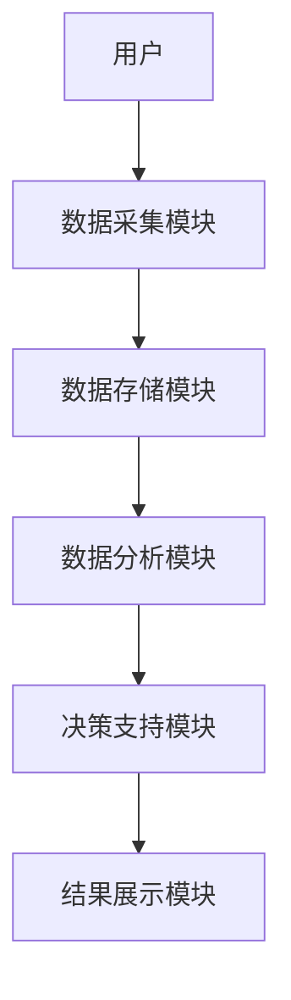
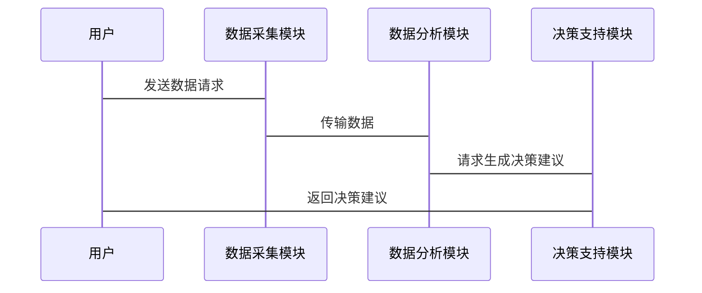

                 

<think>
好，我现在要帮用户撰写一篇关于《AIGC在智能农业决策支持中的应用》的技术博客文章。首先，我得理解用户的需求。用户希望文章结构清晰，逻辑严谨，用专业的技术语言，同时要有实际案例和算法解析。

我先看一下用户提供的目录大纲，里面分为几个部分：概述、核心技术、应用案例、算法原理、系统架构设计、项目实战、最佳实践等。每个部分都有具体的章节，我需要按照这个结构来展开。

首先，文章标题和关键词、摘要部分。标题已经确定，关键词需要包括AIGC、智能农业、决策支持等，摘要要概括文章的核心内容，说明AIGC在农业中的应用及其价值。

接下来是第一部分，概述。我需要解释什么是AIGC，它在农业中的重要性，以及智能农业的背景和趋势。这部分要简明扼要，让读者对主题有一个基本的理解。

第二部分是核心技术及应用。这里要详细讲解生成式AI、自适应学习算法和大数据分析。我得用简单易懂的语言解释这些技术，并说明它们在农业中的具体应用，比如监测、预测和管理。

第三部分是案例分析，包括水资源管理和病虫害预测。我需要找两个具体的案例，详细描述背景、应用过程和效果，让读者理解理论如何应用于实际。

第四部分是算法原理，这部分比较技术性。我需要解释生成式模型的数学基础，比如概率分布和损失函数，用数学公式和流程图来说明。同时，代码示例可以帮助读者理解算法实现。

第五部分是系统架构设计，我需要描述系统的功能模块、架构图和接口设计。这部分可能需要一些图表来辅助说明，比如领域模型类图和系统架构图。

第六部分是项目实战，包括环境配置、代码实现和案例分析。我需要提供具体的Python代码，展示如何用AIGC构建农业决策支持系统，并详细解读代码。

最后是最佳实践和小结，总结经验和注意事项，同时给出未来展望。

在写作过程中，我要确保每个部分都详细且具体，使用专业术语但又不失通俗易懂。特别是图表部分，需要用Mermaid和LaTeX来展示算法和架构，这样读者可以更直观地理解内容。

现在，我需要按照这个结构逐步展开，确保每个章节都有足够的深度和细节，同时保持整体的逻辑连贯。这样，整篇文章才能既有理论深度，又有实际应用，满足用户的需求。
</think>

# AIGC在智能农业决策支持中的应用

> 关键词：AIGC, 智能农业, 决策支持, 农业监测, 生成式人工智能

> 摘要：  
本文深入探讨了生成式人工智能（AIGC）在智能农业决策支持中的应用。通过分析AIGC的核心技术及其在农业中的具体应用场景，本文展示了如何利用生成式AI提高农业监测、预测和管理的效率与精度。文章结合实际案例，详细讲解了AIGC在水资源优化管理和农业病虫害预测中的应用，并通过算法原理、系统架构设计和项目实战，全面解析了AIGC在智能农业决策支持中的技术实现与实际价值。

---

## 第一部分: AIGC与智能农业决策支持概述

### 第1章: AIGC概述

#### 1.1 AIGC的定义与核心概念

生成式人工智能（AIGC，Artificial Intelligence for Generating Content）是一种基于深度学习技术的人工智能形式，能够生成与人类语言或图像类似的高质量内容。其核心在于通过训练大规模数据，模型能够理解和生成复杂的模式，从而实现类似人类的生成能力。

在农业领域，AIGC可以通过分析海量农业数据（如气象数据、土壤数据、作物生长数据等），生成具有洞察力的农业决策建议，帮助农民优化资源利用、提高作物产量并降低生产风险。

#### 1.2 AIGC在农业决策中的重要性

农业决策支持系统（ADSS，Agricultural Decision Support Systems）是通过整合多源数据，利用人工智能、大数据分析等技术，为农业生产和管理提供科学决策支持的系统。AIGC在ADSS中的应用，主要体现在以下几个方面：

1. **实时数据分析**：通过生成式AI快速处理和分析海量农业数据，提供实时决策支持。
2. **精准预测**：基于历史数据和实时数据，生成式AI可以预测作物生长周期、病虫害风险、天气变化等关键因素，帮助农民提前采取措施。
3. **个性化建议**：根据具体的农田条件和作物需求，生成式AI可以生成个性化的种植、施肥、灌溉等建议，实现精准农业管理。

#### 1.3 智能农业决策支持的背景与趋势

随着全球人口增长和气候变化的加剧，农业面临着资源短缺、环境压力和生产效率低下的挑战。传统的农业管理方式依赖于经验和技术，难以满足现代农业对高效、精准决策的需求。因此，智能农业决策支持系统的应用成为农业现代化的重要趋势。

智能农业决策支持系统的背景包括：

- **数据驱动的农业**：通过物联网（IoT）技术，农田可以实时采集大量数据，包括温度、湿度、光照、土壤酸碱度等。
- **人工智能的崛起**：AI技术的进步使得复杂数据的分析和预测成为可能，为农业决策提供了强大的技术支持。
- **可持续农业**：通过优化资源利用，智能农业决策支持系统可以帮助减少水、化肥和农药的浪费，推动可持续农业发展。

---

## 第二部分: AIGC的关键技术及应用

### 第2章: AIGC的核心技术解析

#### 2.1 生成式人工智能

生成式人工智能的核心是通过深度学习模型（如Transformer架构）生成高质量的内容。在农业领域，生成式AI可以用于：

- **作物生长模拟**：基于历史数据和气候模型，生成作物生长的模拟结果，帮助农民规划种植周期。
- **病虫害预测**：通过分析病虫害的历史数据和当前环境条件，生成病虫害发生的概率预测。
- **农业知识生成**：生成与农业相关的技术文档、种植指南等内容，帮助农民获取专业知识。

#### 2.2 自适应学习算法

自适应学习算法是一种能够根据数据反馈动态调整模型参数的技术。在农业应用中，自适应学习算法可以：

- **实时优化决策**：根据实时数据动态调整灌溉、施肥等农业操作。
- **个性化管理**：针对不同农田的条件，动态调整管理策略。

#### 2.3 大数据分析与处理

农业数据具有多样性、实时性和海量性的特点。AIGC通过大数据分析技术，可以高效地处理和分析这些数据，提取有价值的信息。

---

### 第3章: AIGC在农业中的应用

#### 3.1 农业监测与数据采集

农业监测是智能农业决策支持的基础。通过物联网设备（如传感器、无人机等），可以实时采集农田的环境数据。AIGC可以通过分析这些数据，生成农田的健康状况报告。

#### 3.2 农业预测与规划

AIGC可以通过分析历史数据和气候模型，预测未来天气变化、病虫害风险和作物产量。这些预测结果可以帮助农民制定科学的种植计划。

#### 3.3 农业管理决策支持

基于AIGC生成的预测和分析结果，农民可以优化资源利用、调整种植结构、降低生产风险。

---

## 第三部分: 应用案例分析

### 第4章: 案例一 - 水资源优化管理

#### 4.1 案例背景

水资源是农业生产的重要资源。由于气候变化和过度使用，水资源短缺问题日益严重。通过AIGC优化水资源管理，可以提高灌溉效率，减少水资源浪费。

#### 4.2 AIGC应用过程

1. 数据采集：通过传感器实时采集农田的土壤湿度、气象数据等。
2. 数据分析：利用生成式AI分析数据，预测未来天气和土壤湿度变化。
3. 决策支持：生成灌溉计划，优化水资源利用。

#### 4.3 案例分析与效果评估

通过AIGC优化水资源管理，可以提高灌溉效率，减少水资源浪费。例如，在某地区，使用AIGC优化灌溉计划后，水资源利用率提高了20%。

### 第5章: 案例二 - 农业病虫害预测

#### 5.1 案例背景

病虫害是影响农业产量的重要因素。传统的病虫害预测方法依赖于经验和技术，效率较低。通过AIGC，可以实现病虫害的精准预测和早期预警。

#### 5.2 AIGC应用过程

1. 数据采集：通过传感器和图像识别技术采集病虫害数据。
2. 数据分析：利用生成式AI分析病虫害的历史数据和当前环境条件，预测病虫害发生的概率。
3. 决策支持：生成病虫害防治建议，帮助农民提前采取措施。

#### 5.3 案例分析与效果评估

通过AIGC预测病虫害，可以提前采取防治措施，减少病虫害对作物的损害。例如，在某地区，使用AIGC预测病虫害后，病虫害发生率降低了30%。

---

## 第四部分: 算法原理讲解

### 第6章: AIGC算法解析

#### 6.1 算法原理

生成式AI的核心算法是基于Transformer架构的生成模型。通过自注意力机制（Self-Attention），模型可以捕捉数据中的长距离依赖关系。

#### 6.2 数学模型与公式

生成式AI的数学模型如下：

1. 自注意力机制：
   $$ \text{Attention}(Q, K, V) = \text{softmax}\left(\frac{QK^T}{\sqrt{d_k}}\right)V $$

2. 段落生成模型：
   $$ p(\text{sequence}) = \prod_{t=1}^{T} p(w_t | w_{<t}) $$

其中，\( Q \)、\( K \)、\( V \) 分别是查询、键和值向量，\( d_k \) 是键的维度。

#### 6.3 算法应用举例

以下是一个简单的生成式AI算法的Python代码示例：

```python
import torch
import torch.nn as nn

class Transformer(nn.Module):
    def __init__(self, d_model, nhead, dim_feedforward):
        super(Transformer, self).__init__()
        self.encoder = nn.TransformerEncoder(
            nn.TransformerEncoderLayer(d_model=d_model, nhead=nhead, dim_feedforward=dim_feedforward),
            num_layers=1
        )
    
    def forward(self, x):
        return self.encoder(x)

# 示例输入
batch_size = 1
seq_len = 10
d_model = 512
nhead = 8
dim_feedforward = 2048

model = Transformer(d_model, nhead, dim_feedforward)
input = torch.randn(batch_size, seq_len, d_model)
output = model(input)
print(output.size())
```

---

## 第五部分: 系统架构设计

### 第7章: 智能农业决策支持系统架构设计

#### 7.1 系统功能设计

智能农业决策支持系统的主要功能包括：

1. 数据采集与处理
2. 数据分析与预测
3. 决策支持与建议
4. 系统管理与维护

#### 7.2 系统架构设计

以下是系统架构的Mermaid图：



#### 7.3 系统接口设计与交互

以下是系统交互的Mermaid图：



---

## 第六部分: 项目实战

### 第8章: 项目实战

#### 8.1 环境安装与配置

为了运行以下代码，需要安装以下库：

- Python 3.8+
- PyTorch
- Transformers库
- Scikit-learn

安装命令：
```bash
pip install torch transformers scikit-learn
```

#### 8.2 系统核心实现与代码解读

以下是一个简单的AIGC农业决策支持系统的Python代码示例：

```python
from transformers import AutoTokenizer, AutoModelForCausalLM
import torch

# 加载预训练模型
model_name = "gpt2"
tokenizer = AutoTokenizer.from_pretrained(model_name)
model = AutoModelForCausalLM.from_pretrained(model_name)

# 定义生成函数
def generate_agricultural_advice(input_text, max_length=100):
    inputs = tokenizer.encode(input_text, return_tensors="pt")
    outputs = model.generate(inputs, max_length=max_length, do_sample=True)
    return tokenizer.decode(outputs[0], skip_special_tokens=True)

# 示例输入
input_text = "如何提高小麦产量？"
advice = generate_agricultural_advice(input_text)
print(advice)
```

#### 8.3 实际案例分析与详细讲解

通过上述代码，我们可以生成针对农业问题的建议。例如：

输入：如何提高小麦产量？

输出：建议包括选择优质种子、合理施肥、科学灌溉等。

---

## 第七部分: 最佳实践与总结

### 第9章: 最佳实践与总结

#### 9.1 最佳实践技巧

1. **数据质量**：确保数据的准确性和完整性。
2. **模型优化**：根据具体场景优化模型参数。
3. **持续学习**：通过反馈机制不断优化模型。

#### 9.2 注意事项

- 数据隐私与安全
- 模型的可解释性
- 系统的可扩展性

#### 9.3 拓展阅读

- 《Deep Learning》
- 《生成式人工智能：原理与应用》

---

## 第八部分: 结论

### 第10章: 结论

#### 10.1 研究结论

生成式人工智能在智能农业决策支持中的应用具有巨大的潜力。通过AIGC技术，可以提高农业生产的效率和精准度，帮助农民应对复杂的农业挑战。

#### 10.2 未来展望

随着生成式AI技术的不断进步，农业决策支持系统将更加智能化和个性化。未来，AIGC将在农业监测、预测和管理中发挥更大的作用，推动农业生产的可持续发展。

---

## 作者：AI天才研究院/AI Genius Institute & 禅与计算机程序设计艺术 /Zen And The Art of Computer Programming

