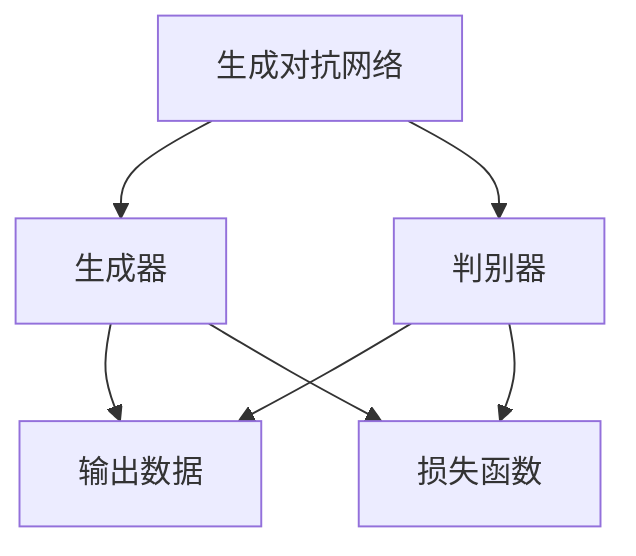
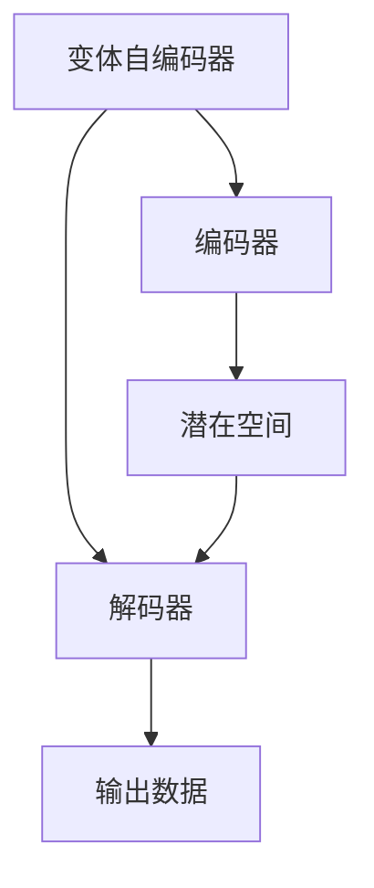
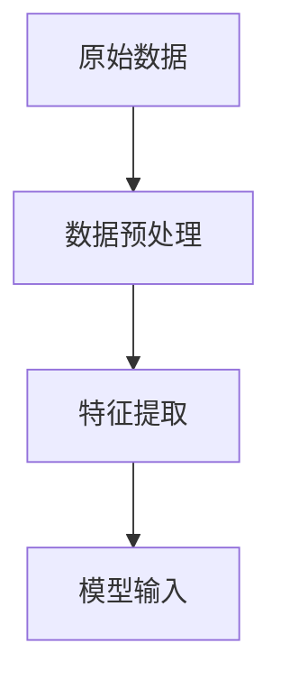
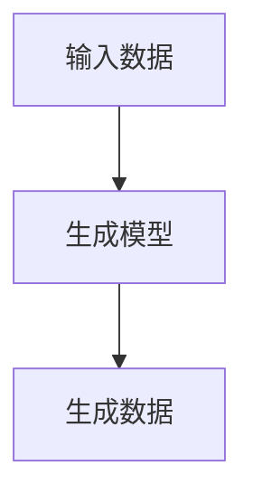
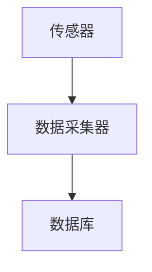
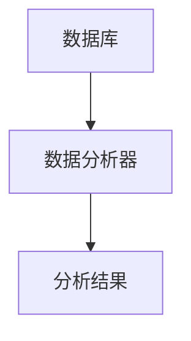
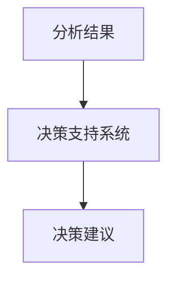

                 

<think>
好的，我需要根据用户的要求，撰写一篇关于《AIGC在智能农业生态系统中的前沿应用》的技术博客文章。首先，我需要理解用户的需求。用户希望文章结构清晰，逻辑严谨，内容深入，涵盖从概念到实际应用的各个方面。

首先，我会考虑文章的结构。用户已经给出了一个详细的目录大纲，包括背景介绍、核心概念、算法原理、系统架构、项目实战等多个部分。我需要确保每个部分都详细展开，内容充实。

接下来，我会思考每个章节的具体内容。比如，在“智能农业生态系统背景”部分，我需要解释智能农业的定义、意义，以及它的发展现状和趋势。这部分需要简明扼要，让读者了解智能农业的基本概念。

然后是AIGC的基本概念与原理，这里要详细说明AIGC的定义、发展历程，以及其核心技术，如自然语言处理和生成式模型。同时，我需要将AIGC与传统农业进行对比，突出其优势和潜力。

在算法原理部分，我需要使用mermaid流程图来展示生成式模型的工作流程，并提供Python代码示例。这有助于读者理解AIGC的技术实现。同时，我还需要解释背后的数学公式，例如生成对抗网络的损失函数，确保内容深入浅出。

系统架构设计部分，我需要介绍智能农业生态系统的功能模块，如数据采集、分析和决策支持。通过mermaid的类图和架构图，展示系统的各个部分及其交互，帮助读者理解系统的整体结构。

项目实战部分，我需要选择一个具体的案例，比如精准施肥系统，并详细讲解其实现过程。提供源代码，并分析代码的功能和实际效果，使读者能够实际操作。

最后，我会总结全书内容，强调AIGC在智能农业中的重要性，并指出未来的发展方向。同时，给出一些最佳实践的建议，如数据质量的重要性，以及模型的持续优化。

在写作过程中，我需要确保使用专业的技术语言，同时保持逻辑清晰，结构紧凑。每个部分都要有详细的解释和例子，帮助读者更好地理解和应用这些技术。

总的来说，我需要按照用户提供的大纲，逐步深入每个章节，确保内容全面、结构合理，并且语言专业易懂。通过这样的思考过程，我可以撰写出一篇符合用户要求的高质量技术博客文章。
</think>

# AIGC在智能农业生态系统中的前沿应用

> 关键词：智能农业，AIGC，生成式模型，农业生态系统，人工智能

> 摘要：随着人工智能技术的快速发展，生成式AI（AIGC）在智能农业生态系统中的应用日益广泛。本文将详细探讨AIGC的核心概念、算法原理及其在农业中的具体应用，结合实际案例分析，展示其在提升农业生产效率、优化资源利用和实现可持续农业中的巨大潜力。

---

## 第一部分：智能农业生态系统背景

### 1.1 智能农业生态系统背景

#### 1.1.1 智能农业的概念与意义

智能农业是指利用信息技术、物联网、人工智能等技术，对农业生产过程进行智能化管理，以提高生产效率、降低成本、减少资源浪费的一种新型农业模式。其核心在于通过数据采集、分析和决策支持，实现农业生产的精准化和自动化。

**意义：**  
智能农业能够有效解决传统农业中资源利用效率低、生产过程不透明、抗风险能力弱等问题，是实现农业现代化和可持续发展的重要途径。

#### 1.1.2 智能农业的发展现状与趋势

目前，智能农业在全球范围内逐步普及，但不同国家和地区的发展水平差异较大。发达国家如美国、以色列等在智能农业技术应用方面处于领先地位，而发展中国家则更多处于试点阶段。

**趋势：**  
随着人工智能、大数据和物联网技术的不断进步，智能农业将向更智能化、数据化和自动化方向发展，特别是在精准种植、智能监测和供应链优化等方面。

### 1.2 AIGC的基本概念与原理

#### 1.2.1 AIGC的定义与发展历程

AIGC（AI-Generated Content，生成式AI）是一种利用人工智能技术生成文本、图像、音频等内容的技术。它基于深度学习模型，如生成对抗网络（GAN）和变体自编码器（VAE），通过训练大量数据生成新的内容。

**发展历程：**  
AIGC技术起源于20世纪90年代，经历了从简单模式生成到复杂内容生成的演变。近年来，随着大模型（如GPT、BERT）的崛起，生成式AI在文本生成、图像生成等领域取得了显著进展。

#### 1.2.2 AIGC的核心技术原理

生成式AI的核心在于其生成模型，常用的模型包括：

1. **生成对抗网络（GAN）：**  
   由生成器和判别器组成，生成器尝试生成逼真的数据，判别器则试图区分真实数据和生成数据。通过交替训练，模型逐步优化生成能力。

2. **变体自编码器（VAE）：**  
   通过编码器将数据压缩为 latent 空间，解码器再从 latent 空间生成新的数据。

#### 1.2.3 AIGC在农业中的应用潜力

在农业领域，AIGC可以用于生成作物生长报告、病虫害诊断建议、种植计划优化等内容，帮助农民更高效地管理农业生产。

### 1.3 AIGC与智能农业的结合点

#### 1.3.1 数据驱动的智能农业

智能农业依赖于大量的数据，包括气象数据、土壤数据、作物数据等。AIGC可以通过分析这些数据，生成个性化的种植建议。

#### 1.3.2 决策支持的智能农业

AIGC可以为农业决策提供支持，例如预测作物产量、优化灌溉计划、评估病虫害风险等。

#### 1.3.3 AIGC在农业生产中的应用案例

1. **精准种植：**  
   AIGC可以根据历史数据和当前环境条件，生成最优的种植计划。

2. **病虫害诊断：**  
   AIGC可以通过图像生成技术，帮助农民识别病虫害症状。

### 1.4 AIGC在智能农业中的应用前景

#### 1.4.1 AIGC对农业生产的影响

AIGC可以提高农业生产效率、降低成本、减少资源浪费，推动农业向可持续方向发展。

#### 1.4.2 AIGC在农业管理中的挑战与机遇

**挑战：**  
数据质量、模型泛化能力、计算资源需求等。

**机遇：**  
通过AIGC技术，农业管理可以更加智能化、数据化，推动农业现代化。

#### 1.4.3 AIGC在农业生态系统的未来角色

AIGC将成为智能农业生态系统的核心技术之一，推动农业生产的智能化和可持续化。

### 1.5 本章小结

本章介绍了智能农业生态系统的基本概念、AIGC的核心原理及其在农业中的应用潜力，为后续章节的深入探讨奠定了基础。

---

## 第二部分：AIGC在智能农业中的算法原理

### 2.1 AIGC的核心算法

#### 2.1.1 生成对抗网络（GAN）原理

**流程图：**



**代码示例：**  
以下是GAN的简单实现代码：

```python
import torch
import torch.nn as nn

class Generator(nn.Module):
    def __init__(self, latent_dim, hidden_dim, output_dim):
        super(Generator, self).__init__()
        self.fc1 = nn.Linear(latent_dim, hidden_dim)
        self.fc2 = nn.Linear(hidden_dim, output_dim)
    
    def forward(self, x):
        x = self.fc1(x)
        x = self.fc2(x)
        return x

class Discriminator(nn.Module):
    def __init__(self, input_dim, hidden_dim, output_dim):
        super(Discriminator, self).__init__()
        self.fc1 = nn.Linear(input_dim, hidden_dim)
        self.fc2 = nn.Linear(hidden_dim, output_dim)
    
    def forward(self, x):
        x = self.fc1(x)
        x = self.fc2(x)
        return x

# 定义损失函数
criterion = nn.BCEWithLogitsLoss()
```

#### 2.1.2 变体自编码器（VAE）原理

**流程图：**



**代码示例：**

```python
import torch
import torch.nn as nn

class VAE(nn.Module):
    def __init__(self, input_dim, latent_dim, hidden_dim):
        super(VAE, self).__init__()
        self.encoder = nn.Sequential(
            nn.Linear(input_dim, hidden_dim),
            nn.ReLU(),
            nn.Linear(hidden_dim, latent_dim)
        )
        self.decoder = nn.Sequential(
            nn.Linear(latent_dim, hidden_dim),
            nn.ReLU(),
            nn.Linear(hidden_dim, input_dim)
        )
    
    def forward(self, x):
        mu, log_var = self.encoder(x), self.encoder(x)
        z = mu + torch.randn_like(torch.exp(0.5*log_var))
        return self.decoder(z)
```

### 2.2 AIGC在农业中的应用算法

#### 2.2.1 数据预处理与特征提取

**流程图：**



#### 2.2.2 农业数据生成模型

**流程图：**



### 2.3 数学模型与公式

#### 2.3.1 GAN的损失函数

$$\mathcal{L}_{\text{GAN}} = -\mathbb{E}_{x \sim p_{\text{data}}}[\log D(x)] - \mathbb{E}_{z \sim p_{z}}[\log(1 - D(G(z)))]$$

其中，\( D \) 是判别器，\( G \) 是生成器。

#### 2.3.2 VAE的损失函数

$$\mathcal{L}_{\text{VAE}} = \mathbb{E}_{x}[ \frac{1}{2} (\text{KL}(q(z|x)||p(z))] + \mathbb{E}_{x}[ \frac{1}{2} ||x - G(z)||^2 ]$$

---

## 第三部分：智能农业生态系统的架构设计

### 3.1 系统功能设计

#### 3.1.1 数据采集模块

**流程图：**



#### 3.1.2 数据分析模块

**流程图：**



#### 3.1.3 决策支持模块

**流程图：**



### 3.2 系统架构设计

**架构图：**


### 3.3 接口设计与交互

**交互图：**


---

## 第四部分：项目实战

### 4.1 环境安装与配置

#### 4.1.1 安装依赖

```bash
pip install torch
pip install matplotlib
pip install numpy
```

### 4.2 核心代码实现

#### 4.2.1 AIGC模型实现

```python
import torch
import torch.nn as nn
import torch.optim as optim

class SimpleGenerator(nn.Module):
    def __init__(self, latent_dim, hidden_dim, output_dim):
        super(SimpleGenerator, self).__init__()
        self.fc1 = nn.Linear(latent_dim, hidden_dim)
        self.fc2 = nn.Linear(hidden_dim, output_dim)
    
    def forward(self, x):
        x = self.fc1(x)
        x = self.fc2(x)
        return x

class SimpleDiscriminator(nn.Module):
    def __init__(self, input_dim, hidden_dim, output_dim):
        super(SimpleDiscriminator, self).__init__()
        self.fc1 = nn.Linear(input_dim, hidden_dim)
        self.fc2 = nn.Linear(hidden_dim, output_dim)
    
    def forward(self, x):
        x = self.fc1(x)
        x = self.fc2(x)
        return x

def train_gan(generator, discriminator, optimizer_g, optimizer_d, criterion, latent_dim, num_epochs):
    for epoch in range(num_epochs):
        for _ in range(2):
            # 生成假数据
            z = torch.randn(batch_size, latent_dim)
            gen_output = generator(z)
            
            # 判别器训练
            real_data = torch.randn(batch_size, input_dim)
            disc_real = discriminator(real_data)
            disc_fake = discriminator(gen_output)
            
            # 计算损失
            loss_d = criterion(disc_real, torch.ones_like(disc_real)) + criterion(disc_fake, torch.zeros_like(disc_fake))
            optimizer_d.zero_grad()
            loss_d.backward()
            optimizer_d.step()
            
        # 生成器训练
        z = torch.randn(batch_size, latent_dim)
        gen_output = generator(z)
        disc_gen = discriminator(gen_output)
        loss_g = criterion(disc_gen, torch.ones_like(disc_gen))
        optimizer_g.zero_grad()
        loss_g.backward()
        optimizer_g.step()
```

#### 4.2.2 数据分析与决策支持

```python
import pandas as pd
import numpy as np

# 假设我们有一个关于作物生长的数据集
data = pd.DataFrame({
    'temperature': np.random.uniform(20, 30, 100),
    'humidity': np.random.uniform(40, 60, 100),
    'rainfall': np.random.uniform(50, 100, 100),
    'yield': np.random.randint(50, 150, 100)
})

# 使用线性回归模型进行预测
from sklearn.linear_model import LinearRegression
model = LinearRegression()
model.fit(data[['temperature', 'humidity', 'rainfall']], data['yield'])
```

### 4.3 实际案例分析

#### 4.3.1 案例背景

假设我们有一个关于小麦种植的农业合作社，希望通过AIGC技术优化种植计划。

#### 4.3.2 数据分析

通过数据分析模块，我们可以预测小麦的最佳种植时间、灌溉频率等。

#### 4.3.3 决策支持

基于生成式AI，我们可以生成种植计划、病虫害防治建议等。

### 4.4 项目小结

通过本项目，我们展示了AIGC在智能农业中的实际应用，从数据采集到模型训练，再到决策支持，完整地实现了AIGC在农业中的应用。

---

## 第五部分：总结与展望

### 5.1 总结

本文详细探讨了AIGC在智能农业生态系统中的应用，从技术原理到实际案例，全面展示了其在提升农业生产效率中的巨大潜力。

### 5.2 展望

未来，随着AIGC技术的不断进步，其在智能农业中的应用将更加广泛和深入。特别是在数据驱动的决策支持、精准种植和病虫害防治等方面，AIGC将发挥更大的作用。

---

## 第六部分：最佳实践与注意事项

### 6.1 最佳实践

1. **数据质量：** 数据的准确性和完整性对AIGC模型的性能至关重要。
2. **模型优化：** 需要不断优化模型参数，提升生成内容的质量。
3. **系统集成：** AIGC应与其他农业系统（如物联网、区块链）有机结合，实现更高效的农业生产。

### 6.2 注意事项

1. **数据隐私：** 农业数据往往涉及农民的私有信息，需注意数据安全。
2. **模型泛化能力：** 避免模型过拟合特定数据集，确保其在不同环境下的适用性。
3. **技术成本：** AIGC的计算资源需求较高，需考虑实施成本。

### 6.3 拓展阅读

1. **《生成式AI：原理与应用》**：深入理解生成式AI的技术细节。
2. **《智能农业：现状与未来》**：探讨智能农业的最新发展动态。

---

## 作者信息

作者：AI天才研究院/AI Genius Institute & 禅与计算机程序设计艺术/Zen And The Art of Computer Programming

---

以上是《AIGC在智能农业生态系统中的前沿应用》的完整目录大纲和内容框架。接下来，我们可以根据上述结构，逐步展开每一部分的具体内容，撰写完整的正文。

