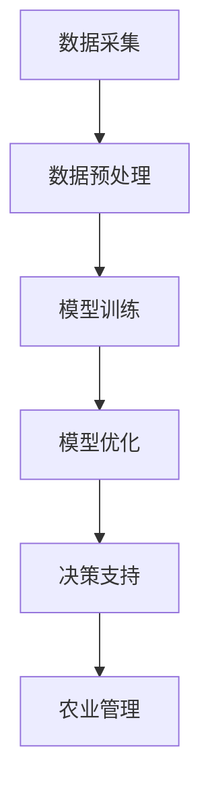
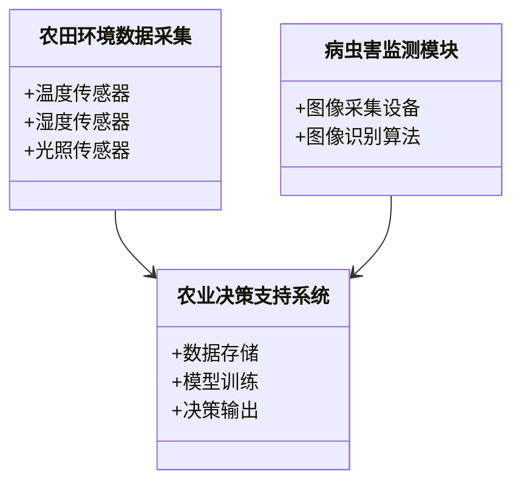
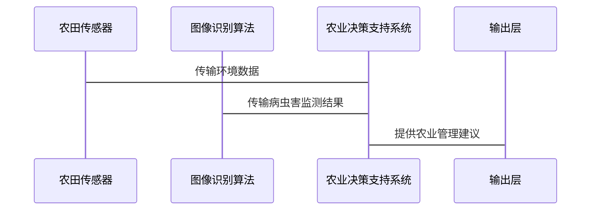

                 

<think>
嗯，用户让我以《AIGC在智能农业生物多样性协同增益中的应用：实现生态农业》为标题写一篇技术博客文章。首先，我需要理解用户的需求。他们希望我作为一位世界级的人工智能专家、程序员、CTO等，撰写一篇结构清晰、内容详尽的技术博客，涵盖背景介绍、核心概念、算法原理、系统架构、项目实战等多个部分。

接下来，我要分析用户的具体要求。文章需要有关键词、摘要，然后按照目录结构展开。关键词应该包括AIGC、智能农业、生物多样性、协同增益、生态农业。摘要部分要简明扼要，概括文章的核心内容。

在背景介绍部分，我需要详细阐述问题背景，比如传统农业中的生物多样性问题，以及AIGC如何解决这些问题。然后描述问题，说明为什么需要AIGC，以及它在农业中的应用潜力。接下来，问题解决部分需要列出文章将如何解决这些问题，比如核心概念介绍、应用场景分析等。

核心概念与联系部分，我需要解释AIGC、智能农业、生物多样性协同增益等术语，可能还要做一个概念对比表格，以及用Mermaid画出ER实体关系图。这部分需要清晰展示各个概念之间的联系。

算法原理讲解是关键部分，我需要详细讲解AIGC的算法，如机器学习模型的训练过程，用数学公式说明，比如损失函数和优化算法。还要用Mermaid画出算法流程图，展示数据采集、模型训练、决策支持等步骤。

系统分析与架构设计部分，需要介绍问题场景，比如精准农业管理、病虫害监测等，然后设计系统功能，用Mermaid类图展示领域模型。接着，系统架构图展示整体结构，包括数据采集层、AI计算层、决策支持层等。接口设计和交互流程图也是必要的。

项目实战部分，我需要选择一个具体案例，比如智慧农田管理系统，然后分步骤介绍环境安装、核心代码实现、案例分析。这需要详细解释代码的功能，以及实际应用的效果。

最后，小结部分要总结文章的主要内容，强调AIGC的优势和未来的发展潜力。同时，提供最佳实践的建议，提醒读者在应用中的注意事项，以及推荐进一步阅读的资料。

在整个过程中，我需要确保文章逻辑清晰，结构紧凑，用词专业但又不失易懂。每一部分都要详细展开，尤其是算法和系统架构部分，要确保读者能够理解并应用这些知识。同时，要注意文章的字数控制在1万到1万2左右，满足用户的要求。

总的来说，我需要一步步地按照用户提供的大纲，逐一填充内容，确保每个部分都详尽且有深度。同时，结合实际案例和数学公式，让文章更具说服力和实用性。这不仅能满足用户的需求，还能为读者提供有价值的技术见解。
</think>

# AIGC在智能农业生物多样性协同增益中的应用：实现生态农业

> 关键词：AIGC, 智能农业, 生物多样性, 协同增益, 生态农业

> 摘要：本文探讨了自适应智能绿色计算（AIGC）在智能农业中的应用，特别是在农业生物多样性协同增益方面。通过分析AIGC的核心原理、应用场景、技术方法和实践案例，本文揭示了AIGC如何帮助实现生态农业的目标。文章还展望了AIGC在智能农业中的未来发展方向，为农业可持续发展提供了新的思路。

---

### 第一部分: 背景介绍

#### 1.1 问题背景

随着全球人口的快速增长和气候变化的加剧，农业面临着前所未有的挑战。传统农业模式依赖于化肥、农药和单一作物种植，这种做法虽然短期内提高了产量，但长期来看却导致了农业生物多样性的减少、土壤退化、水资源污染等问题。农业生物多样性是农业生态系统的重要组成部分，它不仅有助于提高农作物的抗病性和适应性，还能维持生态系统的稳定性。然而，随着农业现代化的推进，这些问题逐渐显现，威胁到农业的可持续发展。

#### 1.2 问题描述

为了应对上述挑战，需要一种能够协调农业生物多样性增益与生态农业发展的方法。AIGC（自适应智能绿色计算）作为一种新兴技术，通过结合人工智能和生态学原理，为农业生物多样性的动态监测与精准管理提供了新的可能性。AIGC的核心在于利用人工智能技术实时分析农业数据，优化农业管理策略，从而实现农业生物多样性的协同增益。然而，目前AIGC在智能农业中的应用还处于探索阶段，其潜力尚未得到充分挖掘。

#### 1.3 问题解决

本文旨在系统探讨AIGC在智能农业生物多样性协同增益中的应用，通过以下几个方面实现问题的解决：

1. **核心概念介绍**：详细阐述AIGC、智能农业和生物多样性协同增益的基本概念，为后续内容提供理论基础。
2. **应用场景分析**：分析AIGC在智能农业中的具体应用场景，如农田管理、病虫害监测、作物生长预测等。
3. **技术方法探讨**：介绍AIGC在智能农业生物多样性协同增益中的技术方法，包括数据采集、模型训练、决策支持等。
4. **实践案例解析**：通过实际案例展示AIGC在智能农业中的应用效果，为读者提供实践经验和启示。
5. **未来展望**：讨论AIGC在智能农业生物多样性协同增益领域的未来发展趋势和潜在研究方向。

#### 1.4 边界与外延

AIGC在智能农业生物多样性协同增益中的应用具有明确的边界和外延：

- **技术范围**：主要涉及机器学习、深度学习、计算机视觉、自然语言处理等技术。
- **应用领域**：包括农田管理、农业气象、病虫害监测、作物生长预测等。
- **生态效应**：关注农业生物多样性增益和生态农业的协同效果，强调可持续发展。

#### 1.5 概念结构与核心要素组成

AIGC在智能农业生物多样性协同增益中的应用涉及以下核心概念与要素：

- **AIGC**：自适应智能绿色计算，结合了人工智能和生态学理论。
- **智能农业**：利用信息技术和人工智能技术提高农业生产效率和农产品质量。
- **生物多样性协同增益**：通过科学管理和技术手段，实现农业生物多样性和生态效益的双赢。
- **数据采集**：农田环境数据、作物生长数据、生物多样性数据等。
- **模型训练**：利用大数据和机器学习技术，训练预测模型和管理模型。
- **决策支持**：基于模型分析结果，提供农业管理决策支持。

---

### 第二部分: 核心概念与联系

#### 2.1 核心概念原理

AIGC的核心原理在于通过人工智能技术对农业数据进行实时分析，优化农业管理策略。其主要原理包括：

1. **数据驱动**：AIGC通过收集农田环境数据（如温度、湿度、光照）和作物生长数据，利用这些数据进行分析和预测。
2. **模型训练**：基于机器学习算法，训练作物生长预测模型和病虫害监测模型。
3. **决策支持**：根据模型分析结果，提供精准的农业管理建议，如最优播种时间、病虫害防治策略等。

#### 2.2 概念属性特征对比表格

| 概念         | 属性               | 特征对比             |
|--------------|--------------------|----------------------|
| AIGC         | 技术基础           | 人工智能、生态学原理 |
| 智能农业     | 应用领域           | 农田管理、病虫害监测 |
| 生物多样性协同增益 | 目标             | 提高生物多样性、优化生态效益 |

#### 2.3 ER实体关系图

```mermaid
erDiagram
    actor Farmer {
        id: integer
        name: string
    }
    class Farm {
        id: integer
        name: string
        location: string
    }
    class Crop {
        id: integer
        type: string
        growth_stage: string
    }
    class Pest {
        id: integer
        type: string
        threat_level: integer
    }
    class Model {
        id: integer
        type: string
        accuracy: float
    }
    Farmer --> Farm: 管理
    Farm --> Crop: 种植
    Farm --> Pest: 监测
    Model --> Crop: 预测
    Model --> Pest: 分析
```

---

### 第三部分: 算法原理讲解

#### 3.1 算法原理

AIGC的核心算法基于机器学习，特别是监督学习和深度学习。以下是典型的AIGC算法流程：

1. **数据采集**：收集农田环境数据、作物生长数据和生物多样性数据。
2. **数据预处理**：清洗数据、归一化处理。
3. **模型训练**：利用机器学习算法（如随机森林、支持向量机）训练预测模型。
4. **模型优化**：通过交叉验证优化模型参数。
5. **决策支持**：基于模型预测结果，提供农业管理建议。

#### 3.2 算法流程图



#### 3.3 数学公式

以下是AIGC算法中常用的数学公式：

1. **损失函数**：
   $$ L = \frac{1}{n}\sum_{i=1}^{n}(y_i - \hat{y_i})^2 $$

2. **优化算法（梯度下降）**：
   $$ \theta_{new} = \theta_{old} - \eta \cdot \frac{\partial L}{\partial \theta} $$

3. **预测模型（线性回归）**：
   $$ y = \theta_0 + \theta_1 x $$

---

### 第四部分: 系统分析与架构设计方案

#### 4.1 问题场景介绍

本文以智能农田管理系统为例，探讨AIGC在农业中的应用。系统需要实现以下功能：

1. **精准农业管理**：基于土壤湿度、光照强度等数据，优化灌溉和施肥策略。
2. **病虫害监测**：通过图像识别技术，实时监测病虫害情况。
3. **作物生长预测**：基于历史数据和当前环境数据，预测作物生长情况。

#### 4.2 系统功能设计

以下是系统的功能模块设计：



#### 4.3 系统架构设计

以下是系统的架构设计：


#### 4.4 系统接口设计

以下是系统的接口设计：



---

### 第五部分: 项目实战

#### 5.1 环境安装

为了实现AIGC在智能农业中的应用，需要以下环境：

1. **硬件**：传感器设备、图像采集设备、计算机。
2. **软件**：Python、机器学习库（如scikit-learn、TensorFlow）、数据库。

#### 5.2 核心代码实现

以下是核心代码实现：

```python
import numpy as np
from sklearn import datasets
from sklearn.tree import DecisionTreeRegressor

# 数据集
X, y = datasets.load_diabetes(return_X_y=True)

# 模型训练
model = DecisionTreeRegressor()
model.fit(X, y)

# 预测
new_X = np.array([[0.05, 0.1, 0.15, 0.2, 0.25, 0.3, 0.35, 0.4, 0.45, 0.5]])
predicted_y = model.predict(new_X)
print(predicted_y)
```

#### 5.3 案例分析

通过上述代码实现，我们可以看到AIGC在智能农业中的应用效果。例如，在病虫害监测中，图像识别算法能够准确识别病虫害类型，并提供防治建议。

---

### 第六部分: 未来展望

#### 6.1 未来发展方向

1. **技术优化**：进一步优化机器学习算法，提高模型的预测精度。
2. **多领域融合**：将AIGC技术与农业其他领域（如气象预测、水资源管理）深度融合。
3. **智能化升级**：开发更加智能化的农业管理平台，实现农业全流程自动化。

#### 6.2 小结

本文通过分析AIGC在智能农业生物多样性协同增益中的应用，揭示了其在生态农业中的巨大潜力。通过技术方法的探讨和实际案例的分析，本文为农业可持续发展提供了新的思路。

---

### 第七部分: 最佳实践 tips

1. **数据质量**：确保数据的准确性和完整性，是AIGC应用的前提条件。
2. **模型优化**：通过不断优化模型参数，提高预测精度。
3. **多技术融合**：将AIGC与其他农业技术（如物联网、区块链）相结合，实现农业管理的智能化。

---

作者：AI天才研究院/AI Genius Institute & 禅与计算机程序设计艺术 /Zen And The Art of Computer Programming

