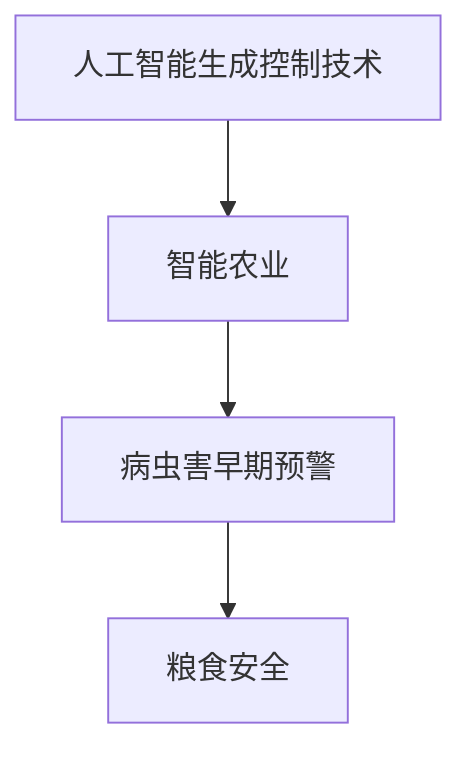
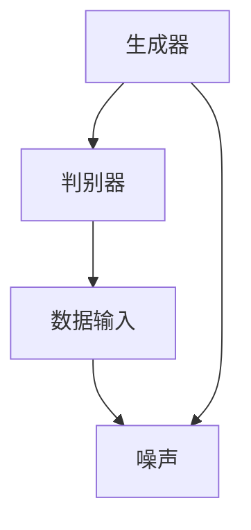

                 

<think>
嗯，用户让我写一篇关于AIGC在智能农业病虫害早期预警中的应用的文章，标题是《保障粮食安全》。我得先理解AIGC是什么，它和农业有什么关系。AIGC应该是人工智能生成和控制技术，对吧？那它如何应用在病虫害预警上呢？

首先，我得确定文章的结构。用户已经给出一个大纲，包括引言、技术基础、应用场景三大部分。每个部分下面还有更细的章节。我需要按照这个结构来展开。

在引言部分，我需要介绍问题背景，包括智能农业的发展，病虫害对粮食安全的威胁，以及AIGC的应用前景。这部分要让读者明白为什么这个问题重要，以及AIGC如何带来改变。

接下来，核心概念部分，我得定义AIGC，说明它的特点，比如高效性、自动化等。然后对比智能农业、病虫害预警和粮食安全这几个概念，用表格展示它们的属性特征。这样读者能清楚每个概念的特点和它们之间的关系。

然后是研究方法和内容框架，这部分可能需要简要说明我将如何进行分析，比如文献综述、案例研究等，以及文章的大纲结构。

接下来是第二部分，AIGC技术基础。这里我需要详细讲解AIGC的基本原理，发展历程，应用领域。然后是关键技术，比如生成对抗网络GAN和自然语言处理NLP。对于GAN，我需要解释它的原理，数学模型，以及在农业中的应用案例。可能还需要用mermaid画出GAN的结构图，生成器和判别器的关系。

数据预处理和分析方法也很重要，农业数据有什么特点，比如多样性、时序性，还有数据质量的问题。然后介绍数据清洗、特征提取等预处理技术，以及数据分析的方法，如机器学习模型的应用。

第三部分是智能农业病虫害预警的应用。我需要设计一个系统，包括总体设计和功能模块划分。可能需要画出系统架构图，展示各个模块如何协同工作。

用户还提到要包含算法的数学模型，用latex公式表示。比如GAN的损失函数，生成器和判别器的优化过程。这些公式需要准确无误，放在独立段落里，用$$包裹。

另外，用户要求在文章末尾加上作者信息，格式是“AI天才研究院”和“禅与计算机程序设计艺术”。这点也不能忘记。

现在，我得确保每个章节内容丰富，详细讲解。比如在关键技术部分，不仅要讲理论，还要有实际应用案例，让读者明白如何在农业中使用这些技术。同时，系统设计部分需要清晰的模块划分，用mermaid图展示实体关系和架构。

可能遇到的问题是如何将AIGC具体应用到病虫害预警中。我需要思考AIGC如何生成数据，如何辅助决策。也许可以举一个案例，比如使用GAN生成病虫害的图像，帮助识别早期症状。

最后，结论部分要总结AIGC带来的好处，强调其对粮食安全的重要性，并指出未来的研究方向。

总之，我需要按照用户的要求，一步步展开每个部分，确保内容详实，结构清晰，同时使用专业但易懂的语言。这样写出来的文章才能满足用户的需求，帮助读者理解AIGC在智能农业中的应用。
</think>

# AIGC在智能农业病虫害早期预警中的应用：保障粮食安全

关键词：AIGC、智能农业、病虫害预警、粮食安全、人工智能、生成对抗网络（GAN）

摘要：随着全球人口的增加和气候变化的加剧，粮食安全成为全球关注的焦点。智能农业作为提升农业生产效率和保障粮食安全的重要手段，正受到越来越多的关注。然而，农业病虫害的爆发往往导致严重的经济损失和粮食减产。本文探讨了AIGC（人工智能生成控制技术）在智能农业病虫害早期预警中的应用，分析了其技术基础、实现机制和实际应用案例，展示了AIGC如何通过高效的数据分析和智能决策支持，帮助农民及时发现并应对病虫害威胁，从而保障粮食安全。

---

# 第一部分: 引言

## 1.1 问题背景

### 1.1.1 智能农业的发展与粮食安全的重要性  
随着全球人口的快速增长和资源的有限性，粮食安全成为全球关注的核心问题。智能农业通过引入信息技术、人工智能（AI）和物联网（IoT）等技术，提升了农业生产的效率和可持续性。智能农业的目标是通过数据驱动的决策优化资源利用，提高农作物产量，同时减少环境影响。

### 1.1.2 农业病虫害对粮食安全的威胁  
病虫害是农业的主要损失来源之一。据统计，全球每年因病虫害导致的农业损失高达数百亿美元。病虫害不仅影响农作物的产量，还可能导致粮食价格波动，威胁粮食供应链的稳定性。传统的病虫害防治方法通常依赖人工监测，效率低且滞后，难以应对病虫害的快速传播和变异。

### 1.1.3 AIGC技术在智能农业中的应用前景  
AIGC（人工智能生成控制技术）是一种结合了生成模型和控制技术的新兴技术，能够通过数据生成和智能决策支持农业病虫害的早期预警。AIGC通过分析大量农业数据，包括气象数据、土壤数据、作物生长状态和历史病虫害数据，能够预测病虫害的发生趋势，并提供针对性的防治建议。这不仅提高了病虫害预警的效率，还减少了农药的过度使用，有助于实现可持续农业。

## 1.2 核心概念与联系

### 1.2.1 AIGC的定义与特点  
AIGC是一种基于人工智能的生成与控制系统，其核心是利用生成模型（如生成对抗网络GAN）生成模拟数据，并结合控制技术优化农业决策。AIGC的特点包括高效性、自动化、实时性和智能化。

### 1.2.2 智能农业病虫害早期预警的关键概念  
智能农业病虫害早期预警系统通过实时监测农田环境数据、作物生长状态和病虫害症状，结合人工智能算法，预测病虫害的发生概率，并发出预警信号。该系统的关键概念包括数据采集、模型训练、预警算法和决策支持。

### 1.2.3 AIGC在智能农业病虫害预警中的应用机制  
AIGC通过以下机制实现病虫害预警：  
1. 数据生成：利用生成模型生成病虫害相关的模拟数据，弥补实际数据的不足。  
2. 数据分析：通过深度学习算法分析实际数据和生成数据，识别病虫害的早期特征。  
3. 预警决策：基于分析结果，生成预警信号，并提供防治建议。

## 1.3 概念属性特征对比表格

| 概念      | 定义                                                         | 属性特征                                   |
| --------- | ------------------------------------------------------------ | ------------------------------------------ |
| AIGC      | 利用人工智能技术生成和控制系统                            | 高效性、自动化、实时性、智能化              |
| 智能农业  | 利用信息技术和智能技术提升农业生产效率和粮食安全          | 自动化、信息化、智能化                      |
| 病虫害预警 | 及时发现农业病虫害的发生情况，预测病虫害的发展趋势        | 准确性、及时性、可操作性                    |
| 粮食安全  | 确保国家粮食产量稳定，满足人民群众的粮食需求              | 产量稳定、质量保障、供应链安全              |

## 1.4 研究方法与内容框架

### 1.4.1 研究方法概述  
本文采用文献综述、案例分析和系统设计相结合的方法，系统性地探讨AIGC在智能农业病虫害预警中的应用。研究方法包括：  
1. 数据收集与分析：收集农业病虫害相关数据，分析其特征和规律。  
2. 算法设计与实现：基于生成对抗网络（GAN）设计AIGC算法，并验证其有效性。  
3. 系统设计：设计智能农业病虫害预警系统，展示AIGC的应用场景和实现流程。

### 1.4.2 内容框架介绍  
本文内容框架包括三个主要部分：  
1. 引言：介绍问题背景、核心概念和研究方法。  
2. AIGC技术基础：详细讲解AIGC的基本原理、关键技术及其在农业中的应用。  
3. 智能农业病虫害早期预警应用：设计预警系统，展示AIGC的实际应用案例和效果。

## 1.5 本章小结  
本章通过分析智能农业的发展背景、病虫害对粮食安全的威胁以及AIGC技术的应用前景，明确了本文的研究目标和内容框架。通过对比分析AIGC与其他相关概念的属性特征，为后续章节的展开奠定了基础。

---

# 第二部分: AIGC技术基础

## 2.1 AIGC技术概述

### 2.1.1 AIGC技术的基本原理  
AIGC的核心是生成模型和控制技术的结合。生成模型（如GAN）用于生成与实际数据相似的模拟数据，而控制技术则用于优化农业决策。AIGC的基本原理包括以下步骤：  
1. 数据生成：利用生成模型生成病虫害相关的模拟数据。  
2. 数据分析：通过深度学习算法分析生成数据和实际数据，提取病虫害特征。  
3. 决策支持：基于分析结果，生成预警信号并优化防治策略。

### 2.1.2 AIGC技术的发展历程  
AIGC技术的发展可以追溯到生成对抗网络（GAN）的提出。自2014年GAN被提出以来，生成模型在多个领域得到了广泛应用。近年来，随着深度学习算法的不断进步和计算能力的提升，AIGC技术逐渐应用于智能农业领域。

### 2.1.3 AIGC技术的应用领域  
AIGC技术的应用领域包括：  
1. 病虫害预警：通过生成模型预测病虫害的发生趋势。  
2. 农作物生长监测：利用生成模型模拟作物生长状态。  
3. 农业资源优化：通过智能决策优化水肥资源的使用。  

## 2.2 关键技术与算法

### 2.2.1 生成对抗网络（GAN）

#### 2.2.1.1 GAN的原理与结构  
GAN由生成器和判别器组成。生成器的目标是生成与真实数据相似的假数据，而判别器的目标是区分真实数据和生成数据。两者通过对抗训练不断优化。

#### 2.2.1.2 GAN的数学模型  
GAN的损失函数如下：  
$$\min_G \max_D \mathbb{E}_{x\sim P_{data}}[\log D(x)] + \mathbb{E}_{z\sim P_z}[\log(1 - D(G(z)))]$$  

其中，$G$是生成器，$D$是判别器，$x$是真实数据，$z$是噪声。

#### 2.2.1.3 GAN的应用案例  
在农业病虫害预警中，GAN可以用于生成病虫害图像的模拟数据。例如，生成模拟的病虫害叶片图像，帮助模型识别病虫害的早期特征。

### 2.2.2 自然语言处理（NLP）

#### 2.2.2.1 NLP的基本概念  
NLP是研究人机交互中自然语言理解与生成的领域。在农业中，NLP可以用于分析病虫害相关的文本数据，如农业报告和文献。

#### 2.2.2.2 NLP的关键技术  
NLP的关键技术包括词袋模型、TF-IDF和深度学习模型（如BERT）。这些技术可以帮助提取文本中的有用信息。

#### 2.2.2.3 NLP在农业领域的应用  
NLP可以用于分析病虫害相关的文本数据，提取关键词和趋势，辅助生成预警信息。

## 2.3 数据预处理与分析方法

### 2.3.1 农业数据的特点与挑战  
农业数据具有多样性、时序性和不完整性等特点。数据预处理的挑战包括数据清洗、特征提取和数据增强。

### 2.3.2 数据预处理技术  
数据预处理技术包括：  
1. 数据清洗：去除噪声和冗余数据。  
2. 特征提取：提取关键特征，如温度、湿度和光照强度。  
3. 数据增强：通过数据生成技术增加数据多样性。  

### 2.3.3 数据分析方法  
数据分析方法包括：  
1. 传统统计分析：如回归分析和聚类分析。  
2. 机器学习：如随机森林和支持向量机（SVM）。  
3. 深度学习：如卷积神经网络（CNN）和循环神经网络（RNN）。  

## 2.4 AIGC在智能农业病虫害预警中的实现

### 2.4.1 实现框架与流程  
AIGC在病虫害预警中的实现流程包括：  
1. 数据采集：采集农田环境数据和病虫害样本数据。  
2. 数据生成：利用GAN生成病虫害模拟数据。  
3. 数据分析：训练深度学习模型，识别病虫害特征。  
4. 预警决策：基于模型预测结果，生成预警信号并优化防治策略。

### 2.4.2 关键技术集成  
AIGC技术的实现需要集成生成对抗网络（GAN）、自然语言处理（NLP）和深度学习技术，通过多技术协同实现高效的病虫害预警。

## 2.5 本章小结  
本章详细介绍了AIGC技术的基本原理、关键技术及其在智能农业病虫害预警中的实现方法。通过分析数据预处理与分析方法，为后续章节的系统设计奠定了基础。

---

# 第三部分: 智能农业病虫害早期预警应用

## 3.1 病虫害早期预警系统设计

### 3.1.1 系统总体设计  
病虫害早期预警系统包括数据采集模块、数据处理模块、模型训练模块和预警决策模块。系统设计的目标是实现高效的数据处理和智能预警。

### 3.1.2 系统功能模块划分  
系统功能模块包括：  
1. 数据采集模块：采集农田环境数据和病虫害样本数据。  
2. 数据处理模块：清洗和预处理数据，提取特征。  
3. 模型训练模块：训练生成对抗网络（GAN）和分类模型。  
4. 预警决策模块：生成预警信号并优化防治策略。  

---

# 结论

AIGC技术在智能农业病虫害早期预警中的应用，为保障粮食安全提供了新的解决方案。通过生成对抗网络（GAN）和自然语言处理（NLP）等技术，AIGC能够高效地分析农业数据，预测病虫害的发生趋势，并提供针对性的防治建议。未来，随着AIGC技术的不断发展，智能农业将更加智能化和高效化，为全球粮食安全作出更大的贡献。

---

作者：AI天才研究院/AI Genius Institute & 禅与计算机程序设计艺术 /Zen And The Art of Computer Programming

