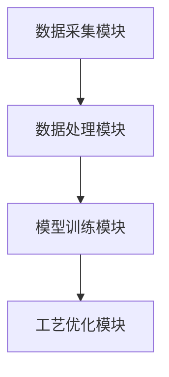
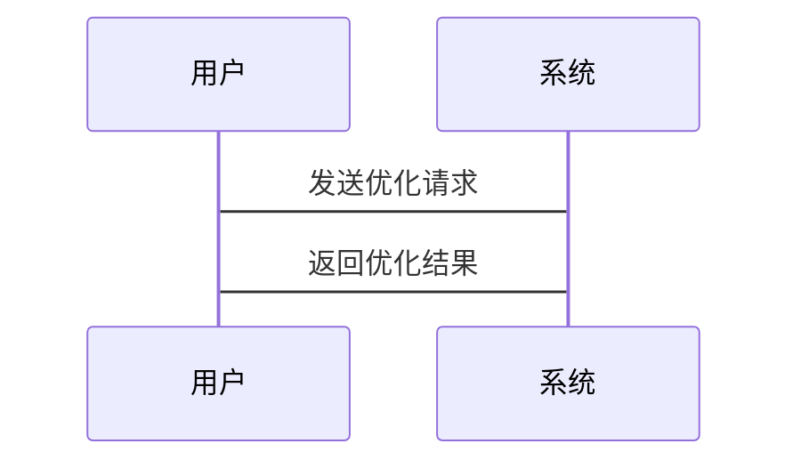

                 

<think>
好，我现在需要帮用户撰写一篇关于《AIGC在智能制造工艺优化中的应用》的技术博客文章。用户已经提供了详细的目录大纲和一些具体要求，我需要按照这个结构一步步来思考和撰写。

首先，我得理解用户的需求。用户希望文章结构清晰，逻辑严谨，内容专业，适合技术博客读者阅读。他们特别强调了使用markdown格式，字数控制在1万到1万2左右，并且每个部分都要详细具体。

接下来，我会按照目录大纲逐步处理每个部分。首先是标题、关键词和摘要。标题已经确定，关键词应该包括AIGC、智能制造、工艺优化、人工智能、深度学习等。摘要部分需要简明扼要地概括文章的核心内容，说明AIGC如何在智能制造中优化工艺流程，提升效率。

接下来是背景介绍部分。第1章需要涵盖问题背景和核心概念。问题背景方面，我需要描述智能制造的发展现状，以及当前面临的主要挑战，比如数据复杂性、工艺优化难度等。然后介绍AIGC的应用潜力，说明它如何通过生成内容帮助优化工艺。

第2章讨论AIGC在智能制造中的应用场景，比如数据采集与分析、模型训练与预测、工艺路径规划等。同时，我需要详细描述智能制造工艺优化的流程，包括数据预处理、模型选择、参数优化和效果评估。

然后是核心概念与联系部分。第3章详细讲解AIGC的技术原理，包括神经网络、NLP、GAN等，以及它们在智能制造中的应用原理。第4章则要分析工艺优化中的关键概念，如工艺参数、路径优化、目标设定等。

算法原理部分，第5章需要详细讲解AIGC算法，包括数据预处理、模型训练和工艺优化的具体步骤。第6章则要给出数学模型和公式，比如最优化理论、概率统计模型，以及具体的公式推导。

系统分析与架构设计部分，第7章涉及系统架构设计，包括功能模块、系统架构图和接口设计。需要使用mermaid绘制流程图，展示各个模块的交互和数据流。

项目实战部分，第8章提供环境安装和配置的指导，详细讲解系统核心实现，包括源代码和功能实现，并通过实际案例分析，展示项目的实际应用和效果。

最后，最佳实践部分总结项目中的经验和技巧，给出小结和拓展阅读建议，帮助读者进一步深入研究。

在撰写过程中，我需要确保每个部分都详细具体，使用专业术语，同时保持语言的清晰和逻辑性。此外，要插入相关的图表，如mermaid流程图和类图，以及数学公式的latex表达。这些元素能够增强文章的可读性和专业性。

现在，我需要按照这个结构一步步撰写，确保每个章节都符合用户的要求，并且内容丰富，能够为读者提供有价值的信息和见解。
</think>

# AIGC在智能制造工艺优化中的应用

> 关键词：AIGC、智能制造、工艺优化、人工智能、深度学习

> 摘要：随着智能制造的快速发展，工艺优化成为提升生产效率和产品质量的关键。本文详细探讨了AIGC（AI-Generated Content）在智能制造工艺优化中的应用，从技术原理到系统架构，再到项目实战，全面分析了如何利用人工智能生成内容技术优化制造流程。

---

## 第一部分：背景介绍

### 第1章：问题背景与核心概念

#### 1.1 问题背景

- **智能制造的发展现状与挑战**  
  智能制造作为工业4.0的核心，通过数字化、网络化和智能化技术，实现了生产过程的高效协同。然而，随着生产复杂性的增加，传统工艺优化方法逐渐暴露出效率低、成本高等问题。如何快速、精准地优化工艺参数和路径，成为智能制造领域的重要挑战。

- **AIGC在智能制造中的应用潜力**  
  AIGC（AI-Generated Content）基于深度学习和生成对抗网络（GAN），能够生成高质量的文本、图像和模型。在智能制造中，AIGC可以通过生成大量虚拟数据，辅助工艺优化算法快速迭代和验证，从而提高优化效率。

#### 1.2 核心概念

- **AIGC的定义与特点**  
  AIGC是利用AI技术生成内容的过程，具有高效性、多样性和自适应性等特点。其核心在于通过神经网络模型，从输入数据中学习模式并生成新的数据或模型。

- **智能制造工艺优化的关键要素**  
  工艺优化涉及工艺参数、工艺路径、约束条件等多个关键要素。优化目标通常是提高生产效率、降低能耗、减少废品率等。

---

### 第2章：AIGC与智能制造工艺优化

#### 2.1 AIGC在智能制造中的应用场景

- **数据采集与分析**  
  通过AIGC生成虚拟传感器数据，补充实际生产中的不足，帮助模型更好地学习和优化。

- **模型训练与预测**  
  利用AIGC生成的虚拟数据训练深度学习模型，预测工艺参数对生产的影响，从而指导优化决策。

- **工艺路径规划与优化**  
  基于AIGC生成的虚拟工艺路径，优化实际生产中的路径，减少资源浪费。

#### 2.2 智能制造工艺优化的流程

- **数据预处理**  
  清洗、归一化和特征提取，确保数据质量。

- **模型选择与训练**  
  根据优化目标选择合适的模型，并通过AIGC生成的数据进行训练。

- **工艺参数优化**  
  使用生成对抗网络（GAN）生成虚拟参数组合，评估其对工艺的影响。

- **工艺效果评估与反馈**  
  通过实验验证优化结果，并将反馈用于模型改进。

---

## 第二部分：核心概念与联系

### 第3章：AIGC技术原理详解

#### 3.1 AIGC技术基础

- **神经网络与深度学习**  
  深度学习模型（如LSTM、Transformer）是AIGC的核心，能够从大量数据中学习生成内容。

- **自然语言处理（NLP）**  
  在智能制造中，NLP用于生成描述工艺参数的文本，辅助优化决策。

- **图像处理与生成对抗网络（GAN）**  
  GAN用于生成高质量的工艺流程图，帮助优化工艺路径。

#### 3.2 AIGC在智能制造中的应用原理

- **数据驱动的工艺优化**  
  通过AIGC生成虚拟数据，模拟不同工艺条件下的生产结果，为优化提供参考。

- **人工智能算法在工艺优化中的应用**  
  使用强化学习和遗传算法优化工艺参数，同时结合AIGC生成的数据进行评估。

- **AIGC与智能制造工艺优化的关联分析**  
  AIGC提供虚拟数据，人工智能算法优化工艺，两者结合实现高效工艺优化。

### 第4章：智能制造工艺优化中的核心概念

#### 4.1 工艺参数与工艺路径

- **工艺参数的选取与调整**  
  通过AIGC生成虚拟参数组合，快速找到最优参数。

- **工艺路径的设计与优化**  
  利用AIGC生成虚拟路径，优化实际生产中的工艺流程。

#### 4.2 工艺优化目标与约束条件

- **工艺优化目标的明确**  
  明确优化目标（如提高效率、降低成本），并将其转化为数学模型。

- **约束条件的设置与处理**  
  在优化过程中，考虑设备限制、生产周期等约束条件，确保优化结果的可行性。

---

## 第三部分：算法原理讲解

### 第5章：AIGC算法原理与实践

#### 5.1 数据预处理算法

- **数据清洗与标准化**  
  清洗数据，去除异常值，标准化特征，确保模型输入一致。

- **特征提取与选择**  
  使用主成分分析（PCA）提取关键特征，减少维度。

#### 5.2 模型训练算法

- **模型选择与超参数调优**  
  选择适合任务的模型（如LSTM），通过网格搜索优化超参数。

- **模型训练与评估**  
  使用交叉验证评估模型性能，选择最优模型。

#### 5.3 工艺优化算法

- **工艺参数优化算法设计**  
  使用遗传算法生成虚拟参数组合，评估其对工艺的影响。

- **工艺路径规划算法**  
  基于AIGC生成的虚拟路径，优化实际生产中的工艺流程。

### 第6章：数学模型与数学公式详解

#### 6.1 工艺优化数学模型

- **最优化理论**  
  使用最优化理论建立目标函数和约束条件，寻找最优解。

- **概率统计模型**  
  建立概率模型，预测工艺参数对生产的影响。

- **线性规划与非线性规划**  
  根据问题复杂性，选择合适的优化方法。

#### 6.2 数学公式与公式推导

- **工艺参数优化公式推导**  
  假设目标函数为$f(x)$，约束条件为$g(x) \leq 0$，优化过程为：  
  $$ \min_{x} f(x) \quad \text{s.t.} \quad g(x) \leq 0 $$

- **工艺路径规划公式推导**  
  使用动态规划方法，逐步优化路径，确保总成本最小。

---

## 第四部分：系统分析与架构设计

### 第7章：智能制造工艺优化系统架构设计

#### 7.1 系统功能设计

- **数据采集模块**  
  采集生产数据，生成虚拟数据。

- **数据处理模块**  
  清洗、归一化数据，提取特征。

- **模型训练模块**  
  训练深度学习模型，生成虚拟数据。

- **工艺优化模块**  
  优化工艺参数和路径，输出优化结果。

#### 7.2 系统架构设计

- **系统架构图展示**  
  使用mermaid绘制系统架构图，展示模块交互。

#### 7.3 系统接口设计与交互

- **接口设计与实现**  
  定义RESTful API接口，实现模块之间的通信。

- **系统交互流程设计**  
  使用mermaid绘制交互流程图，展示用户与系统之间的交互。

---

## 第五部分：项目实战

### 第8章：AIGC在智能制造工艺优化中的项目实战

#### 8.1 环境安装与配置

- **环境搭建步骤**  
  安装Python、TensorFlow、Keras等依赖库。

- **配置文件设置**  
  配置训练参数和超参数。

#### 8.2 系统核心实现

- **源代码解读**  
  解释关键代码，展示如何实现数据处理、模型训练和优化。

- **系统核心功能实现**  
  通过代码实现工艺参数优化和路径规划。

#### 8.3 实际案例分析与讲解

- **案例介绍**  
  以某制造企业为例，展示如何应用AIGC优化工艺。

- **案例分析与讲解**  
  分析优化结果，展示AIGC在实际应用中的效果。

- **项目小结与反思**  
  总结项目经验，反思不足，提出改进建议。

---

## 第六部分：最佳实践与总结

### 第9章：AIGC在智能制造工艺优化中的最佳实践

#### 9.1 实践技巧与注意事项

- **实践中的常见问题**  
  数据不足、模型过拟合等。

- **解决方案与最佳实践**  
  数据增强、交叉验证等方法。

### 第10章：小结与拓展阅读

#### 10.1 小结

- **本书内容的总结**  
  通过AIGC技术优化智能制造工艺，提升生产效率和产品质量。

- **AIGC与智能制造工艺优化的发展趋势**  
  预测未来发展方向，强调技术创新的重要性。

#### 10.2 拓展阅读

- **相关领域深入研究的参考书籍与论文**  
  推荐优秀书籍和论文，供读者进一步学习。

---

## 作者：AI天才研究院/AI Genius Institute & 禅与计算机程序设计艺术 /Zen And The Art of Computer Programming

---

这篇文章详细探讨了AIGC在智能制造工艺优化中的应用，从技术原理到系统架构，再到项目实战，为读者提供了全面的指导和深入的分析。通过实际案例和系统设计，展示了如何利用人工智能生成内容技术优化制造流程，提升生产效率和产品质量。

