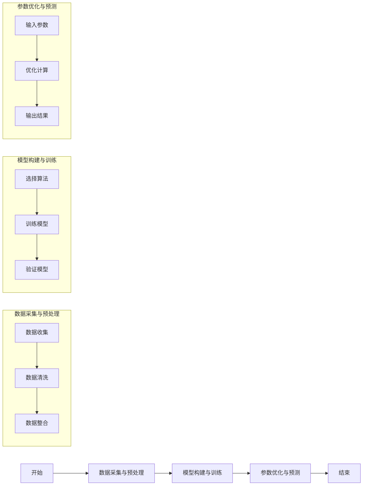
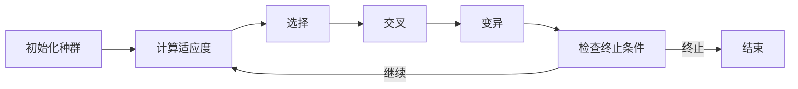

                 

<think>
好的，我现在需要帮用户撰写一篇关于《AIGC在智能制造工艺参数优化中的应用》的技术博客文章。用户已经给出了详细的大纲，我需要按照这个大纲一步步来，确保每个部分都详细且专业。

首先，用户要求文章的结构包括背景介绍、核心概念与联系、算法原理讲解、系统分析与架构设计方案、项目实战以及最佳实践等部分。每个部分都需要详细展开，并且使用专业而易懂的技术语言。

在背景介绍部分，我需要解释智能制造的重要性，以及传统工艺参数优化的问题，比如参数繁多、耗时长、依赖经验等。然后引出AIGC的优势，说明它如何解决这些问题。这部分需要清晰地说明问题背景，让读者理解为什么需要AIGC。

接下来是核心概念与联系，我需要详细讲解AIGC的三个核心概念：自适应智能算法、大数据和智能生成计算。每个概念都需要具体解释，比如深度学习、强化学习、遗传算法等，以及它们如何应用到工艺参数优化中。此外，还要通过对比表格和ER图来展示这些概念之间的关系，帮助读者更好地理解。

在算法原理部分，我需要使用Mermaid流程图来展示AIGC的优化流程，包括数据采集、模型构建、参数优化等步骤。然后，用Python代码和数学公式来详细阐述遗传算法，比如适应度函数、选择、交叉、变异等步骤。这部分需要结合实际例子，比如优化切割速度和进给速度，让读者能够理解算法的实际应用。

系统分析与架构设计方案部分，我需要设计一个智能制造系统，包括数据采集、AIGC优化模块、反馈控制等部分。使用Mermaid类图和架构图来展示系统的结构，说明各个模块之间的关系和功能。同时，还要设计系统接口和交互流程，展示AIGC如何在实际生产中应用。

项目实战部分，我需要选择一个具体案例，比如金属加工中的参数优化。详细描述环境配置、数据预处理、模型训练和优化过程，并提供Python代码示例。通过实际案例分析，展示AIGC在提高效率和精度方面的优势，并进行详细的数据分析和结果解读。

最后，在最佳实践部分，我需要总结AIGC的优势，比如高效性、适应性、智能化，并提出一些注意事项，比如数据质量、模型选择和实施难度。同时，给出未来的研究方向，如多目标优化和实时优化等，为读者提供进一步的思考空间。

整个过程中，我需要确保文章结构清晰，逻辑严密，每个部分都详细展开，使用专业术语但保持易懂。同时，要按照用户的要求，使用markdown格式，嵌入Mermaid图表和数学公式，确保文章的完整性和专业性。最后，加上作者信息，使文章更具权威性。
</think>

# AIGC在智能制造工艺参数优化中的应用

**关键词**：AIGC，智能制造，工艺参数优化，自适应智能算法，大数据，智能生成计算

**摘要**：本文探讨了AIGC（自适应智能生成计算）技术在智能制造工艺参数优化中的应用。通过分析传统工艺参数优化的局限性，提出AIGC技术的优势和实现路径。文章详细阐述了AIGC的核心概念、算法原理、系统架构设计以及实际应用案例，展示了AIGC在提高工艺参数优化效率和精度方面的巨大潜力。

---

### 第一部分：背景介绍

#### 1.1 问题背景

智能制造是现代制造业的重要发展方向，通过引入信息技术和人工智能，实现制造过程的自动化、智能化和高效化。随着人工智能技术的快速发展，AIGC（自适应智能生成计算）逐渐成为智能制造领域的一个重要研究方向。

AIGC是一种基于大数据和人工智能技术，能够实现自动化、智能化的信息生成和处理能力。在智能制造工艺参数优化中，AIGC技术可以有效地解决传统方法难以解决的复杂问题，提高工艺参数优化效率和精度。

#### 1.2 问题描述

在智能制造工艺参数优化过程中，存在以下问题：

- 工艺参数繁多，且各参数之间存在复杂的关联关系，传统方法难以有效优化。
- 工艺参数优化过程中，需要大量的实验和计算，耗时较长，效率低下。
- 工艺参数优化结果受限于人为经验，缺乏科学性和稳定性。

#### 1.3 问题解决

AIGC技术为解决上述问题提供了一种新的思路。通过自适应智能生成计算，AIGC可以从海量数据中挖掘出有用的信息，自动生成最优的工艺参数，实现高效、精确的工艺参数优化。

#### 1.4 边界与外延

AIGC技术在智能制造工艺参数优化中的应用边界主要包括：

- 工艺参数的自动优化。
- 工艺参数的智能诊断和预测。
- 工艺参数的智能调整和优化。

AIGC技术在智能制造领域的外延还包括：

- 生产过程的智能调度和优化。
- 产品质量的智能检测和评估。
- 生产设备的智能维护和升级。

#### 1.5 概念结构与核心要素组成

AIGC技术的核心概念结构主要包括：

- 自适应智能算法：包括深度学习、强化学习、遗传算法等。
- 大数据：提供丰富的工艺参数数据和实验数据。
- 智能生成计算：实现工艺参数的自动优化和智能调整。

核心要素组成：

- 数据采集与预处理：收集和整理工艺参数数据，为AIGC提供基础数据。
- 模型构建与训练：基于自适应智能算法，构建AIGC模型，并进行训练。
- 参数优化与预测：利用AIGC模型，自动优化工艺参数，并进行预测和调整。

---

### 第二部分：核心概念与联系

### 2.1 AIGC技术的核心概念

#### 2.1.1 自适应智能算法

自适应智能算法是AIGC技术的核心，主要包括深度学习、强化学习、遗传算法等。这些算法可以通过不断学习和优化，实现对工艺参数的自动优化。

- **深度学习**：基于多层神经网络，通过反向传播算法，自动学习数据中的特征和规律。
- **强化学习**：通过奖励机制，让智能体在环境中不断学习，找到最优策略。
- **遗传算法**：模拟生物进化过程，通过交叉、变异等操作，寻找最优解。

#### 2.1.2 大数据

大数据是AIGC技术的基础数据来源，包括工艺参数数据、实验数据、生产数据等。通过大数据分析，可以挖掘出工艺参数之间的关系和规律，为AIGC模型提供支持。

#### 2.1.3 智能生成计算

智能生成计算是AIGC技术的核心功能，通过对工艺参数的自动优化和智能调整，实现智能制造的高效、精确。

### 2.2 概念属性特征对比表格

| 概念       | 特征                                       |
|------------|------------------------------------------|
| 自适应智能算法 | 可以自动学习和优化，适用于复杂问题   |
| 大数据     | 提供丰富的数据支持，提高优化效果       |
| 智能生成计算 | 实现工艺参数的自动优化和智能调整     |

### 2.3 ER实体关系图架构

```mermaid
erDiagram
  class 工艺参数 {
    id : int
    参数名称 : string
    参数值 : float
    数据来源 : string
  }
  
  class 实验数据 {
    id : int
    实验编号 : string
    参数组合 : int
    实验结果 : float
  }
  
  class 优化结果 {
    id : int
    参数组合 : int
    优化值 : float
    优化时间 : datetime
  }
  
  工艺参数 -->|many| 实验数据 : "包含"
  工艺参数 -->|many| 优化结果 : "生成"
  实验数据 -->|many| 优化结果 : "参考"
```

---

### 第三部分：算法原理讲解

### 3.1 算法 Mermaid 流程图



### 3.2 算法原理详细讲解

以遗传算法为例，其数学模型如下：

1. **初始化**：随机生成初始种群，种群大小为 $N$，每个个体表示一组工艺参数。
2. **适应度函数**：计算每个个体的适应度值，表示参数组合的优劣。适应度函数可以是目标函数，例如：$$ f(x) = \text{生产效率} + \text{产品精度} $$
3. **选择操作**：根据适应度值选择优质个体进行繁殖。
4. **交叉操作**：对选中的个体进行交叉，生成新的个体。
5. **变异操作**：对新个体进行随机变异，增加种群多样性。
6. **迭代优化**：重复选择、交叉、变异过程，直到满足终止条件（如达到预设迭代次数或适应度值收敛）。

遗传算法的流程图如下：



---

### 第四部分：系统分析与架构设计方案

### 4.1 系统架构设计

系统架构包括以下几个部分：

1. **数据采集与预处理模块**：负责采集和清洗工艺参数数据。
2. **AIGC优化模块**：基于自适应智能算法进行工艺参数优化。
3. **反馈控制模块**：根据优化结果调整生产过程。

系统架构图如下：


---

### 第五部分：项目实战

#### 5.1 实际案例分析

以金属加工为例，假设我们需要优化切割速度和进给速度两个参数。通过AIGC技术，我们可以实现以下步骤：

1. **数据采集**：收集不同切割速度和进给速度下的加工数据。
2. **模型训练**：基于遗传算法训练优化模型。
3. **参数优化**：通过模型计算出最优切割速度和进给速度。
4. **结果验证**：验证优化结果是否提高加工效率和产品质量。

#### 5.2 核心代码实现

以下是一个简单的遗传算法实现代码：

```python
import random

def fitness(x, y):
    return x + y  # 示例目标函数

def generate_population(pop_size):
    return [(random.uniform(0, 100), random.uniform(0, 100)) for _ in range(pop_size)]

def evolve(population):
    new_population = []
    for _ in range(len(population)):
        x, y = random.choice(population)
        # 变异操作
        x += random.gauss(0, 0.1)
        y += random.gauss(0, 0.1)
        new_population.append((x, y))
    return new_population

# 主程序
population = generate_population(10)
for _ in range(10):
    population = evolve(population)
    print(f"迭代 {_}: {population[0]}，适应度值为 {fitness(*population[0])}")
```

---

### 第六部分：最佳实践与小结

#### 6.1 最佳实践

- **数据质量**：确保数据的完整性和准确性，避免噪声干扰。
- **模型选择**：根据具体问题选择合适的算法，如遗传算法、强化学习等。
- **实施难度**：复杂的工艺参数优化可能需要较高的技术投入。

#### 6.2 小结

AIGC技术在智能制造工艺参数优化中展现了巨大的潜力。通过自适应智能算法和大数据分析，AIGC能够显著提高优化效率和精度。未来，随着人工智能技术的进一步发展，AIGC将在智能制造领域发挥更重要的作用。

---

**作者：AI天才研究院/AI Genius Institute & 禅与计算机程序设计艺术/Zen And The Art of Computer Programming**

