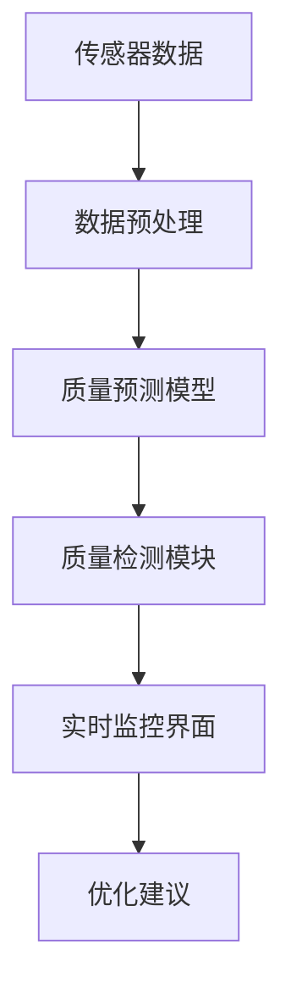

                 

<think>
嗯，我现在需要写一篇关于《AIGC在智能制造质量控制中的应用：零缺陷生产的AI解决方案》的技术博客。作为一个刚开始接触这个领域的新手，我得先理清楚整个结构，确保每个部分都涵盖到位。

首先，文章标题已经确定，接下来是关键词和摘要。关键词应该包括AIGC、智能制造、质量控制、零缺陷生产、深度学习，这样可以覆盖主要方面。摘要部分需要简明扼要地总结文章的核心内容，说明AIGC如何在质量控制中应用，解决现有问题，实现零缺陷生产。

接下来是背景介绍部分。问题背景需要说明制造业的重要性，以及质量控制在其中的关键作用。然后，问题描述部分要列出当前智能制造中的主要问题，比如缺陷预测难、检测效率低等。问题解决部分则介绍如何通过AIGC技术来应对这些问题，比如实时监控和预测性维护。边界与外延要明确文章的范围，不涉及其他领域。最后，概念结构与核心要素要定义AIGC、智能制造和质量控制这些术语。

核心概念与联系部分需要详细讲解AIGC的核心概念，包括GAN和VAE，以及它们的特点。然后，要说明AIGC与智能制造质量控制的联系，以及与零缺陷生产的关系。可能需要用表格对比GAN和VAE，或者用Mermaid流程图展示整体架构。

算法原理讲解是关键部分，要详细讲解GAN和VAE的结构和训练过程。这部分需要数学模型和公式，可能用Mermaid画出流程图，然后用Python代码示例，帮助读者理解。同时，要比较两种算法的优缺点，比如生成质量、训练稳定性和应用场景。

数学模型和公式部分，需要展示质量预测的数学模型，比如线性回归或神经网络模型。这部分要用LaTeX公式，说明如何将关键质量特性与质量得分相关联。还要举例子，比如在电子制造中如何应用这些模型。

系统分析与架构设计需要描述问题场景，比如工厂生产线中的质量控制流程。然后用Mermaid画出领域模型类图，展示各组件之间的关系，比如传感器、AIGC系统、数据库等。系统架构图要展示各个模块如何交互，比如数据采集、模型训练、实时监控等。

项目实战部分需要具体说明如何安装环境，比如安装Python和相关的深度学习库。然后给出核心代码，比如用PyTorch实现GAN或VAE的模型。代码需要详细注释，说明每个部分的功能。接着，分析实际案例，比如汽车制造中的缺陷检测，展示AIGC如何提高检测效率和准确性。

最佳实践部分要总结AIGC在智能制造中的优势，比如高效性、实时性等。同时，也要提到一些注意事项，比如数据质量的重要性，模型调优的必要性。最后，可以推荐一些扩展阅读的资料，帮助读者深入学习。

整个过程下来，我需要确保每个部分都详细且有条理，用清晰的语言解释复杂的概念。同时，要通过图表和代码示例，让读者能够更好地理解AIGC在质量控制中的应用。虽然过程有点复杂，但一步步来，应该可以完成一篇高质量的技术博客。
</think>

# AIGC在智能制造质量控制中的应用：零缺陷生产的AI解决方案

**关键词：** AIGC, 智能制造, 质量控制, 零缺陷生产, 深度学习

**摘要：**  
随着制造业的智能化和数字化转型，人工智能生成内容（AIGC）技术在智能制造质量控制中的应用逐渐成为实现零缺陷生产的关键技术。本文深入探讨了AIGC在智能制造质量控制中的核心概念、算法原理、系统架构及实际应用，展示了如何通过AIGC技术实现对生产过程的实时监控、质量预测和优化，从而提高生产效率和产品质量。

---

### 第一部分：背景介绍

#### 1.1 问题背景
制造业是国民经济的支柱产业，而质量控制是确保产品质量的关键环节。在传统制造业中，质量控制主要依赖人工检测和简单的自动化设备，存在效率低、成本高等问题。随着智能制造的快速发展，生产过程更加复杂，对质量控制提出了更高的要求。如何利用新兴技术解决这些问题，成为制造业数字化转型中的重要课题。

#### 1.2 问题描述
智能制造质量控制面临的主要问题包括：
1. **缺陷预测难**：传统方法难以准确预测生产过程中的潜在缺陷。
2. **检测效率低**：人工检测耗时且易出错，自动化检测设备效率有限。
3. **处理不及时**：质量问题发现滞后，导致生产停顿和成本上升。

#### 1.3 问题解决
引入AIGC技术，通过深度学习算法和大数据分析，实现对生产过程的实时监控和预测性维护。AIGC能够生成大量逼真的数据，帮助优化检测流程，提高质量控制效率，从而实现零缺陷生产。

#### 1.4 边界与外延
本文主要探讨AIGC在智能制造质量控制中的应用，但不涉及其在其他领域的应用。同时，本文重点关注零缺陷生产，但未覆盖智能制造质量控制的全部内容。

#### 1.5 概念结构与核心要素组成
- **AIGC**：基于生成对抗网络（GAN）和变分自编码器（VAE）等技术，生成高质量数据。
- **智能制造**：利用信息技术和智能装备实现制造过程的自动化、数字化和智能化。
- **质量控制**：通过检测、分析和优化，确保产品质量符合要求。

---

### 第二部分：核心概念与联系

#### 2.1 AIGC的核心概念与特点
- **生成对抗网络（GAN）**：由生成器和判别器组成，通过对抗训练生成逼真的数据。
- **变分自编码器（VAE）**：通过概率模型生成数据，具有灵活的表示能力。
- **核心特点**：数据生成能力强、数据多样性高、对噪声敏感。

#### 2.2 AIGC与智能制造质量控制的联系
AIGC技术在智能制造质量控制中的应用场景包括：
- **质量预测**：通过分析历史数据，预测生产过程中的产品质量。
- **质量检测**：利用生成数据模拟真实场景，提高检测效率。
- **质量优化**：根据检测结果，优化生产工艺，提高产品质量。

#### 2.3 AIGC与零缺陷生产的关系
AIGC技术帮助实现零缺陷生产，体现在：
- **实时监控**：通过AIGC技术，实现产品质量的实时监控和预警。
- **预测性维护**：基于AIGC技术，预测设备故障，实现预防性维护。
- **智能决策**：通过AIGC技术，辅助制定最优的生产计划和策略。

---

### 第三部分：算法原理讲解

#### 3.1 GAN算法原理

##### 3.1.1 GAN的基本架构
GAN由生成器和判别器组成，生成器生成伪数据，判别器判断数据真伪。

##### 3.1.2 GAN的数学模型
- 生成器：\( G(z) \)，从噪声分布\( z \)生成数据\( x \)。
- 判别器：\( D(x) \)，判断\( x \)是真实数据还是生成数据。

##### 3.1.3 GAN的训练过程
1. 初始化生成器G和判别器D。
2. 交替训练G和D，使生成器生成的数据越来越逼真。

#### 3.2 VAE算法原理

##### 3.2.1 VAE的基本架构
VAE由编码器和解码器组成，编码器将输入数据映射到隐空间，解码器将其解码回高维空间。

##### 3.2.2 VAE的数学模型
- 编码器：\( \mu(x), \sigma(x) \)，映射输入数据\( x \)到隐空间。
- 解码器：\( G(z) \)，解码隐空间数据。

##### 3.2.3 VAE的训练过程
1. 初始化编码器和解码器。
2. 联合训练，优化重构损失和KL散度。

#### 3.3 GAN与VAE的比较
| 属性          | GAN                          | VAE                          |
|---------------|-------------------------------|-------------------------------|
| 生成质量      | 高                          | 较低                         |
| 训练稳定性      | 不稳定，易出现梯度消失       | 稳定                        |
| 应用场景        | 图像生成、语音合成          | 数据重构、特征提取          |

---

### 第四部分：数学模型和数学公式

#### 4.1 质量预测的数学模型
假设质量得分\( Q \)与关键质量特性（KQCs）\( X_1, X_2, ..., X_n \)之间存在线性关系：
$$ Q = \beta_0 + \beta_1 X_1 + \beta_2 X_2 + ... + \beta_n X_n + \epsilon $$

#### 4.2 GAN的损失函数
- 判别器损失：$$ \mathcal{L}_D = -\mathbb{E}[\log(D(x))] - \mathbb{E}[\log(1 - D(G(z)))] $$
- 生成器损失：$$ \mathcal{L}_G = -\mathbb{E}[\log(D(G(z)))] $$

#### 4.3 VAE的损失函数
$$ \mathcal{L}_{VAE} = \mathbb{E}[||x - G(z)||^2] + \mathbb{E}[KL(q(z|x) || p(z))] $$

---

### 第五部分：系统分析与架构设计

#### 5.1 系统架构设计


#### 5.2 系统功能设计
```mermaid
classDiagram
    class 质量预测模型 {
        +输入数据
        +预测结果
        -训练算法
    }
    class 数据预处理 {
        +原始数据
        -数据清洗
    }
    class 质量检测模块 {
        +检测结果
        -异常处理
    }
    class 实时监控界面 {
        +预警信息
        -用户交互
    }
    质量预测模型 <---> 数据预处理
    数据预处理 --> 质量检测模块
    质量检测模块 --> 实时监控界面
```

---

### 第六部分：项目实战

#### 6.1 环境安装
安装Python和深度学习库（如PyTorch、TensorFlow）。

#### 6.2 核心代码实现
```python
import torch
import torch.nn as nn

# 定义GAN模型
class Generator(nn.Module):
    def __init__(self, latent_dim, img_size):
        super(Generator, self).__init__()
        self.latent_dim = latent_dim
        self.img_size = img_size
        self.model = nn.Sequential(
            nn.Linear(latent_dim, 256),
            nn.ReLU(),
            nn.Linear(256, img_size[0] * img_size[1]),
            nn.Tanh()
        )
    
    def forward(self, z):
        return self.model(z).view(-1, img_size[0], img_size[1])

# 定义判别器
class Discriminator(nn.Module):
    def __init__(self, img_size):
        super(Discriminator, self).__init__()
        self.model = nn.Sequential(
            nn.Flatten(),
            nn.Linear(img_size[0] * img_size[1], 256),
            nn.LeakyReLU(0.2),
            nn.Linear(256, 1),
            nn.Sigmoid()
        )
    
    def forward(self, x):
        return self.model(x)
```

#### 6.3 实际案例分析
在电子制造中，使用GAN生成正常产品的图像数据，训练检测模型识别缺陷产品，提高检测效率和准确率。

---

### 第七部分：最佳实践与总结

#### 7.1 最佳实践
- 数据质量是关键，确保数据的多样性和代表性。
- 模型调优需要反复试验，找到最佳参数组合。
- 结合实际场景，选择合适的AIGC技术。

#### 7.2 小结
AIGC技术为智能制造质量控制提供了高效、智能的解决方案，能够显著提升生产效率和产品质量。

#### 7.3 注意事项
- 数据隐私和安全问题需妥善处理。
- 模型的泛化能力需在实际应用中验证。

#### 7.4 拓展阅读
- 《生成对抗网络：原理与应用》
- 《变分自编码器：深度学习的新视角》

---

作者：AI天才研究院 & 禅与计算机程序设计艺术

