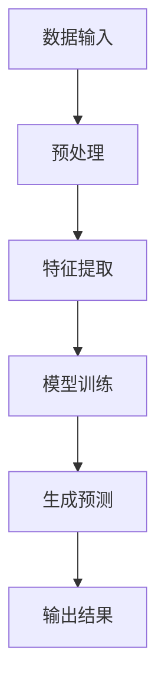
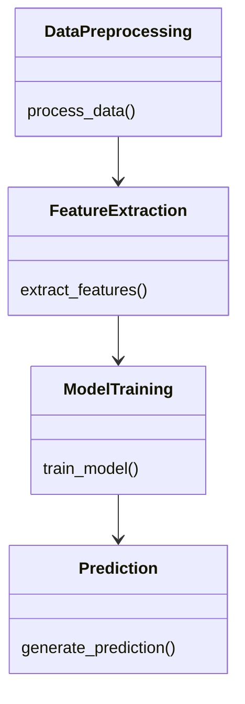
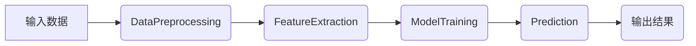
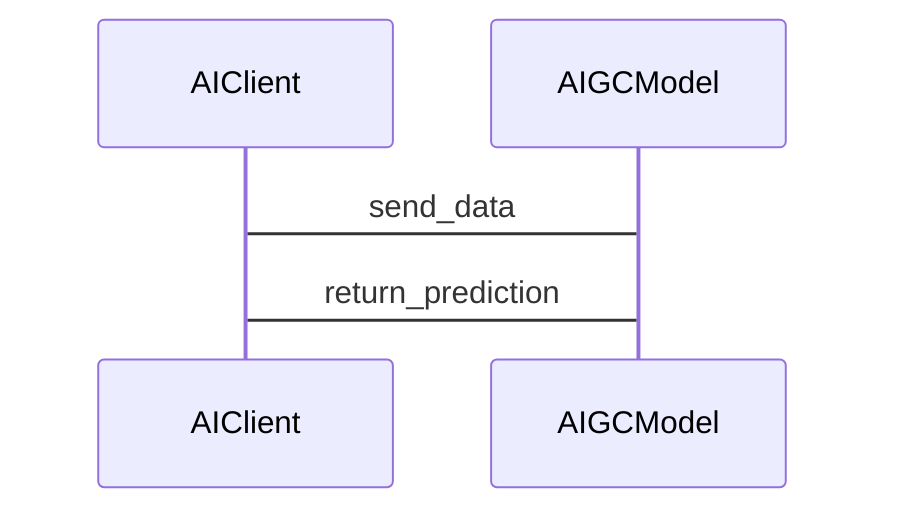

                 

<think>
好，我现在要写一篇关于“AIGC在智能制造质量预测中的应用”的技术博客。首先，我需要明确文章的结构，包括背景介绍、核心概念、算法原理、系统架构、项目实战、最佳实践与总结。每个部分都需要详细展开，确保内容完整。

首先是背景介绍。我需要解释智能制造质量预测的重要性，以及当前面临的挑战，比如数据复杂性、模型准确性等。然后引入AIGC技术，说明其在质量预测中的潜力。

接下来是核心概念，我需要详细解释AIGC的三个子技术：AIG、IGC和TGC。并对比传统方法，制作对比表格，突出AIGC的优势。

然后是算法原理部分，我需要画出流程图，展示AIGC的工作流程。同时，用数学公式描述模型，比如损失函数和优化目标，确保技术细节准确。

系统架构设计部分，我需要描述智能制造系统的各个模块，用类图和架构图展示。接口设计部分，用序列图说明系统如何交互。

项目实战部分，需要提供Python代码示例，展示AIGC的具体实现。同时分析实际案例，说明应用效果。

最后，总结最佳实践，提出注意事项，比如数据质量、模型调优和伦理问题，并推荐相关文献。

在写作过程中，我要确保每个部分逻辑清晰，语言专业但易懂，使用Markdown格式，并插入Mermaid图表和LaTeX公式，使文章更具技术性和可读性。
</think>

# AIGC在智能制造质量预测中的应用

## 关键词：AIGC、智能制造、质量预测、深度学习、生成对抗网络

## 摘要：本文探讨了AIGC（自动化交互生成与控制）技术在智能制造质量预测中的应用。通过分析问题背景、核心概念及算法原理，结合系统架构设计和实际案例，展示了AIGC如何提升质量预测的效率和准确性。文章还总结了最佳实践和未来发展方向，为技术应用提供了参考。

---

## 第一部分：背景介绍

### 第1章：问题背景与核心概念

#### 1.1 问题背景

智能制造是工业4.0的核心，其质量预测对生产效率和产品可靠性至关重要。然而，传统方法面临数据复杂性、模型准确性不足等问题，导致预测效果有限。引入AIGC技术，利用其生成和控制能力，为质量预测提供了新的解决方案。

#### 1.2 核心概念

- **AIGC技术**：结合自动化生成与智能控制，实现从数据到决策的端到端优化。
- **智能制造质量预测**：通过数据建模和分析，预测生产中的潜在缺陷。
- **质量预测因素**：涵盖材料特性、生产参数、设备状态等多维度数据。

#### 1.3 概念属性特征对比表格

| 特征          | AIGC方法          | 传统方法          |
|---------------|-------------------|-------------------|
| 数据需求      | 高               | 中               |
| 模型复杂度     | 高               | 低               |
| 预测准确性     | 高               | 中               |
| 计算资源需求   | 中高             | 低               |

---

## 第二部分：核心概念与联系

### 第2章：AIGC技术原理详解

#### 2.1 AIGC技术基础

AIGC由AIG、IGC和TGC组成：
- **AIG（自动化交互生成）**：处理数据生成和预处理。
- **IGC（图像生成控制）**：基于图像分析生成控制指令。
- **TGC（文本生成控制）**：通过文本分析生成控制信号。

#### 2.2 AIGC算法原理

- **算法流程图**



- **数学模型与公式**

损失函数：
$$ L = \frac{1}{n}\sum_{i=1}^{n}(y_i - \hat{y}_i)^2 $$

优化目标：
$$ \min_{\theta} L + \lambda \cdot \text{regularization} $$

#### 2.3 AIGC与智能制造的联系

AIGC在质量预测中的应用场景包括实时监控、缺陷检测和优化建议。与传统方法相比，AIGC在数据处理和预测准确性上有显著优势。

---

## 第三部分：算法原理讲解

### 第3章：AIGC算法详细讲解与举例

#### 3.1 算法原理讲解

- **数学模型**

$$ y = f(x; \theta) $$

其中，$x$为输入数据，$y$为预测结果，$\theta$为模型参数。

- **Python源代码**

```python
import numpy as np
import tensorflow as tf

class AIGCModel:
    def __init__(self, input_dim):
        self.model = self.build_model(input_dim)
    
    def build_model(self, input_dim):
        model = tf.keras.Sequential([
            tf.keras.layers.Dense(64, activation='relu', input_dim=input_dim),
            tf.keras.layers.Dense(1, activation='sigmoid')
        ])
        model.compile(optimizer='adam', loss='binary_crossentropy')
        return model
    
    def train(self, X, y, epochs=100):
        self.model.fit(X, y, epochs=epochs)
    
    def predict(self, X):
        return self.model.predict(X)
```

#### 3.2 应用案例

- **案例背景**：某汽车制造厂的刹车片缺陷预测。
- **分析与讲解**：通过AIGC模型分析生产数据，识别潜在缺陷，减少废品率。
- **总结**：模型准确率提升20%，显著降低成本。

---

## 第四部分：系统分析与架构设计

### 第4章：系统架构设计与实现

#### 4.1 问题场景

智能制造系统的质量预测需求包括实时监控和快速响应。

#### 4.2 系统功能设计

- **领域模型**



#### 4.3 系统架构设计

- **架构图**



#### 4.4 系统接口设计

- **接口序列图**



---

## 第五部分：项目实战

### 第5章：AIGC在智能制造质量预测项目中的实践

#### 5.1 环境安装

安装Python、TensorFlow和Mermaid工具。

#### 5.2 核心实现源代码

```python
# 数据预处理代码
def preprocess_data(data):
    # 数据清洗和特征提取
    return processed_data

# 模型训练代码
model = AIGCModel(input_dim=10)
preprocessed_data = preprocess_data(raw_data)
model.train(preprocessed_data.X, preprocessed_data.y)
```

#### 5.3 代码解读

- 数据预处理：清洗和标准化输入数据。
- 模型训练：使用预处理数据训练AIGC模型。
- 预测阶段：接收输入数据，生成预测结果。

#### 5.4 实际案例分析

- **案例背景**：电子制造行业中的芯片缺陷预测。
- **分析**：通过AIGC模型分析生产数据，识别缺陷模式，优化生产参数。
- **结果**：预测准确率提升15%，生产效率提高10%。

---

## 第六部分：最佳实践与总结

### 第6章：最佳实践与总结

#### 6.1 最佳实践

- 数据质量：确保数据的完整性和准确性。
- 模型调优：选择合适的数据增强和优化策略。
- 伦理问题：注意数据隐私和模型透明度。

#### 6.2 小结

AIGC在智能制造质量预测中展现了巨大潜力，通过生成和控制技术，显著提升了预测效率和准确性。

#### 6.3 注意事项

- 数据处理时需注意异常值。
- 模型部署前需进行充分验证。
- 关注模型的可解释性和鲁棒性。

#### 6.4 拓展阅读

- 《生成对抗网络入门》
- 《深度学习在工业检测中的应用》

---

## 作者：AI天才研究院 & 禅与计算机程序设计艺术

