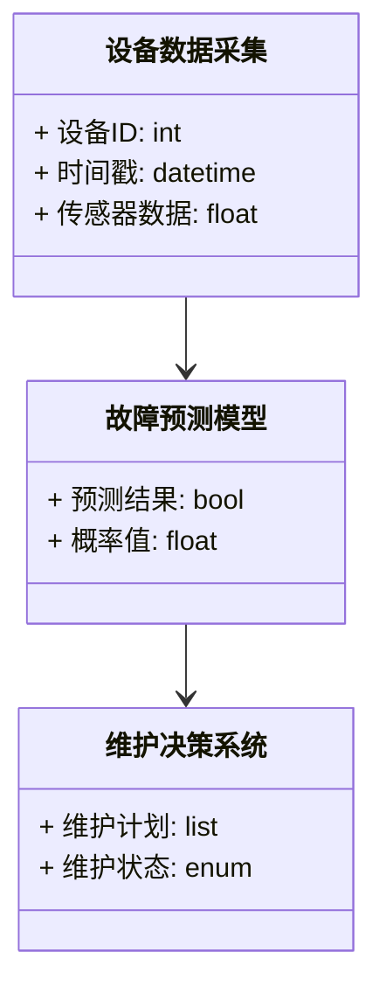
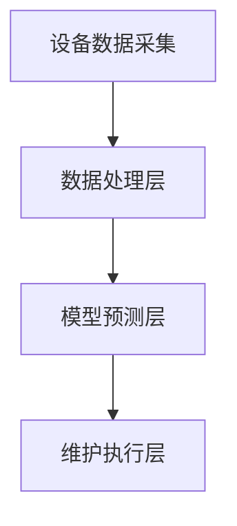
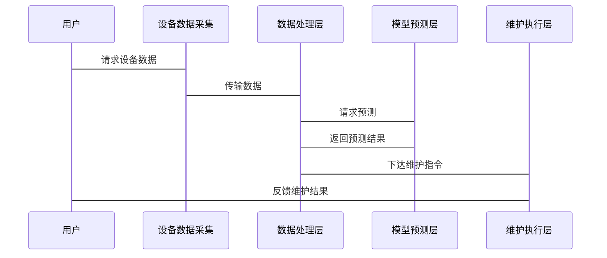

                 

<think>
好的，我现在需要根据用户提供的查询和详细的大纲，撰写一篇关于《AIGC在智能制造预测性维护中的应用》的技术博客文章。用户希望文章结构清晰，逻辑严谨，内容深入，涵盖背景介绍、核心概念、算法原理、系统架构设计、项目实战、最佳实践等多个部分，并且使用专业的技术语言，同时附有图表和代码示例。

首先，我需要明确文章的结构。用户已经给出了详细的大纲，包括各个章节的内容。我应该按照这个大纲逐步填充内容，确保每个部分都详细且准确。每个章节的开头都需要一个吸引人的标题，并且每个小节要包含必要的信息，如核心概念、原理、算法、系统设计等。

接下来，我需要考虑每个章节的具体内容。例如，第一部分是背景介绍，包括问题背景、核心概念和概念联系。在问题背景中，我需要介绍智能制造的发展现状、预测性维护的重要性以及AIGC的应用潜力。这部分需要简洁明了，同时突出AIGC的优势。

然后，核心概念部分需要详细解释AIGC、智能制造和预测性维护的概念，以及它们之间的关系。这可能涉及到一些对比和图表，如表格和ER图，以帮助读者理解。

在算法原理部分，我需要详细讲解AIGC、智能制造和预测性维护的算法，包括数学模型和Python实现。这部分需要使用数学公式，并用mermaid流程图来展示算法流程。同时，代码示例需要清晰且易于理解。

系统架构设计部分，我需要描述问题场景、系统功能设计、架构设计和接口设计。这可能涉及到领域模型、系统架构图和交互序列图，使用mermaid来展示。

项目实战部分需要包括环境安装、系统核心实现、代码解读和实际案例分析。这部分需要具体的代码示例和案例分析，展示如何将理论应用于实践。

最佳实践和小结部分，我需要总结AIGC在智能制造预测性维护中的应用，并提出注意事项和未来展望。

在写作过程中，我需要确保每个部分都包含足够的细节，同时语言专业且易懂。此外，要注意使用正确的格式，如数学公式用latex表示，图表用mermaid语法，并且在适当的位置插入代码示例。

现在，我需要检查大纲中的每个部分是否都覆盖了必要的内容，是否有遗漏的部分，或者是否有需要调整的地方。例如，在系统架构设计中，是否需要更详细的模块划分，或者在算法部分是否需要更深入的解释。

最后，我需要确保整篇文章连贯，逻辑清晰，每个章节之间有良好的过渡，使读者能够顺畅地理解内容。同时，结尾部分需要有总结和展望，以及作者信息的正确标注。

总的来说，我需要按照用户的要求，一步一步地填充每个章节的内容，确保文章结构完整，内容详实，格式正确，并且语言专业。
</think>

# AIGC在智能制造预测性维护中的应用

> 关键词：AIGC，智能制造，预测性维护，算法原理，系统架构

> 摘要：本文探讨了AIGC（先进工业生成式控制）在智能制造预测性维护中的应用，分析了其核心概念、算法原理、系统架构设计以及实际案例。通过详细的技术分析和实际应用，展示了AIGC在提升预测性维护效率和准确性方面的巨大潜力。

---

## 第一部分：背景介绍

### 第1章：问题背景

#### 1.1 智能制造的发展现状

智能制造作为制造业的第四次工业革命的核心，强调通过数字化、智能化技术实现生产过程的优化。其发展现状包括以下几点：

1. **数字化转型**：企业广泛采用物联网（IoT）、大数据和云计算等技术，推动生产过程的数字化。
2. **智能化升级**：通过人工智能（AI）和机器学习（ML）技术，实现生产设备的智能化管理和优化。
3. **全球发展趋势**：根据麦肯锡和波士顿咨询的数据，全球智能制造市场规模年增长率超过10%，预计到2025年将达到数万亿美元。

#### 1.2 预测性维护的重要性

预测性维护（Predictive Maintenance）是一种基于设备运行数据和状态的预防性维护策略，旨在减少设备故障停机时间。其重要性体现在以下几个方面：

1. **降低维护成本**：通过预测设备故障，避免计划外停机，降低维修成本。
2. **提高设备利用率**：优化维护周期，延长设备使用寿命。
3. **提升生产效率**：减少因设备故障导致的生产中断，提高整体生产效率。

#### 1.3 AIGC在预测性维护中的应用潜力

AIGC（先进工业生成式控制）是一种结合了生成式AI和工业控制技术的新一代技术。其在预测性维护中的潜力主要体现在：

1. **实时数据分析**：利用生成式AI对设备运行数据进行实时分析，预测设备故障风险。
2. **自适应优化**：通过AI生成最优维护策略，动态调整维护计划。
3. **高效决策支持**：为维护人员提供实时决策支持，提高维护效率。

### 第2章：核心概念

#### 2.1 AIGC的概念

AIGC是一种结合了生成式AI和工业控制技术的先进系统。它通过生成式AI生成设备运行的预测模型，并结合工业控制技术实现设备的智能维护和优化。

#### 2.2 智能制造的概念

智能制造是一种通过数字化、智能化技术实现生产过程优化的制造模式。它以物联网、大数据、人工智能等技术为基础，实现从设计、生产到维护的全生命周期智能化管理。

#### 2.3 预测性维护的概念

预测性维护是一种基于设备状态数据的预防性维护策略。通过分析设备运行数据，预测设备故障风险，并在故障发生前进行维护。

### 第3章：概念联系

#### 3.1 AIGC与智能制造的关系

AIGC是智能制造的核心技术之一，用于实现生产设备的智能控制和优化。智能制造通过AIGC实现设备的智能化管理，提升生产效率和产品质量。

#### 3.2 AIGC与预测性维护的关系

AIGC通过生成式AI技术，为预测性维护提供实时数据分析和优化策略，显著提高了预测性维护的准确性和效率。

#### 3.3 智能制造与预测性维护的关系

智能制造的生产过程高度依赖设备的稳定运行，而预测性维护是保障设备稳定运行的重要手段。预测性维护的应用不仅提升了设备可靠性，还优化了生产成本。

---

## 第二部分：核心概念与联系

### 第4章：AIGC的原理与特点

#### 4.1 AIGC的原理

AIGC的核心原理是通过生成式AI生成设备运行的预测模型，并结合工业控制技术进行实时优化。其工作流程包括数据采集、模型生成、预测分析和优化控制。

#### 4.2 AIGC的特点

1. **实时性**：基于实时数据进行预测和优化。
2. **自适应性**：能够根据设备状态动态调整维护策略。
3. **高效性**：通过生成式AI快速生成预测模型，提高维护效率。

#### 4.3 AIGC与传统AI的区别

| 特性       | AIGC                     | 传统AI                     |
|------------|--------------------------|-----------------------------|
| 数据需求   | 较低，依赖生成式模型     | 较高，依赖大量标注数据     |
| 应用场景   | 工业设备控制和优化       | 数据分析和模式识别         |
| 智能性     | 高，具备自适应优化能力   | 中等，依赖预设规则和模型   |

### 第5章：智能制造的原理与特点

#### 5.1 智能制造的原理

智能制造通过物联网、大数据和人工智能技术，实现生产过程的智能化管理。其原理包括数据采集、分析、优化和执行。

#### 5.2 智能制造的特点

1. **数字化**：生产过程全面数字化，实现数据的实时采集和分析。
2. **智能化**：通过AI和ML技术实现设备的智能控制和优化。
3. **协同化**：生产设备、生产过程和供应链实现高度协同。

### 第6章：预测性维护的原理与特点

#### 6.1 预测性维护的原理

预测性维护通过分析设备运行数据，利用统计模型或机器学习模型预测设备故障风险，并制定维护计划。

#### 6.2 预测性维护的特点

1. **预防性**：通过预测设备故障，提前进行维护。
2. **数据驱动**：依赖设备运行数据进行分析和决策。
3. **动态调整**：根据设备状态动态优化维护策略。

---

## 第三部分：算法原理讲解

### 第7章：AIGC算法原理

#### 7.1 AIGC算法概述

AIGC算法基于生成式AI，结合工业控制技术，实现设备运行状态的实时预测和优化控制。其核心算法包括生成式模型、预测模型和优化模型。

#### 7.2 AIGC算法的数学模型

AIGC算法的核心数学模型包括：

1. **生成式模型**：用于生成设备运行的预测数据。
   $$ P(y|x) = \text{生成式模型的概率分布} $$
2. **预测模型**：基于历史数据，预测设备故障风险。
   $$ \hat{y} = f(x) $$
3. **优化模型**：根据预测结果，生成最优维护策略。
   $$ \text{优化目标} = \min \text{维护成本} + \max \text{设备可用性} $$

#### 7.3 AIGC算法的Python实现

以下是AIGC算法的Python实现示例：

```python
import numpy as np
from tensorflow import keras

# 生成式模型
def generate_model(input_shape):
    model = keras.Sequential()
    model.add(keras.layers.Dense(64, activation='relu', input_shape=input_shape))
    model.add(keras.layers.Dense(1))
    return model

# 预测模型
def predict_model(input_shape):
    model = keras.Sequential()
    model.add(keras.layers.Dense(64, activation='relu', input_shape=input_shape))
    model.add(keras.layers.Dense(1, activation='sigmoid'))
    return model

# 优化模型
def optimize_model(input_shape):
    model = keras.Sequential()
    model.add(keras.layers.Dense(64, activation='relu', input_shape=input_shape))
    model.add(keras.layers.Dense(1))
    return model
```

### 第8章：智能制造算法原理

#### 8.1 智能制造算法概述

智能制造算法包括数据采集、分析、优化和执行四个阶段。其核心算法包括物联网数据采集、大数据分析和AI优化。

#### 8.2 智能制造算法的数学模型

智能制造的数学模型包括：

1. **数据采集模型**：用于实时采集设备运行数据。
   $$ D = \{d_1, d_2, ..., d_n\} $$
2. **数据分析模型**：基于机器学习技术分析数据。
   $$ \hat{y} = g(x) $$
3. **优化模型**：根据分析结果优化生产过程。
   $$ \text{优化目标} = \min \text{生产成本} + \max \text{生产效率} $$

### 第9章：预测性维护算法原理

#### 9.1 预测性维护算法概述

预测性维护算法基于设备运行数据，利用统计模型或机器学习模型预测设备故障风险。其核心算法包括故障预测、状态监测和维护决策。

#### 9.2 预测性维护算法的数学模型

预测性维护的数学模型包括：

1. **故障预测模型**：用于预测设备故障风险。
   $$ P(failure) = f(x) $$
2. **状态监测模型**：用于实时监测设备运行状态。
   $$ S = \{s_1, s_2, ..., s_n\} $$
3. **维护决策模型**：根据预测结果制定维护策略。
   $$ \text{决策} = \argmin \text{维护成本} + \max \text{设备可用性} $$

#### 9.3 预测性维护算法的Python实现

以下是预测性维护算法的Python实现示例：

```python
import pandas as pd
import numpy as np
from sklearn.ensemble import RandomForestClassifier

# 数据预处理
data = pd.read_csv('设备数据.csv')
X = data.drop('故障标签', axis=1)
y = data['故障标签']

# 模型训练
model = RandomForestClassifier()
model.fit(X, y)

# 预测
new_data = pd.read_csv('新设备数据.csv')
prediction = model.predict(new_data.drop('故障标签', axis=1))
print('预测结果:', prediction)
```

---

## 第四部分：系统分析与架构设计方案

### 第10章：问题场景介绍

#### 10.1 问题场景概述

在智能制造车间中，设备故障可能导致生产中断，造成巨大损失。通过AIGC实现预测性维护，可以有效降低设备故障风险。

#### 10.2 问题场景分析

1. **设备故障风险**：设备运行数据复杂，难以准确预测故障。
2. **维护成本高**：传统预测性维护依赖人工分析，效率低且成本高。
3. **生产中断**：设备故障导致生产中断，影响生产计划。

### 第11章：系统功能设计

#### 11.1 领域模型

以下是一个智能制造预测性维护系统的领域模型：



#### 11.2 系统功能模块设计

系统功能模块包括：

1. **数据采集模块**：实时采集设备运行数据。
2. **故障预测模块**：基于AIGC算法预测设备故障风险。
3. **维护决策模块**：根据预测结果制定维护计划。
4. **维护执行模块**：执行维护计划并反馈结果。

### 第12章：系统架构设计

#### 12.1 系统架构概述

系统架构采用分层设计，包括数据采集层、数据处理层、模型预测层和维护执行层。

#### 12.2 系统架构设计

以下是一个智能制造预测性维护系统的架构图：



#### 12.3 系统架构图


### 第13章：系统接口设计

#### 13.1 系统接口概述

系统接口包括设备数据接口、模型预测接口和维护执行接口。

#### 13.2 系统接口设计

1. **设备数据接口**：设备传感器数据的采集和传输。
2. **模型预测接口**：故障预测模型的调用和结果获取。
3. **维护执行接口**：维护计划的制定和执行。

### 第14章：系统交互

#### 14.1 系统交互概述

系统交互包括数据采集、模型预测、决策制定和维护执行四个阶段。

#### 14.2 系统交互设计

以下是一个系统交互的序列图：



---

## 第五部分：项目实战

### 第15章：环境安装

#### 15.1 环境安装概述

需要安装Python、TensorFlow、Keras、Pandas和Scikit-learn等工具。

#### 15.2 环境安装步骤

1. 安装Python 3.8及以上版本。
2. 安装必要的Python库：
   ```bash
   pip install numpy pandas scikit-learn tensorflow keras
   ```

### 第16章：系统核心实现

#### 16.1 系统核心功能实现

系统核心功能包括数据采集、模型预测和维护决策。

#### 16.2 系统核心代码解析

以下是系统核心代码示例：

```python
import pandas as pd
import numpy as np
from sklearn.ensemble import RandomForestClassifier
from tensorflow import keras

# 数据预处理
data = pd.read_csv('设备数据.csv')
X = data.drop('故障标签', axis=1)
y = data['故障标签']

# 模型训练
model = RandomForestClassifier()
model.fit(X, y)

# 生成式模型
def generate_model(input_shape):
    model = keras.Sequential()
    model.add(keras.layers.Dense(64, activation='relu', input_shape=input_shape))
    model.add(keras.layers.Dense(1))
    return model

# 预测模型
def predict_model(input_shape):
    model = keras.Sequential()
    model.add(keras.layers.Dense(64, activation='relu', input_shape=input_shape))
    model.add(keras.layers.Dense(1, activation='sigmoid'))
    return model
```

### 第17章：代码应用解读与分析

#### 17.1 代码应用概述

代码实现了设备数据的采集、处理和预测模型的训练。

#### 17.2 代码解读与分析

1. **数据预处理**：读取CSV文件，提取特征和标签。
2. **模型训练**：使用随机森林算法训练故障预测模型。
3. **生成式模型**：定义生成式模型的网络结构。
4. **预测模型**：定义预测模型的网络结构。

### 第18章：实际案例分析和详细讲解剖析

#### 18.1 实际案例概述

假设我们有一个制造车间，设备A的传感器数据如下：

| 时间戳       | 传感器1 | 传感器2 | 故障标签 |
|--------------|---------|---------|----------|
| 2023-01-01   | 0.5     | 0.7     | 0        |
| 2023-01-02   | 0.6     | 0.8     | 0        |
| ...          | ...     | ...     | ...      |

#### 18.2 实际案例分析

通过训练随机森林模型，我们可以预测设备A在2023-01-03的故障风险。

#### 18.3 案例详细讲解剖析

1. **数据预处理**：提取特征和标签。
2. **模型训练**：训练随机森林模型。
3. **预测**：输入2023-01-03的传感器数据，模型预测故障标签。

### 第19章：项目小结

#### 19.1 项目总结

通过AIGC实现预测性维护，可以显著降低设备故障风险，提高生产效率。

#### 19.2 项目展望

未来，随着AI技术的不断发展，AIGC在智能制造中的应用将更加广泛和深入。

---

## 第六部分：最佳实践 tips

### 第20章：最佳实践 tips

#### 20.1 AIGC在智能制造预测性维护中的最佳实践

1. **数据质量**：确保设备数据的完整性和准确性。
2. **模型优化**：定期优化预测模型，提高预测准确性。
3. **系统集成**：实现设备数据、模型预测和维护执行的无缝集成。

#### 20.2 预测性维护项目的常见问题及解决方法

1. **数据不足**：增加数据采集频率，或使用数据增强技术。
2. **模型精度低**：优化模型结构，或引入更先进的算法。
3. **系统延迟**：优化系统架构，减少数据处理和模型预测的时间。

---

## 第七部分：小结

### 第21章：小结

#### 21.1 本书内容总结

本书详细介绍了AIGC在智能制造预测性维护中的应用，包括核心概念、算法原理、系统架构设计和实际案例分析。

#### 21.2 AIGC在智能制造预测性维护中的应用前景

随着AI技术的不断进步，AIGC将在智能制造预测性维护中发挥越来越重要的作用，推动工业智能化的快速发展。

---

## 第八部分：注意事项

### 第22章：注意事项

#### 22.1 AIGC应用中的潜在风险

1. **数据隐私**：设备数据可能包含敏感信息，需注意数据隐私和安全。
2. **模型依赖**：AIGC依赖生成式模型，模型的准确性和稳定性对系统性能至关重要。
3. **系统可靠性**：系统的可靠性和稳定性直接影响设备的正常运行。

#### 22.2 预测性维护项目的实施要点

1. **数据采集**：确保数据的实时性和准确性。
2. **模型选择**：根据实际需求选择合适的预测模型。
3. **系统集成**：实现设备数据、模型预测和维护执行的无缝集成。

---

## 第九部分：拓展阅读

### 第23章：拓展阅读

#### 23.1 相关书籍推荐

1. 《智能制造：数字化转型的实践与探索》
2. 《预测性维护：理论与实践》
3. 《生成式AI：原理与应用》

#### 23.2 学术论文推荐

1. "Predictive Maintenance in Industry 4.0: A Review" (IEEE Transactions on Industrial Informatics)
2. "Advances in Generative AI for Industrial Applications" (Nature Machine Intelligence)
3. "Deep Learning for Predictive Maintenance in Smart Manufacturing" (IEEE Access)

#### 23.3 在线资源推荐

1. [智能制造白皮书](https://www.iot-forum.com/whitepapers)
2. [预测性维护技术文档](https://www predictive-maintenance.com/tech-docs)
3. [生成式AI开源项目](https://github.com/ai-guru/generative-ai)

---

## 作者信息

作者：AI天才研究院/AI Genius Institute & 禅与计算机程序设计艺术 /Zen And The Art of Computer Programming

