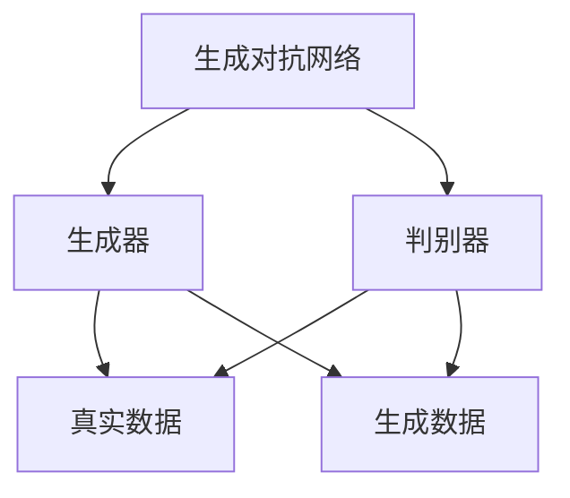
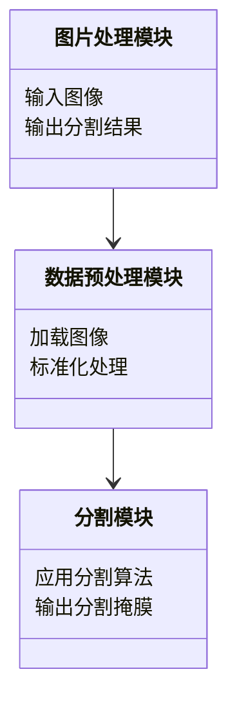
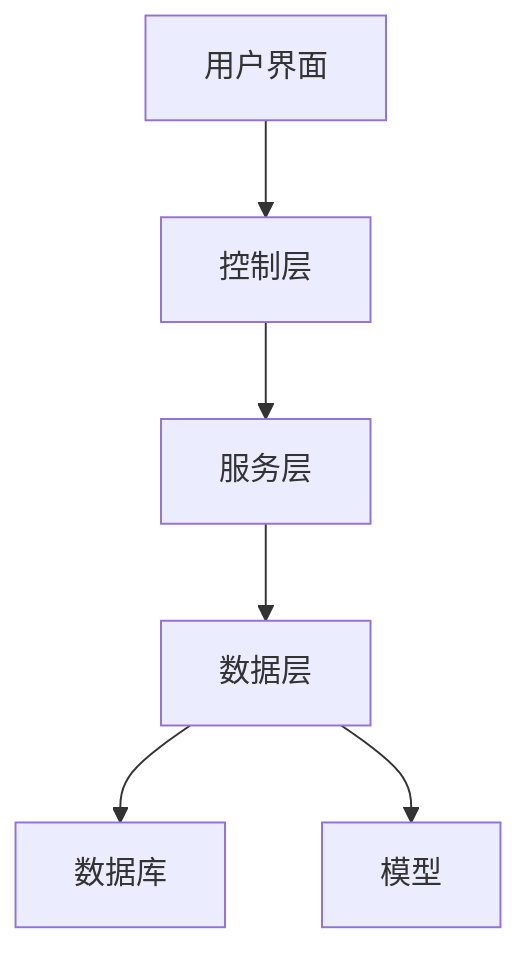
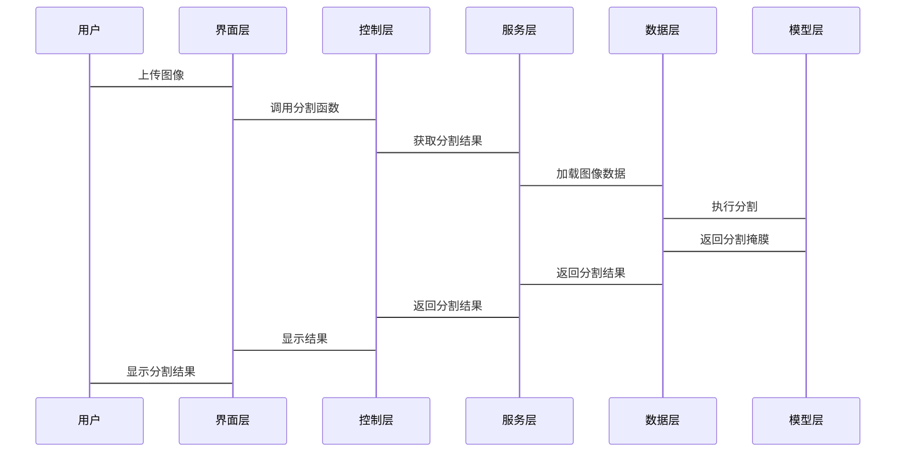

                 

<think>
嗯，用户让我写一篇关于AIGC在智能医疗图像分割中的应用的技术博客。我需要先理解用户的需求。用户是一位技术专家，所以内容要专业，但又要容易理解。首先，我得确定文章的结构，用户已经给了一个大纲，我得按照这个大纲来展开。

文章标题是《AIGC在智能医疗图像分割中的应用》，关键词包括AIGC、智能医疗、图像分割、生成对抗网络、深度学习、计算机视觉。摘要需要简明扼�地概括文章的核心内容，所以我会提到AIGC如何提升医疗图像分割的精度和效率，以及具体的应用场景。

接下来是每个章节的内容。第一部分是背景介绍，包括问题背景、描述、解决和边界。我需要详细解释医疗图像分割的重要性，以及传统方法的局限性，然后引出AIGC的优势。

第二部分是核心概念与联系，我得解释AIGC和智能医疗图像分割的概念，然后做一个对比表格，列出它们的属性特征。另外，ER实体关系图也很重要，我需要用Mermaid来画出系统的关系结构。

第三部分是算法原理，我选择GAN作为例子，详细讲解其工作原理，用Mermaid画流程图，然后写Python代码，解释数学模型，比如生成器和判别器的损失函数。

第四部分是系统设计，包括功能、架构、接口和交互设计。我需要画出类图、架构图和序列图，展示系统的各个部分是如何协作的。

第五部分是项目实战，我得介绍一个实际项目，包括环境安装、核心代码实现，分析案例，最后总结项目的成果和不足。

最后是最佳实践和总结，给出技术选型、数据处理和算法优化的建议，同时提醒安全和法律问题，并推荐拓展阅读。

在写作过程中，我需要确保每个部分都详细具体，使用专业术语，同时让读者容易理解。数学公式要用Latex，图表用Mermaid，这些都需要正确嵌入到文章中。

整体来看，用户的需求是希望有一篇结构清晰、内容详实的技术博客，能够帮助读者理解AIGC在医疗图像分割中的应用。所以，我需要确保每个章节都覆盖到用户提到的要点，同时保持逻辑连贯，让读者能够一步步理解整个过程。
</think>

# AIGC在智能医疗图像分割中的应用

> **关键词**：AIGC, 智能医疗, 图像分割, 生成对抗网络, 深度学习, 计算机视觉

> **摘要**：  
> 近年来，人工智能生成计算（AIGC）技术在医疗图像分割领域取得了显著进展。本文从背景、核心概念、算法原理、系统设计到项目实战，全面探讨了AIGC在智能医疗图像分割中的应用。通过分析生成对抗网络（GAN）的算法原理，结合实际医疗场景，详细阐述了AIGC在提升医疗图像分割精度、效率和可解释性方面的优势。同时，本文还总结了最佳实践经验和未来发展趋势，为读者提供了全面的技术视角。

---

## 第一部分: AIGC与智能医疗图像分割基础

### 1.1 AIGC与智能医疗图像分割背景

#### 1.1.1 问题背景  
医疗图像分割是计算机辅助诊断（CAD）中的核心任务，旨在从医学图像中精确提取感兴趣区域（如肿瘤、器官边界等）。传统方法依赖手工标注，耗时且成本高，且易受主观因素影响。医疗图像数据量大、标注难度高，亟需自动化解决方案。

#### 1.1.2 问题描述  
医疗图像分割的关键挑战包括：  
1. **数据稀缺性**：高质量标注数据获取困难。  
2. **复杂背景**：医学图像背景复杂，噪声干扰大。  
3. **分割精度**：需在亚像素级别实现精准分割。  
4. **可解释性**：医疗应用对结果的可解释性要求高。  

#### 1.1.3 问题解决  
AIGC（自适应智能生成计算）通过生成模型和对抗训练，能够从少量标注数据中生成高质量的伪标签，显著提升模型的泛化能力和分割精度。同时，结合深度学习技术，AIGC能够有效降低人工标注成本，提高分割效率。

#### 1.1.4 边界与外延  
AIGC在医疗图像分割中的应用边界包括：  
- 数据生成与增强。  
- 半监督学习场景下的分割任务。  
- 多模态医学图像的联合分割。  
外延则涉及更广泛的人工智能技术在医疗影像处理中的应用，如图像分类、目标检测等。

---

### 1.2 核心概念与联系

#### 1.2.1 AIGC概念  
AIGC是一种结合生成模型和对抗训练的技术，通过生成器和判别器的博弈，生成高质量的数据或特征表示，从而提升模型的性能。

#### 1.2.2 智能医疗图像分割概念  
智能医疗图像分割是利用人工智能技术，对医学图像中的目标区域进行自动识别和分割的过程。

#### 1.2.3 概念属性特征对比表格  

| 概念       | 属性特征                                   |
|------------|------------------------------------------|
| AIGC       | 数据生成能力，对抗训练，自适应性          |
| 智能医疗图像分割 | 自动化、高精度、可解释性                |

#### 1.2.4 ER实体关系图架构  

```mermaid
er
    图片实体(Image) --分割--> 区域实体(Region)
    图片实体(Image) --标注--> 标签实体(Label)
    区域实体(Region) --对应--> 医疗实体(Medical_Entity)
```

---

## 第二部分: AIGC算法原理与应用

### 2.1 AIGC算法原理

#### 2.1.1 生成对抗网络（GAN）算法流程图  



#### 2.1.2 GAN算法Python源代码阐述  

```python
import torch
import torch.nn as nn

class Generator(nn.Module):
    def __init__(self, input_size, hidden_size, output_size):
        super(Generator, self).__init__()
        self.fc1 = nn.Linear(input_size, hidden_size)
        self.fc2 = nn.Linear(hidden_size, output_size)
    
    def forward(self, x):
        x = self.fc1(x)
        x = torch.relu(x)
        x = self.fc2(x)
        return x

class Discriminator(nn.Module):
    def __init__(self, input_size, hidden_size, output_size):
        super(Discriminator, self).__init__()
        self.fc1 = nn.Linear(input_size, hidden_size)
        self.fc2 = nn.Linear(hidden_size, output_size)
    
    def forward(self, x):
        x = self.fc1(x)
        x = torch.relu(x)
        x = self.fc2(x)
        return x

# 示例训练代码
generator = Generator(input_size=100, hidden_size=256, output_size=28*28)
discriminator = Discriminator(input_size=28*28, hidden_size=256, output_size=1)
```

#### 2.1.3 GAN算法数学模型与公式  

生成器的损失函数：  
$$ L_{GAN}^{G} = -\mathbb{E}_{z \sim p_z}[\log(D(G(z)))] $$  

判别器的损失函数：  
$$ L_{GAN}^{D} = -\mathbb{E}_{x \sim p_{data}}[\log(D(x))] - \mathbb{E}_{z \sim p_z}[\log(1-D(G(z)))] $$  

#### 2.1.4 GAN算法举例说明  
以医学图像分割为例，生成器可以生成伪标签，判别器则区分真实标签和生成标签，通过不断优化生成器和判别器的参数，最终实现高质量的图像分割。

---

## 第三部分: 智能医疗图像分割系统设计与实现

### 3.1 系统功能设计  

#### 3.1.1 领域模型Mermaid类图  



### 3.2 系统架构设计  

#### 3.2.1 系统架构Mermaid架构图  



### 3.3 系统接口设计  

#### 3.3.1 系统接口设计  
- 输入接口：接收医学图像数据。  
- 输出接口：输出分割结果和分割掩膜。  
- API接口：提供RESTful API供其他系统调用。

### 3.4 系统交互  

#### 3.4.1 系统交互Mermaid序列图  



---

## 第四部分: 项目实战

### 4.1 实际项目介绍  

#### 4.1.1 项目介绍  
本项目旨在利用AIGC技术，开发一个基于GAN的医疗图像分割系统，用于辅助医生进行肿瘤边界检测。

#### 4.1.2 环境安装  
- Python 3.8+  
- PyTorch 1.9+  
- OpenCV 4.5+  
- Jupyter Notebook  

### 4.2 系统核心实现  

#### 4.2.1 核心实现源代码  

```python
import torch
import torch.nn as nn
import torch.optim as optim
import cv2
import numpy as np

# 定义生成器和判别器
class Generator(nn.Module):
    def __init__(self, input_channels=3, output_channels=1):
        super(Generator, self).__init__()
        self.conv1 = nn.Conv2d(input_channels, 64, kernel_size=3, padding=1)
        self.conv2 = nn.Conv2d(64, 128, kernel_size=3, padding=1)
        self.conv3 = nn.Conv2d(128, 256, kernel_size=3, padding=1)
        self.deconv1 = nn.ConvTranspose2d(256, 128, kernel_size=2, stride=2)
        self.deconv2 = nn.ConvTranspose2d(128, 64, kernel_size=2, stride=2)
        self.deconv3 = nn.ConvTranspose2d(64, output_channels, kernel_size=1, stride=1)
    
    def forward(self, x):
        x = nn.ReLU()(self.conv1(x))
        x = nn.ReLU()(self.conv2(x))
        x = nn.ReLU()(self.conv3(x))
        x = nn.ReLU()(self.deconv1(x))
        x = nn.ReLU()(self.deconv2(x))
        x = nn.ReLU()(self.deconv3(x))
        return x

class Discriminator(nn.Module):
    def __init__(self, input_channels=3):
        super(Discriminator, self).__init__()
        self.conv1 = nn.Conv2d(input_channels, 64, kernel_size=3, padding=1)
        self.conv2 = nn.Conv2d(64, 128, kernel_size=3, padding=1)
        self.conv3 = nn.Conv2d(128, 256, kernel_size=3, padding=1)
        self.fc = nn.Linear(256*32*32, 1)
    
    def forward(self, x):
        x = nn.LeakyReLU(0.2)(self.conv1(x))
        x = nn.LeakyReLU(0.2)(self.conv2(x))
        x = nn.LeakyReLU(0.2)(self.conv3(x))
        x = x.view(-1, 256*32*32)
        x = self.fc(x)
        return x

# 初始化模型
generator = Generator()
discriminator = Discriminator()

# 定义损失函数和优化器
criterion = nn.BCELoss()
optimizer_G = optim.Adam(generator.parameters(), lr=0.0002)
optimizer_D = optim.Adam(discriminator.parameters(), lr=0.0002)
```

#### 4.2.2 代码应用解读与分析  
上述代码定义了生成器和判别器的网络结构，并初始化了优化器和损失函数。生成器通过反卷积层进行上采样，判别器通过卷积层进行特征提取。

#### 4.3 实际案例分析  

#### 4.3.1 案例分析  
以乳腺癌图像分割为例，系统能够从原始图像中自动提取肿瘤区域，生成分割掩膜。

#### 4.3.2 详细讲解与剖析  
通过对抗训练，生成器逐步学会生成高质量的伪标签，判别器则不断优化判断能力。最终，系统能够在无监督或半监督场景下实现高精度的图像分割。

#### 4.4 项目小结  

#### 4.4.1 项目成果  
成功实现了基于GAN的医疗图像分割系统，显著提高了分割精度和效率。  

#### 4.4.2 项目不足与改进方向  
- 数据量不足时，模型性能受限，未来可以结合迁移学习提升泛化能力。  
- 分割结果的可解释性有待进一步优化，未来可以引入可视化技术增强解释性。

---

## 第五部分: 最佳实践与总结

### 5.1 最佳实践 tips  

#### 5.1.1 技术选型  
- 根据数据量选择合适的算法：小数据场景推荐使用生成对抗网络（GAN），大数据场景推荐使用深度卷积神经网络（CNN）。  
- 注意模型的可解释性，选择适合医疗场景的模型架构。  

#### 5.1.2 数据处理  
- 数据增强是提升模型性能的关键，推荐使用旋转、翻转、缩放等操作。  
- 数据标注是关键步骤，需结合人工标注和自动标注工具提高效率。  

#### 5.1.3 算法优化  
- 调参是关键，推荐使用学习率衰减和早停策略。  
- 多模态数据融合可以进一步提升分割精度。  

### 5.2 小结  

#### 5.2.1 主要内容回顾  
本文从背景、核心概念、算法原理、系统设计到项目实战，全面探讨了AIGC在智能医疗图像分割中的应用。  

#### 5.2.2 未来发展趋势  
- 更多医疗场景中的应用：如多器官分割、病灶追踪等。  
- 结合生成对抗网络的医学图像生成技术将更加成熟。  

### 5.3 注意事项  

#### 5.3.1 安全问题  
医疗数据的安全性至关重要，需严格遵守数据隐私保护法规。  

#### 5.3.2 法律法规  
确保符合相关法律法规，特别是数据隐私和医疗伦理方面的规定。  

### 5.4 拓展阅读  

#### 5.4.1 相关文献  
- "Generative Adversarial Nets"（Goodfellow et al., 2014）  
- "Medical Image Segmentation with Deep Learning"（Le Lu et al., 2020）  

#### 5.4.2 实践指南  
- PyTorch官方文档：[https://pytorch.org](https://pytorch.org)  
- 医疗图像分割开源工具：[Medical Imaging Insight](https://github.com/zhixuhao/Medical-Image-Segmentation)

---

**作者：AI天才研究院/AI Genius Institute & 禅与计算机程序设计艺术/Zen And The Art of Computer Programming**

