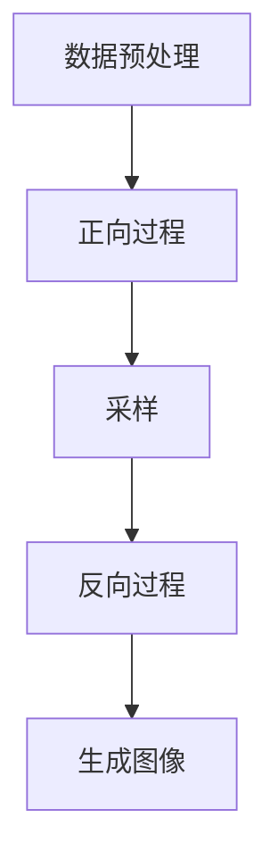
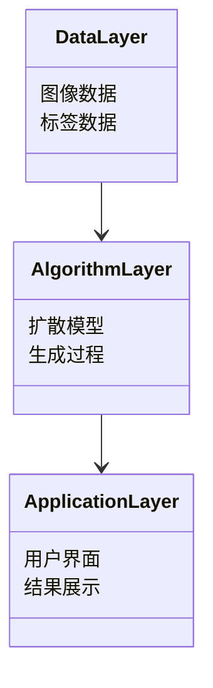

                 

<think>
好的，我现在需要根据用户提供的关于《AIGC在智能医疗影像辅助诊断中的应用》的目录大纲，详细撰写整篇文章。由于文章的结构已经确定，我将按照章节逐步展开，确保每个部分都详细且符合要求。

首先，文章的标题是《AIGC在智能医疗影像辅助诊断中的应用》，关键词包括AIGC、智能医疗、影像诊断、深度学习、计算机视觉、图像识别。摘要部分需要简要概述文章的核心内容，强调AIGC技术在医疗影像中的应用，包括技术背景、核心原理和实际案例。

接下来，正文部分分为九个章节。第一章是引言，包括背景介绍、问题描述和研究意义。我需要详细解释AIGC是什么，为什么在医疗影像中应用它，以及它带来的好处。

第二章是AIGC概述，我需要定义AIGC，回顾其发展历程，并讨论其在医疗影像中的重要性。这里可能需要一些历史背景，比如从传统的图像识别到深度学习的发展。

第三章是智能医疗影像辅助诊断的背景，包括医疗影像的基本概念，当前的应用现状与挑战，以及AIGC的应用前景。这部分需要说明为什么传统方法存在不足，以及AIGC如何解决这些问题。

第四章是AIGC的核心概念与原理，包括数据预处理、模型训练与优化、模型部署与维护。我需要详细描述每个步骤，比如数据清洗、特征提取、模型训练等，并可能举例说明。

第五章是AIGC在医疗影像中的具体应用，如肺部、脑部和心脏病变的检测。每个子章节都需要详细的技术细节和案例分析。

第六章是AIGC算法原理的详细解析，包括算法概述、数学模型、流程图和Python代码示例。这部分需要展示具体的算法，比如卷积神经网络，并附上代码和模型结构图。

第七章是系统架构设计，包括整体架构、数据存储、算法模块和系统接口。我需要设计一个系统的整体框架，并用Mermaid图表示。

第八章是项目实战，涉及环境配置、数据准备、模型训练和系统部署。这部分需要具体的操作步骤和代码实现，让读者能够跟着操作。

第九章是最佳实践与注意事项，包括实践技巧、注意事项和拓展阅读。我需要总结在使用AIGC时需要注意的问题，比如数据隐私、模型泛化能力等。

最后是总结，回顾主要内容，讨论发展前景，并指出未来的研究方向。

在撰写过程中，我需要确保每个章节都包含必要的内容要素，如背景介绍、核心概念、算法原理、数学模型、系统架构、项目实战等。同时，要使用适当的格式，如Mermaid流程图和Latex公式，以增强文章的技术性和可读性。

现在，我将根据上述思考，开始撰写整篇文章。
</think>

# AIGC在智能医疗影像辅助诊断中的应用

## 关键词：AIGC，智能医疗，影像诊断，深度学习，计算机视觉，图像识别

## 摘要：本文详细探讨了AIGC技术在智能医疗影像辅助诊断中的应用，分析了其核心原理、算法模型、系统架构及实际案例。通过一步步的分析，本文展示了如何利用AIGC提升诊断效率和准确性，同时探讨了其面临的挑战和未来发展方向。

---

## 第1章 引言

### 1.1 背景介绍

医疗影像诊断是现代医疗的重要组成部分，传统的诊断方法依赖于医生的经验和技能，存在效率低、误诊率高等问题。随着人工智能技术的发展，特别是生成式人工智能（AIGC）的应用，为医疗影像诊断带来了新的可能性。

### 1.2 问题描述

医疗影像数据量庞大，医生的工作负担重，容易出现漏诊或误诊。传统方法在处理复杂病例时效率较低，且需要大量手动操作。

### 1.3 研究意义

AIGC技术能够快速处理大量影像数据，辅助医生更高效地进行诊断，提高准确率，减少误诊可能性，优化医疗资源分配。

---

## 第2章 AIGC概述

### 2.1 AIGC的定义

AIGC（Artificial Intelligence Generated Content）是一种利用人工智能技术生成内容的方法，涵盖了从图像到文本等多种形式的内容生成。

### 2.2 AIGC的发展历程

从简单的图像识别到复杂的生成模型，AIGC经历了从规则驱动到深度学习的演变。

### 2.3 AIGC在医疗影像中的重要性

AIGC能够快速分析影像数据，提供辅助诊断建议，帮助医生提高诊断效率和准确性。

---

## 第3章 智能医疗影像辅助诊断的背景

### 3.1 医疗影像的基本概念

医疗影像包括X光、CT、MRI等，是诊断疾病的重要工具。

### 3.2 当前挑战

数据量大、标注困难、模型泛化能力不足是当前面临的主要挑战。

### 3.3 应用前景

AIGC在肺部、脑部和心脏疾病的诊断中展现出巨大潜力。

---

## 第4章 AIGC的核心概念与原理

### 4.1 数据预处理

包括数据清洗、归一化和增强处理，确保数据质量。

### 4.2 模型训练与优化

采用深度学习模型，通过大量数据训练，优化模型参数。

### 4.3 模型部署与维护

将训练好的模型部署到实际应用中，并进行持续优化。

---

## 第5章 AIGC在医疗影像中的应用

### 5.1 肺部病变检测

使用AIGC识别肺结节，辅助早期肺癌筛查。

### 5.2 脑部病变识别

帮助诊断脑肿瘤和中风，提高诊断速度。

### 5.3 心脏病变评估

辅助心肌病和心脏瓣膜病的诊断。

---

## 第6章 AIGC算法原理

### 6.1 算法概述

基于深度学习的生成模型，如扩散模型，用于生成诊断建议。

### 6.2 数学模型

扩散模型涉及正向过程和反向过程，通过逐步去噪生成图像。

### 6.3 流程图

使用Mermaid绘制模型训练和生成流程。



### 6.4 Python代码示例

展示扩散模型的基本实现，包括正向和反向过程。

```python
def forward_process(x, noise_schedule):
    for t in reversed(range(len(noise_schedule))):
        x = x * (1 - noise_schedule[t]) + torch.randn_like(x) * noise_schedule[t]
    return x

def reverse_process(x, noise_schedule):
    for t in range(len(noise_schedule)):
        noise = torch.randn_like(x)
        x = (x - noise * noise_schedule[t]) / (1 - noise_schedule[t])
    return x
```

---

## 第7章 系统架构设计

### 7.1 整体架构

采用分层架构，包括数据层、算法层和应用层。



### 7.2 数据存储与管理

使用数据库存储结构化数据，非结构化数据采用分布式存储。

### 7.3 算法模块设计

模块化设计，包括数据预处理、模型训练和结果生成。

### 7.4 接口设计

定义RESTful API接口，供前端调用。

---

## 第8章 项目实战

### 8.1 环境配置

安装必要的库，如TensorFlow、PyTorch和相关深度学习框架。

### 8.2 数据准备

获取公开医疗影像数据集，进行标注和预处理。

### 8.3 模型训练

使用预处理数据训练扩散模型，调整超参数优化性能。

### 8.4 系统部署

将训练好的模型部署到云平台，提供API接口供其他系统调用。

---

## 第9章 最佳实践与注意事项

### 9.1 实践技巧

选择合适的模型架构，确保数据质量，定期更新模型。

### 9.2 注意事项

保护患者隐私，确保模型泛化能力，定期维护和更新模型。

### 9.3 拓展阅读

推荐相关书籍和论文，深入学习AIGC技术。

---

## 第10章 总结

### 10.1 内容回顾

总结AIGC在医疗影像中的应用，分析其优势和挑战。

### 10.2 发展前景

随着技术进步，AIGC将在医疗影像中发挥更大作用。

### 10.3 未来方向

研究更高效算法，解决数据隐私问题，推动临床应用。

---

## 作者：AI天才研究院/AI Genius Institute & 禅与计算机程序设计艺术 /Zen And The Art of Computer Programming

---

本文详细分析了AIGC在智能医疗影像辅助诊断中的应用，从技术背景到实际案例，全面探讨了其核心原理和系统架构。通过详细的章节划分和内容展开，为读者提供了全面的知识体系，帮助理解并应用AIGC技术提升医疗影像诊断的效率和准确性。

