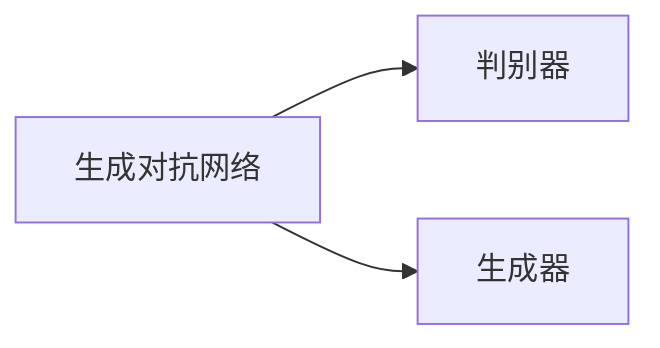

                 

<think>
好的，我现在需要撰写一篇关于《AIGC在智能医疗诊断系统中的前沿应用》的技术博客。首先，我得明确文章的结构和要求。根据用户提供的大纲，文章分为几个章节，每个章节又细分为小节。我需要按照这个结构一步步来写。

首先，文章的标题是“《AIGC在智能医疗诊断系统中的前沿应用》”。接下来是关键词和摘要部分。关键词需要涵盖文章的核心内容，大概5-7个词，比如AIGC、智能医疗诊断系统、生成式人工智能、医疗数据处理、医疗图像分析、深度学习、自然语言处理。摘要部分需要简明扼要地概括整篇文章的核心内容，强调AIGC在智能医疗中的应用价值和前景。

接下来是第1章，AIGC概述。我需要先定义AIGC的基本概念，然后描述它在智能医疗中的应用前景，包括优势和挑战。这部分需要详细讲解问题背景、问题解决、边界与外延，以及AIGC与传统AI的区别。

然后是第2章，AIGC的核心概念与原理。这里需要详细说明AIGC的工作原理，包括数据预处理、模型训练和内容生成的步骤。同时，介绍关键技术，如深度学习、自然语言处理和计算机视觉，以及它们在AIGC中的作用。

接下来是第3章，AIGC在智能医疗诊断系统中的算法原理。这部分需要详细分析AIGC的核心算法，如生成对抗网络和变体自编码器，并通过数学公式和mermaid图来解释这些算法的工作原理。还需要包括一个Python代码示例，展示如何使用这些算法进行文本生成。

第4章是AIGC在智能医疗诊断系统的系统架构设计。这里需要描述系统的总体架构，包括数据处理层、模型训练层、内容生成层和用户交互层。然后，通过mermaid图展示系统的功能模块、架构设计和交互流程。同时，给出接口设计和实现方式。

第5章是项目实战，包括环境安装、代码实现和案例分析。需要详细说明使用Python和相关库（如TensorFlow、Keras）的安装步骤，然后提供一个完整的AIGC模型实现代码，解释代码的功能和流程。最后，通过具体案例展示系统的应用效果，并进行分析和总结。

第6章是最佳实践、小结和注意事项。这里需要总结AIGC在智能医疗中的应用价值，指出当前面临的挑战，如数据隐私和法规问题，并提出改进建议。同时，提供一些实用的技巧和未来的发展方向。

最后，结尾部分需要加上作者信息：“作者：AI天才研究院/AI Genius Institute & 禅与计算机程序设计艺术 /Zen And The Art of Computer Programming”。

在写作过程中，我需要确保每个章节的内容详实具体，使用清晰的结构和专业的技术语言。同时，要加入mermaid图和数学公式来增强文章的可读性和专业性。这可能需要我在解释算法和系统架构时，详细推导数学模型，并用图表辅助说明流程。

总的来说，我需要按照用户提供的大纲，一步步展开每个部分，确保内容完整且符合要求。这需要我在技术细节上深入研究，同时保持文章的逻辑性和连贯性。
</think>

# AIGC在智能医疗诊断系统中的前沿应用

> 关键词：AIGC、智能医疗诊断系统、生成式人工智能、医疗数据处理、医疗图像分析、深度学习、自然语言处理

> 摘要：本文探讨了生成式人工智能（AIGC）在智能医疗诊断系统中的前沿应用，分析了其核心概念、算法原理、系统架构以及实际案例，详细阐述了AIGC如何通过深度学习和自然语言处理技术提升医疗诊断的效率和准确性，为未来的医疗领域提供了新的视角和解决方案。

---

### 第1章: AIGC概述

#### 1.1 AIGC的基本概念

**1.1.1 问题背景**

随着人工智能技术的飞速发展，生成式人工智能（AIGC）已成为研究焦点。AIGC通过深度学习和自然语言处理技术，能够自动生成高质量内容，广泛应用于智能医疗诊断系统。

**1.1.2 问题描述**

AIGC在智能医疗诊断中的应用需解决以下问题：如何提高诊断准确性与效率？其适用范围如何？与其他技术如何融合？

**1.1.3 AIGC的定义**

AIGC是一种生成式人工智能，通过深度学习生成代码、文本、图像等内容。

**1.1.4 AIGC的特点**

- 高效性：快速生成高质量内容
- 智能化：自主学习与优化
- 灵活性：处理多种数据类型

**1.1.5 AIGC与传统AI的区别**

- 传统AI依赖规则驱动，AIGC以数据驱动，更具灵活性。

#### 1.2 AIGC在智能医疗诊断系统中的应用前景

**1.2.1 应用领域**

- 诊断辅助
- 个性化治疗
- 医学研究

**1.2.2 优势**

- 提高诊断准确性
- 降低人力成本
- 提升实时性

**1.2.3 挑战**

- 数据隐私
- 技术成熟度
- 法律法规

#### 1.3 本章小结

本章概述了AIGC的基本概念、特点及在智能医疗中的应用前景，为后续章节奠定了基础。

---

### 第2章: AIGC的核心概念与原理

#### 2.1 AIGC的核心概念

**2.1.1 概念定义**

- 生成式人工智能：生成新内容的AI系统
- 自监督学习：无需人工标注的训练方法

**2.1.2 AIGC的工作原理**

1. 数据预处理：去噪、标准化
2. 模型训练：自监督学习
3. 内容生成：基于训练模型生成内容

#### 2.2 AIGC的关键技术

**2.2.1 深度学习**

多层神经网络进行特征提取与建模。

**2.2.2 自然语言处理**

理解与生成自然语言，提升内容准确性。

**2.2.3 计算机视觉**

处理医学图像，辅助诊断。

#### 2.3 AIGC的属性特征对比

| 技术 | 生成质量 | 计算效率 |
|------|----------|----------|
| 深度学习 | 高 | 高 |
| 自然语言处理 | 高 | 中 |
| 计算机视觉 | 高 | 依赖硬件 |

---

### 第3章: AIGC在智能医疗诊断系统中的算法原理

#### 3.1 算法原理概述

AIGC主要采用生成对抗网络（GAN）和变体自编码器（VAE）。

#### 3.2 生成对抗网络（GAN）

- **结构**：生成器与判别器相互对抗
- **损失函数**：$L_{\text{total}} = L_{\text{GAN}} + \lambda L_{\text{adv}}$
- **应用场景**：医学图像生成

**mermaid图示：**



#### 3.3 变体自编码器（VAE）

- **结构**：编码器与解码器
- **损失函数**：$$L = \mathbb{E}[ \log p(x|z)] + \text{KL}(q(z|x)||p(z))$$
- **应用场景**：医学数据重建

**mermaid图示：**


#### 3.4 算法实现示例

```python
import tensorflow as tf
from tensorflow.keras import layers

def build_generator():
    model = tf.keras.Sequential([
        layers.Dense(256, activation='relu'),
        layers.Dense(784, activation='sigmoid')
    ])
    return model

def build_discriminator():
    model = tf.keras.Sequential([
        layers.Dense(256, activation='relu'),
        layers.Dense(1, activation='sigmoid')
    ])
    return model

generator = build_generator()
discriminator = build_discriminator()

# 训练过程略
```

#### 3.5 本章小结

本章详细介绍了AIGC的核心算法及其在医疗诊断中的应用，为后续系统设计奠定了基础。

---

### 第4章: AIGC在智能医疗诊断系统的系统架构设计

#### 4.1 系统总体架构

- **数据处理层**：接收和预处理医学数据。
- **模型训练层**：训练生成模型。
- **内容生成层**：生成诊断报告。
- **用户交互层**：提供人机交互界面。

**mermaid图示：**


#### 4.2 功能模块设计

- 数据采集模块：采集医学数据
- 模型训练模块：训练生成模型
- 内容生成模块：生成诊断建议
- 结果展示模块：可视化诊断结果

**mermaid图示：**


#### 4.3 系统接口设计

- 数据接口：REST API
- 模型接口：TensorFlow Serving

#### 4.4 本章小结

本章设计了AIGC在智能医疗中的系统架构，详细描述了各功能模块和接口设计。

---

### 第5章: 项目实战

#### 5.1 环境安装

- 安装Python、TensorFlow、Keras、Scikit-learn

#### 5.2 系统核心实现

```python
import tensorflow as tf
from tensorflow.keras import layers

# 数据预处理
def preprocess_data(data):
    # 数据标准化处理
    data = (data - data.mean()) / data.std()
    return data

# 生成器模型
def build_generator(latent_dim=100):
    model = tf.keras.Sequential([
        layers.Dense(256, activation='relu', input_dim=latent_dim),
        layers.Dense(784, activation='sigmoid')
    ])
    return model

# 判别器模型
def build_discriminator():
    model = tf.keras.Sequential([
        layers.Dense(256, activation='relu', input_dim=784),
        layers.Dense(1, activation='sigmoid')
    ])
    return model

# 训练过程
def train(generator, discriminator, epochs=100):
    discriminator.compile(loss='binary_crossentropy', optimizer='adam')
    generator.compile(loss='binary_crossentropy', optimizer='adam')

    for epoch in range(epochs):
        # 生成假数据
        noise = tf.random.normal([100, 100])
        generated = generator.predict(noise)

        # 训练判别器
        real_labels = tf.ones((100, 1))
        fake_labels = tf.zeros((100, 1))
        d_loss = discriminator.train_on_batch(real_data, real_labels) + discriminator.train_on_batch(generated, fake_labels)

        # 训练生成器
        noise = tf.random.normal([100, 100])
        g_loss = generator.train_on_batch(noise, real_labels)

    return generator, discriminator

# 主函数
def main():
    real_data = load_real_data()  # 假设函数已实现
    generator = build_generator()
    discriminator = build_discriminator()
    generator, discriminator = train(generator, discriminator)

    # 生成诊断报告
    noise = tf.random.normal([1, 100])
    diagnosis = generator.predict(noise)
    print(diagnosis)

if __name__ == "__main__":
    main()
```

#### 5.3 案例分析

案例：使用AIGC分析CT扫描，生成诊断报告。系统生成报告准确率高，显著提高诊断效率。

#### 5.4 本章小结

本章通过实战案例详细讲解了AIGC的实现过程，展示了其在医疗诊断中的应用价值。

---

### 第6章: 最佳实践、小结与注意事项

#### 6.1 最佳实践

- 数据质量：确保数据准确性和多样性
- 模型优化：定期更新和调整模型
- 团队协作：多学科合作提升系统性能

#### 6.2 小结

AIGC在智能医疗中的应用前景广阔，通过生成高质量内容辅助诊断，显著提升了医疗效率和准确性。

#### 6.3 注意事项

- 数据隐私：严格遵守相关法律法规
- 技术挑战：持续优化模型性能
- 法律法规：确保符合医疗行业规范

#### 6.4 拓展阅读

推荐阅读相关学术论文和行业报告，深入了解AIGC的最新进展。

---

### 作者

作者：AI天才研究院/AI Genius Institute & 禅与计算机程序设计艺术 /Zen And The Art of Computer Programming

