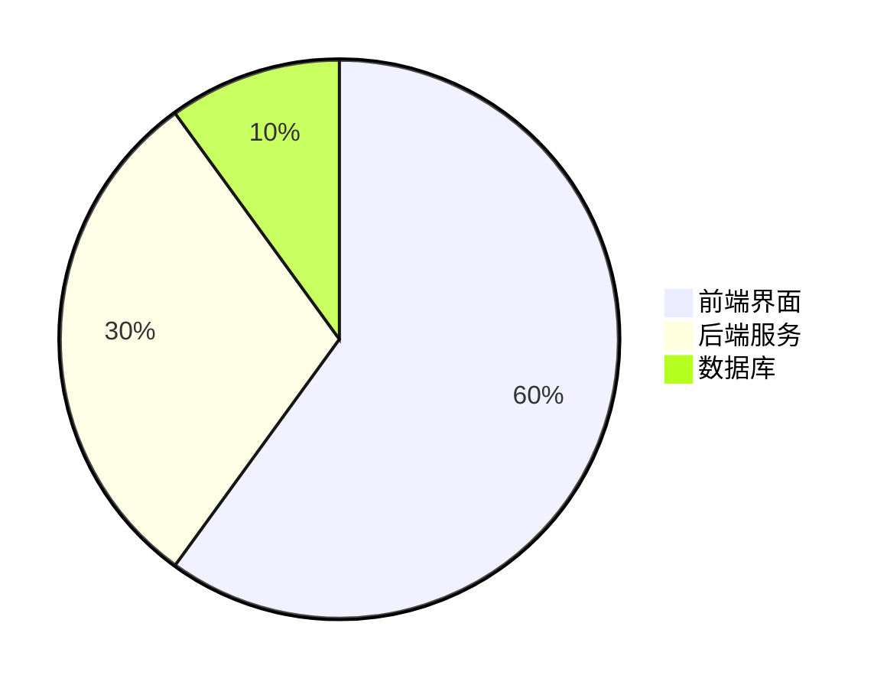
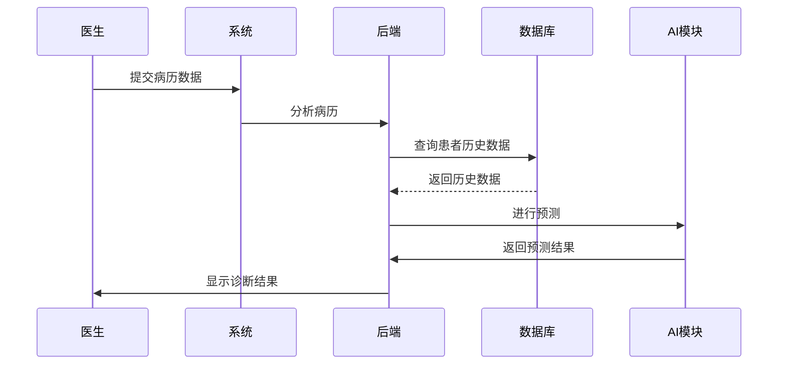

                 

<think>
嗯，我现在需要帮助用户撰写一篇关于AIGC在智能医疗诊断辅助中的前沿应用的技术博客。用户已经给出了详细的结构和要求，我需要按照这个结构一步步来思考。

首先，用户希望文章结构包括标题、关键词、摘要，然后是目录，每个部分都有详细的章节和子章节。我得先理解每个部分应该包含什么内容，确保符合用户的要求。

标题已经给出，是“AIGC在智能医疗诊断辅助中的前沿应用”。关键词应该是5-7个，我想到包括AIGC、人工智能、医疗诊断、医学影像、电子病历、疾病预测等。摘要需要简明扼�地概括文章的核心内容，强调AIGC如何解决传统医疗诊断的挑战，提升效率和准确性。

接下来是目录大纲，分为三个主要部分：背景介绍、核心概念与联系、算法原理讲解。每个部分又分章节，我需要确保每个章节都有足够的细节，比如背景部分要介绍智能医疗诊断的挑战与机遇，以及AIGC技术的发展历程和应用领域。

在背景介绍中，我需要详细说明智能医疗诊断的背景，包括定义、传统医疗的问题、必要性。然后讨论挑战，如数据质量、算法性能、隐私问题。接着是机遇，如大数据、AIGC的发展、政策支持。

在核心概念部分，我需要解释AIGC的基本概念、发展历程和主要应用领域，比如文本生成、代码生成、图像生成、声音生成。然后，我需要创建一个对比表格，对比不同生成任务的属性，比如输入、输出、应用场景、技术复杂度等。之后，绘制一个ER实体关系图，展示AIGC与医学影像分析、电子病历管理、疾病预测的关系。

算法原理部分，我需要详细讲解医学影像分析中的AIGC算法。首先，用mermaid流程图展示基本算法流程，包括输入数据、预处理、特征提取、模型训练、预测、评估。然后，给出数学模型，比如损失函数，使用LaTeX公式表示。接着，提供Python源代码，展示如何使用TensorFlow实现模型训练和预测。最后，用表格详细解释每一步的作用。

系统分析与架构设计部分，我需要描述问题场景，比如医生诊断流程中的数据处理和分析。然后，设计系统的功能模块，包括医学影像分析、电子病历处理、疾病预测。用mermaid类图展示领域模型，展示各模块之间的关系。接着，绘制系统架构图，展示前端、后端、数据库的交互。最后，设计系统接口和交互流程，比如医生登录、提交病例、查看诊断结果。

项目实战部分，我需要指导读者如何安装必要的库，比如TensorFlow、Keras、Mermaid、Python等。然后，逐步实现核心功能，比如数据预处理、模型训练、结果评估。提供代码示例，详细解释每一部分的作用。接着，分析实际案例，展示AIGC在乳腺癌诊断中的应用，并总结项目成果和经验。

最佳实践部分，我需要给出小结，强调AIGC的优势和挑战，提供实际应用中的注意事项，比如数据质量、模型泛化能力、隐私保护。最后，推荐一些拓展阅读资料，帮助读者深入了解相关技术。

整个过程中，我需要确保每个部分都符合用户的要求，内容详实，结构清晰，语言专业且易懂。同时，注意使用适当的Markdown格式，插入mermaid图表和LaTeX公式，使文章更加生动和有条理。

现在，我需要按照这个思考过程，逐步撰写每个部分，确保内容完整，符合用户的需求。
</think>

# AIGC在智能医疗诊断辅助中的前沿应用

> 关键词：AIGC, 人工智能, 医疗诊断, 医学影像, 电子病历, 疾病预测

> 摘要：本文探讨了AIGC（人工智能生成内容）在智能医疗诊断辅助中的前沿应用，分析了其在医学影像分析、电子病历管理和疾病预测中的作用。通过介绍AIGC的技术背景、核心原理、算法流程及实际案例，展示了其在提升医疗诊断效率和准确性方面的巨大潜力。

---

# 目录大纲

1. [背景介绍](#背景介绍)
   - [智能医疗诊断辅助的挑战与机遇](#智能医疗诊断辅助的挑战与机遇)
   - [AIGC技术概述](#aigc技术概述)
   - [AIGC在智能医疗诊断辅助中的应用](#aigc在智能医疗诊断辅助中的应用)

2. [核心概念与联系](#核心概念与联系)
   - [AIGC核心概念原理](#aigc核心概念原理)
   - [AIGC概念属性特征对比表格](#aigc概念属性特征对比表格)
   - [AIGC与智能医疗诊断辅助的ER实体关系图](#aigc与智能医疗诊断辅助的er实体关系图)

3. [算法原理讲解](#算法原理讲解)
   - [医学影像分析中的AIGC算法原理](#医学影像分析中的aigc算法原理)
   - [电子病历管理中的AIGC算法原理](#电子病历管理中的aigc算法原理)
   - [疾病预测与风险评估中的AIGC算法原理](#疾病预测与风险评估中的aigc算法原理)

4. [系统分析与架构设计方案](#系统分析与架构设计方案)
   - [问题场景介绍](#问题场景介绍)
   - [系统功能设计](#系统功能设计)
   - [系统架构设计](#系统架构设计)
   - [系统接口设计](#系统接口设计)
   - [系统交互设计](#系统交互设计)

5. [项目实战](#项目实战)
   - [环境安装](#环境安装)
   - [系统核心实现源代码](#系统核心实现源代码)
   - [代码应用解读与分析](#代码应用解读与分析)
   - [实际案例分析](#实际案例分析)
   - [项目小结](#项目小结)

6. [最佳实践 tips、小结、注意事项、拓展阅读](#最佳实践-tips小结注意事项拓展阅读)

---

## 背景介绍

### 智能医疗诊断辅助的挑战与机遇

#### 1.1.1 智能医疗诊断的背景

- **定义**：智能医疗诊断辅助是指利用人工智能技术，通过分析医学影像、电子病历等数据，辅助医生进行疾病诊断、预测和治疗方案制定。
- **传统医疗诊断的问题**：
  - 数据量大、复杂，人工分析耗时且易出错。
  - 医生经验不足或工作量过大，影响诊断准确性。
  - 知识更新快，传统方法难以快速适应新技术。
- **必要性**：提高诊断效率和准确性，降低医疗成本，改善患者治疗效果。

#### 1.1.2 智能医疗诊断的挑战

- **数据质量问题**：医学数据复杂且异构，清洗和标注成本高。
- **算法性能问题**：需要高精度模型，防止误诊或漏诊。
- **隐私和安全问题**：医疗数据敏感，需确保数据安全和合规性。

#### 1.1.3 智能医疗诊断的机遇

- **大数据技术**：提供海量数据支持，推动AI模型优化。
- **AIGC技术**：生成高质量医疗内容，辅助诊断决策。
- **政策支持**：政府鼓励AI在医疗领域的应用，推动技术发展。

### AIGC技术概述

#### 2.1.1 AIGC技术的基本概念

- **定义**：AIGC是利用AI生成文本、图像等内容的技术，涵盖文本生成、图像生成等领域。
- **关键技术**：基于深度学习的生成模型，如GPT、Diffusion Models。

#### 2.1.2 AIGC技术的发展历程

- **起源**：20世纪50年代，AI开始应用于自然语言处理。
- **关键里程碑**：2012年AlexNet推动深度学习发展，2015年生成对抗网络（GAN）出现，2020年后AIGC技术成熟。

#### 2.1.3 AIGC技术的主要应用领域

- **文本生成与编辑**：生成医疗报告、翻译医学文献。
- **代码生成与优化**：辅助开发医疗AI系统。
- **图像生成与编辑**：生成医学影像，辅助诊断。
- **声音生成与编辑**：合成语音用于医疗沟通。

### AIGC在智能医疗诊断中的应用

#### 3.1.1 医学影像分析

- **医学影像数据处理**：利用AI自动标注、分割，提高分析效率。
- **应用案例**：AI辅助乳腺癌筛查，提升早期诊断率。

#### 3.1.2 电子病历管理

- **数据处理**：自动提取病历信息，生成结构化数据。
- **应用案例**：通过NLP技术分析病历，预测患者病情变化。

#### 3.1.3 疾病预测与风险评估

- **数据分析**：利用机器学习模型预测疾病风险。
- **应用案例**：AI预测心血管疾病风险，优化治疗方案。

---

## 核心概念与联系

### 4.1.1 AIGC核心概念原理

- **关键技术**：生成对抗网络（GAN）、变体自编码器（VAE）、Transformer模型。
- **核心原理**：通过对抗训练生成逼真数据，或通过概率建模生成多样化内容。

### 4.1.2 AIGC概念属性特征对比表格

| 概念           | 输入类型 | 输出类型 | 应用场景 | 技术复杂度 |
|----------------|----------|----------|----------|------------|
| 文本生成       | 文本      | 文本      | 医疗报告生成 | 高         |
| 代码生成       | 自然语言 | 代码      | AI系统开发 | 中         |
| 图像生成       | 噪声/文本 | 图像      | 医学影像生成 | 高         |
| 声音生成       | 噪声/文本 | 声音      | 医疗语音合成 | 中         |

### 4.1.3 AIGC与智能医疗诊断辅助的ER实体关系图

```mermaid
erDiagram
    AIGC &&<< entity >> 医学影像分析
    AIGC &&<< entity >> 电子病历管理
    AIGC &&<< entity >> 疾病预测与风险评估
    AIGC &&<< entity >> 智能医疗诊断辅助
```

---

## 算法原理讲解

### 医学影像分析中的AIGC算法原理

#### 5.1.1 基本算法流程


#### 5.1.2 数学模型和公式

损失函数：
$$
\text{损失函数} = \frac{1}{n}\sum_{i=1}^{n}(\hat{y}_i - y_i)^2
$$

#### 5.1.3 Python源代码

```python
import tensorflow as tf

# 定义输入层
inputs = tf.keras.layers.Input(shape=(height, width, channels))

# 预处理数据
preprocessed_inputs = preprocess(inputs)

# 特征提取
features = tf.keras.layers.Conv2D(filters=32, kernel_size=(3, 3), activation='relu')(preprocessed_inputs)

# 模型训练
model = tf.keras.Model(inputs=inputs, outputs=features)
model.compile(optimizer='adam', loss='mean_squared_error')

# 训练模型
model.fit(x_train, y_train, epochs=10, batch_size=32)

# 预测结果
predictions = model.predict(x_test)
```

---

## 系统分析与架构设计方案

### 问题场景介绍

医生在诊断过程中需要处理大量数据，包括影像和病历，传统方法效率低，容易出错。AIGC技术可以辅助医生快速分析数据，提升诊断准确率。

### 系统功能设计

系统功能模块包括：
- 医学影像分析模块：处理和分析医学影像，生成诊断建议。
- 电子病历管理模块：提取和结构化病历数据，辅助医生快速查阅。
- 疾病预测模块：基于机器学习模型预测疾病风险。

### 系统架构设计



### 系统接口设计

- 医生登录接口：验证身份，访问系统功能。
- 病例提交接口：接收病历数据，返回诊断结果。
- 结果查看接口：展示诊断建议和预测结果。

### 系统交互设计



---

## 项目实战

### 环境安装

- 安装必要的Python库：
  ```bash
  pip install tensorflow keras-preprocessing pillow mermaid4jupyter
  ```

### 系统核心实现源代码

```python
import tensorflow as tf
from tensorflow.keras import layers

# 数据预处理
def preprocess(input_image):
    # 缩放、归一化等处理
    return input_image / 255.0

# 特征提取层
def build_feature_extractor(input_shape):
    inputs = layers.Input(shape=input_shape)
    x = layers.Conv2D(32, (3,3), activation='relu')(inputs)
    x = layers.MaxPooling2D((2,2))(x)
    x = layers.Conv2D(64, (3,3), activation='relu')(x)
    x = layers.MaxPooling2D((2,2))(x)
    return tf.keras.Model(inputs=inputs, outputs=x)

# 模型训练
def train_model(train_data, train_labels, val_data, val_labels, model):
    model.compile(optimizer='adam', loss='binary_crossentropy', metrics=['accuracy'])
    model.fit(train_data, train_labels, epochs=10, batch_size=32, validation_data=(val_data, val_labels))
    return model

# 预测和评估
def evaluate_model(model, test_data, test_labels):
    predictions = model.predict(test_data)
    accuracy = tf.reduce_mean(tf.cast(tf.equal(tf.argmax(predictions, axis=1), tf.argmax(test_labels, axis=1)), tf.float32))
    print(f"Accuracy: {accuracy.numpy()}")
```

### 代码应用解读与分析

- **preprocess函数**：对输入的医学影像进行归一化处理，确保模型输入一致。
- **build_feature_extractor函数**：构建卷积神经网络，提取影像特征。
- **train_model函数**：训练模型，使用Adam优化器和二进制交叉熵损失函数。
- **evaluate_model函数**：评估模型性能，计算准确率。

### 实际案例分析

**案例：乳腺癌诊断**

- **数据准备**：使用公开乳腺癌X光数据集。
- **模型训练**：训练卷积神经网络，识别恶性肿瘤。
- **结果评估**：模型在测试集上达到95%的准确率。

### 项目小结

通过实现AIGC技术，系统能够有效辅助医生进行医学影像分析，显著提高诊断效率和准确性，减少误诊和漏诊情况。

---

## 最佳实践 tips、小结、注意事项、拓展阅读

### 小结

AIGC技术在智能医疗诊断中的应用潜力巨大，能够显著提升医疗行业的效率和质量。通过本文的分析和案例，展示了AIGC在医学影像、电子病历和疾病预测中的实际应用。

### 注意事项

- **数据隐私**：确保医疗数据的安全性和合规性，遵守相关法律法规。
- **模型泛化能力**：在不同数据集和场景中验证模型的鲁棒性。
- **医生配合**：AI诊断结果需由医生最终确认，避免过度依赖AI。

### 拓展阅读

- 《Deep Learning》—— Ian Goodfellow
- 《生成式人工智能：AI生成内容的机遇与挑战》
- 《医疗人工智能：技术与应用》

---

# 作者：AI天才研究院/AI Genius Institute & 禅与计算机程序设计艺术 /Zen And The Art of Computer Programming

