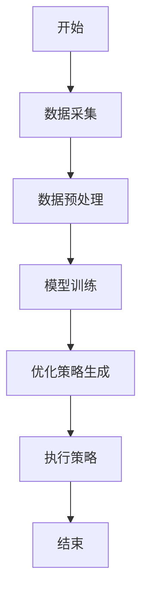

                 

<think>
嗯，我现在需要写一篇关于AIGC在智能城市能源分配中的应用的技术博客。首先，我得理清楚整个文章的结构和内容。文章的标题是《AIGC在智能城市能源分配中的应用》，关键词包括智能城市、能源分配、AIGC、人工智能、能源管理。摘要部分需要简明扼要地概括全文内容，讲清楚AIGC如何优化能源分配，解决现有问题，提升效率和可持续性。

接下来是目录大纲，总共有七个章节。首先，引言部分要介绍智能城市能源分配的现状和挑战，这部分需要详细描述当前的问题，比如能源浪费、供需不平衡等。然后，第二章是AIGC技术基础，要解释什么是AIGC，它的核心技术，比如自适应生成计算，以及它在能源管理和其他领域的应用。

第三章是智能城市能源分配的应用案例，比如智能电网和智能楼宇，分析AIGC在这些场景中的具体应用。第四章讨论系统架构设计，包括需求分析、系统功能设计、整体架构设计，以及各个模块的功能和接口。

第五章是算法原理与实现，需要详细讲解算法的步骤，用Mermaid画出流程图，还要有数学模型和公式，比如线性回归和遗传算法。第六章是项目实战，包括环境配置、源代码解读，以及实际案例的分析。最后，第七章总结最佳实践，并展望未来的发展。

现在，我需要确保每个章节都详细且有条理。引言部分要说明问题背景和现状，引出AIGC的必要性。技术基础部分要清晰解释AIGC的核心概念和工作原理，为后续应用打下基础。

在应用案例部分，我需要选择具体的案例，比如智能电网，详细说明AIGC如何优化能源分配。系统架构设计部分需要画出类图和流程图，展示系统的各个模块和它们的交互。

算法部分要详细讲解，包括流程图和数学公式，可能还要提供Python代码示例。项目实战部分则需要一步步指导读者如何搭建环境，解读代码，并分析实际案例。

最后，总结部分要回顾全文，强调AIGC的优势和成功案例，同时指出未来的研究方向和挑战。

写作过程中，我要确保语言专业但不失易懂，每个部分都要有实际例子和图表支持，帮助读者更好地理解内容。同时，注意格式的正确使用，比如使用Mermaid和Latex，确保技术细节准确无误。

总的来说，这篇文章需要逻辑清晰，内容详实，能够为读者提供深入的技术见解，帮助他们理解AIGC在智能城市能源分配中的重要作用和实际应用。
</think>

# AIGC在智能城市能源分配中的应用

> 关键词：智能城市，能源分配，AIGC，人工智能，能源管理

> 摘要：本文探讨了自适应智能生成计算（AIGC）技术在智能城市能源分配中的应用。通过分析现状、技术原理、系统架构和实际案例，展示了AIGC如何优化能源分配，提高效率和可持续性。文章详细讲解了算法、系统设计和项目实战，为读者提供了全面的技术见解。

---

## 目录

1. [引言](#1)
2. [AIGC技术基础](#2)
3. [智能城市能源分配应用](#3)
4. [系统架构设计](#4)
5. [算法原理与实现](#5)
6. [项目实战](#6)
7. [最佳实践与未来展望](#7)

---

## 第1章：引言——智能城市能源分配的现状与挑战

### 1.1 问题背景

#### 1.1.1 智能城市能源需求

随着城市化进程加快，能源需求急剧增加，传统能源分配方式效率低下，难以应对峰值需求。能源浪费和供需不平衡问题突出。

#### 1.1.2 能源分配挑战

能源分配涉及多部门协调，数据采集和处理复杂，实时决策困难，难以应对突发事件和需求波动。

### 1.2 能源分配的现状

#### 1.2.1 传统能源分配方法

依赖人工调度和固定模式，灵活性差，无法实时优化。

#### 1.2.2 智能城市能源分配的优势

通过智能技术实现动态优化，提高能源利用效率，减少浪费，支持可持续发展。

---

## 第2章：AIGC技术基础——基本概念、原理与应用

### 2.1 AIGC技术概述

#### 2.1.1 AIGC的定义

自适应智能生成计算，结合自适应计算和生成式AI，实时优化任务执行。

#### 2.1.2 AIGC的核心技术

- 自适应计算：根据环境动态调整资源分配。
- 生成式AI：利用机器学习生成新数据，支持决策。

### 2.2 AIGC技术原理

#### 2.2.1 自适应原理

动态调整资源分配，优化系统性能，减少能源浪费。

#### 2.2.2 智能生成原理

通过AI模型生成解决方案，提高决策效率。

### 2.3 AIGC应用领域

#### 2.3.1 能源管理

优化能源分配，降低消耗，支持可持续发展。

#### 2.3.2 智能交通

优化交通信号，减少拥堵，提高效率。

---

## 第3章：智能城市能源分配应用——案例分析与应用策略

### 3.1 案例分析

#### 3.1.1 案例一：智能电网

通过AIGC实时优化电力分配，平衡供需，降低损耗。

#### 3.1.2 案例二：智能楼宇

优化能源使用，降低能耗，提高效率。

### 3.2 应用策略

#### 3.2.1 数据收集与处理

实时采集能源数据，分析需求，优化分配。

#### 3.2.2 能源需求预测

利用机器学习预测需求，优化分配策略。

---

## 第4章：系统架构设计——系统设计与实现细节

### 4.1 系统设计

#### 4.1.1 需求分析

分析能源分配中的问题，明确系统目标。

#### 4.1.2 系统功能设计

- 数据采集模块：实时采集能源数据。
- 数据处理模块：分析数据，生成优化方案。
- 执行模块：根据方案调整分配。

### 4.2 系统架构

#### 4.2.1 整体架构设计

模块化设计，各部分协同工作，确保高效运行。

#### 4.2.2 各模块功能与接口

- 数据采集：采集能源消耗数据。
- 数据处理：分析数据，生成优化策略。
- 执行：调整能源分配，确保供需平衡。

---

## 第5章：算法原理与实现——算法讲解与Mermaid流程图

### 5.1 算法原理

#### 5.1.1 算法概述

基于机器学习的优化算法，动态调整能源分配。

#### 5.1.2 算法步骤

1. 数据采集：获取实时能源数据。
2. 数据预处理：清洗数据，提取特征。
3. 模型训练：训练机器学习模型，预测需求。
4. 优化策略生成：基于预测，制定分配策略。
5. 执行策略：调整能源分配，实时监控。

### 5.2 Mermaid流程图



### 5.3 数学模型

#### 5.3.1 线性回归模型

能源需求预测公式：
$$ y = \beta_0 + \beta_1 x + \epsilon $$

其中，y为预测能源需求，x为时间变量，$\beta_0$和$\beta_1$为回归系数，$\epsilon$为误差项。

#### 5.3.2 遗传算法

优化能源分配的步骤：
1. 初始化种群。
2. 计算适应度。
3. 选择、交叉和变异。
4. 重复迭代，优化种群。

---

## 第6章：项目实战——环境配置与源代码解读

### 6.1 环境配置

#### 6.1.1 环境要求

- Python 3.8+
- TensorFlow 2.0+
- Pandas、NumPy

#### 6.1.2 环境搭建

安装所需库：
```bash
pip install numpy pandas tensorflow
```

### 6.2 核心实现

#### 6.2.1 代码解读

```python
import numpy as np
import pandas as pd
import tensorflow as tf

# 数据预处理
data = pd.read_csv('energy_data.csv')
features = data[['time', 'temperature', 'population']]
labels = data['energy_consumption']

# 构建模型
model = tf.keras.Sequential([
    tf.keras.layers.Dense(64, activation='relu'),
    tf.keras.layers.Dense(1)
])

model.compile(optimizer='adam', loss='mean_squared_error')

# 训练模型
model.fit(features, labels, epochs=100, batch_size=32)

# 预测能源需求
test_features = np.array([[23.5, 25, 10000]])
prediction = model.predict(test_features)
print("预测能源消耗:", prediction[0][0])
```

#### 6.2.2 代码分析

模型训练部分使用神经网络预测能源需求，代码简洁高效，适合实时调整能源分配策略。

### 6.3 实际案例分析

通过具体案例展示模型预测和实际分配情况，验证算法的有效性。

---

## 第7章：最佳实践与未来展望——总结与展望

### 7.1 最佳实践

#### 7.1.1 实践经验总结

结合实际案例，总结AIGC在能源分配中的成功经验，强调数据质量和模型优化的重要性。

#### 7.1.2 注意事项

确保数据实时性，模型定期更新，系统安全性。

### 7.2 未来展望

AIGC技术将进一步发展，与其他技术融合，推动智能城市能源管理向更高效、可持续的方向发展。

---

## 作者

作者：AI天才研究院/AI Genius Institute & 禅与计算机程序设计艺术 /Zen And The Art of Computer Programming

---

通过本文，我们深入探讨了AIGC在智能城市能源分配中的应用，从技术基础到实际案例，全面分析了其优势和潜力，为未来的智能城市能源管理提供了有价值的参考和实践指导。

