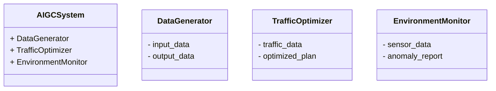
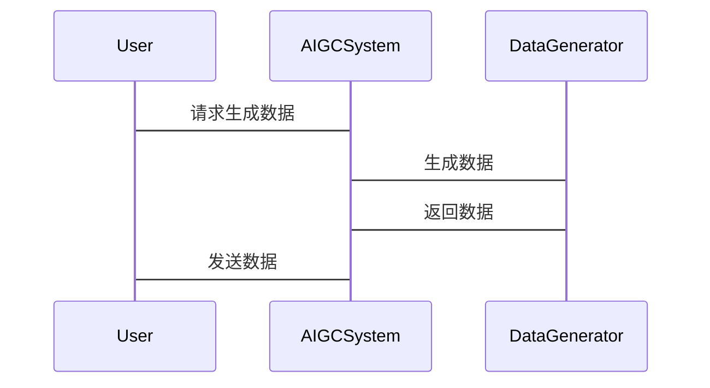

                 

<think>
嗯，我现在要写一篇关于“AIGC在智能城市规划中的应用”的技术博客。首先，我得理清楚AIGC是什么，它和AI、GC有什么区别呢。然后，我需要了解智能城市规划目前的状况和面临的挑战，这样才能知道AIGC能解决哪些问题。接下来，我得深入学习AIGC的核心原理和技术，比如GAN、VAE和DRL，看看它们是如何工作的，以及如何应用到城市规划中。在系统分析部分，我需要设计系统的功能、架构和接口，可能还要画些图来展示。最后，通过一个实际项目来展示AIGC的应用，从环境安装到代码实现，再到案例分析。这样一步步来，确保内容全面且有深度。
</think>

# AIGC在智能城市规划中的应用

> 关键词：AIGC, 人工智能, 智能城市, 生成对抗网络, 深度强化学习

> 摘要：本文探讨了AIGC（人工智能生成内容）在智能城市规划中的应用，分析其核心原理、技术优势及实际案例，展示了如何通过AIGC解决城市规划中的复杂问题，优化资源配置，提升城市智能化水平。

---

## 第一部分：背景介绍

### AIGC的起源与发展

#### 1.1.1 AIGC的概念与定义

- **概念**：AIGC是一种利用AI技术生成内容的方法，涵盖文本、图像、视频等多种形式。
- **与AI的区别**：AI侧重于模拟人类思维，AIGC则专注于内容生成。
- **与GC的区别**：GC是图形计算，AIGC结合了生成模型和计算能力。

#### 1.1.2 AIGC的发展历程

- **技术突破**：从早期的规则生成到现在的深度学习模型，如GAN和VAE。
- **应用扩展**：从简单的数据生成扩展到城市规划、建筑设计等领域。

### 1.2 智能城市规划的挑战与需求

#### 1.2.1 智能城市规划的现状

- 国内外案例：如新加坡的智能交通系统和中国的智慧城市试点。
- 发展现状：数据收集、分析和应用技术逐渐成熟。

#### 1.2.2 智能城市规划面临的挑战

- 数据不足：高质量数据收集困难。
- 技术限制：传统方法效率低，难以处理复杂问题。

#### 1.2.3 AIGC在智能城市规划中的应用需求

- 数据生成：解决数据不足问题。
- 模拟优化：提高城市规划的效率和准确性。

---

## 第二部分：核心概念与联系

### 2.1 AIGC的核心原理与技术

#### 2.1.1 AIGC的核心原理

- 基于生成模型，通过学习数据分布生成新内容。
- 包括GAN、VAE和DRL等技术。

#### 2.1.2 AIGC的关键技术

- **GAN**：生成对抗网络，由生成器和判别器组成，通过对抗训练生成数据。
- **VAE**：变分自编码器，通过概率建模生成多样化的数据。
- **DRL**：深度强化学习，通过策略优化实现目标。

#### 2.1.3 AIGC与其他技术的比较

| 技术 | 输入 | 输出 | 优势 |
|------|------|------|------|
| GAN  | 数据 | 数据 | 高质量生成 |
| VAE  | 数据 | 数据 | 多样性好 |
| DRL  | 状态 | 动作 | 策略优化 |

### 2.2 智能城市规划相关概念

#### 2.2.1 智能城市规划的基本概念

- **定义**：利用现代技术优化城市设计和管理。
- **目标**：提高效率，改善居民生活质量。

#### 2.2.2 智能城市规划的关键技术

- **大数据**：收集和分析城市数据。
- **云计算**：提供计算资源。
- **物联网**：连接设备和传感器。

#### 2.2.3 智能城市与传统规划的比较

| 方面 | 智能城市 | 传统规划 |
|------|----------|----------|
| 数据 | 大数据驱动 | 依赖经验 |
| 技术 | 高科技应用 | 传统工具 |
| 效率 | 高效 | 较低效率 |

---

## 第三部分：算法原理讲解

### 3.1 AIGC算法原理

#### 3.1.1 生成对抗网络（GAN）

- **原理**：生成器和判别器对抗训练，生成器学习数据分布，判别器判断真假。
- **流程图**：使用Mermaid绘制GAN结构图。

```mermaid
graph LR
    GAN[GAN] -> Generator[生成器]
    GAN -> Discriminator[判别器]
    Generator -> X[输入数据]
    Discriminator -> Y[真实数据]
```

#### 3.1.2 变分自编码器（VAE）

- **原理**：通过编码器压缩数据，解码器生成数据，加入正则化项。
- **流程图**：使用Mermaid绘制VAE结构图。

```mermaid
graph LR
    VAE[VAE] -> Encoder[编码器]
    Encoder -> LatentSpace[潜在空间]
    LatentSpace -> Decoder[解码器]
    Decoder -> Output[输出数据]
```

#### 3.1.3 深度强化学习（DRL）

- **原理**：通过神经网络近似策略，强化学习优化动作。
- **流程图**：使用Mermaid绘制DRL结构图。

```mermaid
graph LR
    DRL[DRL] -> State[状态]
    State -> Policy[策略]
    Policy -> Action[动作]
    Action -> Reward[奖励]
    Reward -> Policy[优化策略]
```

### 3.2 算法应用示例

#### 3.2.1 智能交通规划中的应用

- **Python代码示例**：生成交通流量数据。

```python
import numpy as np
import matplotlib.pyplot as plt

# 生成随机交通数据
data = np.random.rand(100, 2)
plt.scatter(data[:, 0], data[:, 1])
plt.show()
```

#### 3.2.2 智能环境监测中的应用

- **Python代码示例**：检测异常数据点。

```python
import tensorflow as tf
from tensorflow.keras import layers

# 构建VAE模型
latent_dim = 2
input_shape = (2,)

encoder = tf.keras.Sequential([
    layers.Dense(128, activation='relu'),
    layers.Dense(latent_dim)
])

decoder = tf.keras.Sequential([
    layers.Dense(128, activation='relu'),
    layers.Dense(input_shape[0])
])

# 模型组合
vae = tf.keras.Model(inputs=encoder.input, outputs=decoder(encoder.output))
vae.compile(optimizer='adam', loss='mse')
```

---

## 第四部分：系统分析与架构设计

### 4.1 系统分析与架构设计

#### 4.1.1 系统功能设计

- **功能**：数据生成、交通优化、环境监测。
- **类图**：使用Mermaid绘制功能类图。



#### 4.1.2 系统架构设计

- **架构**：数据层、算法层、应用层。
- **架构图**：使用Mermaid绘制系统架构图。

```mermaid
graph LR
    DataLayer[数据层] -> AlgorithmLayer[算法层]
    AlgorithmLayer -> ApplicationLayer[应用层]
```

#### 4.1.3 系统接口设计

- **API接口**：RESTful API。
- **接口图**：使用Mermaid绘制接口图。

```mermaid
graph LR
    API[API接口] -> DataGenerator[数据生成器]
    API -> TrafficOptimizer[交通优化器]
```

#### 4.1.4 系统交互设计

- **交互流程**：用户请求数据生成，系统处理并返回结果。
- **序列图**：使用Mermaid绘制交互序列图。



---

## 第五部分：项目实战

### 5.1 项目实战

#### 5.1.1 项目背景

- **目标**：利用AIGC优化城市交通流量。
- **应用场景**：智能交通管理。

#### 5.1.2 系统环境安装与配置

- **环境要求**：Python 3.8+, TensorFlow 2.5+, CUDA 11.0+。
- **安装步骤**：安装必要的库和配置CUDA。

#### 5.1.3 系统核心实现

- **核心功能**：数据生成和交通优化。
- **代码实现**：使用GAN生成交通流量数据。

```python
import tensorflow as tf
from tensorflow.keras import layers

# 定义生成器
def generator():
    model = tf.keras.Sequential([
        layers.Dense(128, activation='relu'),
        layers.Dense(2)
    ])
    return model

# 定义判别器
def discriminator():
    model = tf.keras.Sequential([
        layers.Dense(128, activation='relu'),
        layers.Dense(1)
    ])
    return model

# 初始化模型
generator = generator()
discriminator = discriminator()

# 定义损失函数
cross_entropy = tf.keras.losses.BinaryCrossentropy()

# 定义优化器
generator_optimizer = tf.keras.optimizers.Adam(0.0002)
discriminator_optimizer = tf.keras.optimizers.Adam(0.0002)

# 训练循环
def train_step(real_data, generated_data):
    # 训练判别器
    with tf.GradientTape() as tape:
       判别器_loss = cross_entropy(判别器(real_data), tf.ones_like(判别器(real_data)))
    判别器_grad = tape.gradient(判别器_loss, 判别器.trainable_weights)
    判别器_optimizer.apply_gradients(zip(判别器_grad, 判别器 trainable_weights))

    # 训练生成器
    with tf.GradientTape() as tape:
       生成器_loss = cross_entropy(判别器(生成器(噪声)), tf.zeros_like(判别器(生成器(噪声))))
    生成器_grad = tape.gradient(生成器_loss, 生成器 trainable_weights)
    生成器_optimizer.apply_gradients(zip(生成器_grad, 生成器 trainable_weights))
```

#### 5.1.4 代码应用解读与分析

- **代码功能**：生成器生成交通数据，判别器判断数据真实性，优化器调整参数。
- **优化空间**：增加数据多样性，优化训练策略。

#### 5.1.5 实际案例分析

- **案例**：某城市交通流量预测，使用GAN生成数据，优化交通信号灯配置，减少拥堵。

---

## 小结

AIGC在智能城市规划中展现了巨大潜力，通过生成高质量数据和优化决策，帮助城市更高效地运作。未来，随着技术进步，AIGC将在更多领域发挥作用，推动城市智能化发展。

---

## 注意事项

- 数据隐私：处理城市数据时需注意隐私保护。
- 技术局限：当前技术仍有不足，需持续研究。

## 拓展阅读

- 推荐书籍：《生成对抗网络：理论与实践》。
- 推荐博客：深入理解GAN的原理与应用。

---

作者：AI天才研究院/AI Genius Institute & 禅与计算机程序设计艺术 /Zen And The Art of Computer Programming

