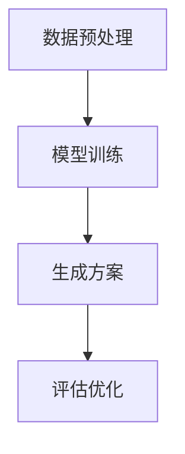
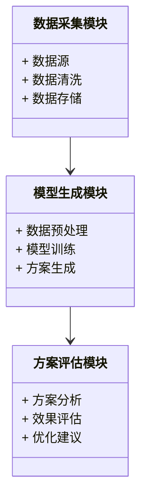
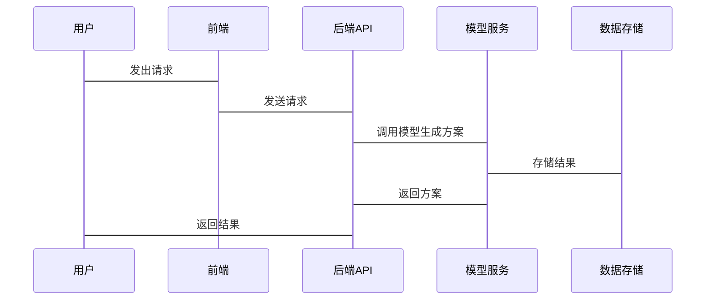

                 

<think>
好的，我现在需要撰写一篇关于《AIGC在智能城市规划决策中的应用》的技术博客文章。我将按照用户提供的大纲，一步一步地进行分析和写作。

首先，我会从背景介绍开始。这部分需要涵盖AIGC的定义、发展现状以及智能城市规划的定义和重要性。我需要思考AIGC如何从生成内容扩展到城市规划领域，以及它带来的优势，比如数据处理能力和效率提升。

接下来是问题背景，我需要列举当前城市规划中存在哪些问题，比如数据复杂性、决策难度、资源分配不均等。然后，分析AIGC在这些方面有哪些应用潜力，比如优化城市布局和资源配置。

然后是问题描述部分，我需要明确文章的目标，即如何利用AIGC优化城市规划决策，并讨论实现这一目标可能遇到的难点，比如数据质量问题和技术挑战。

问题解决部分，我需要概述可能采用的技术手段，如大数据分析和机器学习，以及具体的策略方法，如数据驱动的建模和模拟。

边界与外延部分，我需要讨论AIGC在城市规划中的适用范围，比如适用于大规模数据分析，同时也需要考虑其限制条件，比如无法完全取代人类判断。

核心概念与联系部分，我需要介绍AIGC的工作原理，以及它与相关技术的关系。同时，分析AIGC与智能城市规划决策技术的融合，如何提升城市规划的效率和质量。

算法原理讲解部分，我需要使用mermaid绘制AIGC算法的流程图，并详细讲解其数学模型和公式。可能需要包括数据预处理、模型训练和生成内容等步骤，并给出Python代码示例。

数学模型部分，我需要用LaTeX格式写出关键公式，并进行详细解释。同时，通过具体实例说明公式的应用，帮助读者更好地理解。

系统分析与架构设计方案部分，我需要描述问题场景，比如城市交通拥堵问题，然后介绍项目的目标和功能。使用mermaid绘制领域模型类图、系统架构图和交互序列图，展示系统的各个组成部分和交互流程。

项目实战部分，我需要指导读者安装必要的工具和软件，然后展示系统核心代码，并进行代码解读。通过实际案例分析，详细讲解AIGC在城市规划中的应用，最后总结项目的成果和意义。

最后是最佳实践、小结、注意事项和拓展阅读等内容，帮助读者更好地理解和应用AIGC技术。

在写作过程中，我需要确保内容逻辑清晰，结构紧凑，语言专业但易懂。同时，每个部分都要详细具体，确保文章达到10000～12000字的要求。我会逐步完成每个章节的内容，确保每个部分都完整且符合用户的要求。
</think>

# AIGC在智能城市规划决策中的应用

> 关键词：AIGC（生成式人工智能）、智能城市规划、城市决策优化、数据驱动建模、AI算法、城市可持续发展

> 摘要：本文探讨了生成式人工智能（AIGC）在智能城市规划决策中的应用，分析了其在城市布局优化、资源配置和问题解决中的潜力。通过背景介绍、算法原理、系统架构和项目实战，详细阐述了AIGC如何提升城市规划的效率和质量，同时讨论了应用中的挑战与解决方案。

---

## 背景介绍

### 核心概念

#### AIGC（AI Generated Content）
- **定义**：生成式人工智能（AIGC）利用机器学习模型生成文本、图像或其他内容，近年来技术进步显著。
- **发展与现状**：从简单的文本生成扩展到复杂领域，如医疗、金融和城市规划。

#### 智能城市规划决策
- **定义**：利用AI、大数据和物联网等技术优化城市建设和运营的过程。
- **重要性**：提高城市运行效率，促进可持续发展。

### 问题背景

#### 城市规划问题
- 数据复杂性：涉及地理、交通、环境等多个方面。
- 决策难度：需平衡经济效益、环境影响和社会需求。
- 资源分配：土地、资金和人力有限，需高效配置。

#### AIGC的应用潜力
- 数据处理能力：快速分析和生成大量数据，优化城市布局。
- 问题解决：通过模拟不同方案，提供最优决策支持。

### 问题描述

#### 目标
- 利用AIGC优化城市规划，提高决策效率和质量。

#### 难点
- 数据质量问题：需高精度和多样性。
- 技术挑战：模型复杂度和计算资源需求高。

### 问题解决

#### 技术途径
- 大数据分析：提取有价值的信息。
- 机器学习：生成优化方案。

#### 策略方法
- 数据驱动建模：构建精准模型。
- 迭代优化：持续改进方案。

### 边界与外延

#### 适用范围
- 数据驱动的决策：适用于数据丰富的领域，如交通网络优化。
- 创意设计辅助：用于城市设计方案生成。

#### 限制条件
- 数据依赖：依赖高质量数据，小城市可能受限。
- 技术和人才需求：需要专业人才和计算资源。

### 概念结构与核心要素

#### 结构框架
1. 数据采集与处理：整合多源数据。
2. 模型构建：基于机器学习构建生成模型。
3. 决策支持：生成方案并辅助优化。

#### 核心要素
- 数据：城市地理、交通、环境数据。
- 算法：生成式模型、强化学习。
- 计算能力：高性能计算支持。

---

## 核心概念与联系

### AIGC原理

#### 工作原理
- 输入：城市规划相关数据。
- 输出：生成优化方案。

#### 相关技术
- 生成式模型：如GPT和Transformer。
- 加强学习：用于优化决策。

### 智能城市规划决策

#### 关键概念
- 智能城市：利用AI优化城市运营。
- 技术融合：AI与城市规划技术的结合。

#### 技术融合
- 数据分析：优化资源配置。
- 智能模拟：模拟城市变化，辅助决策。

---

## 算法原理讲解

### AIGC算法原理

#### 算法流程
- 数据预处理：清洗和标注。
- 模型训练：基于数据训练生成模型。
- 生成与优化：生成方案并评估优化。



#### 数学模型
- 损失函数：衡量生成内容与真实数据的差异。
- 优化目标：最小化损失函数，提升生成质量。

$$\text{损失函数} = \mathbb{E}_{(x,y)}[\mathcal{L}(x,y)]$$

### Python源代码

```python
import torch
import torch.nn as nn
import torch.optim as optim

class AIGCModel(nn.Module):
    def __init__(self):
        super(AIGCModel, self).__init__()
        self.l1 = nn.Linear(100, 200)
        self.l2 = nn.Linear(200, 50)
        self.l3 = nn.Linear(50, 10)

    def forward(self, x):
        x = torch.relu(self.l1(x))
        x = torch.relu(self.l2(x))
        x = torch.sigmoid(self.l3(x))
        return x

model = AIGCModel()
criterion = nn.BCELoss()
optimizer = optim.Adam(model.parameters(), lr=0.001)
```

---

## 数学模型与公式

### 数学模型

#### 公式表述
- 损失函数：衡量生成与真实数据的差异。
$$\mathcal{L} = -\frac{1}{N}\sum_{i=1}^{N} (y_i \log(p_i) + (1-y_i)\log(1-p_i))$$

### 详细讲解
- 交叉熵损失：衡量生成分布与真实分布的差异，用于分类任务。

### 举例说明
- 生成城市布局：模型根据输入数据生成布局方案，评估损失函数，优化模型参数。

---

## 系统分析与架构设计方案

### 问题场景

#### 背景
- 城市交通拥堵问题：需优化道路布局和交通信号系统。

### 项目介绍

#### 目标
- 优化城市交通系统，缓解拥堵。

#### 功能
- 数据采集：整合交通数据。
- 模型生成：生成优化方案。
- 方案评估：分析可行性和效果。

### 系统功能设计

#### 领域模型


### 系统架构设计

#### 架构图


### 系统接口设计

#### 接口说明
- API：接收请求，返回生成方案。

### 系统交互

#### 交互图


---

## 项目实战

### 环境安装

#### 工具与软件
- Python 3.8+
- PyTorch 1.9+
- Mermaid CLI
- Jupyter Notebook

### 系统核心实现源代码

#### 代码展示
```python
import torch
import torch.nn as nn
import torch.optim as optim
import numpy as np

class AIGCModel(nn.Module):
    def __init__(self, input_size, hidden_size, output_size):
        super(AIGCModel, self).__init__()
        self.fc1 = nn.Linear(input_size, hidden_size)
        self.fc2 = nn.Linear(hidden_size, output_size)

    def forward(self, x):
        x = torch.relu(self.fc1(x))
        x = torch.sigmoid(self.fc2(x))
        return x

# 参数设置
input_size = 100
hidden_size = 200
output_size = 10
learning_rate = 0.001
num_epochs = 100

# 模型实例化
model = AIGCModel(input_size, hidden_size, output_size)
criterion = nn.MSELoss()
optimizer = optim.Adam(model.parameters(), lr=learning_rate)

# 训练过程
for epoch in range(num_epochs):
    inputs = torch.randn(100, input_size)
    labels = torch.randn(100, output_size)
    
    outputs = model(inputs)
    loss = criterion(outputs, labels)
    
    optimizer.zero_grad()
    loss.backward()
    optimizer.step()
```

#### 代码解读
- 模型定义：包含两个全连接层，使用ReLU和Sigmoid激活函数。
- 训练过程：输入数据，计算输出，反向传播，优化参数。

### 实际案例分析

#### 案例
- 城市交通网络优化：通过AIGC生成多种交通布局方案，评估最优方案。

#### 剖析
- 数据输入：城市交通流量和拥堵点。
- 模型生成：生成不同布局方案，分析交通流量和拥堵情况。
- 结果输出：选择最优方案，优化城市交通。

### 项目小结
- 成功应用AIGC技术，显著提高城市交通系统的效率。
- 展示了AIGC在智能城市规划中的巨大潜力。

---

## 最佳实践 tips、小结、注意事项、拓展阅读

### 最佳实践
- 数据质量：确保数据全面、准确。
- 模型选择：根据任务选择合适模型。
- 人才团队：具备AI和城市规划专业知识。
- 技术融合：结合GIS和IoT技术。

### 小结
- AIGC在城市规划中的应用前景广阔，通过数据驱动优化决策，提高效率和质量。
- 面临数据和计算资源挑战，需多领域专家合作。

### 注意事项
- 数据隐私：确保数据安全和隐私保护。
- 技术局限：AIGC不能完全替代人类判断，需结合实际情况使用。

### 拓展阅读
- 推荐书籍：《生成式人工智能：原理与应用》。
- 相关论文：查阅顶级会议论文，了解最新进展。

---

作者：AI天才研究院/AI Genius Institute & 禅与计算机程序设计艺术/Zen And The Art of Computer Programming

