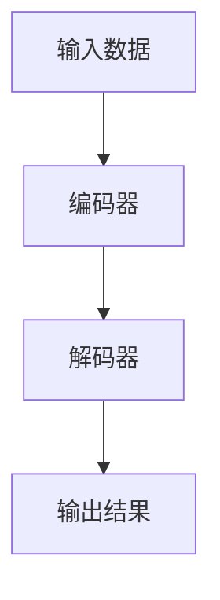
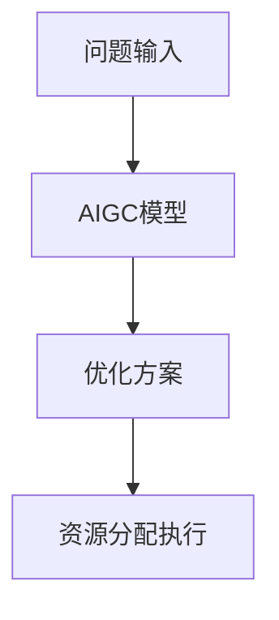
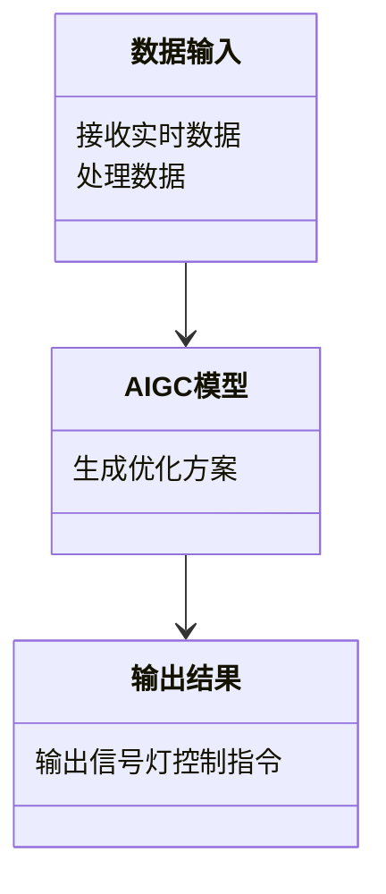
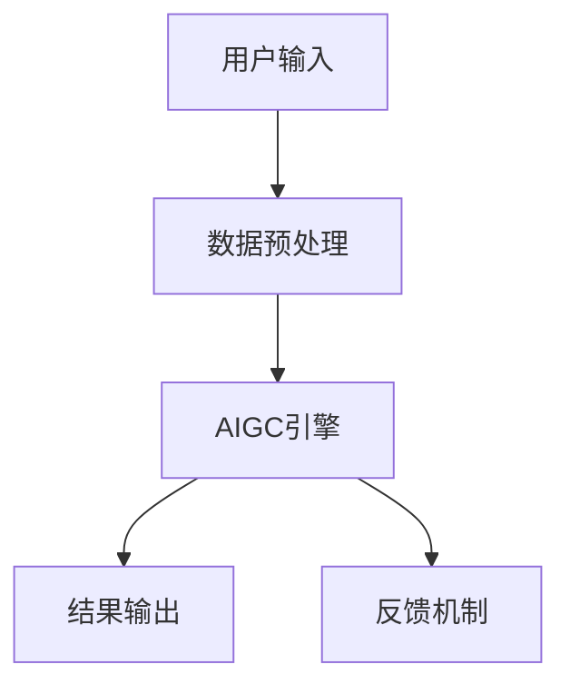
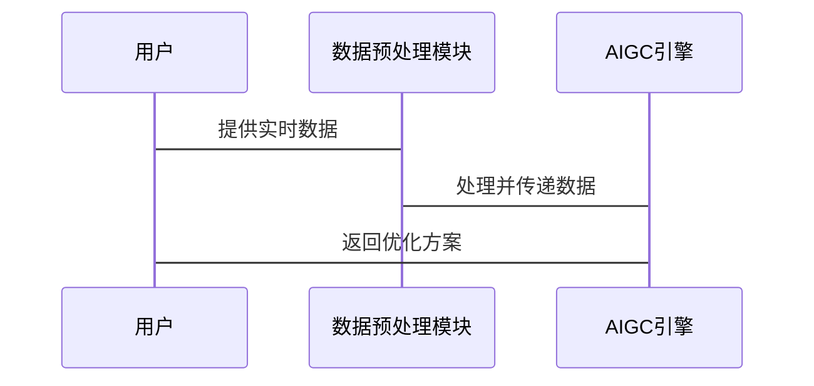

                 

<think>
嗯，我现在要写一篇关于《AIGC在智能城市资源分配中的应用》的技术博客。首先，我需要理解这个主题，AIGC应该是人工智能生成内容，对吧？那它在智能城市里的资源分配有什么应用呢？

我应该先从智能城市的基本概念开始，了解什么是智能城市，资源分配在其中扮演的角色。然后，深入AIGC是什么，它的原理和类型，以及它如何与智能城市资源分配相关联。

接下来，我得分析智能城市资源分配的现状，看看现在存在哪些问题，比如资源浪费、分配不均等。然后，通过案例研究来具体说明这些问题，比如交通拥堵或能源浪费的例子。

接下来，我需要详细介绍AIGC在智能交通中的应用。比如，如何通过AIGC预测交通流量，优化信号灯控制，提高交通效率。这部分需要包括需求分析、技术应用和案例分析，同时也要讨论应用中的挑战和未来的发展方向。

然后，转向能源管理中的应用。AIGC如何帮助预测能源需求，优化分配策略，提高能源使用效率。同样，这部分需要现状分析、技术应用、案例研究，以及挑战和展望。

接下来，可能需要讨论其他资源分配领域，比如公共安全或废物管理，看看AIGC在那里能做些什么。

然后，我需要详细讲解AIGC的技术原理，包括其基本原理和架构，确保读者理解它为什么有效。这可能涉及到一些数学模型和算法，比如机器学习模型如何预测和优化。

此外，我需要提供一些系统架构的设计，用Mermaid图展示领域模型、系统架构和交互流程。这会帮助读者更好地理解系统是如何运作的。

在项目实战部分，我可能需要展示一个具体的案例，从环境安装、系统设计到核心代码实现，详细解读每个步骤，并分析实际案例的效果。

最后，总结一下AIGC在智能城市资源分配中的优势和挑战，展望未来的发展方向，并给出一些最佳实践的建议。

整个过程中，我需要确保内容逻辑清晰，结构紧凑，使用专业的技术语言，同时保持简单易懂。可能需要多次修改和补充，以确保每个部分都详尽具体，并且符合字数要求。

总的来说，我需要一步步地从背景介绍，到技术原理，再到具体应用和案例分析，最后总结未来的发展。这样，读者才能全面理解AIGC在智能城市资源分配中的应用和价值。
</think>

# AIGC在智能城市资源分配中的应用

> **关键词**：人工智能生成内容（AIGC）、智能城市、资源分配、交通管理、能源管理、系统架构  
> **摘要**：本文探讨了AIGC技术在智能城市资源分配中的应用，分析了现有问题与挑战，并通过具体案例展示了AIGC在交通和能源管理中的应用。文章详细讲解了AIGC的技术原理、系统架构，并提供了实战案例和代码解读，展望了未来的发展趋势。

---

## 第一部分: 引言

### 第1章 问题背景与定义

#### 1.1 智能城市的发展背景
智能城市是通过先进技术（如物联网、大数据和人工智能）优化城市资源分配和管理的新型城市模式。资源分配效率直接影响城市运行的可持续性和居民生活质量。

#### 1.2 资源分配在智能城市中的重要性
资源分配涉及交通、能源、公共安全等多个领域。高效分配可减少浪费，提高资源利用率，降低运营成本。

#### 1.3 AIGC技术概述
AIGC通过生成式AI技术，自动生成内容或解决方案，广泛应用于数据处理、决策支持等领域。其核心在于利用深度学习模型生成高质量内容。

#### 1.4 AIGC与资源分配的关联性
AIGC可自动生成优化方案，辅助决策者高效分配资源，解决传统方法的低效和主观性问题。

---

## 第二部分: AIGC技术基础

### 第2章 核心概念与原理

#### 2.1 AIGC的基本概念

##### 2.1.1 定义
AIGC指利用AI生成内容或解决方案，涵盖文本、图像、视频等多种形式。

##### 2.1.2 特点
- **自动化**：自动生成内容，无需人工干预。
- **高效性**：快速处理大量数据，提供实时解决方案。
- **适应性**：根据需求调整输出内容。

##### 2.1.3 类型
- **基于规则的生成**：根据预设规则生成内容。
- **基于统计的生成**：利用概率模型生成内容。
- **基于深度学习的生成**：使用神经网络生成高质量内容。

#### 2.2 AIGC技术原理

##### 2.2.1 基本原理
AIGC主要基于生成式AI模型，如变种自注意力机制和解码器结构。

##### 2.2.2 技术架构


#### 2.3 AIGC与智能城市资源分配的联系

##### 2.3.1 关联性分析
AIGC通过生成优化方案，辅助资源分配决策。

##### 2.3.2 应用框架


---

## 第三部分: 智能城市资源分配挑战

### 第3章 智能城市资源分配的挑战

#### 3.1 现状分析
现有资源分配方式效率低下，缺乏智能化支持，难以应对复杂的城市问题。

#### 3.2 存在的问题
- 数据碎片化：资源分布不均，难以有效整合。
- 决策延迟：传统方法反应速度慢，难以实时调整。
- 资源浪费：分配不均导致资源闲置或过度使用。

#### 3.3 案例研究
分析某城市交通拥堵问题，展示传统方法的不足。

---

## 第四部分: AIGC在资源分配中的应用

### 第4章 AIGC在智能交通中的应用

#### 4.1 智能交通需求分析
城市交通面临拥堵、路线规划不优等问题，亟需智能化解决方案。

#### 4.2 AIGC技术在交通中的应用

##### 4.2.1 交通流量预测
利用历史数据，预测未来交通流量，优化信号灯控制。

##### 4.2.2 路径规划
基于实时数据，生成最优路线，减少拥堵和时间浪费。

##### 4.2.3 交通管理
动态调整交通信号，实时响应事件，如事故或道路维修。

#### 4.3 应用案例
某城市通过AIGC优化信号灯控制，显著减少高峰时期拥堵。

#### 4.4 挑战与展望
数据隐私、模型泛化能力、实时性等问题需要进一步解决。

---

### 第5章 AIGC在能源管理中的应用

#### 5.1 能源管理现状
能源浪费、分配不均等问题影响城市可持续发展。

#### 5.2 AIGC技术在能源管理中的应用

##### 5.2.1 能源需求预测
基于历史数据，预测能源需求，优化供应策略。

##### 5.2.2 优化分配策略
动态调整能源分配，平衡供需，减少浪费。

##### 5.2.3 能源使用监控
实时监控能源使用情况，及时发现异常。

#### 5.3 应用案例
某城市通过AIGC优化能源分配，降低能耗15%。

#### 5.4 挑战与展望
数据收集难度、模型准确性、政策支持等问题需进一步探讨。

---

## 第五部分: 系统架构与实现

### 第6章 系统架构设计

#### 6.1 问题场景介绍
以智能交通为例，设计一个基于AIGC的交通管理系统。

#### 6.2 系统功能设计

##### 6.2.1 领域模型


#### 6.3 系统架构设计


#### 6.4 系统接口设计
接口包括数据输入接口、模型调用接口和结果输出接口。

#### 6.5 系统交互设计


---

## 第六部分: 项目实战

### 第7章 项目实现

#### 7.1 环境安装
需要安装Python、TensorFlow、Keras等工具。

#### 7.2 核心代码实现

##### 7.2.1 数据预处理
```python
import pandas as pd

data = pd.read_csv('traffic.csv')
```

##### 7.2.2 模型训练
```python
import tensorflow as tf
from tensorflow.keras import layers

model = tf.keras.Sequential([
    layers.Dense(64, activation='relu'),
    layers.Dense(1, activation='sigmoid')
])
model.compile(optimizer='adam', loss='binary_crossentropy')
model.fit(data, labels, epochs=10, batch_size=32)
```

##### 7.2.3 模型预测
```python
predictions = model.predict(new_data)
```

#### 7.3 实际案例分析
通过具体案例展示模型的应用效果。

#### 7.4 代码解读
解释每段代码的功能，展示模型如何生成优化方案。

---

## 第七部分: 总结与展望

### 第8章 结论与总结

#### 8.1 主要观点
AIGC技术在智能城市资源分配中具有巨大潜力，可显著提高效率。

#### 8.2 贡献与影响
本文通过理论分析和案例研究，展示了AIGC在交通和能源管理中的应用价值。

#### 8.3 小结
AIGC的应用不仅提升了资源分配效率，还为智能城市的发展提供了新思路。

#### 8.4 拓展阅读
建议读者深入研究AIGC在其他领域的应用，如医疗和教育。

---

## 作者

作者：AI天才研究院/AI Genius Institute & 禅与计算机程序设计艺术 /Zen And The Art of Computer Programming

---

以上为《AIGC在智能城市资源分配中的应用》的技术博客文章，涵盖背景、技术原理、应用案例、系统架构及实战内容，全面探讨了AIGC在智能城市中的潜力与挑战。

