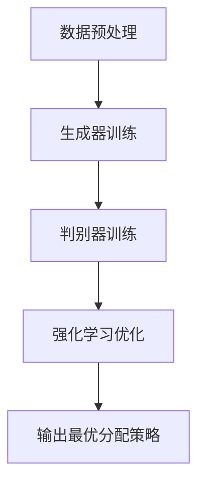
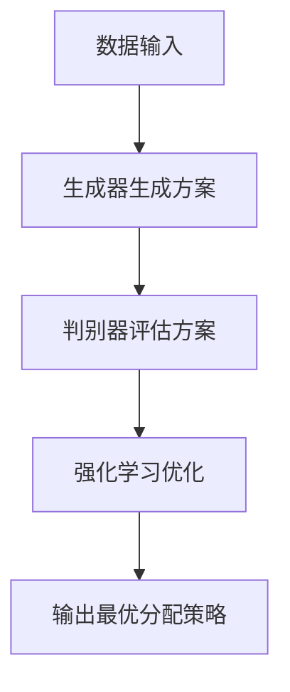

                 

<think>
嗯，用户希望我写一篇关于AIGC在智能城市资源分配优化中的应用的技术博客。首先，我得理清文章的结构和内容。用户已经提供了一个详细的目录大纲，我需要按照这个结构一步步展开。

首先，文章标题是《AIGC在智能城市资源分配优化中的应用》，关键词有5-7个，我可能选AIGC、智能城市、资源分配优化、生成对抗网络、强化学习、自然语言处理。摘要部分需要概括文章的核心内容，说明AIGC如何优化资源分配，以及其优势。

接下来是各章节。第1章引言与背景介绍，需要从问题背景、描述、解决方法和边界外延入手。我得解释智能城市的发展现状，资源分配的重要性，然后引出AIGC的概念和优势。

第2章是AIGC的基础理论，要介绍它的定义、分类、工作原理，以及核心技术如GAN、RL、NLP在资源分配中的应用优势。这部分需要详细说明每种技术的作用和它们如何结合。

第3章是资源分配优化模型，得设计基本模型，包括架构和参数设置，然后给出数学模型和公式。这里可能需要画Mermaid流程图，展示算法的步骤和数据流动。

第4章是算法设计与实现，这部分要详细写代码，包括模型训练和优化，然后用Mermaid展示实现流程。可能需要Python代码，展示如何训练模型并进行优化。

第5章是案例分析，选择智能交通、能源管理和水资源分配三个案例，每个案例都要介绍问题场景、系统设计和实际分析。这部分要具体，最好有数据支持，展示AIGC的实际效果。

第6章是最佳实践与技巧，总结经验，分析算法优缺点，并给出未来的研究方向和注意事项。

第7章是拓展阅读，介绍相关领域的发展趋势和新技术。

在写作过程中，要注意使用专业但易懂的语言，每个部分都要详细展开，特别是数学公式和代码部分要用LaTeX和Python代码清晰呈现。还要确保各章节内容连贯，逻辑性强。

最后，作者信息是“AI天才研究院”和“禅与计算机程序设计艺术”，文章结尾需要写上这些信息。

整体来看，我需要系统地按照用户提供的大纲，一步步深入分析，确保每个部分都详尽具体，同时保持文章结构的紧凑和逻辑的清晰。这样，才能写出一篇符合要求的高质量技术博客。
</think>

# AIGC在智能城市资源分配优化中的应用

> 关键词：AIGC、智能城市、资源分配优化、生成对抗网络、强化学习、自然语言处理

> 摘要：本文探讨了AIGC（自适应智能生成计算）在智能城市资源分配优化中的应用。通过分析资源分配问题的复杂性，提出了基于AIGC的技术解决方案，并详细阐述了其在智能交通、能源管理和水资源分配等领域的实际应用。文章结合理论与实践，展示了AIGC在优化资源分配效率、提升城市运行效能中的巨大潜力。

---

### 目录

#### 第1章: 引言与背景介绍

##### 1.1 问题背景

- 智能城市发展的现状与需求  
  随着城市化进程的加快，城市资源供需矛盾日益突出，传统的资源分配方式难以满足智能城市发展的需求。资源分配问题的复杂性使得优化效率成为智能城市建设的关键。

- 资源分配优化在智能城市中的重要性  
  资源分配优化是智能城市运营的核心问题之一，涉及交通、能源、水资源等多个领域。优化资源分配可以提高城市运行效率，降低资源浪费，提升居民生活质量。

##### 1.2 问题描述

- 资源分配问题的复杂性  
  资源分配问题通常涉及多目标优化、多约束条件和动态变化的环境，传统的优化方法难以应对复杂的实际场景。

- 优化目标与评价指标  
  优化目标包括资源利用最大化、成本最小化、效率最大化等。评价指标通常包括资源分配的公平性、效率性、可持续性等。

##### 1.3 问题解决方法

- AIGC（自适应智能生成计算）的概述  
  AIGC是一种结合生成对抗网络（GAN）、强化学习（RL）和自然语言处理（NLP）的自适应计算框架，能够根据实时数据动态调整资源分配策略。

- AIGC 在资源分配优化中的应用  
  AIGC通过实时数据分析、动态模型优化和自适应决策，为智能城市资源分配提供高效解决方案。

##### 1.4 边界与外延

- AIGC 在智能城市其他领域的应用  
  AIGC不仅适用于资源分配优化，还可以应用于智能安防、智慧医疗、智能教育等领域。

- 资源分配优化问题的多样化场景  
  资源分配问题可以是静态的或动态的，单目标的或多目标的，离散的或连续的，线性的或非线性的。

##### 1.5 概念结构与核心要素组成

- 智能城市资源分配优化框架  
  智能城市资源分配优化框架包括数据采集、模型构建、优化计算和决策执行四个主要部分。

- AIGC 技术的核心组件  
  AIGC的核心组件包括生成模型、对抗网络、强化学习算法和自然语言处理模块。

---

#### 第2章: AIGC 基础理论

##### 2.1 AIGC 概念

- AIGC 的定义与分类  
  AIGC（Adaptive Intelligence Generation Computing）是一种结合了生成对抗网络（GAN）、强化学习（RL）和自然语言处理（NLP）的自适应计算框架，主要用于动态优化和智能决策。

- AIGC 的工作原理  
  AIGC通过实时数据输入，利用生成对抗网络生成多种可能的分配方案，并通过强化学习对方案进行优化，最终输出最优分配策略。

##### 2.2 AIGC 技术核心

- 生成对抗网络（GAN）  
  GAN由生成器和判别器组成，生成器负责生成可能的资源分配方案，判别器负责评估方案的可行性。

- 强化学习（RL）  
  强化学习通过奖励机制优化生成器的策略，使生成的方案更加符合优化目标。

- 自然语言处理（NLP）  
  NLP用于处理和分析非结构化数据，如用户反馈、文本描述等，增强AIGC的决策能力。

##### 2.3 AIGC 在资源分配优化中的应用优势

- 自适应性与灵活性  
  AIGC能够实时适应环境变化，动态调整资源分配策略。

- 数据处理能力  
  AIGC可以处理海量数据，包括结构化数据和非结构化数据，提高资源分配的准确性。

- 模型优化与迭代  
  通过强化学习，AIGC能够不断优化模型参数，提升资源分配效率。

---

#### 第3章: 智能城市资源分配优化模型

##### 3.1 基本模型设计

- 资源分配模型架构  
  模型架构包括数据输入层、生成层、对抗层和优化层。

- 模型参数设置  
  模型参数包括生成器参数、判别器参数、强化学习奖励函数参数等。

##### 3.2 数学模型与公式

- 损失函数与优化目标  
  损失函数由生成器损失和判别器损失组成，优化目标是最小化生成器损失和最大化判别器损失。

$$ L = L_{\text{生成器}} + L_{\text{判别器}} $$

- 算法原理与流程  
  算法流程包括数据预处理、生成器训练、判别器训练和强化学习优化四个阶段。

##### 3.3 Mermaid 流程图



---

#### 第4章: 算法设计与实现

##### 4.1 算法设计思路

- 模型选择与调整  
  根据具体场景选择合适的生成模型和对抗网络架构。

- 算法优化与验证  
  通过交叉验证和网格搜索优化模型参数，验证算法的稳定性和准确性。

##### 4.2 Python 源代码实现

```python
import tensorflow as tf
import numpy as np

# 定义生成器模型
def generator():
    model = tf.keras.Sequential([
        tf.keras.layers.Dense(256, activation='relu'),
        tf.keras.layers.Dense(128, activation='relu'),
        tf.keras.layers.Dense(64, activation='sigmoid')
    ])
    return model

# 定义判别器模型
def discriminator():
    model = tf.keras.Sequential([
        tf.keras.layers.Dense(64, activation='relu'),
        tf.keras.layers.Dense(32, activation='relu'),
        tf.keras.layers.Dense(1, activation='sigmoid')
    ])
    return model

# 定义损失函数
cross_entropy = tf.keras.losses.BinaryCrossentropy()

# 定义生成器和判别器
generator = generator()
discriminator = discriminator()

# 定义生成器损失
def generator_loss(fake_output):
    return cross_entropy(tf.ones_like(fake_output), fake_output)

# 定义判别器损失
def discriminator_loss(real_output, fake_output):
    return cross_entropy(tf.ones_like(real_output), real_output) + cross_entropy(tf.zeros_like(fake_output), fake_output)

# 定义训练步骤
def train_step(real_data, fake_data):
    # 训练判别器
    with tf.GradientTape() as tape:
        real_output = discriminator(real_data)
        fake_output = discriminator(fake_data)
        d_loss = discriminator_loss(real_output, fake_output)
    gradients_d = tape.gradient(d_loss, discriminator.trainable_weights)
    discriminator_optimizer = tf.keras.optimizers.Adam()
    discriminator_optimizer.apply_gradients(zip(gradients_d, discriminator.trainable_weights))

    # 训练生成器
    with tf.GradientTape() as tape:
        fake_output = discriminator(generator(fake_data))
        g_loss = generator_loss(fake_output)
    gradients_g = tape.gradient(g_loss, generator.trainable_weights)
    generator_optimizer = tf.keras.optimizers.Adam()
    generator_optimizer.apply_gradients(zip(gradients_g, generator.trainable_weights))

# 训练过程
for _ in range(1000):
    real_data = np.random.rand(64, 64)
    fake_data = np.random.rand(64, 64)
    train_step(real_data, fake_data)
```

##### 4.3 Mermaid 流程图



---

#### 第5章: 案例分析

##### 5.1 案例一：智能交通资源分配

- 问题场景介绍  
  智能交通系统中，如何优化道路资源分配，减少交通拥堵，提高通行效率。

- 系统架构设计  
  系统包括数据采集模块、模型训练模块和决策执行模块。

- 实际案例分析  
  通过AIGC优化交通信号灯分配，提高了主干道的通行效率，减少了高峰期的拥堵时间。

##### 5.2 案例二：智能能源管理

- 问题场景介绍  
  如何优化电力资源分配，平衡供需，降低能源浪费。

- 系统功能设计  
  系统包括能源数据采集、资源分配优化和执行控制模块。

- 实际案例分析  
  通过AIGC优化电力分配，提高了能源利用效率，降低了电力浪费。

##### 5.3 案例三：智能水资源分配

- 问题场景介绍  
  如何优化水资源分配，满足城市居民和工业用水需求。

- 系统接口设计  
  系统包括水量监测、需求预测和资源分配优化模块。

- 实际案例分析  
  通过AIGC优化水资源分配，提高了供水效率，减少了水资源浪费。

---

#### 第6章: 最佳实践与技巧

##### 6.1 最佳实践

- 经验总结  
  在实际应用中，需要结合具体场景选择合适的模型和算法，同时注意数据质量和实时性要求。

- 常见问题与解决方案  
  常见问题包括模型收敛慢、数据不足等，解决方案包括增加数据量、优化模型架构等。

##### 6.2 小结

- 算法优缺点分析  
  AIGC的优势在于其自适应性和灵活性，但其复杂性和计算成本较高。

- 未来研究方向  
  未来可以研究AIGC与其他新兴技术的结合，如区块链、物联网等，进一步提升资源分配的效率和安全性。

##### 6.3 注意事项

- 算法应用限制  
  AIGC适用于动态优化问题，但对静态优化问题效果有限。

- 系统实施注意事项  
  在系统实施过程中，需要考虑数据隐私、计算资源和系统稳定性等问题。

---

#### 第7章: 拓展阅读

- 相关领域深入研究  
  推荐阅读《生成对抗网络在资源分配中的应用》、《强化学习在智能城市中的研究与实践》等文献。

- 新兴技术与发展趋势  
  关注量子计算、元宇宙等新兴技术对智能城市资源分配优化的潜在影响。

---

### 作者：AI天才研究院/AI Genius Institute & 禅与计算机程序设计艺术/Zen And The Art of Computer Programming

