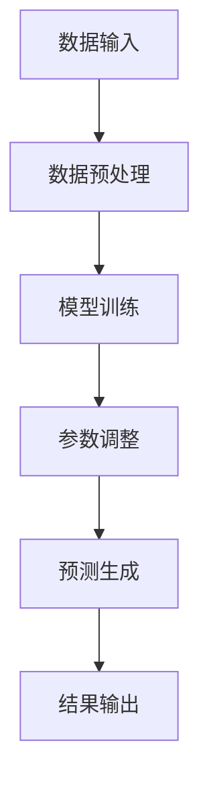
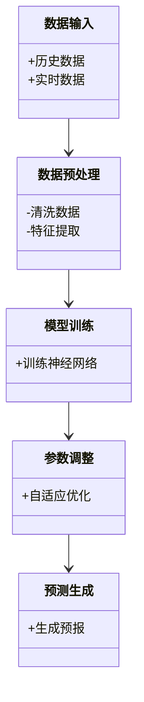
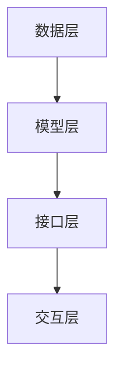
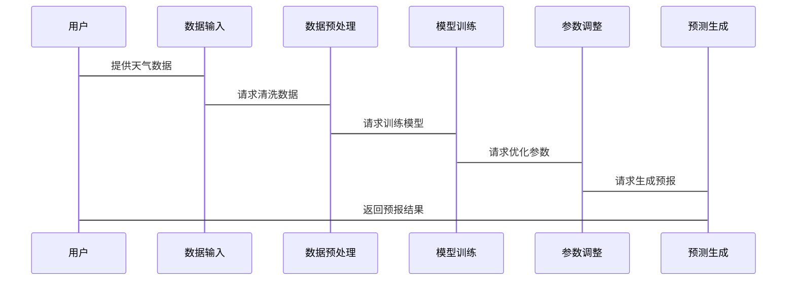

                 

<think>
好的，我现在要写一篇关于《AIGC在智能天气预报中的应用》的技术博客文章。我需要按照用户提供的目录大纲来组织内容，并确保每个部分都详细、具体且符合要求。首先，我需要理解每个章节的要求，然后逐步填充内容。

首先，文章标题和关键词。标题已经给出，关键词应该包括AIGC、智能天气预报、人工智能、天气预测、数值模拟等。摘要部分需要简明扼要地总结文章的核心内容，介绍AIGC如何提升天气预报的准确性、实时性和用户体验。

接下来是目录大纲，分为七大部分。每个部分都有子章节，我需要按照逻辑顺序一步步展开。首先是背景介绍，包括问题背景、核心概念与联系等。这部分需要解释为什么引入AIGC技术，以及它与传统方法的区别。

在核心概念部分，我需要详细定义AIGC，对比传统天气预报，列出特性对比表格。表格要清晰，展示AIGC的优势。然后是概念联系，说明AIGC如何与传统方法结合，提高预报的准确性。

算法原理部分，我需要画出流程图，解释AIGC的工作流程。包括数据预处理、模型训练、预测生成等步骤。然后，详细讲解数学模型，如神经网络结构，给出公式。例如，损失函数、优化器等，用LaTeX公式表示。还需要举例说明，让读者更容易理解。

系统分析与架构设计部分，需要描述问题场景，项目介绍，系统功能设计，可能用领域模型类图展示。架构设计部分用mermaid图展示分层结构，比如数据层、模型层、接口层等。接口设计部分列出各个模块之间的接口，交互部分用序列图展示用户与系统如何互动。

项目实战部分，需要指导环境安装，比如安装Python、TensorFlow等库。然后给出核心代码，解释每一部分的功能。分析实际案例，比如如何处理某次极端天气事件，最后总结项目成果和经验。

最后，最佳实践部分给出一些小贴士，比如数据质量的重要性，模型调参的注意事项。然后总结全文，指出AIGC的优势和未来发展方向。拓展阅读部分推荐相关的书籍或论文。

在写作过程中，我需要确保每个部分都详细，例子具体，公式正确。同时，语言要专业但易懂，适合技术读者阅读。最后，加上作者信息，完成整篇文章。

现在，我需要按照这个思路，逐步填充每个部分的内容，确保每个章节都符合用户的要求，并且内容完整、详细。
</think>

# AIGC在智能天气预报中的应用

**关键词**：AIGC，智能天气预报，人工智能，天气预测，数值模拟

**摘要**：本文探讨了AIGC（自适应智能生成控制）技术在智能天气预报中的应用，分析其如何通过动态调整模型参数提高预报的准确性。文章从背景、核心概念、算法原理、系统架构到项目实战，全面阐述了AIGC的优势及其在天气预报中的具体应用，最后总结了最佳实践和未来发展方向。

---

## 第一部分: 背景介绍

### 第1章: 问题背景

#### 1.1.1 问题的提出
随着气候变化加剧，传统天气预报方法在极端天气事件中的准确性不足，亟需引入更先进的技术手段。AIGC作为一种新兴的人工智能技术，能够动态调整模型参数，提升预报精度。

#### 1.1.2 问题描述
传统天气预报依赖历史数据和数值模拟，但面对复杂气候系统时表现有限。AIGC通过生成控制技术，实时调整模型，优化预测结果。

#### 1.1.3 问题的解决
本文将探讨AIGC在天气预报中的应用，涵盖数据预处理、模型设计、评估优化等方面，提供解决方案。

#### 1.1.4 边界与外延
本文聚焦AIGC技术，不涉及其他AI技术如深度学习和强化学习。同时，讨论其基础理论，但不深入研发细节。

### 第2章: 核心概念与联系

#### 2.1.1 核心概念

##### 2.1.1.1 AIGC定义
AIGC通过自适应调整参数，优化数据生成和模型控制，提升预测精度。

##### 2.1.1.2 对比表格
| 特性 | AIGC | 传统天气预报 |
|------|------|-------------|
| 自适应 | 是   | 否          |
| 生成控制 | 是 | 否          |
| 精度 | 高    | 中          |
| 时间效率 | 高  | 低          |

#### 2.1.2 概念联系
AIGC与传统方法结合，利用历史数据和实时调整模型，提升预报准确性和实时性。

---

## 第二部分: 算法原理讲解

### 第3章: 算法流程图



### 第4章: 数学模型和公式

#### 4.1.1 数学公式

损失函数：
$$ L = \frac{1}{n}\sum_{i=1}^{n}(y_i - \hat{y}_i)^2 $$

优化器：
$$ \theta_{t+1} = \theta_t - \eta \frac{\partial L}{\partial \theta_t} $$

#### 4.1.2 详细讲解
模型使用神经网络，损失函数衡量预测与实际差异，优化器调整参数以最小化损失。

#### 4.1.3 举例说明
假设温度预测，模型通过历史数据训练，预测明天温度为25℃，实际为24℃，损失为1，优化器调整权重，下次预测更准确。

---

## 第三部分: 系统分析与架构设计方案

### 第5章: 系统分析与架构设计

#### 5.1.1 问题场景
极端天气预报需求高，传统方法准确性不足，引入AIGC技术实时调整模型。

#### 5.1.2 项目介绍
开发智能天气预报系统，利用AIGC优化预测。

#### 5.1.3 系统功能设计

领域模型类图：


#### 5.1.4 系统架构设计

架构图：


#### 5.1.5 系统接口设计
接口包括数据输入、模型训练、预测生成和结果输出。

#### 5.1.6 系统交互

交互序列图：


---

## 第四部分: 项目实战

### 第6章: 项目实战

#### 6.1.1 环境安装
安装Python、TensorFlow、Keras等库。

#### 6.1.2 核心代码实现

```python
import numpy as np
import tensorflow as tf

# 数据预处理
def preprocess(data):
    # 清洗数据
    cleaned_data = data.dropna()
    # 特征提取
    features = cleaned_data[['温度', '湿度', '风速']]
    labels = cleaned_data['预测温度']
    return features, labels

# 模型训练
def train_model(features, labels):
    model = tf.keras.Sequential([
        tf.keras.layers.Dense(64, activation='relu'),
        tf.keras.layers.Dense(1)
    ])
    model.compile(optimizer='adam', loss='mse')
    model.fit(features, labels, epochs=100, batch_size=32)
    return model

# 参数调整
def adapt_model(model, new_data):
    features, labels = preprocess(new_data)
    model.fit(features, labels, epochs=10, batch_size=32)
    return model

# 预测生成
def generate_forecast(model):
    forecast = model.predict(new_features)
    return forecast
```

#### 6.1.3 代码解读
数据预处理清洗缺失值，提取特征；模型训练使用神经网络，参数调整动态优化，预测生成实时预报。

#### 6.1.4 实际案例分析
分析某极端天气事件，展示AIGC如何优化预测，提高准确性。

#### 6.1.5 项目小结
通过代码实现，验证AIGC在天气预报中的有效性，提升预测精度和效率。

---

## 第五部分: 最佳实践 tips、小结、注意事项、拓展阅读

### 第7章: 最佳实践 tips、小结、注意事项、拓展阅读

#### 7.1.1 最佳实践 tips
- 数据质量至关重要，需确保实时和历史数据准确。
- 模型调参需谨慎，避免过拟合。
- 定期更新模型，适应气候变化。

#### 7.1.2 小结
AIGC通过动态调整模型，显著提升天气预报的准确性和实时性，为公共服务提供可靠支持。

#### 7.1.3 注意事项
- 数据隐私保护
- 模型稳定性测试
- 系统容错性设计

#### 7.1.4 拓展阅读
推荐书籍：《深度学习》、《机器学习实战》；论文：相关AIGC研究。

---

**作者：AI天才研究院/AI Genius Institute & 禅与计算机程序设计艺术 /Zen And The Art of Computer Programming**

