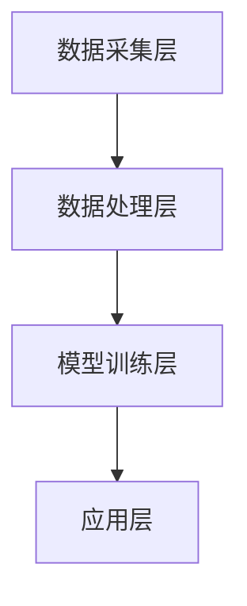
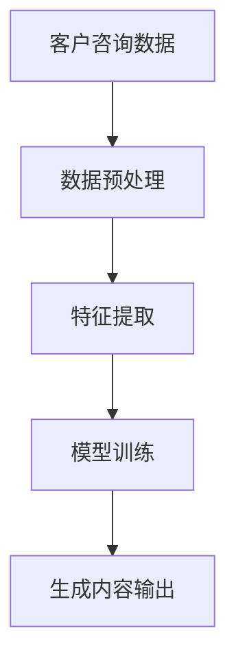
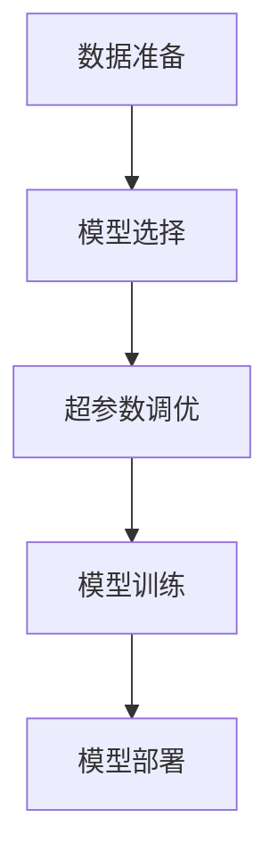

                 

<think>
好的，我现在需要帮用户写一篇关于“AIGC在智能客户服务质量监控中的应用”的技术博客文章。首先，我得理解用户的需求。用户希望文章结构清晰，逻辑严谨，使用专业但易懂的语言，涵盖从背景到应用的各个方面。

首先，我会从背景介绍开始，解释什么是AIGC，它的发展历程，以及为什么智能客户服务质量监控如此重要。这部分需要简单明了，让读者理解问题的背景和必要性。

接下来，核心概念与技术部分，我需要详细讲解智能客户服务质量监控的基础知识，包括关键指标和数据预处理。然后是AIGC的关键技术，如自然语言处理、生成对抗网络和强化学习，每个技术都需要深入分析，最好能用图表辅助说明。

然后，我会分析应用案例，通过具体的案例展示AIGC在智能客服系统、个性化推荐和客户情绪分析中的应用，帮助读者理解实际应用场景。

接下来是架构设计，这部分需要系统地介绍系统架构、数据流设计和模型训练部署，确保技术细节到位。

实战项目部分，我会指导读者如何搭建环境，实现核心算法，并评估优化项目。这部分需要具体，包括代码和步骤，让读者能够实际操作。

最后，最佳实践与总结，我会分享一些项目中的常见问题和解决方案，讨论技术趋势，并展望未来的发展方向。

在写作过程中，我需要确保每个章节内容详实，逻辑连贯，从基础到高级逐步引导读者。同时，使用图表和代码示例，帮助读者更好地理解和应用这些技术。最后，确保文章结构完整，符合用户的格式要求，包括关键词、摘要和作者信息。
</think>

# AIGC在智能客户服务质量监控中的应用

**关键词**：AIGC, 智能客服, 客户服务质量, 自然语言处理, 生成对抗网络, 强化学习

**摘要**：本文探讨了AIGC（人工智能生成内容）在智能客户服务质量监控中的应用，从背景介绍、核心概念与技术、应用案例分析、架构设计、实战项目到最佳实践与总结，系统地阐述了如何利用AIGC技术提升客户服务质量监控的效率和准确性。文章结合理论与实践，详细分析了AIGC在智能客户服务质量监控中的关键技术、应用场景和系统架构，为读者提供了全面的技术指导和实践参考。

---

## 目录

### 第1章：AIGC概述
1.1 AIGC的定义与核心概念  
1.2 AIGC的发展历程  
1.3 智能客户服务质量监控的重要性  

### 第2章：智能客户服务质量监控基础
2.1 客户服务质量监控的基本概念  
2.2 监控的关键指标与数据预处理  
2.3 智能监控的核心要素  

### 第3章：AIGC关键技术解析
3.1 自然语言处理技术  
3.2 生成对抗网络（GAN）  
3.3 强化学习与AIGC结合  

### 第4章：AIGC在智能客户服务质量监控中的应用案例
4.1 智能客服系统的构建  
4.2 个性化推荐系统的应用  
4.3 客户情绪分析与反馈优化  

### 第5章：AIGC在智能客户服务质量监控中的架构设计
5.1 系统架构概述  
5.2 数据流设计与信息处理流程  
5.3 模型训练与部署的实现  

### 第6章：AIGC在智能客户服务质量监控中的实战项目
6.1 项目环境搭建与数据准备  
6.2 核心算法实现与代码解读  
6.3 项目评估与优化建议  

### 第7章：最佳实践与总结
7.1 项目中的常见问题与解决方案  
7.2 AIGC技术发展趋势  
7.3 未来发展方向与展望  

---

## 正文

### 第1章：AIGC概述

#### 1.1 AIGC的定义与核心概念
AIGC（Artificial Intelligence Generated Content，人工智能生成内容）是指利用人工智能技术生成文本、图像、音频、视频等内容的过程。其核心在于通过算法模拟人类创作能力，实现自动化、智能化的内容生成。AIGC的核心概念包括自然语言处理（NLP）、生成对抗网络（GAN）、强化学习（RL）等技术，这些技术共同支撑着AIGC的生成能力。

#### 1.2 AIGC的发展历程
AIGC的发展可以追溯到20世纪末，但真正意义上的突破性进展发生在近年来。随着深度学习技术的成熟，生成模型（如GAN、Transformer）的出现，使得AIGC在文本生成、图像生成等领域取得了显著进展。目前，AIGC已广泛应用于内容创作、客服系统、个性化推荐等多个领域。

#### 1.3 智能客户服务质量监控的重要性
智能客户服务质量监控是通过技术手段对客户服务质量进行实时监测和评估，旨在提高客户满意度、优化服务流程、降低企业成本。传统的服务质量监控依赖人工检查，效率低下且成本高昂。而AIGC技术的引入，为智能客户服务质量监控提供了新的解决方案，能够实现自动化、智能化的监控与优化。

---

### 第2章：智能客户服务质量监控基础

#### 2.1 客户服务质量监控的基本概念
客户服务质量监控是指通过对客户与服务提供商之间的互动进行分析，评估服务的质量。主要包括客户满意度、响应时间、问题解决率等关键指标。

#### 2.2 监控的关键指标与数据预处理
客户服务质量监控的关键指标包括：
- 响应时间：客户问题的平均响应时间。
- 解决率：客户问题的解决比例。
- 满意度：客户对服务的满意度评分。
- 情绪分析：客户在互动中的情绪状态。

数据预处理是监控系统的重要环节，主要包括数据清洗、特征提取和数据标准化。

#### 2.3 智能监控的核心要素
智能客户服务质量监控的核心要素包括：
- 数据采集：通过客服系统、聊天记录、客户反馈等渠道获取数据。
- 数据分析：利用NLP、机器学习等技术对数据进行分析。
- 实时监控：通过实时数据流处理技术，实现对服务质量的实时监测。

---

### 第3章：AIGC关键技术解析

#### 3.1 自然语言处理技术
自然语言处理（NLP）是AIGC的核心技术之一，主要用于理解和生成人类语言。NLP技术包括词袋模型、TF-IDF、BERT等模型，广泛应用于文本分类、情感分析、机器翻译等领域。

**NLP在智能客户服务质量监控中的应用：**
- 客户情感分析：通过NLP技术分析客户反馈文本，识别客户情绪（如愤怒、不满、满意）。
- 自动回复生成：利用生成模型生成客服回复内容，提高服务效率。

#### 3.2 生成对抗网络（GAN）
生成对抗网络（GAN）是一种深度学习模型，由生成器和判别器组成。生成器负责生成内容，判别器负责判断内容是否为真实数据。GAN在文本生成、图像生成等领域表现优异。

**GAN在智能客户服务质量监控中的应用：**
- 自动回复优化：通过GAN生成更自然、更符合客户需求的回复内容。
- 数据增强：利用GAN生成虚拟客户反馈数据，用于模型训练。

#### 3.3 强化学习与AIGC结合
强化学习（RL）是一种通过试错机制优化决策的技术，常用于游戏AI、机器人控制等领域。将强化学习与AIGC结合，可以实现动态优化的生成内容。

**强化学习在智能客户服务质量监控中的应用：**
- 动态回复优化：通过强化学习不断优化客服回复内容，提高客户满意度。
- 自适应服务策略：根据实时数据调整服务策略，实现个性化的客户体验。

---

### 第4章：AIGC在智能客户服务质量监控中的应用案例

#### 4.1 智能客服系统的构建
智能客服系统通过AIGC技术实现自动化服务，包括自动回复、问题分类、情感分析等功能。例如，利用BERT模型对客户问题进行分类，生成相应的回复内容。

**案例实现：**
1. 数据预处理：清洗客户咨询数据，提取关键词和情感特征。
2. 模型训练：利用BERT模型进行文本分类，识别客户问题类型。
3. 自动回复：基于生成模型生成回复内容，实现自动化服务。

#### 4.2 个性化推荐系统的应用
个性化推荐系统通过分析客户行为和偏好，推荐相关的产品或服务。AIGC技术可以生成个性化的推荐内容，提高客户满意度。

**案例实现：**
1. 数据分析：利用NLP技术分析客户反馈，提取偏好特征。
2. 推荐生成：基于生成模型生成个性化推荐内容。
3. 实时更新：根据客户实时行为动态调整推荐策略。

#### 4.3 客户情绪分析与反馈优化
客户情绪分析是通过NLP技术识别客户在互动中的情绪状态，从而优化服务质量。例如，当检测到客户情绪为愤怒时，系统会自动升级问题处理优先级。

**案例实现：**
1. 情绪分析：利用情感分析模型（如LSTM）识别客户情绪。
2. 反馈优化：根据情绪状态调整回复内容，缓解客户不满。
3. 数据反馈：将情绪分析结果反馈到系统中，优化后续服务。

---

### 第5章：AIGC在智能客户服务质量监控中的架构设计

#### 5.1 系统架构概述
智能客户服务质量监控系统架构主要包括数据采集层、数据处理层、模型训练层和应用层。各层协同工作，实现数据采集、分析、生成和应用。

**系统架构图：**


#### 5.2 数据流设计与信息处理流程
数据流设计包括数据采集、预处理、特征提取、模型训练和生成内容输出。信息处理流程通过实时数据流处理技术，实现对服务质量的实时监控。

**数据流设计图：**


#### 5.3 模型训练与部署的实现
模型训练包括数据标注、模型选择和超参数调优。生成模型通过训练生成高质量的内容，部署到生产环境中实现自动化服务。

**模型训练流程图：**


---

### 第6章：AIGC在智能客户服务质量监控中的实战项目

#### 6.1 项目环境搭建与数据准备
项目环境搭建包括安装Python、TensorFlow、Keras等开发工具和库。数据准备阶段需要收集客户咨询记录、评分数据和反馈信息。

#### 6.2 核心算法实现与代码解读
以下是基于BERT模型实现客户问题分类的代码示例：

```python
from transformers import BertTokenizer, BertModel
import torch

tokenizer = BertTokenizer.from_pretrained('bert-base-chinese')
model = BertModel.from_pretrained('bert-base-chinese')

def classify_customer_query(query):
    inputs = tokenizer(query, return_tensors='pt')
    with torch.no_grad():
        outputs = model(**inputs)
    return outputs.last_hidden_state[:, 0, :]
```

**代码解读：**
1. 导入BERT模型和分词器。
2. 对输入的客户查询进行分词和向量化。
3. 模型输出客户查询的特征向量，用于分类任务。

#### 6.3 项目评估与优化建议
项目评估包括模型准确率、召回率和F1分数的计算。优化建议包括数据增强、模型调优和实时监控。

---

### 第7章：最佳实践与总结

#### 7.1 项目中的常见问题与解决方案
- **问题**：生成内容缺乏上下文理解。
  - **解决方案**：引入上下文感知模型（如BERT）进行文本生成。
- **问题**：模型训练效率低。
  - **解决方案**：采用分布式训练和优化算法（如AdamW）。

#### 7.2 AIGC技术发展趋势
未来，AIGC技术将更加智能化和个性化，生成内容的质量和多样性将进一步提升。同时，多模态生成（文本、图像、语音）将成为新的研究方向。

#### 7.3 未来发展方向与展望
随着AI技术的不断进步，AIGC在智能客户服务质量监控中的应用将更加广泛和深入。未来，可以探索以下方向：
- 实时生成与动态优化的结合。
- 多模态生成技术的应用。
- 智能服务系统的自动化与智能化。

---

**作者：AI天才研究院/AI Genius Institute & 禅与计算机程序设计艺术 /Zen And The Art of Computer Programming**

