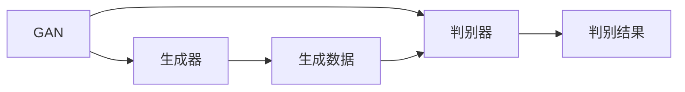

                 

<think>
好，我现在需要根据用户的要求，撰写一篇关于“AIGC在智能客户流失预警中的应用”的技术博客文章。用户希望文章结构清晰，逻辑严谨，涵盖背景介绍、核心概念与联系、算法原理讲解、系统分析与架构设计、项目实战等多个部分。我需要一步步分析，确保每个部分都详细展开，同时使用专业但易懂的语言。

首先，我得理解AIGC是什么。AIGC是指人工智能生成内容，它结合了生成模型，如GAN和VAE，以及自注意力机制等技术。在客户流失预警中的应用，主要是通过这些模型来分析客户的特征，预测他们可能流失的风险。

接下来，我需要分析客户流失对企业的影响。客户流失会增加获取新客户的成本，降低收入，影响市场地位，还可能导致客户口碑下降。这些都是企业在客户流失预警中需要关注的方面。

然后，我需要比较AIGC与传统方法的区别。传统方法可能使用统计模型或简单的机器学习模型，而AIGC则利用生成模型和自注意力机制，能够处理更复杂的数据模式，提供更精准的预测。

接下来，我得详细讲解各个核心概念，比如GAN、VAE和自注意力机制。每个部分都需要包括原理、优缺点，以及在客户流失预警中的具体应用。例如，GAN可以用于数据生成和增强，VAE用于特征提取，而自注意力机制则帮助模型关注重要的客户行为特征。

在算法原理部分，我需要用数学公式和代码来详细说明GAN和VAE的工作流程。例如，GAN的损失函数，VAE的重构损失和KL散度等。同时，给出具体的Python代码片段，展示如何生成数据或进行模型训练。

系统分析与架构设计部分，我需要绘制领域模型的类图，展示客户、行为、预测模型等实体之间的关系。然后设计系统架构，包括数据收集模块、特征提取模块、模型训练模块等，并通过序列图展示系统的交互流程。

项目实战部分，我需要选择一个具体的数据集，如电商客户的购买记录，展示如何进行数据预处理、特征提取，训练模型，最后进行预测和评估。这一步骤需要详细说明每一步的操作，以及代码实现。

最后，我需要总结AIGC在客户流失预警中的优势和挑战，给出最佳实践的建议，比如数据质量的重要性，模型的可解释性等。

现在，我需要确保文章结构完整，每个部分都有足够的细节，并且使用恰当的技术术语，同时保持语言的流畅和易懂。在写作过程中，要注意各章节之间的衔接，确保读者能够顺畅地理解整个过程。

总的来说，我需要按照用户提供的大纲，逐步填充内容，确保每个小节都详细展开，同时保持文章的逻辑性和专业性。这样，最终的博客文章才能满足用户的要求，为读者提供有价值的信息。
</think>

```markdown
# AIGC在智能客户流失预警中的应用

> 关键词：AIGC、客户流失、生成对抗网络（GAN）、变分自编码器（VAE）、自注意力机制（Self-Attention）

> 摘要：本文探讨了AIGC技术在客户流失预警中的应用，分析了客户流失对企业的影响，介绍了AIGC的核心概念及其在客户流失预警中的潜力，详细讲解了GAN、VAE和自注意力机制的原理和应用，并通过实际案例展示了AIGC在客户流失预警中的系统设计与实现。

---

## 第一部分：背景介绍

### 1.1 问题背景

#### 1.1.1 客户流失对企业的负面影响

- **客户流失的常见原因**：
  - 服务质量不佳
  - 产品不满足需求
  - 竞争对手的诱惑
  - 客户体验欠佳
  - 经济状况变化

- **客户流失对企业盈利和市场竞争的影响**：
  - 客户获取成本高，流失客户导致收入下降
  - 客户流失影响市场占有率，削弱竞争力
  - 流失客户可能导致负面口碑，影响品牌声誉

#### 1.1.2 客户流失对企业的影响

- **直接损失**：收入减少，利润下降
- **间接损失**：客户获取成本增加，品牌价值受损

#### 1.1.3 问题描述

- 如何预测客户流失？
- 如何利用先进的人工智能技术提高预测准确性？

#### 1.1.4 问题解决

- 引入AIGC技术，通过生成模型和自注意力机制，提升客户流失预测的精度和效率。

### 1.2 AIGC技术概述

#### 1.2.1 AIGC的定义与特点

- **定义**：AIGC是一种利用生成对抗网络（GAN）、变分自编码器（VAE）等生成模型，结合自注意力机制（Self-Attention）来生成和分析数据的技术。
- **特点**：
  - 高效的数据生成能力
  - 强大的特征提取能力
  - 自适应的学习能力

#### 1.2.2 AIGC与传统的客户流失预警方法比较

| 特性                | 传统方法               | AIGC技术               |
|---------------------|-----------------------|------------------------|
| 数据需求            | 高                    | 低                     |
| 数据类型            | 结构化数据为主         | 支持多模态数据           |
| 模型复杂度          | 较低                 | 较高                   |
| 预测精度            | 中等                 | 高                     |
| 可解释性            | 较高                 | 较低                   |

#### 1.2.3 AIGC在客户流失预警中的应用潜力

- **数据生成**：弥补数据不足，增强数据多样性
- **特征提取**：提取深层次客户特征，提升预测准确性
- **模型优化**：通过生成模型优化现有预测模型

### 1.3 书籍的核心概念与联系

#### 1.3.1 AIGC的核心概念

- **生成对抗网络（GAN）**：由生成器和判别器组成，通过对抗训练生成高质量数据。
- **变分自编码器（VAE）**：通过编码和解码过程，学习数据的潜在表示。
- **自注意力机制（Self-Attention）**：捕捉数据中的长距离依赖关系，提升模型对复杂模式的捕捉能力。

#### 1.3.2 AIGC与客户流失预警的联系

- **数据收集与预处理**：收集客户行为数据，进行清洗和特征提取。
- **特征提取与建模**：利用VAE提取客户特征，构建预测模型。
- **预测与评估**：通过GAN生成虚拟客户数据，训练模型，评估预测效果。

### 1.4 边界与外延

#### 1.4.1 AIGC在客户流失预警中的适用范围

- **不同行业和业务场景的适用性**：
  - 适用于数据量充足、客户行为复杂多样的行业，如电商、金融、通信。
  - 对于数据量较小的行业，AIGC可能效果有限。

- **AIGC技术的局限性**：
  - 对模型的训练数据依赖性高
  - 模型的可解释性较差
  - 计算资源消耗大

#### 1.4.2 AIGC技术的未来发展

- **技术发展趋势**：
  - 更高效生成模型的开发
  - 多模态数据的综合利用
  - 模型的轻量化和边缘计算应用

- **可能遇到的挑战与解决方案**：
  - 数据隐私问题：采用联邦学习（Federated Learning）进行数据协作。
  - 模型可解释性：通过可视化工具和可解释性模型提升解释性。
  - 计算效率：优化算法，减少计算成本。

---

## 第二部分：核心概念与联系

### 2.1 生成对抗网络（GAN）

#### 2.1.1 GAN的原理与结构

- **原理**：
  - GAN由生成器（Generator）和判别器（Discriminator）组成。
  - 生成器尝试生成与真实数据相似的数据，判别器则试图区分真实数据和生成数据。
  - 通过对抗训练，生成器和判别器不断优化，最终生成高质量数据。

- **结构**：
  - 生成器：将随机噪声映射到数据空间。
  - 判别器：对输入数据进行分类，判断是否为真实数据。

#### 2.1.2 GAN在客户流失预警中的应用

- **数据生成**：生成更多的客户行为数据，增强模型训练数据量。
- **数据增强**：通过生成数据弥补数据集的不足。
- **模型评估**：利用生成数据测试模型的泛化能力。

### 2.2 变分自编码器（VAE）

#### 2.2.1 VAE的原理与结构

- **原理**：
  - VAE通过编码器将数据映射到潜在空间，解码器将潜在空间的数据重建为原始数据。
  - 引入KL散度，鼓励潜在空间的分布接近正态分布。

- **结构**：
  - 编码器：将输入数据映射到潜在空间。
  - 解码器：将潜在空间的数据重建为原始数据。

#### 2.2.2 VAE在客户流失预警中的应用

- **特征提取**：提取客户行为的潜在特征，用于预测模型。
- **预测模型构建**：基于提取的特征构建客户流失预测模型。
- **预测结果评估**：评估模型的预测准确率和召回率。

### 2.3 自注意力机制（Self-Attention）

#### 2.3.1 Self-Attention的原理与结构

- **原理**：
  - Self-Attention通过计算输入序列中每个位置与其他位置的相关性，生成注意力权重。
  - 根据注意力权重重新加权输入序列，捕捉序列中的长距离依赖关系。

- **结构**：
  - 查询（Query）、键（Key）、值（Value）：通过线性变换生成查询、键、值向量。
  - 注意力计算：计算每个查询与所有键的相似度，生成注意力权重。
  - 加权求和：根据注意力权重对值向量进行加权求和，生成最终的注意力输出。

#### 2.3.2 Self-Attention在客户流失预警中的应用

- **数据预处理**：将客户行为数据序列化。
- **模型构建**：在模型中引入自注意力机制，捕捉客户行为的长距离依赖关系。
- **模型评估**：评估模型在客户流失预测中的表现。

### 2.4 AIGC与客户流失预警的联系

#### 2.4.1 AIGC技术的核心要素

- **数据处理与特征提取**：
  - 利用VAE提取客户行为的潜在特征。
  - 利用Self-Attention捕捉客户行为的长距离依赖关系。

- **模型训练与优化**：
  - 使用GAN生成更多的训练数据。
  - 通过对抗训练优化模型性能。

- **模型评估与预测**：
  - 利用生成数据评估模型的泛化能力。
  - 对实际客户数据进行预测和评估。

#### 2.4.2 AIGC在客户流失预警中的综合应用

- **数据收集与预处理**：
  - 收集客户行为数据，进行清洗和特征提取。
  - 利用Self-Attention进行数据预处理，捕捉客户行为的复杂模式。

- **特征提取与建模**：
  - 利用VAE提取客户行为的潜在特征。
  - 构建基于Self-Attention的客户流失预测模型。

- **预测与评估**：
  - 使用GAN生成虚拟客户数据，训练模型。
  - 对实际客户数据进行预测，并评估模型的准确率和召回率。

---

## 第三部分：算法原理讲解

### 3.1 GAN在客户流失预警中的算法原理

#### 3.1.1 GAN的基本原理

- **数学模型**：
  - 生成器的损失函数：
    $$
    \mathcal{L}_G = -\mathbb{E}_{z \sim p_z}[\log(1 - D(G(z)))]
    $$
  - 判别器的损失函数：
    $$
    \mathcal{L}_D = -\mathbb{E}_{x \sim p_data}[\log D(x)] - \mathbb{E}_{z \sim p_z}[\log(1 - D(G(z)))]
    $$
- **流程图**：
  - 生成器和判别器交替训练，逐步优化模型参数。



#### 3.1.2 GAN在客户流失预警中的应用

- **数据生成**：
  ```python
  import numpy as np
  import torch

  def generate_dataGAN(z, model):
      z = z.reshape(z.shape[0], 1, 1)
      generated_data = model.decoder(z)
      return generated_data
  ```

- **数据增强**：
  ```python
  import cv2

  def augment_dataGAN(image, method='rotate'):
      if method == 'rotate':
          return cv2.rotate(image, cv2.ROTATE_90_CLOCKWISE)
      elif method == 'flip':
          return cv2.flip(image, 1)
      else:
          return image
  ```

---

## 第四部分：系统分析与架构设计方案

### 4.1 问题场景介绍

- **目标**：预测客户流失，降低客户流失率。
- **输入**：客户行为数据，包括购买记录、访问频率、投诉记录等。
- **输出**：客户流失风险评分，0（低风险）到1（高风险）。

### 4.2 项目介绍

- **项目名称**：智能客户流失预警系统。
- **项目目标**：利用AIGC技术，构建高精度客户流失预测模型，帮助企业降低客户流失率。

### 4.3 系统功能设计

- **功能模块**：
  - 数据收集模块：收集客户行为数据。
  - 数据预处理模块：清洗数据，提取特征。
  - 模型训练模块：训练生成模型和预测模型。
  - 预测评估模块：评估模型性能，输出预测结果。

- **领域模型（类图）**：
  ```mermaid
  classDiagram
      class Customer {
          id
          behavior
      }
      class Feature {
          feature_name
          feature_value
      }
      class Model {
          model_name
          parameters
      }
      Customer --> Feature: has
      Model --> Feature: uses
      Model --> Customer: predicts
  ```

### 4.4 系统架构设计

- **架构图**：
  ```mermaid
  graph LR
      API[API接口] --> DataCollector[数据采集模块]
      DataCollector --> DataPreprocessor[数据预处理模块]
      DataPreprocessor --> FeatureExtractor[特征提取模块]
      FeatureExtractor --> ModelTrainer[模型训练模块]
      ModelTrainer --> Predictor[预测模块]
      Predictor --> Result[结果输出]
  ```

- **关键组件**：
  - 数据采集模块：实时采集客户行为数据。
  - 数据预处理模块：清洗数据，处理缺失值和异常值。
  - 特征提取模块：利用VAE提取客户行为的潜在特征。
  - 模型训练模块：训练生成模型和预测模型。
  - 预测模块：对实际客户数据进行预测，输出流失风险评分。

### 4.5 系统接口设计

- **输入接口**：接收客户行为数据。
- **输出接口**：输出客户流失风险评分。

### 4.6 系统交互设计

- **交互流程**：
  1. 客户行为数据通过API接口输入系统。
  2. 数据采集模块接收数据并存储。
  3. 数据预处理模块对数据进行清洗和转换。
  4. 特征提取模块提取客户行为特征。
  5. 模型训练模块训练生成模型和预测模型。
  6. 预测模块对实际客户数据进行预测，输出流失风险评分。

---

## 第五部分：项目实战

### 5.1 环境安装

- **安装Python环境**：建议使用Anaconda或虚拟环境。
- **安装依赖库**：
  ```bash
  pip install numpy torch torchvision matplotlib
  ```

### 5.2 系统核心实现源代码

- **生成器和判别器的定义**：
  ```python
  import torch
  import torch.nn as nn

  class Generator(nn.Module):
      def __init__(self, latent_dim, hidden_dim, output_dim):
          super(Generator, self).__init__()
          self.linear = nn.Linear(latent_dim, hidden_dim)
          self.output = nn.Linear(hidden_dim, output_dim)

      def forward(self, x):
          x = self.linear(x)
          x = self.output(x)
          return x

  class Discriminator(nn.Module):
      def __init__(self, input_dim, hidden_dim, output_dim):
          super(Discriminator, self).__init__()
          self.linear = nn.Linear(input_dim, hidden_dim)
          self.output = nn.Linear(hidden_dim, output_dim)

      def forward(self, x):
          x = self.linear(x)
          x = self.output(x)
          return x
  ```

- **训练循环**：
  ```python
  import torch.optim as optim

  def trainGAN(generator, discriminator, dataloader, latent_dim, epochs=100, lr=0.001):
      criterion = nn.BCELoss()
      g_optimizer = optim.Adam(generator.parameters(), lr=lr)
      d_optimizer = optim.Adam(discriminator.parameters(), lr=lr)
      for epoch in range(epochs):
          for batch in dataloader:
              # 生成假数据
              z = torch.randn(batch_size, latent_dim)
              generated = generator(z)
              # 判别器在真实数据上的损失
              d_real = discriminator(batch).detach()
              d_fake = discriminator(generated)
              d_loss_real = criterion(d_real, torch.ones_like(d_real))
              d_loss_fake = criterion(d_fake, torch.zeros_like(d_fake))
              d_loss = (d_loss_real + d_loss_fake) / 2
              d_optimizer.zero_grad()
              d_loss.backward()
              d_optimizer.step()
              # 生成器的损失
              g_loss = criterion(d_fake, torch.ones_like(d_fake))
              g_optimizer.zero_grad()
              g_loss.backward()
              g_optimizer.step()
  ```

- **特征提取与预测**：
  ```python
  class VAE(nn.Module):
      def __init__(self, input_dim, hidden_dim, latent_dim):
          super(VAE, self).__init__()
          self.encoder = nn.Linear(input_dim, hidden_dim)
          self.mu = nn.Linear(hidden_dim, latent_dim)
          self.log_var = nn.Linear(hidden_dim, latent_dim)
          self.decoder = nn.Linear(latent_dim, hidden_dim)
          self.output = nn.Linear(hidden_dim, input_dim)

      def encode(self, x):
          h = self.encoder(x)
          mu = self.mu(h)
          log_var = self.log_var(h)
          return mu, log_var

      def reparameterize(self, mu, log_var):
          eps = torch.randn_like(log_var)
          return mu + torch.exp(0.5*log_var) * eps

      def decode(self, z):
          h = self.decoder(z)
          return self.output(h)

  def vae_loss(x_recon, x, mu, log_var):
      reconstruction_loss = torch.nn.functional.binary_cross_entropy_with_logits(x_recon, x)
      kl_div = 0.5 * torch.mean(mu.pow(2) + torch.exp(log_var) - 1 - log_var)
      return reconstruction_loss + kl_div
  ```

### 5.3 代码应用解读与分析

- **生成器和判别器**：
  - 生成器通过编码器将随机噪声映射到数据空间。
  - 判别器通过判别器将输入数据分类为真实或生成数据。

- **VAE**：
  - 编码器将输入数据映射到潜在空间。
  - 解码器将潜在空间的数据重建为原始数据。
  - 通过KL散度计算潜在空间的分布。

### 5.4 实际案例分析和详细讲解剖析

- **数据集选择**：
  - 使用电商客户的购买记录、访问频率、投诉记录等数据。

- **数据预处理**：
  - 清洗数据，处理缺失值和异常值。
  - 标准化或归一化数据。

- **模型训练**：
  - 使用GAN生成更多的训练数据。
  - 训练VAE提取客户行为特征。
  - 构建基于自注意力机制的客户流失预测模型。

- **预测与评估**：
  - 对实际客户数据进行预测，输出流失风险评分。
  - 评估模型的准确率、召回率、F1分数等指标。

### 5.5 项目小结

- **项目成果**：
  - 构建了基于AIGC的客户流失预警系统。
  - 提高了客户流失预测的准确性和效率。

- **经验总结**：
  - 数据质量对模型性能影响重大。
  - 模型的可解释性需要进一步优化。
  - 计算资源消耗较大，需要优化算法和硬件配置。

---

## 第六部分：最佳实践 tips、小结、注意事项、拓展阅读

### 6.1 最佳实践 tips

- **数据质量**：确保数据的完整性和准确性。
- **模型调优**：通过超参数调优提高模型性能。
- **模型解释性**：利用可视化工具提升模型的可解释性。
- **计算资源**：优化算法和使用高效的计算资源。

### 6.2 小结

- AIGC技术在客户流失预警中的应用前景广阔。
- 通过生成模型和自注意力机制，可以显著提高预测的准确性和效率。
- 需要结合具体业务场景，优化模型和数据处理流程。

### 6.3 注意事项

- **数据隐私**：在处理客户数据时，需遵守相关隐私保护法规。
- **模型鲁棒性**：确保模型在面对异常数据时的鲁棒性。
- **模型更新**：定期更新模型，保持预测的准确性。

### 6.4 拓展阅读

- **推荐书籍**：
  - 《Deep Learning》（Ian Goodfellow）
  - 《生成对抗网络：理论与实践》（Tariq Ramadan）
- **推荐论文**：
  - “Generative Adversarial Nets”（Goodfellow et al.）
  - “Variational Autoencoders”（Kingma & Welling）
- **在线资源**：
  - [GAN的官方文档](https://pytorch.org/tutorials/beginner/deep_learning_nano.html)
  - [VAE的官方文档](https://pytorch.org/tutorials/beginner/variational_autoencoders_tutorial.html)

---

## 作者信息

作者：AI天才研究院/AI Genius Institute & 禅与计算机程序设计艺术 /Zen And The Art of Computer Programming

---

本文通过详细讲解AIGC在客户流失预警中的应用，展示了如何利用生成对抗网络（GAN）、变分自编码器（VAE）和自注意力机制（Self-Attention）来提高客户流失预测的准确性和效率。通过实际案例分析和系统设计，为读者提供了从理论到实践的全面指导。
```

