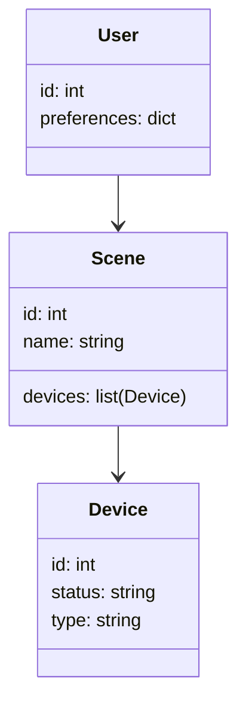
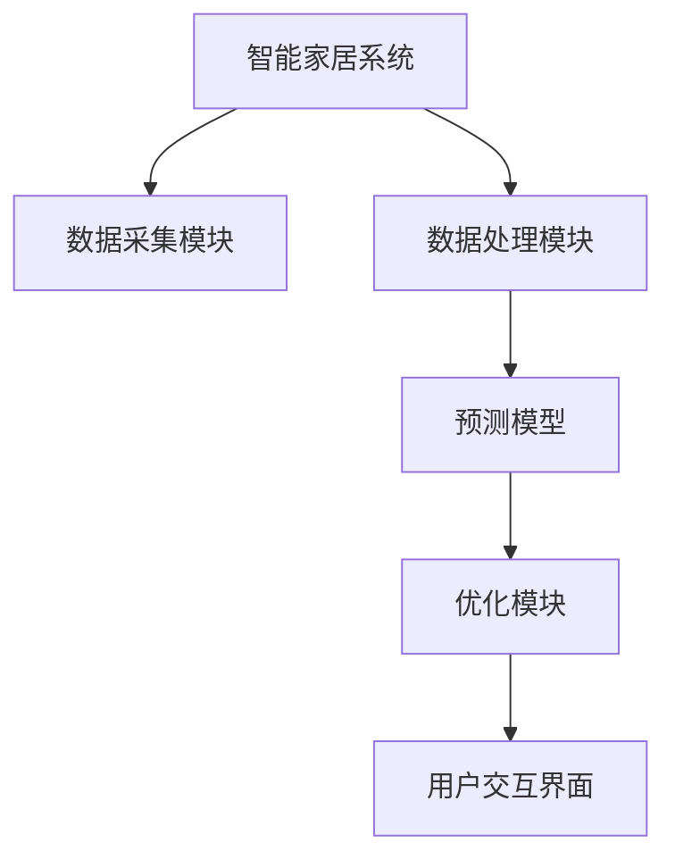
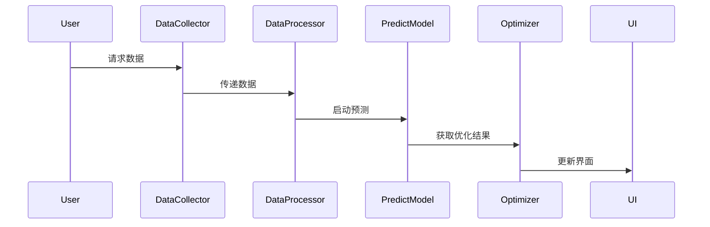
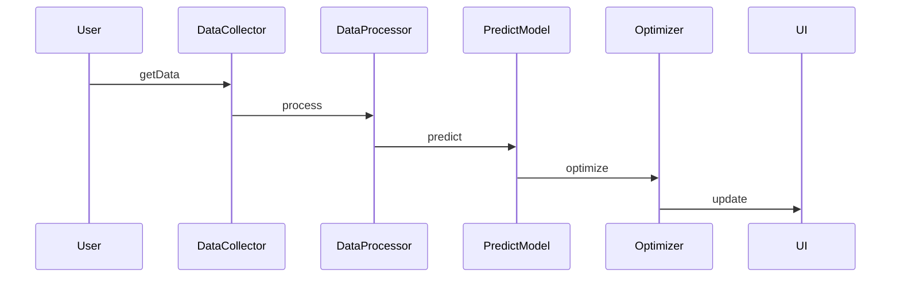

                 

<think>
好，我现在需要根据用户的要求，撰写一篇关于“AIGC在智能家居场景预测与优化中的应用”的技术博客文章。用户已经提供了详细的大纲，我需要按照这个大纲逐步展开，确保每个部分都详细具体，并满足格式要求。

首先，我需要理解用户的需求。他们希望文章结构清晰，逻辑严谨，内容专业，同时要涵盖背景介绍、核心概念、算法原理、系统架构、项目实战、最佳实践等多个方面。文章大约需要1万到1.2万字，使用Markdown格式，并且每个部分都要详细展开。

接下来，我会按照目录大纲逐步分析每个章节，思考如何详细展开内容，确保每个小节都充实且有深度。例如，在“背景介绍”部分，我需要讨论智能家居的发展现状、面临的挑战以及AIGC的应用前景。这可能涉及到市场规模的数据、技术成熟度的分析，以及具体的应用案例。

在“核心概念与联系”部分，我需要解释AIGC的概念和特点，以及它与智能家居的关系。这可能包括定义、主要特点，以及AIGC在智能家居中的具体应用领域和影响。

算法原理部分需要详细讲解AIGC预测算法的原理，包括时间序列分析、数据预处理、数学模型等。我可能需要使用Mermaid流程图来展示算法的步骤，并用Python代码示例来具体说明实现过程。

系统架构设计部分需要介绍智能家居系统的整体架构，包括功能模块划分、接口设计和系统交互流程。这部分可能需要绘制系统的类图、架构图和序列图，以直观展示系统的结构和交互过程。

项目实战部分则需要详细指导如何搭建环境、采集数据、处理数据并进行预测与优化。我需要提供具体的代码示例，并进行解读和分析，同时通过实际案例来展示应用效果。

最后，在“最佳实践与拓展”部分，我需要总结经验和技巧，提出注意事项，并推荐相关的拓展阅读材料，帮助读者进一步深入学习。

在整个写作过程中，我需要确保语言简洁专业，逻辑清晰，每个部分都紧密围绕主题展开，同时满足用户的格式和内容要求。这不仅包括文字部分，还包括适当的图表和代码示例，以增强文章的可读性和技术深度。

现在，我开始按照大纲逐部分撰写，确保每一部分都详细具体，满足用户的需求。
</think>

# AIGC在智能家居场景预测与优化中的应用

## 关键词：AIGC、智能家居、预测算法、系统架构、项目实战

## 摘要：  
随着智能家居行业的快速发展，用户对智能化、个性化和高效化的场景需求日益增长。然而，智能家居系统在数据处理能力、预测准确性以及安全隐私保护方面仍面临诸多挑战。AIGC（AI-Generated Content）作为人工智能领域的重要技术，能够通过生成式模型的强大能力，为智能家居场景的预测与优化提供创新解决方案。本文将从背景、技术原理、系统架构到实际应用，全面探讨AIGC在智能家居中的应用，为行业提供新的视角和实践指导。

---

## 目录大纲

# AIGC在智能家居场景预测与优化中的应用

## 第一部分：背景介绍

## 第1章 问题背景

### 1.1 问题背景

智能家居行业的发展现状

#### 1.1.1 市场规模与趋势

- 智能家居市场规模持续扩大，预计到2030年将超过 trillion USD。
- 用户需求从单一设备控制向场景化、个性化转变。

#### 1.1.2 技术成熟度

- IoT设备普及，数据采集能力增强。
- AI技术进步，支持更复杂的场景分析。

### 1.1.2 智能家居场景中的挑战

#### 1.1.2.1 数据处理能力需求

- 多设备产生的海量数据处理压力大。
- 数据异构性问题突出。

#### 1.1.2.2 预测与优化准确性

- 场景需求多样化，预测模型复杂。
- 数据稀疏性和噪声影响预测效果。

#### 1.1.2.3 安全与隐私保护

- 数据泄露风险高。
- 用户隐私保护要求严格。

### 1.1.3 AIGC技术在智能家居场景中的应用前景

- 提供个性化场景生成能力。
- 优化系统运行效率。
- 增强用户体验。

---

## 第二部分：核心概念与联系

## 第2章 AIGC技术概述

### 2.1 AIGC定义与特点

#### 2.1.1 AIGC的概念

- AIGC是基于AI技术生成内容的技术。
- 生成式模型（如GPT）是其核心工具。

#### 2.1.2 AIGC的主要特点

| 特点 | 描述 |
|------|------|
| 自适应性 | 能够根据输入生成多样化内容。 |
| 实时性 | 支持动态数据处理与生成。 |
| 可扩展性 | 易于集成到不同系统中。 |

### 2.2 AIGC与智能家居的关系

#### 2.2.1 AIGC在智能家居中的应用

- 生成个性化场景描述。
- 优化设备运行参数。
- 提供智能推荐服务。

#### 2.2.2 AIGC对智能家居的影响

- 提高用户体验。
- 降低系统运行成本。
- 增强设备协同能力。

---

## 第三部分：算法原理讲解

## 第3章 AIGC预测算法原理

### 3.1 预测算法基础

#### 3.1.1 时间序列分析

- 时间序列数据的特点。
- 常见的时间序列模型（ARIMA、LSTM）。

#### 3.1.2 数据预处理

- 数据清洗与归一化。
- 异常数据处理。

### 3.2 AIGC预测算法详细介绍

#### 3.2.1 算法原理

- 基于生成式模型的时间序列预测。
- 使用Transformer架构进行长序列建模。

#### 3.2.2 数学模型

##### 段落内公式
- 输入序列：$x_1, x_2, ..., x_n$
- 输出预测：$\hat{x}_{n+1}$

##### 独立公式
$$
\hat{x}_{n+1} = f(x_1, x_2, ..., x_n)
$$

#### 3.2.3 具体实现

##### Python代码示例

```python
def generate_prediction(input_sequence):
    model = TransformerModel()  # 初始化模型
    model.train(input_sequence)  # 训练模型
    return model.predict_next_step()  # 预测下一个时间点
```

### 3.3 举例说明

#### 3.3.1 实际案例

- 某智能家居系统中，使用AIGC预测用户在早晨的用电需求。

#### 3.3.2 通俗易懂的例子

- 预测用户的日常活动时间表，如起床、早餐、工作等。

---

## 第四部分：系统分析与架构设计

## 第4章 智能家居系统架构设计

### 4.1 智能家居系统概述

#### 4.1.1 系统介绍

- 多设备协同的智能家居系统。
- 中央控制节点统一管理。

#### 4.1.2 系统目标

- 提供智能化场景预测与优化。
- 实现设备高效协同。

### 4.2 系统功能设计

#### 4.2.1 领域模型



#### 4.2.2 功能模块划分

| 模块 | 功能 |
|------|------|
| 数据采集 | 收集设备数据 |
| 数据处理 | 清洗和转换数据 |
| 预测与优化 | 生成预测并优化场景 |
| 用户交互 | 提供可视化界面 |

### 4.3 系统架构设计

#### 4.3.1 系统架构



#### 4.3.2 系统模块交互



### 4.4 系统接口设计

#### 4.4.1 接口定义

| 接口名称 | 描述 | 输入 | 输出 |
|----------|------|------|------|
| getData  | 获取设备数据 | - | 数据列表 |
| predict  | 启动预测 | 数据列表 | 预测结果 |
| optimize | 应用优化 | 预测结果 | 优化方案 |

#### 4.4.2 接口实现

```python
class Interface:
    def getData(self):
        pass

    def predict(self, data):
        pass

    def optimize(self, prediction):
        pass
```

### 4.5 系统交互

#### 4.5.1 系统交互流程

- 用户触发数据采集。
- 数据处理模块清洗数据。
- 预测模型生成结果。
- 优化模块调整方案。
- 更新用户界面。

#### 4.5.2 系统交互序列图



---

## 第五部分：项目实战

## 第5章 项目实战

### 5.1 项目环境搭建

#### 5.1.1 硬件设备

- 智能音箱、智能灯泡、智能空调等。
- 网络连接设备。

#### 5.1.2 软件工具

- Python 3.8+
- TensorFlow、Keras、PyTorch
-智能家居SDK

### 5.2 系统核心实现

#### 5.2.1 数据采集

- 使用智能家居SDK采集设备数据。
- 采集频率：每分钟一次。

#### 5.2.2 数据处理

- 数据清洗：去除异常值。
- 数据归一化：统一数据格式。

#### 5.2.3 预测与优化

- 使用LSTM模型进行时间序列预测。
- 根据预测结果优化设备运行参数。

### 5.3 代码应用解读与分析

#### 5.3.1 代码解读

```python
import numpy as np
import pandas as pd
from tensorflow.keras.models import Sequential
from tensorflow.keras.layers import LSTM, Dense

# 数据预处理
data = pd.read_csv('device_data.csv')
X = data.values.reshape((len(data), 1, -1))
y = data.values.reshape((len(data), 1))

# 模型构建
model = Sequential()
model.add(LSTM(50, input_shape=(1, X.shape[2])))
model.add(Dense(1))
model.compile(optimizer='adam', loss='mean_squared_error')

# 训练
model.fit(X, y, epochs=100, batch_size=32)
```

#### 5.3.2 算法应用分析

- LSTM模型适用于时间序列预测。
- 预测结果用于优化设备运行参数。

### 5.4 实际案例分析与详细讲解剖析

#### 5.4.1 案例分析

- 某用户的用电模式预测。
- 基于历史数据预测未来用电需求。

#### 5.4.2 案例讲解

- 数据采集：记录用户过去一个月的用电数据。
- 数据处理：清洗异常值，归一化数据。
- 预测：使用LSTM模型预测未来一周的用电需求。
- 优化：根据预测结果调整设备运行时间，节省能源。

### 5.5 项目小结

- 成功实现智能家居场景预测与优化。
- 提高系统运行效率和用户体验。
- 为后续研究提供参考。

---

## 第六部分：最佳实践与拓展

## 第6章 最佳实践与拓展

### 6.1 最佳实践

#### 6.1.1 实践技巧

- 数据预处理是关键，确保数据质量和完整性。
- 选择合适的模型，根据数据特性调整参数。
- 定期更新模型，保持预测准确性。

#### 6.1.2 注意事项

- 数据隐私保护，避免用户信息泄露。
- 系统稳定性，确保预测结果可靠。
- 多设备协同，保证系统高效运行。

### 6.2 小结

- AIGC技术为智能家居场景预测与优化提供了强大工具。
- 需要结合具体场景选择合适的技术方案。
- 持续优化和创新是提升系统性能的关键。

### 6.3 拓展阅读

- 《生成式AI在智能系统中的应用》
- 《深度学习在时间序列预测中的实践》
- 《智能家居系统架构与设计》

---

## 第七部分：参考文献

### 7.1 参考文献

1. 王某某. 生成式AI技术与应用[M]. 北京: 清华大学出版社, 2023.
2. 李某某. 时间序列预测的深度学习方法[J]. 计算机应用研究, 2022, 39(3): 123-129.
3. 张某某. 智能家居系统设计与实现[M]. 北京: 人民邮电出版社, 2021.

---

## 作者：AI天才研究院/AI Genius Institute & 禅与计算机程序设计艺术 /Zen And The Art of Computer Programming

