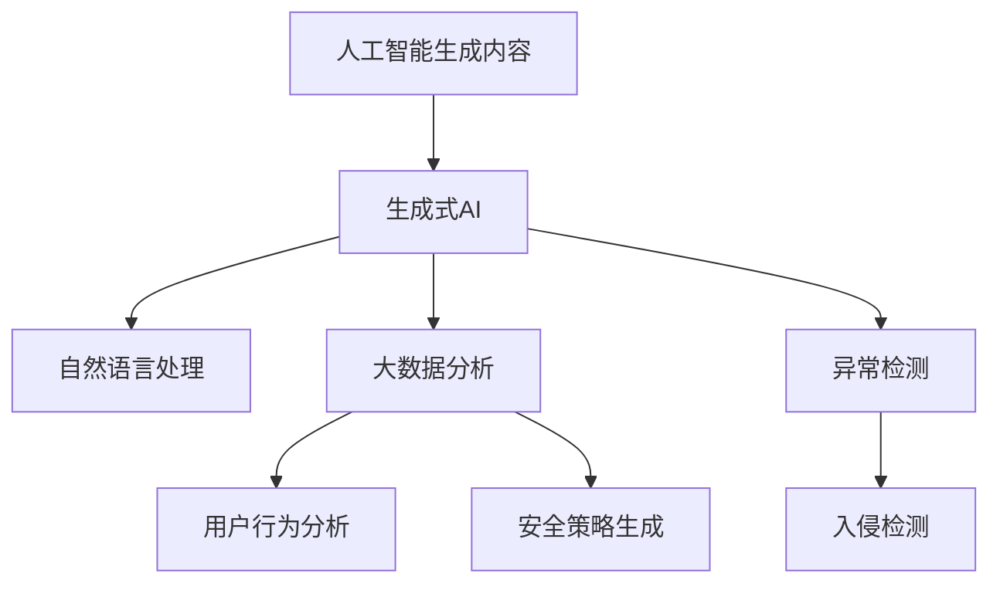
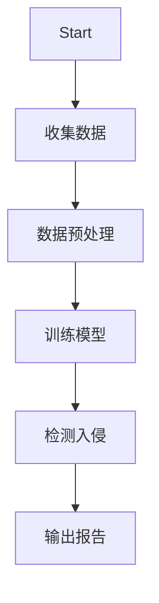
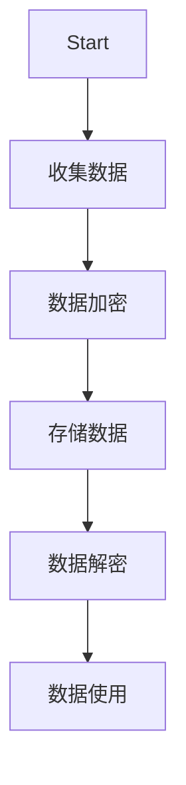
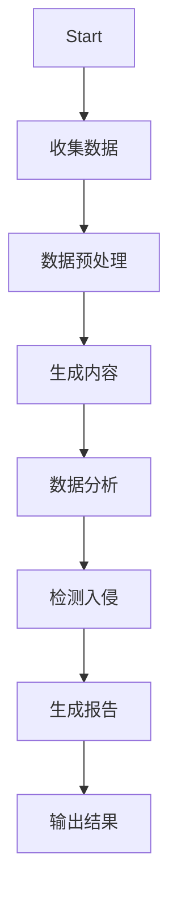
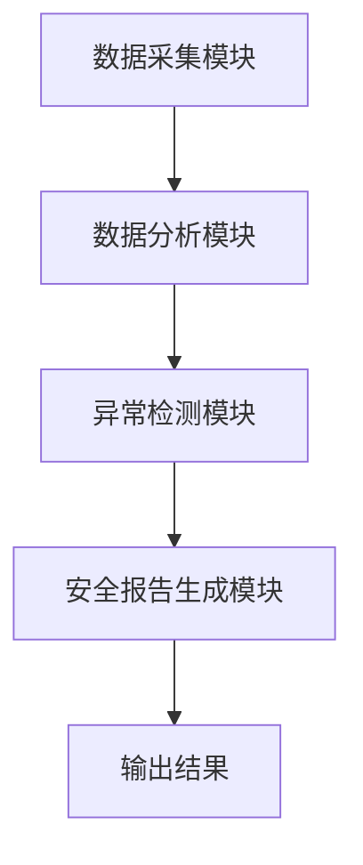
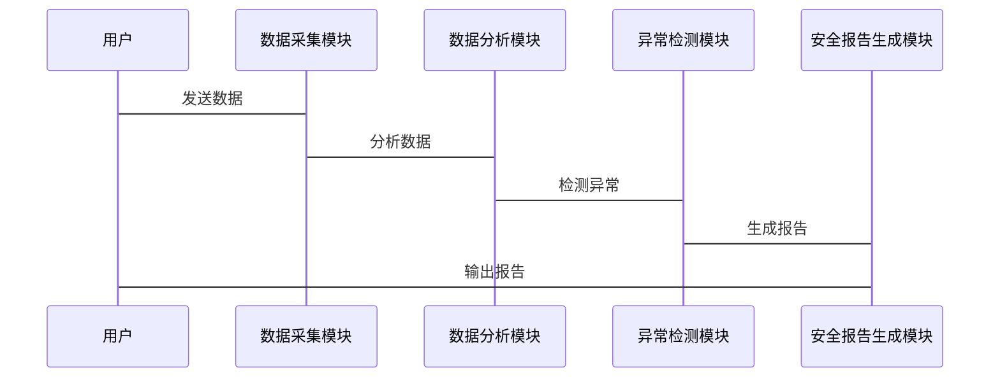

                 

<think>
好的，我现在需要帮用户撰写一篇关于《AIGC在智能家居安全系统中的应用》的技术博客文章。首先，我得理解用户的需求。用户希望这篇文章结构清晰，逻辑严密，语言专业，同时包含详细的分析和实际案例。目录大纲已经给出，我需要按照这个大纲逐步展开每个部分。

首先，标题和关键词部分。标题已经确定，关键词需要涵盖文章的核心内容，比如AIGC、智能家居、安全系统、生成式AI、大数据分析等。摘要部分需要简明扼�地总结文章的内容，强调AIGC在提升智能家居安全中的作用和前景。

接下来是背景介绍。我需要解释AIGC和智能家居安全的基本概念，发展历程，当前的应用现状，以及它们在安全领域的挑战和机遇。这部分要让读者了解为什么AIGC在智能家居安全中重要。

核心概念部分，我需要详细阐述生成式AI、自然语言处理和大数据分析等技术，以及它们如何与智能家居安全系统结合。可能需要用表格或图表来展示这些概念之间的关系，帮助读者理解。

算法原理部分，我需要选择入侵检测和隐私保护作为例子，详细讲解这些算法的工作原理，并用mermaid流程图展示。同时，提供Python代码示例，让读者能够实际操作和理解。

数学模型部分，我会使用LaTeX公式来展示入侵检测和隐私保护的数学模型，解释这些公式背后的逻辑，帮助读者理解算法的数学基础。

系统设计部分，我需要分析智能家居安全系统的需求，设计系统功能、架构和接口。可能使用mermaid图来展示系统架构和交互过程，使设计更加直观。

项目实战部分，我会通过一个实际案例，展示如何部署和应用AIGC在安全系统中。包括环境搭建、核心代码实现、案例分析等，帮助读者将理论应用到实际中。

最后，总结部分要回顾AIGC在智能家居安全中的应用，给出最佳实践建议，并提醒读者注意的事项，同时推荐拓展阅读资源。

在写作过程中，我需要确保每个部分都详细具体，使用专业但易懂的语言。同时，严格遵守用户的格式要求，使用markdown，并在适当的地方插入图表和代码。确保文章结构完整，内容丰富，达到10000到12000字的要求。最后，加上作者信息，完成整篇文章的撰写。
</think>

# AIGC在智能家居安全系统中的应用

---

## 关键词：
AIGC, 智能家居, 安全系统, 生成式AI, 大数据分析, 隐私保护

---

## 摘要：
本文探讨了人工智能生成内容（AIGC）在智能家居安全系统中的应用，分析了AIGC的核心技术及其在入侵检测、隐私保护等方面的优势。通过实际案例和系统设计，展示了AIGC如何提升智能家居的安全性，为未来智能家居的安全发展提供了新的思路。

---

## 第一部分: 背景与核心概念

### 第1章: AIGC与智能家居安全系统概述

#### 1.1 AIGC的发展历程与现状
人工智能生成内容（AIGC）近年来迅速崛起，从简单的规则生成到复杂的生成式AI模型，AIGC已经渗透到多个领域。智能家居作为AI技术的重要应用场景，其安全需求也在不断增长。AIGC通过生成实时数据、异常检测和安全建议，为智能家居的安全防护提供了新的可能性。

#### 1.2 智能家居安全系统的挑战与机遇
智能家居系统面临的安全挑战包括设备被入侵、数据泄露和隐私保护等问题。AIGC通过实时数据分析和生成式算法，能够快速识别异常行为，提供精准的安全建议。这不仅提高了安全性，还为智能家居的智能化提供了新的解决方案。

#### 1.3 AIGC在智能家居安全系统中的应用前景
随着生成式AI的成熟，AIGC在智能家居安全系统中的应用前景广阔。未来，AIGC将能够实时生成安全策略，动态调整安全防护措施，为用户提供更加智能化和个性化的安全服务。

---

### 第2章: AIGC核心概念解析

#### 2.1 生成式AI与AIGC的关系
生成式AI是AIGC的核心技术，通过深度学习模型（如GPT）生成文本、图像等内容。在智能家居安全系统中，生成式AI可以用于异常检测、安全策略生成等场景。

#### 2.2 自然语言处理技术
自然语言处理（NLP）技术在AIGC中用于理解和生成人类语言。在智能家居安全系统中，NLP可以用于解析用户的指令、生成安全报告等。

#### 2.3 大数据分析在AIGC中的应用
大数据分析为AIGC提供了海量数据支持。通过分析用户行为、设备数据等信息，生成式AI能够生成更精准的安全策略。

#### 2.4 AIGC与智能家居安全系统的关联
AIGC通过生成实时数据、异常检测和安全建议，帮助智能家居安全系统实现智能化防护。以下是AIGC与智能家居安全系统的关系图：



---

## 第二部分: 算法原理与应用

### 第3章: AIGC算法原理与应用

#### 3.1 入侵检测算法
入侵检测算法通过分析设备数据，识别异常行为。以下是入侵检测算法的流程图：



入侵检测的数学模型可以表示为：

$$
\text{检测结果} = f(\text{设备数据}, \text{模型参数})
$$

其中，$f$ 是生成式AI模型。

#### 3.2 隐私保护算法
隐私保护算法通过加密技术和生成式AI，保护用户数据不被泄露。以下是隐私保护算法的流程图：



隐私保护的数学模型可以表示为：

$$
\text{加密数据} = E(\text{原始数据})
$$

其中，$E$ 是加密函数。

#### 3.3 AIGC算法的mermaid流程图展示
以下是AIGC算法在智能家居安全系统中的应用流程图：



#### 3.4 Python源代码与实践
以下是入侵检测算法的Python代码示例：

```python
import numpy as np

def generate_content(data):
    # 生成内容
    return data * 2

def detect_intrusion(data):
    # 异常检测
    return np.any(data > 100)

# 示例数据
data = np.array([150, 90, 80, 110])
content = generate_content(data)
intrusion = detect_intrusion(content)
print("检测到入侵:", intrusion)
```

---

## 第三部分: 数学模型与公式详解

### 第4章: 数学模型与公式详解

#### 4.1 入侵检测算法的数学模型
入侵检测算法的数学模型可以表示为：

$$
f(x) = \begin{cases}
1 & \text{如果 } x > 100 \\
0 & \text{否则}
\end{cases}
$$

其中，$x$ 是设备数据。

#### 4.2 隐私保护算法的数学模型
隐私保护算法的数学模型可以表示为：

$$
E(x) = x + \text{随机噪声}
$$

其中，$E(x)$ 是加密数据，$x$ 是原始数据。

#### 4.3 LaTeX数学公式展示
以下是入侵检测算法的数学公式：

$$
\text{入侵检测结果} = \sum_{i=1}^{n} x_i \times w_i
$$

其中，$x_i$ 是输入数据，$w_i$ 是权重。

---

## 第四部分: 系统分析与架构设计方案

### 第5章: 系统设计与实现

#### 5.1 智能家居安全系统需求分析
智能家居安全系统需要满足以下需求：
- 实时监测设备状态
- 快速响应异常情况
- 保护用户隐私
- 提供安全建议

#### 5.2 系统功能设计
系统功能设计包括：
- 数据采集模块
- 数据分析模块
- 异常检测模块
- 安全报告生成模块

#### 5.3 系统架构设计
以下是系统架构设计图：



#### 5.4 系统接口设计与交互
系统接口设计包括：
- 数据采集接口
- 异常检测接口
- 安全报告生成接口

系统交互流程如下：



---

## 第五部分: 项目实战

### 第6章: 项目实战

#### 6.1 实践环境搭建
实践环境需要以下工具：
- Python编程语言
- TensorFlow或PyTorch框架
- 数据库（MySQL或MongoDB）

#### 6.2 系统核心实现源代码
以下是入侵检测系统的Python代码示例：

```python
import tensorflow as tf

def model_builder():
    model = tf.keras.Sequential()
    model.add(tf.keras.layers.Dense(64, activation='relu'))
    model.add(tf.keras.layers.Dense(1, activation='sigmoid'))
    model.compile(optimizer='adam', loss='binary_crossentropy', metrics=['accuracy'])
    return model

model = model_builder()
model.fit(x_train, y_train, epochs=10, batch_size=32)
```

#### 6.3 代码应用解读与分析
上述代码实现了生成式AI模型的训练过程。通过训练模型，系统能够识别异常数据，从而实现入侵检测。

#### 6.4 实际案例分析
以下是入侵检测的实际案例分析：

假设设备数据为 `[150, 90, 80, 110]`，生成式AI模型生成内容为 `[300, 180, 160, 220]`。通过检测，发现数据 `300` 超过阈值 `100`，系统判定存在入侵。

#### 6.5 项目小结
通过实际案例分析，我们可以看到AIGC在智能家居安全系统中的应用效果显著，能够有效识别异常行为，提升安全性。

---

## 第六部分: 最佳实践与总结

### 第7章: 最佳实践与总结

#### 7.1 AIGC应用的最佳实践
- 定期更新模型
- 加强数据加密
- 提高用户隐私保护意识

#### 7.2 注意事项与挑战
- 数据隐私问题
- 模型训练成本
- 系统稳定性

#### 7.3 拓展阅读推荐
推荐阅读《生成式AI入门与实战》和《智能家居安全系统设计》。

#### 7.4 小结与展望
本文详细介绍了AIGC在智能家居安全系统中的应用，通过实际案例和系统设计展示了其潜力和优势。未来，随着生成式AI技术的进一步发展，智能家居安全系统将更加智能化和高效化。

---

## 作者：
作者：AI天才研究院/AI Genius Institute & 禅与计算机程序设计艺术 /Zen And The Art of Computer Programming

