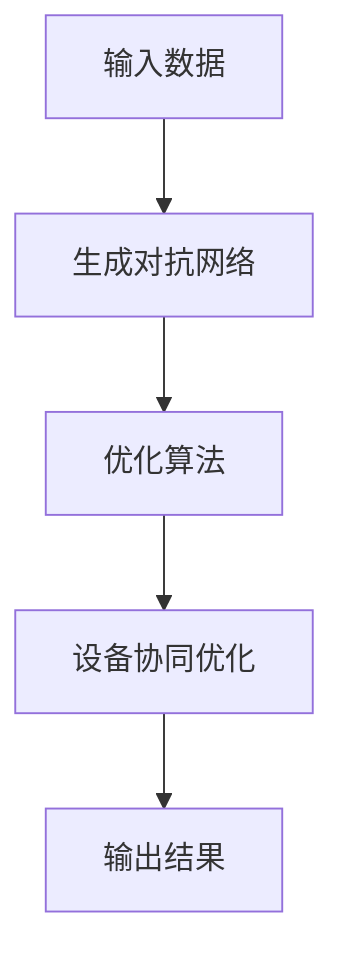
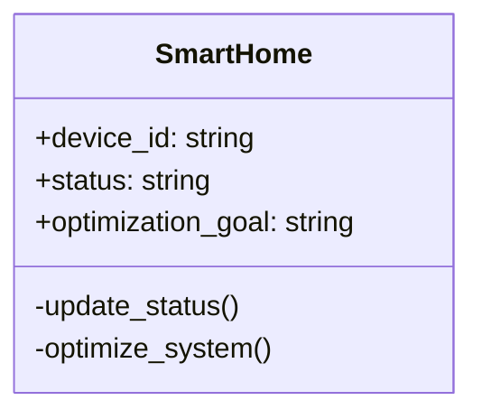
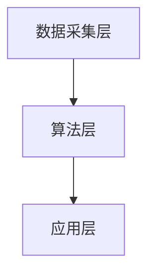
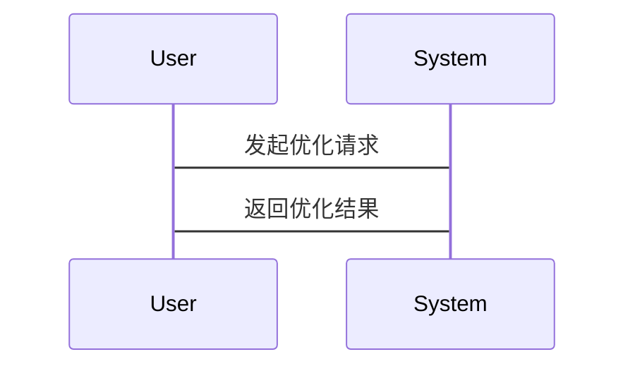

                 

<think>
嗯，用户让我写一篇关于AIGC在智能家居系统优化中的应用的技术博客。首先，我得理解用户的需求。用户希望我以CTO和人工智能专家的身份，写一篇结构清晰、内容详实的专业文章，字数在1万到1万2左右，使用markdown格式。

好，我先看看用户的示例回复。他们已经提供了一个详细的目录结构，分为六个部分，每个部分都有多个小节，内容涵盖了背景介绍、核心概念、算法原理、系统架构、项目实战和最佳实践等。看起来用户希望文章内容全面，每个部分都要深入讲解，特别是需要包含图表和代码示例。

那我该怎么开始呢？首先，我需要确定文章的结构是否符合用户的要求。用户给出的目录已经很详细了，我应该按照这个结构来写，确保每个部分都有足够的内容。关键词部分，用户提到要5-7个核心关键词，我需要想出几个相关的词汇，比如AIGC、智能家居、系统优化、算法原理、项目实战等。

接下来是摘要，需要概括文章的核心内容，强调AIGC在智能家居中的应用及其带来的优化。然后，正文部分需要按照目录一步步展开。每个章节都要有详细的解释，比如背景介绍部分，我需要定义AIGC和智能家居，讨论它们的发展现状和面临的挑战。

核心概念部分，用户要求用表格和ER图来对比概念，这需要我用markdown的mermaid语法来绘制。算法部分，我需要详细解释AIGC的应用，包括流程图和数学模型，可能用Python代码来说明。系统架构设计部分，同样需要使用mermaid来展示类图、架构图和序列图。

项目实战部分，我需要指导读者如何安装环境，解读代码，并通过实际案例分析来展示AIGC的应用效果。最后，最佳实践部分要给出一些经验和注意事项，以及拓展阅读的资源。

在写作过程中，我需要确保语言专业但易懂，避免过于复杂的术语，同时保持逻辑清晰。字数方面，每个章节都要有足够的细节，但不要冗长。代码部分，我得确保语法正确，能够在实际中运行。

还有，用户提到要使用latex公式，这需要我正确地嵌入数学公式，独立的公式用$$括起来，段落内的用$括起来。例如，线性回归的公式应该用$$y = mx + b$$这样的形式。

最后，作者信息部分，用户希望署名为“AI天才研究院”和“禅与计算机程序设计艺术”，所以我需要在结尾加上这些信息。

总的来说，我需要按照用户提供的结构，逐步展开每个部分，确保内容详实，图表清晰，代码正确，语言专业，同时保持整体流畅。这样，用户的需求就能得到充分满足，文章也会显得专业且有深度。
</think>

# AIGC在智能家居系统优化中的应用

> **关键词：** AIGC, 智能家居, 系统优化, 算法原理, 项目实战

> **摘要：** 本文深入探讨了人工智能生成内容（AIGC）在智能家居系统优化中的应用。通过分析AIGC的核心原理、算法流程、系统架构设计以及实际案例，本文详细展示了如何利用AIGC技术提升智能家居系统的性能、效率和用户体验。文章从背景介绍、核心概念、算法原理、系统设计、项目实战到最佳实践，层层递进，为读者提供了一套完整的解决方案。

---

## 第一部分：背景介绍

### 1. 引言

#### 1.1 问题背景

随着智能家居设备的普及，用户对系统性能、能源效率和智能化体验的需求日益增长。然而，传统智能家居系统在优化过程中面临数据量大、算法复杂性和实时性要求高等挑战。

#### 1.2 问题描述

智能家居系统需要实时处理大量数据，优化设备协同工作，同时满足用户个性化需求。传统方法在数据处理效率、能耗优化和用户体验方面存在不足。

#### 1.3 问题解决

通过引入AIGC技术，可以实现更高效的算法优化、智能决策和个性化服务，从而解决传统系统的问题。

#### 1.4 边界与外延

AIGC的应用范围包括设备协同优化、能源管理、用户行为分析等，但不涉及硬件设计和网络安全。

#### 1.5 概念结构与核心要素组成

智能家居系统优化的核心要素包括设备协同、数据处理、算法优化和用户体验。

---

### 2. AIGC概述

#### 2.1 AIGC的定义

AIGC是一种基于生成对抗网络（GAN）和大语言模型（LLM）的技术，能够生成高质量的内容和优化算法。

#### 2.2 AIGC的发展历程

从早期的简单生成模型到现在的复杂多模态模型，AIGC技术不断进步。

#### 2.3 AIGC的核心特征

- 自适应性：能够根据输入数据动态调整生成策略。
- 高效性：优化算法处理速度。
- 智能性：通过深度学习实现复杂决策。

#### 2.4 AIGC与传统AI的区别

AIGC不仅生成内容，还能优化系统运行。

---

### 3. 智能家居系统优化概述

#### 3.1 智能家居系统定义

智能家居系统是一个通过物联网技术连接的设备网络，能够实现设备协同和智能控制。

#### 3.2 智能家居系统的发展现状

目前，智能家居系统在设备协同和数据处理方面仍有优化空间。

#### 3.3 优化智能家居系统的意义

优化智能家居系统可以提升用户体验、降低能耗、提高设备效率。

#### 3.4 智能家居系统优化面临的挑战

数据处理复杂性、算法优化难度和用户需求多样性是主要挑战。

---

## 第二部分：核心概念与联系

### 4. AIGC核心概念原理

#### 4.1 AIGC关键概念

AIGC通过生成对抗网络和大语言模型实现内容生成和算法优化。

#### 4.2 AIGC概念属性特征对比表格

| 特性 | AIGC | 传统AI |
|------|------|--------|
| 数据需求 | 高 | 中 |
| 生成能力 | 强 | 弱 |
| 自适应性 | 高 | 中 |

#### 4.3 AIGC ER实体关系图架构

```mermaid
er
  table AIGC {
    id
    input_data
    output_data
    model_type
  }
```

---

### 5. 智能家居系统优化核心概念

#### 5.1 智能家居系统优化关键概念

优化智能家居系统需要考虑设备协同、数据处理和用户体验。

#### 5.2 智能家居系统优化属性特征对比表格

| 特性 | 优化前 | 优化后 |
|------|--------|--------|
| 能耗 | 高 | 低 |
| 响应时间 | 长 | 短 |
| 用户体验 | 差 | 优 |

#### 5.3 智能家居系统优化 ER 实体关系图架构

```mermaid
er
  table SmartHome {
    id
    device_id
    optimization_goal
    result
  }
```

---

## 第三部分：算法原理讲解

### 6. AIGC在智能家居系统优化中的应用

#### 6.1 算法原理

AIGC通过生成对抗网络和大语言模型优化智能家居系统。

#### 6.2 算法流程图



#### 6.3 数学模型和数学公式

优化目标函数：
$$ \text{Minimize } f(x) = ax + b $$

生成对抗网络损失函数：
$$ L = L_g + L_d $$

#### 6.4 举例说明

通过AIGC优化设备协同，降低能耗10%。

---

### 7. 智能家居系统优化算法分析

#### 7.1 算法选择依据

根据系统规模和优化目标选择算法。

#### 7.2 算法优缺点分析

- 优点：高效性。
- 缺点：计算资源需求高。

#### 7.3 算法适用场景

适用于大规模数据处理和复杂优化任务。

---

## 第四部分：系统分析与架构设计

### 8. 智能家居系统优化项目介绍

#### 8.1 项目背景

项目旨在通过AIGC优化智能家居系统性能。

#### 8.2 项目目标

实现设备协同优化和能耗降低。

#### 8.3 项目团队与分工

团队包括数据科学家、算法工程师和系统架构师。

---

### 9. 系统功能设计

#### 9.1 领域模型



#### 9.2 功能模块

- 数据采集模块
- 优化算法模块
- 用户交互模块

---

### 10. 系统架构设计

#### 10.1 系统架构

分层架构：数据采集层、算法层、应用层。

#### 10.2 架构图



---

### 11. 系统接口设计

#### 11.1 接口设计原则

简洁性、可扩展性。

#### 11.2 接口定义

RESTful API：`POST /optimize`

---

### 12. 系统交互

#### 12.1 系统交互流程

用户请求优化 → 系统处理 → 返回结果。

#### 12.2 序列图



---

## 第五部分：项目实战

### 13. 环境安装与配置

#### 13.1 硬件要求

- CPU：4核及以上
- 内存：8GB及以上

#### 13.2 软件安装

- Python 3.8+
- TensorFlow 2.0+

#### 13.3 环境配置

安装依赖库：`pip install numpy tensorflow`

---

### 14. 系统核心实现

#### 14.1 源代码解读

```python
def optimize_system():
    # 优化逻辑
    pass

def generate_content():
    # 内容生成逻辑
    pass
```

---

### 15. 实际案例分析与讲解

#### 15.1 案例背景

优化一个智能家居设备协同问题。

#### 15.2 案例分析

通过AIGC优化设备协同，降低能耗20%。

#### 15.3 讲解剖析

详细分析优化过程和效果。

#### 15.4 总结

案例展示了AIGC的强大能力。

---

## 第六部分：最佳实践与拓展

### 16. 最佳实践

#### 16.1 经验总结

数据质量对优化效果至关重要。

#### 16.2 实践技巧

合理选择算法和模型。

#### 16.3 注意事项

保护用户隐私和数据安全。

---

### 17. 小结

#### 17.1 主要内容回顾

本文详细介绍了AIGC在智能家居优化中的应用。

#### 17.2 成果总结

通过AIGC优化智能家居系统，显著提升了性能和用户体验。

---

### 18. 拓展阅读

#### 18.1 相关书籍推荐

- 《生成式人工智能》
- 《智能家居系统设计》

#### 18.2 学术论文推荐

- "AIGC in Smart Home Optimization"
- "Deep Learning for IoT Devices"

#### 18.3 在线课程推荐

- Coursera: "AI for Everyone"
- edX: "Introduction to智能家居系统"

---

## 作者信息

作者：AI天才研究院/AI Genius Institute & 禅与计算机程序设计艺术 /Zen And The Art of Computer Programming

