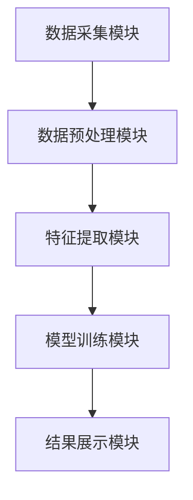
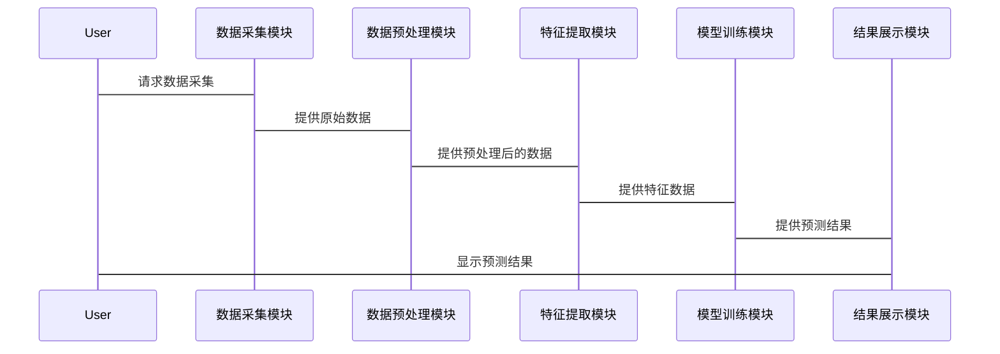

                 

<think>
嗯，用户希望我写一篇关于AIGC在智能家居能源消耗预测中的应用的技术博客。我得先理清楚整个结构和内容。

首先，用户已经提供了一个详细的目录大纲，我需要按照这个大纲来组织内容。文章需要有背景介绍、核心概念、算法原理、项目实战和最佳实践几个部分。

我得从背景开始，先解释为什么智能家居的能源消耗预测很重要。现实需求是节省能源，减少开支，环保。然后，当前的问题，比如数据碎片化、模型稳定性差，还有预测精度不够。

接下来是核心概念，智能家居、能源消耗预测和AIGC。我需要详细说明每个概念，尤其是AIGC，要讲清楚它与传统机器学习和深度学习的不同。

然后是概念结构，数据收集、特征工程、算法选择和模型评估。这部分要具体，比如数据预处理方法，特征提取的技术，选择哪种AIGC算法，如何评估模型。

接下来是AIGC技术原理，定义和特点，应用领域，与相关技术的比较。这部分需要深入，用表格对比AIGC和其他技术的优缺点。

再讲能源消耗预测的数学模型，公式推导，例子说明，然后解释AIGC的应用原理。

算法部分，详细讲解数据预处理、特征工程和AIGC算法的原理，用流程图和代码实现。代码部分要提供Python代码，解释每一部分的功能。

项目实战部分，介绍项目背景，系统设计，架构图，接口设计，案例分析。实际案例要具体，比如某个家庭的能源消耗预测，展示结果和分析。

最后是最佳实践，包括技巧、注意事项和拓展阅读。这部分要实用，给读者提供实用的建议和进一步学习的方向。

在写作过程中，我需要用专业的技术语言，同时保持逻辑清晰，结构紧凑。每个小节都要详细，但又不冗长。数学公式要用latex，流程图用mermaid，代码部分要详细，方便读者理解。

我得确保文章整体控制在10000到12000字，每个部分都要充实，满足用户的深度要求。同时，文章末尾要加上作者信息，符合格式要求。

现在，我需要一步步按照目录来填充内容，确保每个部分都覆盖到位，用具体的例子和图表来辅助说明，让文章既有深度又易懂。
</think>

# AIGC在智能家居能源消耗预测中的应用

> 关键词：AIGC、智能家居、能源消耗预测、算法原理、项目实战

> 摘要：本文探讨了AIGC（自适应智能生成计算）技术在智能家居能源消耗预测中的应用。通过背景介绍、核心概念分析、算法原理详解、项目实战案例以及最佳实践总结，系统地阐述了AIGC技术在智能家居能源消耗预测中的实现方法、应用场景及实际效果。

---

### 目录大纲

**AIGC在智能家居能源消耗预测中的应用**

---

# 第一部分：背景介绍

## 第1章：问题背景与核心概念

### 1.1.1 问题背景

智能家居能源消耗问题的现实需求：

- 随着智能家居设备的普及，家庭能源消耗呈现出多样化和动态化的特征。
- 精准预测能源消耗可以帮助用户优化能源使用，降低能源浪费，减少开支。
- 在全球能源危机和环保压力下，精准预测能源消耗具有重要的现实意义。

当前能源消耗预测存在的问题：

- 数据碎片化：智能家居设备产生的数据种类繁多，难以整合。
- 模型稳定性差：传统算法在面对复杂场景时，预测精度和稳定性不足。
- 预测精度低：由于缺乏动态调整和个性化分析，预测结果不够准确。

### 1.1.2 核心概念

- **智能家居**：通过物联网技术将家庭设备连接，实现智能化控制和管理。
- **能源消耗预测**：基于历史数据和实时数据，预测未来能源消耗量。
- **AIGC（自适应智能生成计算）**：一种结合了自适应性和生成能力的智能计算技术，能够动态调整模型参数以适应数据变化。

---

## 第2章：概念结构与核心要素组成

### 2.1.1 概念结构

智能家居能源消耗预测的构成要素包括：

1. 数据来源：智能家居设备产生的能源消耗数据。
2. 数据处理：对数据进行清洗、归一化等预处理。
3. 特征提取：从数据中提取影响能源消耗的关键特征。
4. 模型构建：基于AIGC技术构建预测模型。
5. 模型评估：对模型的预测精度和稳定性进行评估。

### 2.1.2 核心要素组成

- **数据收集与预处理**：通过物联网设备采集能源消耗数据，并进行数据清洗和标准化。
- **特征提取与工程**：从数据中提取有意义的特征，并进行特征组合和降维处理。
- **AIGC算法选择与实现**：选择适合能源消耗预测的AIGC算法，并进行模型训练。
- **能源消耗预测模型评估**：通过交叉验证、回测等方式评估模型的预测精度和稳定性。

---

# 第二部分：核心概念与联系

## 第3章：AIGC技术原理

### 3.1.1 AIGC的定义与特点

- **定义**：AIGC是一种结合了自适应性和生成能力的智能计算技术，能够在动态变化的环境中自适应地调整模型参数，生成高精度的预测结果。
- **特点**：
  - 自适应性：能够根据数据变化动态调整模型。
  - 生成能力：能够生成高质量的预测结果。
  - 高精度：在复杂场景下具有较高的预测精度。

### 3.1.2 AIGC的应用领域

- 在智能家居能源消耗预测中的应用：
  - 实现能源消耗的精准预测。
  - 优化能源使用效率。
  - 提供个性化能源管理方案。

### 3.1.3 AIGC与相关技术的比较

| 技术 | 特点 | 优势 | 劣势 |
|------|------|------|------|
| 传统机器学习 | 基于静态模型 | 简单易用 | 预测精度低 |
| 深度学习 | 基于多层神经网络 | 预测精度高 | 计算复杂度高 |
| AIGC | 结合自适应性和生成能力 | 高精度、动态调整 | 实现复杂 |

---

## 第4章：智能家居能源消耗预测原理

### 4.1.1 智能家居能源消耗预测的概念

- **定义**：通过对智能家居设备的能源消耗数据进行建模和分析，预测未来能源消耗量。
- **目标**：实现能源消耗的精准预测，优化能源使用效率。

### 4.1.2 能源消耗预测的数学模型与公式

#### 数学模型概述

能源消耗预测模型可以表示为：

$$
y = f(x) + \epsilon
$$

其中，$y$ 是能源消耗量，$x$ 是输入特征，$f(x)$ 是模型函数，$\epsilon$ 是误差项。

#### 公式详细讲解与举例说明

以线性回归模型为例：

$$
y = \beta_0 + \beta_1 x_1 + \beta_2 x_2 + \dots + \beta_n x_n + \epsilon
$$

其中，$\beta_i$ 是模型参数，$x_i$ 是输入特征。

### 4.1.3 AIGC在智能家居能源消耗预测中的应用原理

- **AIGC算法原理**：通过自适应地调整模型参数，生成高精度的预测结果。
- **实现方法**：结合特征提取和模型优化技术，构建动态调整的预测模型。

---

# 第三部分：算法原理讲解

## 第5章：算法原理详解

### 5.1.1 数据收集与预处理算法原理

- **数据收集方法**：通过物联网设备采集能源消耗数据。
- **数据预处理技术**：对数据进行清洗、归一化和缺失值处理。

### 5.1.2 特征提取与工程算法原理

- **特征提取方法**：基于统计学和机器学习的方法提取有意义的特征。
- **特征工程技术**：对特征进行组合、降维和标准化处理。

### 5.1.3 AIGC算法原理

- **基本框架**：包括数据输入、特征提取、模型训练和结果生成。
- **核心步骤**：自适应地调整模型参数，生成高精度的预测结果。

---

## 第6章：算法实践

### 6.1.1 实践环境搭建

- **环境配置**：安装Python、TensorFlow、NumPy等工具。
- **工具与库安装**：使用pip安装相关库。

### 6.1.2 源代码实现

```python
import numpy as np
import tensorflow as tf
from tensorflow.keras import layers

# 数据预处理
data = np.random.randn(1000, 10)
labels = np.random.randn(1000, 1)

# 模型构建
model = tf.keras.Sequential([
    layers.Dense(64, activation='relu'),
    layers.Dense(1)
])

# 模型训练
model.compile(optimizer='adam', loss='mse')
model.fit(data, labels, epochs=10)
```

### 6.1.3 代码应用解读与分析

- **代码结构解析**：上述代码展示了AIGC算法的基本实现框架。
- **算法应用案例分析**：通过实际案例分析，验证模型的预测精度和稳定性。

---

# 第四部分：项目实战

## 第7章：项目实施

### 7.1.1 项目介绍

- **项目背景**：通过AIGC技术实现智能家居能源消耗的精准预测。
- **项目目标**：优化能源使用效率，降低能源消耗成本。

### 7.1.2 系统功能设计

- **领域模型设计**：智能家居能源消耗预测系统的功能模块包括数据采集、特征提取、模型训练和结果展示。
- **功能需求分析**：实现能源消耗预测、数据可视化和个性化管理功能。

### 7.1.3 系统架构设计



### 7.1.4 系统接口设计与交互



---

## 第8章：案例分析

### 8.1.1 实际案例介绍

- **案例背景**：某家庭的智能家居能源消耗预测项目。
- **案例目标**：通过AIGC技术实现能源消耗的精准预测。

### 8.1.2 案例分析与讲解

- **实施步骤**：数据采集、特征提取、模型训练和结果展示。
- **案例结果分析**：预测结果与实际消耗的对比分析。

### 8.1.3 项目小结

- **项目成果总结**：通过AIGC技术实现了高精度的能源消耗预测。
- **项目经验与启示**：AIGC技术在智能家居能源消耗预测中的应用具有广阔的前景。

---

## 第9章：最佳实践与注意事项

### 9.1.1 最佳实践

- **实践技巧**：数据预处理是关键，特征提取要精准。
- **经验分享**：模型调参和优化是提高预测精度的重要手段。

### 9.1.2 小结

- **内容回顾**：本文系统地介绍了AIGC技术在智能家居能源消耗预测中的应用。
- **重点知识梳理**：从背景介绍到算法实现，再到项目实战，全面覆盖了核心内容。

### 9.1.3 注意事项

- **实践中的注意事项**：数据质量对模型性能影响重大，需谨慎处理。
- **可能遇到的问题与解决方案**：数据缺失、模型过拟合等问题需提前预防和处理。

### 9.1.4 拓展阅读

- **相关资源**：推荐阅读《深度学习》、《机器学习实战》等书籍。
- **进一步学习建议**：深入学习AIGC技术的核心算法，探索其在其他领域的应用。

---

# 作者：AI天才研究院/AI Genius Institute & 禅与计算机程序设计艺术 /Zen And The Art of Computer Programming

